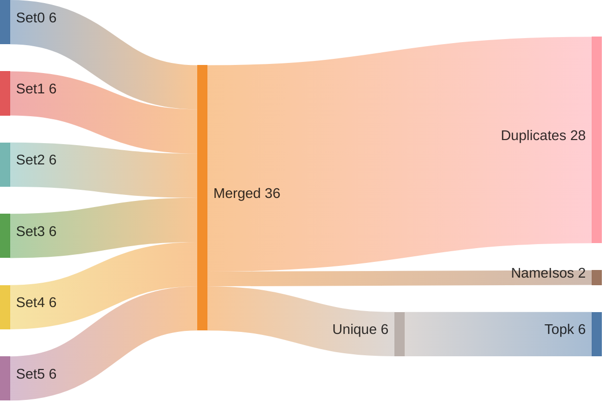
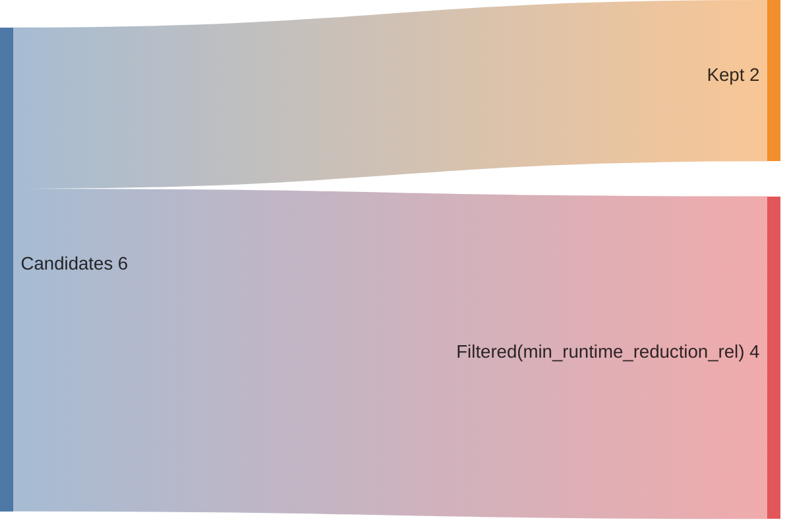
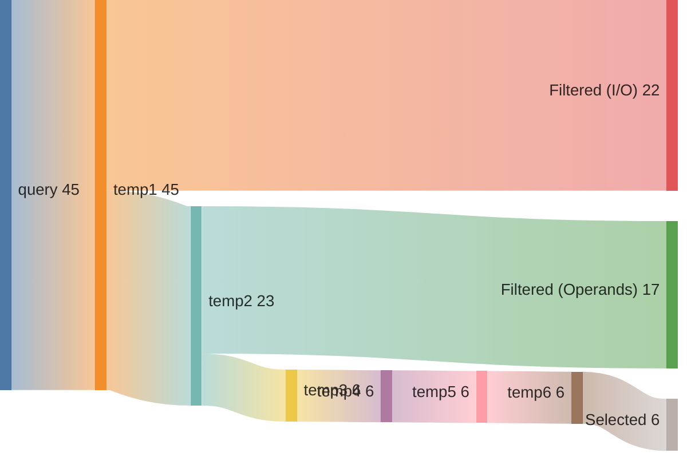
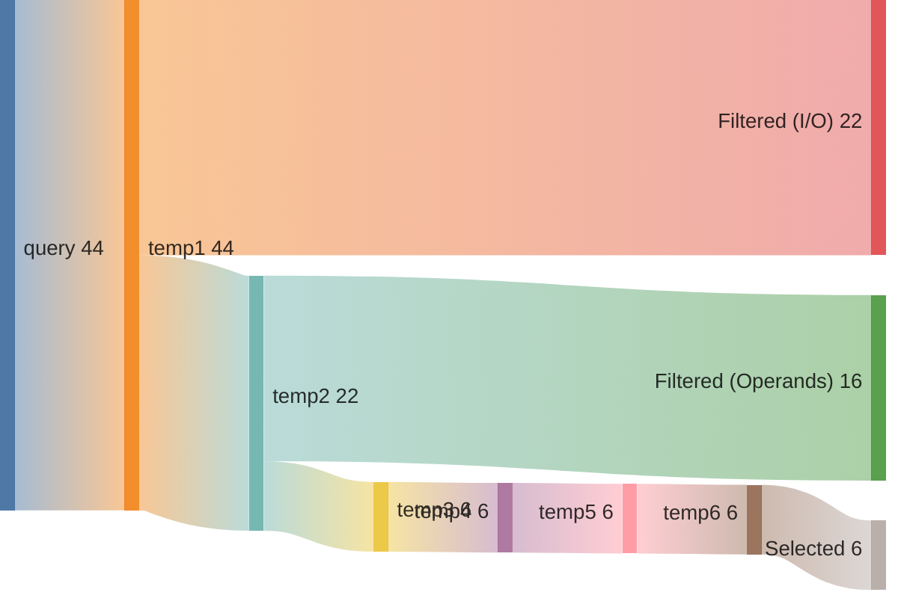

## Summary

Directory: `/var/tmp/ga87puy/isaac-demo/out/embench_iot/aha-mont64/20260520T210608`

### Experiment
```ini
[isaac-demo-embench_iot/aha-mont64-20260520T210608]
benchmark=embench_iot/aha-mont64
datetime=20260520T210608
directory=/var/tmp/ga87puy/isaac-demo/out/embench_iot/aha-mont64/20260520T210608
comment=""
```

### Environment/Config
<details>
<summary>Vars</summary>

```sh
ARCH=rv32im_zicsr_zifencei
ABI=ilp32
GLOBAL_ISEL=0
UNROLL=0
OPTIMIZE=3
TARGET=
CCACHE=1
LLVM_BUILD_TYPE=Release
LLVM_ENABLE_ASSERTIONS=ON
CDFG_STAGE=32
FORCE_PURGE_DB=1
ISAAC_LIMIT_RESULTS=
ISAAC_MIN_ISO_WEIGHT=0.05
ISAAC_SCALE_ISO_WEIGHT=auto
ISAAC_SORT_BY=IsoWeight
ISAAC_TOPK=
ISAAC_PARTITION_WITH_MAXMISO=auto
HLS_ENABLE=1
HLS_SKIP_BASELINE=0
HLS_SKIP_DEFAULT=0
HLS_SKIP_SHARED=0
HLS_NAILGUN_LIBRARY=
HLS_NAILGUN_RESOURCE_MODEL=ol_sky130
HLS_NAILGUN_CLOCK_NS=100
HLS_NAILGUN_SCHEDULE_TIMEOUT=60
HLS_NAILGUN_REFINE_TIMEOUT=60
HLS_NAILGUN_CORE_NAME=CV32E40P
HLS_NAILGUN_ILP_SOLVER=GUROBI
HLS_NAILGUN_SCHED_ALGO_MS=y
HLS_NAILGUN_SCHED_ALGO_PA=y
HLS_NAILGUN_SCHED_ALGO_RA=y
HLS_NAILGUN_SCHED_ALGO_MI=y
HLS_NAILGUN_OL2_ENABLE=y
HLS_NAILGUN_OL2_CONFIG_TEMPLATE=/var/tmp/ga87puy/isaac-demo/cfg/openlane/minimal_config_fast.json
HLS_NAILGUN_OL2_UNTIL_STEP=OpenROAD.Floorplan
HLS_NAILGUN_OL2_TARGET_FREQ=20
HLS_NAILGUN_OL2_TARGET_UTIL=20
HLS_NAILGUN_SHARE_RESOURCES=0
ASIP_SYN_ENABLE=1
ASIP_SYN_SKIP_BASELINE=0
ASIP_SYN_SKIP_DEFAULT=0
ASIP_SYN_SKIP_SHARED=0
ASIP_SYN_TOOL=synopsys
ASIP_SYN_SYNOPSYS_PDK=nangate45
ASIP_SYN_SYNOPSYS_CLOCK_NS=10
ASIP_SYN_SYNOPSYS_CORE_NAME=CV32E40P
FPGA_SYN_ENABLE=0
FPGA_SYN_SKIP_BASELINE=0
FPGA_SYN_SKIP_DEFAULT=0
FPGA_SYN_SKIP_SHARED=0
FPGA_SYN_TOOL=vivado
FPGA_SYN_VIVADO_PART=xc7a200tffv1156-1
FPGA_SYN_VIVADO_CLOCK_NS=50
FPGA_SYN_VIVADO_CORE_NAME=CV32E40P
ISAAC_QUERY_CONFIG_YAML=cfg/isaac/query/paper/cv32e40p.yml
```

</details>

### Times
<details>
<summary>Stages</summary>

| Stage                               |   Diff [s] |
|:------------------------------------|-----------:|
| bench_0                             |      4.19  |
| trace_0                             |     10.846 |
| isaac_0_load                        |     16.933 |
| isaac_0_analyze                     |      9.206 |
| isaac_0_visualize                   |      2.904 |
| isaac_0_pick                        |      3.163 |
| isaac_0_cdfg                        |     29.883 |
| isaac_0_query                       |     48.161 |
| isaac_0_generate                    |      5.537 |
| assign_0_enc                        |      0.73  |
| isaac_0_etiss                       |      1.808 |
| seal5_0_splitted                    |    314.191 |
| assign_0_seal5                      |      0.744 |
| etiss_0                             |     21.25  |
| compare_0                           |     10.603 |
| compare_0_per_instr                 |     12.548 |
| assign_0_compare_per_instr          |      0.741 |
| filter_0                            |      0.822 |
| spec_0_filtered                     |      0.415 |
| isaac_0_generate_filtered           |      5.206 |
| isaac_0_etiss_filtered              |      1.754 |
| fake_hls_0_filtered                 |      0.897 |
| assign_0_fake_hls_filtered          |      1.086 |
| select_0_filtered                   |     12.574 |
| isaac_0_etiss_filtered_selected     |      1.65  |
| fake_hls_0_filtered_selected        |      0.848 |
| assign_0_fake_hls_filtered_selected |      1.178 |
| compare_0_filtered_selected         |     10.374 |
| assign_0_compare_filtered_selected  |      0.022 |
| retrace_0_filtered_selected         |     11.262 |
| reanalyze_0_filtered_selected       |     74.511 |
| assign_0_util_filtered_selected     |      0.624 |
| etiss_perf_0_filtered_selected      |    260.545 |
| compare_perf_0_filtered_selected    |     26.267 |
| retrace_perf_0_filtered_selected    |      6.728 |

</details>

### ISE Potential
|   supported_rel_count |   unsupported_rel_count | has_potential   |
|----------------------:|------------------------:|:----------------|
|              0.926926 |               0.0730737 | True            |

### Choices
<details>
<summary>Summary</summary>

<h2>Choice 0</h2>
<table>
<tr><th>func_name</th><th>bb_name</th><th>rel_weight</th><th>num_instrs</th><th>freq</th><th>start</th><th>end</th></tr>
<tr><td>benchmark_body</td><td>%bb.24</td><td>0.096116</td><td>20</td><td>27072.0</td><td>0x1000574</td><td>0x10005c4</td></tr>
</table>
<pre><code class='asm'>
 1000574: 01f9d693     	srli	a3, s3, 0x1f
 1000578: 00191913     	slli	s2, s2, 0x1
 100057c: 00d96933     	or	s2, s2, a3
 1000580: 00199993     	slli	s3, s3, 0x1
 1000584: 0015c593     	xori	a1, a1, 0x1
 1000588: 00b9e9b3     	or	s3, s3, a1
 100058c: 40b005b3     	neg	a1, a1
 1000590: 00e5f6b3     	and	a3, a1, a4
 1000594: 00f5f5b3     	and	a1, a1, a5
 1000598: 00ba3833     	sltu	a6, s4, a1
 100059c: 40d50533     	sub	a0, a0, a3
 10005a0: 410504b3     	sub	s1, a0, a6
 10005a4: 040ab513     	sltiu	a0, s5, 0x40
 10005a8: 001a8a93     	addi	s5, s5, 0x1
 10005ac: 001ab693     	seqz	a3, s5
 10005b0: 00143813     	seqz	a6, s0
 10005b4: 00d40433     	add	s0, s0, a3
 10005b8: 00a87533     	and	a0, a6, a0
 10005bc: 40ba0a33     	sub	s4, s4, a1
 10005c0: 02050a63     	beqz	a0, 0x10005f4 <benchmark_body+0x2b4>
</code></pre>
<h2>Choice 1</h2>
<table>
<tr><th>func_name</th><th>bb_name</th><th>rel_weight</th><th>num_instrs</th><th>freq</th><th>start</th><th>end</th></tr>
<tr><td>benchmark_body</td><td>%bb.28</td><td>0.096116</td><td>20</td><td>27072.0</td><td>0x10007b8</td><td>0x1000808</td></tr>
</table>
<pre><code class='asm'>
 10007b8: 01fb5693     	srli	a3, s6, 0x1f
 10007bc: 001b9b93     	slli	s7, s7, 0x1
 10007c0: 00dbebb3     	or	s7, s7, a3
 10007c4: 001b1b13     	slli	s6, s6, 0x1
 10007c8: 0015c593     	xori	a1, a1, 0x1
 10007cc: 00bb6b33     	or	s6, s6, a1
 10007d0: 40b005b3     	neg	a1, a1
 10007d4: 00e5f6b3     	and	a3, a1, a4
 10007d8: 00f5f5b3     	and	a1, a1, a5
 10007dc: 00bab833     	sltu	a6, s5, a1
 10007e0: 40d50533     	sub	a0, a0, a3
 10007e4: 41050a33     	sub	s4, a0, a6
 10007e8: 040cb513     	sltiu	a0, s9, 0x40
 10007ec: 001c8c93     	addi	s9, s9, 0x1
 10007f0: 001cb693     	seqz	a3, s9
 10007f4: 001c3813     	seqz	a6, s8
 10007f8: 00dc0c33     	add	s8, s8, a3
 10007fc: 00a87533     	and	a0, a6, a0
 1000800: 40ba8ab3     	sub	s5, s5, a1
 1000804: 02050a63     	beqz	a0, 0x1000838 <benchmark_body+0x4f8>
</code></pre>
<h2>Choice 2</h2>
<table>
<tr><th>func_name</th><th>bb_name</th><th>rel_weight</th><th>num_instrs</th><th>freq</th><th>start</th><th>end</th></tr>
<tr><td>benchmark_body</td><td>%bb.50</td><td>0.096116</td><td>20</td><td>27072.0</td><td>0x1000d7c</td><td>0x1000dcc</td></tr>
</table>
<pre><code class='asm'>
 1000d7c: 01fb5813     	srli	a6, s6, 0x1f
 1000d80: 001a1a13     	slli	s4, s4, 0x1
 1000d84: 010a6a33     	or	s4, s4, a6
 1000d88: 001b1b13     	slli	s6, s6, 0x1
 1000d8c: 0016c693     	xori	a3, a3, 0x1
 1000d90: 00db6b33     	or	s6, s6, a3
 1000d94: 40d006b3     	neg	a3, a3
 1000d98: 00e6f833     	and	a6, a3, a4
 1000d9c: 00f6f6b3     	and	a3, a3, a5
 1000da0: 00d5b3b3     	sltu	t2, a1, a3
 1000da4: 41050533     	sub	a0, a0, a6
 1000da8: 40750bb3     	sub	s7, a0, t2
 1000dac: 040c3513     	sltiu	a0, s8, 0x40
 1000db0: 001c0c13     	addi	s8, s8, 0x1
 1000db4: 001c3813     	seqz	a6, s8
 1000db8: 001ab393     	seqz	t2, s5
 1000dbc: 010a8ab3     	add	s5, s5, a6
 1000dc0: 00a3f533     	and	a0, t2, a0
 1000dc4: 40d58cb3     	sub	s9, a1, a3
 1000dc8: e8050e63     	beqz	a0, 0x1000464 <benchmark_body+0x124>
</code></pre>
<h2>Choice 3</h2>
<table>
<tr><th>func_name</th><th>bb_name</th><th>rel_weight</th><th>num_instrs</th><th>freq</th><th>start</th><th>end</th></tr>
<tr><td>benchmark_body</td><td>%bb.22</td><td>0.096116</td><td>20</td><td>27072.0</td><td>0x1000490</td><td>0x10004e0</td></tr>
</table>
<pre><code class='asm'>
 1000490: 01f95693     	srli	a3, s2, 0x1f
 1000494: 00199993     	slli	s3, s3, 0x1
 1000498: 00d9e9b3     	or	s3, s3, a3
 100049c: 00191913     	slli	s2, s2, 0x1
 10004a0: 0015c593     	xori	a1, a1, 0x1
 10004a4: 00b96933     	or	s2, s2, a1
 10004a8: 40b005b3     	neg	a1, a1
 10004ac: 00e5f6b3     	and	a3, a1, a4
 10004b0: 00f5f5b3     	and	a1, a1, a5
 10004b4: 00bab833     	sltu	a6, s5, a1
 10004b8: 40d50533     	sub	a0, a0, a3
 10004bc: 410504b3     	sub	s1, a0, a6
 10004c0: 040a3513     	sltiu	a0, s4, 0x40
 10004c4: 001a0a13     	addi	s4, s4, 0x1
 10004c8: 001a3693     	seqz	a3, s4
 10004cc: 00143813     	seqz	a6, s0
 10004d0: 00d40433     	add	s0, s0, a3
 10004d4: 00a87533     	and	a0, a6, a0
 10004d8: 40ba8ab3     	sub	s5, s5, a1
 10004dc: 02050a63     	beqz	a0, 0x1000510 <benchmark_body+0x1d0>
</code></pre>
<h2>Choice 4</h2>
<table>
<tr><th>func_name</th><th>bb_name</th><th>rel_weight</th><th>num_instrs</th><th>freq</th><th>start</th><th>end</th></tr>
<tr><td>benchmark_body</td><td>%bb.30</td><td>0.096116</td><td>20</td><td>27072.0</td><td>0x1000858</td><td>0x10008a8</td></tr>
</table>
<pre><code class='asm'>
 1000858: 01fbd693     	srli	a3, s7, 0x1f
 100085c: 001c1c13     	slli	s8, s8, 0x1
 1000860: 00dc6c33     	or	s8, s8, a3
 1000864: 001b9b93     	slli	s7, s7, 0x1
 1000868: 0015c593     	xori	a1, a1, 0x1
 100086c: 00bbebb3     	or	s7, s7, a1
 1000870: 40b005b3     	neg	a1, a1
 1000874: 00e5f6b3     	and	a3, a1, a4
 1000878: 00f5f5b3     	and	a1, a1, a5
 100087c: 00bdb833     	sltu	a6, s11, a1
 1000880: 40d50533     	sub	a0, a0, a3
 1000884: 41050b33     	sub	s6, a0, a6
 1000888: 040d3513     	sltiu	a0, s10, 0x40
 100088c: 001d0d13     	addi	s10, s10, 0x1
 1000890: 001d3693     	seqz	a3, s10
 1000894: 001cb813     	seqz	a6, s9
 1000898: 00dc8cb3     	add	s9, s9, a3
 100089c: 00a87533     	and	a0, a6, a0
 10008a0: 40bd85b3     	sub	a1, s11, a1
 10008a4: 02050a63     	beqz	a0, 0x10008d8 <benchmark_body+0x598>
</code></pre>
<h2>Choice 5</h2>
<table>
<tr><th>func_name</th><th>bb_name</th><th>rel_weight</th><th>num_instrs</th><th>freq</th><th>start</th><th>end</th></tr>
<tr><td>benchmark_body</td><td>%bb.26</td><td>0.096116</td><td>20</td><td>27072.0</td><td>0x1000658</td><td>0x10006a8</td></tr>
</table>
<pre><code class='asm'>
 1000658: 01fa5693     	srli	a3, s4, 0x1f
 100065c: 00199993     	slli	s3, s3, 0x1
 1000660: 00d9e9b3     	or	s3, s3, a3
 1000664: 001a1a13     	slli	s4, s4, 0x1
 1000668: 0015c593     	xori	a1, a1, 0x1
 100066c: 00ba6a33     	or	s4, s4, a1
 1000670: 40b005b3     	neg	a1, a1
 1000674: 00e5f6b3     	and	a3, a1, a4
 1000678: 00f5f5b3     	and	a1, a1, a5
 100067c: 00b4b833     	sltu	a6, s1, a1
 1000680: 40d50533     	sub	a0, a0, a3
 1000684: 41050433     	sub	s0, a0, a6
 1000688: 040ab513     	sltiu	a0, s5, 0x40
 100068c: 001a8a93     	addi	s5, s5, 0x1
 1000690: 001ab693     	seqz	a3, s5
 1000694: 00193813     	seqz	a6, s2
 1000698: 00d90933     	add	s2, s2, a3
 100069c: 00a87533     	and	a0, a6, a0
 10006a0: 40b484b3     	sub	s1, s1, a1
 10006a4: 02050a63     	beqz	a0, 0x10006d8 <benchmark_body+0x398>
</code></pre>

</details>

### Queries
<details>
<summary>Metrics</summary>

|   num_rows |   num_nodes |   num_edges | func           | basic_block   |
|-----------:|------------:|------------:|:---------------|:--------------|
|       3003 |        1232 |        1078 | benchmark_body | %bb.24        |
|       3003 |        1232 |        1078 | benchmark_body | %bb.28        |
|       3003 |        1232 |        1078 | benchmark_body | %bb.50        |
|       3003 |        1232 |        1078 | benchmark_body | %bb.22        |
|       3003 |        1232 |        1078 | benchmark_body | %bb.30        |
|       3003 |        1232 |        1078 | benchmark_body | %bb.26        |

</details>

### Sankeys
<details>
<summary>Merge Query Results</summary>





</details>

<details>
<summary>Filtered Candidates</summary>





</details>

<details>
<summary>benchmark_body_%bb.24_0</summary>



</details>

<details>
<summary>benchmark_body_%bb.28_0</summary>


</details>

<details>
<summary>benchmark_body_%bb.50_0</summary>



</details>

<details>
<summary>benchmark_body_%bb.22_0</summary>


</details>

<details>
<summary>benchmark_body_%bb.30_0</summary>


</details>

<details>
<summary>benchmark_body_%bb.26_0</summary>


</details>

### Compare DF
| Model      | Arch                         |   Run Instructions |   Run Instructions (rel.) |   Total ROM |   Total RAM |   ROM code |   ROM code (rel.) |
|:-----------|:-----------------------------|-------------------:|--------------------------:|------------:|------------:|-----------:|------------------:|
| aha-mont64 | rv32im_zicsr_zifencei        |            5633253 |                  1        |        5872 |        1236 |       5796 |          1        |
| aha-mont64 | rv32im_zicsr_zifencei_xisaac |            5145957 |                  0.913497 |        5808 |        1236 |       5732 |          0.988958 |

### CoreDSL
<details>
<summary>gen/XIsaac.core_desc</summary>

```c
import "/var/tmp/ga87puy/isaac-demo/etiss_arch_riscv/rv_base/RVI.core_desc"

InstructionSet XIsaac extends RV32I {
    instructions {
        CUSTOM0 {
            encoding: 7'b0000000 :: rs2[4:0] :: rs1[4:0] :: 3'b000 :: rd[4:0] :: 7'b1111011;
            assembly: {"custom0", "{name(rd)}, {name(rs1)}, {name(rs2)}"};
            behavior: {
                unsigned<32> rs2_val = X[rs2];
                unsigned<32> rs1_val = X[rs1];
                unsigned<32> outp0 = (unsigned<32>)((((unsigned<32>)((unsigned<32>)(((rs1_val < (1) ? 1 : 0)))) & (unsigned<32>)((unsigned<32>)(((rs2_val < (64) ? 1 : 0)))))));
                X[rd] = outp0;
            }
        }
        CUSTOM1 {
            encoding: 7'b0000001 :: rs2[4:0] :: rs1[4:0] :: 3'b000 :: rd[4:0] :: 7'b1111011;
            assembly: {"custom1", "{name(rd)}, {name(rs1)}, {name(rs2)}"};
            behavior: {
                unsigned<32> rs2_val = X[rs2];
                unsigned<32> rs1_val = X[rs1];
                unsigned<32> outp0 = (unsigned<32>)((((signed<32>)(rs1_val) + (signed<32>)((unsigned<32>)((((unsigned<32>)((((signed<32>)(rs2_val) + (signed<32>)((1))))) < (1) ? 1 : 0)))))));
                X[rd] = outp0;
            }
        }
        CUSTOM2 {
            encoding: 7'b0000010 :: 5'b00000 :: rs1[4:0] :: 3'b000 :: rd[4:0] :: 7'b1111011;
            assembly: {"custom2", "{name(rd)}, {name(rs1)}"};
            behavior: {
                unsigned<32> rs1_val = X[rs1];
                unsigned<32> outp0 = (unsigned<32>)((((unsigned<32>)((((signed<32>)(rs1_val) + (signed<32>)((1))))) < (1) ? 1 : 0)));
                X[rd] = outp0;
            }
        }
        CUSTOM3 {
            encoding: 7'b0000011 :: rs2[4:0] :: rs1[4:0] :: 3'b000 :: rd[4:0] :: 7'b1111011;
            assembly: {"custom3", "{name(rd)}, {name(rs1)}, {name(rs2)}"};
            behavior: {
                unsigned<32> rs2_val = X[rs2];
                unsigned<32> rs1_val = X[rs1];
                unsigned<32> outp0 = (unsigned<32>)((((unsigned<32>)((unsigned<32>)(((rs2_val < (1) ? 1 : 0)))) & (unsigned<32>)(rs1_val))));
                X[rd] = outp0;
            }
        }
        CUSTOM4 {
            encoding: 7'b0000100 :: rs2[4:0] :: rs1[4:0] :: 3'b000 :: rd[4:0] :: 7'b1111011;
            assembly: {"custom4", "{name(rd)}, {name(rs1)}, {name(rs2)}"};
            behavior: {
                unsigned<32> rs1_val = X[rs1];
                unsigned<32> rs2_val = X[rs2];
                unsigned<32> outp0 = (unsigned<32>)((((signed<32>)(rs2_val) + (signed<32>)((unsigned<32>)(((rs1_val < (1) ? 1 : 0)))))));
                X[rd] = outp0;
            }
        }
        CUSTOM5 {
            encoding: 7'b0000101 :: rs2[4:0] :: rs1[4:0] :: 3'b000 :: rd[4:0] :: 7'b1111011;
            assembly: {"custom5", "{name(rd)}, {name(rs1)}, {name(rs2)}"};
            behavior: {
                unsigned<32> rs1_val = X[rs1];
                unsigned<32> rs2_val = X[rs2];
                unsigned<32> outp0 = (unsigned<32>)((((unsigned<32>)(rs1_val) & (unsigned<32>)((unsigned<32>)(((rs2_val < (64) ? 1 : 0)))))));
                X[rd] = outp0;
            }
        }
    }
}


```

</details>

<details>
<summary>gen_filtered/XIsaac.core_desc</summary>

```c
import "/var/tmp/ga87puy/isaac-demo/etiss_arch_riscv/rv_base/RVI.core_desc"

InstructionSet XIsaac extends RV32I {
    instructions {
        CUSTOM0 {
            encoding: 7'b0000000 :: rs2[4:0] :: rs1[4:0] :: 3'b000 :: rd[4:0] :: 7'b1111011;
            assembly: {"custom0", "{name(rd)}, {name(rs1)}, {name(rs2)}"};
            behavior: {
                unsigned<32> rs2_val = X[rs2];
                unsigned<32> rs1_val = X[rs1];
                unsigned<32> outp0 = (unsigned<32>)(((((unsigned<32>)(((unsigned<32>)((((rs1_val < (1) ? 1 : 0)))))) & (unsigned<32>)(((unsigned<32>)((((rs2_val < (64) ? 1 : 0))))))))));
                X[rd] = outp0;
            }
        }
        CUSTOM4 {
            encoding: 7'b0000100 :: rs2[4:0] :: rs1[4:0] :: 3'b000 :: rd[4:0] :: 7'b1111011;
            assembly: {"custom4", "{name(rd)}, {name(rs1)}, {name(rs2)}"};
            behavior: {
                unsigned<32> rs1_val = X[rs1];
                unsigned<32> rs2_val = X[rs2];
                unsigned<32> outp0 = (unsigned<32>)(((((signed<32>)((rs2_val)) + (signed<32>)(((unsigned<32>)((((rs1_val < (1) ? 1 : 0))))))))));
                X[rd] = outp0;
            }
        }
    }
}


```

</details>


