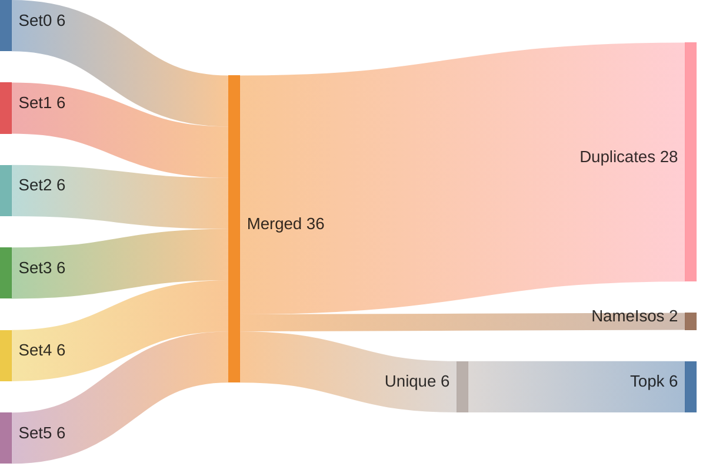

```mermaid
---
config:
  sankey:
    showValues: true
---
sankey-beta

%% source,target,value
Set0,Merged,6
Set1,Merged,6
Set2,Merged,6
Set3,Merged,6
Set4,Merged,6
Set5,Merged,6
Merged,Duplicates,28
Merged,NameIsos,2
Merged,Unique,6
Unique,Topk,6

```
