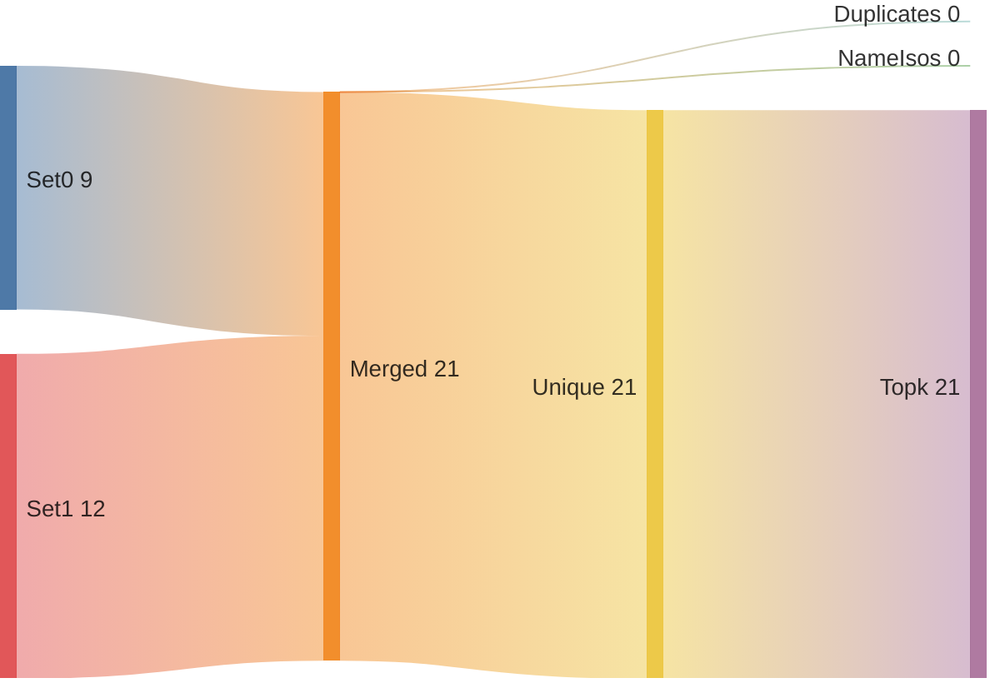
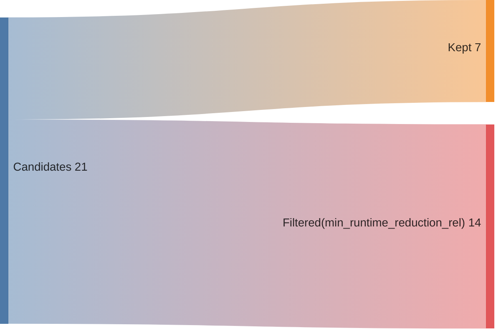
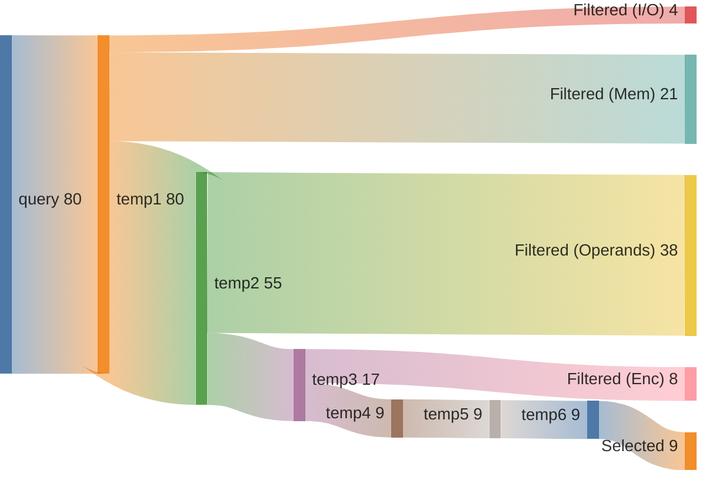
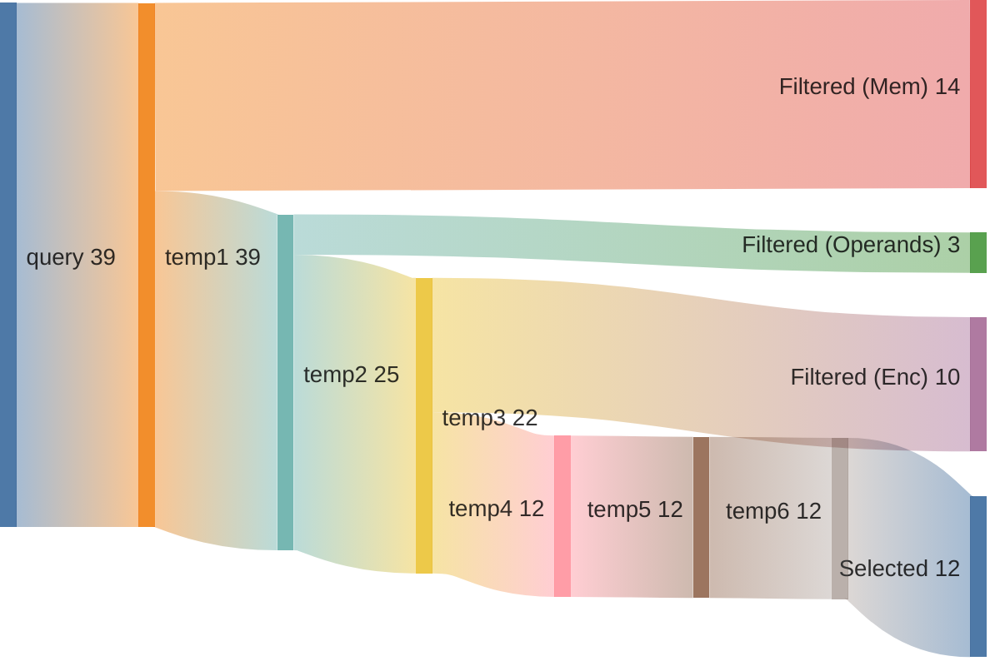

## Summary

Directory: `/var/tmp/ga87puy/isaac-demo/out/embench_iot/crc32/20260520T213046`

### Experiment
```ini
[isaac-demo-embench_iot/crc32-20260520T213046]
benchmark=embench_iot/crc32
datetime=20260520T213046
directory=/var/tmp/ga87puy/isaac-demo/out/embench_iot/crc32/20260520T213046
comment=""
```

### Environment/Config
<details>
<summary>Vars</summary>

```sh
ARCH=rv32im_zicsr_zifencei
ABI=ilp32
GLOBAL_ISEL=0
UNROLL=0
OPTIMIZE=3
TARGET=
CCACHE=1
LLVM_BUILD_TYPE=Release
LLVM_ENABLE_ASSERTIONS=ON
CDFG_STAGE=32
FORCE_PURGE_DB=1
ISAAC_LIMIT_RESULTS=
ISAAC_MIN_ISO_WEIGHT=0.05
ISAAC_SCALE_ISO_WEIGHT=auto
ISAAC_SORT_BY=IsoWeight
ISAAC_TOPK=
ISAAC_PARTITION_WITH_MAXMISO=auto
HLS_ENABLE=1
HLS_SKIP_BASELINE=0
HLS_SKIP_DEFAULT=0
HLS_SKIP_SHARED=0
HLS_NAILGUN_LIBRARY=
HLS_NAILGUN_RESOURCE_MODEL=ol_sky130
HLS_NAILGUN_CLOCK_NS=100
HLS_NAILGUN_SCHEDULE_TIMEOUT=60
HLS_NAILGUN_REFINE_TIMEOUT=60
HLS_NAILGUN_CORE_NAME=CV32E40P
HLS_NAILGUN_ILP_SOLVER=GUROBI
HLS_NAILGUN_SCHED_ALGO_MS=y
HLS_NAILGUN_SCHED_ALGO_PA=y
HLS_NAILGUN_SCHED_ALGO_RA=y
HLS_NAILGUN_SCHED_ALGO_MI=y
HLS_NAILGUN_OL2_ENABLE=y
HLS_NAILGUN_OL2_CONFIG_TEMPLATE=/var/tmp/ga87puy/isaac-demo/cfg/openlane/minimal_config_fast.json
HLS_NAILGUN_OL2_UNTIL_STEP=OpenROAD.Floorplan
HLS_NAILGUN_OL2_TARGET_FREQ=20
HLS_NAILGUN_OL2_TARGET_UTIL=20
HLS_NAILGUN_SHARE_RESOURCES=0
ASIP_SYN_ENABLE=1
ASIP_SYN_SKIP_BASELINE=0
ASIP_SYN_SKIP_DEFAULT=0
ASIP_SYN_SKIP_SHARED=0
ASIP_SYN_TOOL=synopsys
ASIP_SYN_SYNOPSYS_PDK=nangate45
ASIP_SYN_SYNOPSYS_CLOCK_NS=10
ASIP_SYN_SYNOPSYS_CORE_NAME=CV32E40P
FPGA_SYN_ENABLE=0
FPGA_SYN_SKIP_BASELINE=0
FPGA_SYN_SKIP_DEFAULT=0
FPGA_SYN_SKIP_SHARED=0
FPGA_SYN_TOOL=vivado
FPGA_SYN_VIVADO_PART=xc7a200tffv1156-1
FPGA_SYN_VIVADO_CLOCK_NS=50
FPGA_SYN_VIVADO_CORE_NAME=CV32E40P
ISAAC_QUERY_CONFIG_YAML=cfg/isaac/query/paper/cv32e40p.yml
```

</details>

### Times
<details>
<summary>Stages</summary>

| Stage                               |   Diff [s] |
|:------------------------------------|-----------:|
| bench_0                             |      4.211 |
| trace_0                             |     10.341 |
| isaac_0_load                        |     12.047 |
| isaac_0_analyze                     |      6.981 |
| isaac_0_visualize                   |      3.635 |
| isaac_0_pick                        |      3.196 |
| isaac_0_cdfg                        |     20.271 |
| isaac_0_query                       |     16.863 |
| isaac_0_generate                    |      6.04  |
| assign_0_enc                        |      0.934 |
| isaac_0_etiss                       |      2.236 |
| seal5_0_splitted                    |    315.177 |
| assign_0_seal5                      |      0.881 |
| etiss_0                             |     21.161 |
| compare_0                           |     10.497 |
| compare_0_per_instr                 |     16.445 |
| assign_0_compare_per_instr          |      0.879 |
| filter_0                            |      0.946 |
| spec_0_filtered                     |      0.472 |
| isaac_0_generate_filtered           |      5.481 |
| isaac_0_etiss_filtered              |      1.775 |
| fake_hls_0_filtered                 |      0.885 |
| assign_0_fake_hls_filtered          |      1.154 |
| select_0_filtered                   |     34.331 |
| isaac_0_etiss_filtered_selected     |      1.738 |
| fake_hls_0_filtered_selected        |      1.068 |
| assign_0_fake_hls_filtered_selected |      1.128 |
| compare_0_filtered_selected         |     10.801 |
| assign_0_compare_filtered_selected  |      0.02  |
| retrace_0_filtered_selected         |      8.332 |
| reanalyze_0_filtered_selected       |     60.392 |
| assign_0_util_filtered_selected     |      0.677 |
| etiss_perf_0_filtered_selected      |    709.325 |
| compare_perf_0_filtered_selected    |     46.954 |
| retrace_perf_0_filtered_selected    |      6.134 |

</details>

### ISE Potential
|   supported_rel_count |   unsupported_rel_count | has_potential   |
|----------------------:|------------------------:|:----------------|
|              0.608631 |                0.391369 | True            |

### Choices
<details>
<summary>Summary</summary>

<h2>Choice 0</h2>
<table>
<tr><th>func_name</th><th>bb_name</th><th>rel_weight</th><th>num_instrs</th><th>freq</th><th>start</th><th>end</th></tr>
<tr><td>rand_beebs</td><td>%bb.0</td><td>0.564996</td><td>13</td><td>174080.0</td><td>0x1000404</td><td>0x1000438</td></tr>
</table>
<pre><code class='asm'>
 1000404: 018005b7     	lui	a1, 0x1800
 1000408: 6bc5a503     	lw	a0, 0x6bc(a1)
 100040c: 41c65637     	lui	a2, 0x41c65
 1000410: e6d60613     	addi	a2, a2, -0x193
 1000414: 02c50533     	mul	a0, a0, a2
 1000418: 00003637     	lui	a2, 0x3
 100041c: 03960613     	addi	a2, a2, 0x39
 1000420: 00c50533     	add	a0, a0, a2
 1000424: 00151513     	slli	a0, a0, 0x1
 1000428: 00155613     	srli	a2, a0, 0x1
 100042c: 01065513     	srli	a0, a2, 0x10
 1000430: 6ac5ae23     	sw	a2, 0x6bc(a1)
 1000434: 00008067     	ret
</code></pre>
<h2>Choice 1</h2>
<table>
<tr><th>func_name</th><th>bb_name</th><th>rel_weight</th><th>num_instrs</th><th>freq</th><th>start</th><th>end</th></tr>
<tr><td>benchmark_body</td><td>%bb.3</td><td>0.434612</td><td>10</td><td>174080.0</td><td>0x1000384</td><td>0x10003ac</td></tr>
</table>
<pre><code class='asm'>
 1000384: 080000ef     	jal	0x1000404 <rand_beebs>
 1000388: 01354533     	xor	a0, a0, s3
 100038c: 0ff57513     	andi	a0, a0, 0xff
 1000390: 00251513     	slli	a0, a0, 0x2
 1000394: 00a90533     	add	a0, s2, a0
 1000398: 00052503     	lw	a0, 0x0(a0)
 100039c: 0089d593     	srli	a1, s3, 0x8
 10003a0: fffa0a13     	addi	s4, s4, -0x1
 10003a4: 00b549b3     	xor	s3, a0, a1
 10003a8: fc0a1ee3     	bnez	s4, 0x1000384 <benchmark_body+0x40>
</code></pre>

</details>

### Queries
<details>
<summary>Metrics</summary>

|   num_rows |   num_nodes |   num_edges | func           | basic_block   |
|-----------:|------------:|------------:|:---------------|:--------------|
|       5565 |         945 |         840 | rand_beebs     | %bb.0         |
|        903 |         378 |         294 | benchmark_body | %bb.3         |

</details>

### Sankeys
<details>
<summary>Merge Query Results</summary>





</details>

<details>
<summary>Filtered Candidates</summary>





</details>

<details>
<summary>rand_beebs_%bb.0_0</summary>



</details>

<details>
<summary>benchmark_body_%bb.3_0</summary>



</details>

### Compare DF
| Model   | Arch                         |   Run Instructions |   Run Instructions (rel.) |   Total ROM |   Total RAM |   ROM code |   ROM code (rel.) |
|:--------|:-----------------------------|-------------------:|--------------------------:|------------:|------------:|-----------:|------------------:|
| crc32   | rv32im_zicsr_zifencei        |            4005445 |                  1        |        4224 |        1232 |       3124 |          1        |
| crc32   | rv32im_zicsr_zifencei_xisaac |            3135044 |                  0.782696 |        4188 |        1232 |       3088 |          0.988476 |

### CoreDSL
<details>
<summary>gen/XIsaac.core_desc</summary>

```c
import "/var/tmp/ga87puy/isaac-demo/etiss_arch_riscv/rv_base/RVI.core_desc"

InstructionSet XIsaac extends RV32I {
    instructions {
        CUSTOM0 {
            encoding: 7'b0000000 :: rs2[4:0] :: rs1[4:0] :: 3'b000 :: rd[4:0] :: 7'b1111011;
            assembly: {"custom0", "{name(rd)}, {name(rs1)}, {name(rs2)}"};
            behavior: {
                unsigned<32> rs1_val = X[rs1];
                unsigned<32> rs2_val = X[rs2];
                unsigned<32> outp0 = (unsigned<32>)((((unsigned<32>)((unsigned<32>)((((unsigned<32>)((unsigned<32>)((((signed<32>)(rs1_val) + (signed<32>)((unsigned<32>)((((signed<32>)(rs2_val) + (signed<32>)((57)))))))))) << (unsigned<32>)((1)))))) >> (unsigned<32>)((1)))));
                X[rd] = outp0;
            }
        }
        CUSTOM1 {
            encoding: 7'b0000001 :: rs2[4:0] :: rs1[4:0] :: 3'b000 :: rd[4:0] :: 7'b1111011;
            assembly: {"custom1", "{name(rd)}, {name(rs1)}, {name(rs2)}"};
            behavior: {
                unsigned<32> rs1_val = X[rs1];
                unsigned<32> rs2_val = X[rs2];
                unsigned<32> outp0 = (unsigned<32>)((((signed<32>)(rs2_val) + (signed<32>)((unsigned<32>)((((unsigned<32>)((unsigned<32>)((((unsigned<32>)(rs1_val) & (unsigned<32>)((255)))))) << (unsigned<32>)((2)))))))));
                X[rd] = outp0;
            }
        }
        CUSTOM2 {
            encoding: 7'b0000010 :: rs2[4:0] :: rs1[4:0] :: 3'b000 :: rd[4:0] :: 7'b1111011;
            assembly: {"custom2", "{name(rd)}, {name(rs1)}, {name(rs2)}"};
            behavior: {
                unsigned<32> rs2_val = X[rs2];
                unsigned<32> rs1_val = X[rs1];
                unsigned<32> outp0 = (unsigned<32>)((((unsigned<32>)((unsigned<32>)((((unsigned<32>)((unsigned<32>)((((unsigned<32>)(rs1_val) ^ (unsigned<32>)(rs2_val))))) & (unsigned<32>)((255)))))) << (unsigned<32>)((2)))));
                X[rd] = outp0;
            }
        }
        CUSTOM3 {
            encoding: 7'b0000011 :: rs2[4:0] :: rs1[4:0] :: 3'b000 :: rd[4:0] :: 7'b1111011;
            assembly: {"custom3", "{name(rd)}, {name(rs1)}, {name(rs2)}"};
            behavior: {
                unsigned<32> rs1_val = X[rs1];
                unsigned<32> rs2_val = X[rs2];
                unsigned<32> outp0 = (unsigned<32>)((((unsigned<32>)((unsigned<32>)((((signed<32>)(rs1_val) + (signed<32>)((unsigned<32>)((((signed<32>)(rs2_val) + (signed<32>)((57)))))))))) << (unsigned<32>)((1)))));
                X[rd] = outp0;
            }
        }
        CUSTOM4 {
            encoding: 7'b0000100 :: rs2[4:0] :: rs1[4:0] :: 3'b000 :: rd[4:0] :: 7'b1111011;
            assembly: {"custom4", "{name(rd)}, {name(rs1)}, {name(rs2)}"};
            behavior: {
                unsigned<32> rs1_val = X[rs1];
                unsigned<32> rs2_val = X[rs2];
                unsigned<32> outp0 = (unsigned<32>)((((unsigned<32>)((unsigned<32>)((((unsigned<32>)((unsigned<32>)((((signed<32>)(rs1_val) + (signed<32>)(rs2_val))))) << (unsigned<32>)((1)))))) >> (unsigned<32>)((1)))));
                X[rd] = outp0;
            }
        }
        CUSTOM5 {
            encoding: 7'b0000101 :: rs2[4:0] :: rs1[4:0] :: 3'b000 :: rd[4:0] :: 7'b1111011;
            assembly: {"custom5", "{name(rd)}, {name(rs1)}, {name(rs2)}"};
            behavior: {
                unsigned<32> rs1_val = X[rs1];
                unsigned<32> rs2_val = X[rs2];
                unsigned<32> outp0 = (unsigned<32>)((((signed<32>)(rs2_val) + (signed<32>)((unsigned<32>)((((unsigned<32>)(rs1_val) << (unsigned<32>)((2)))))))));
                X[rd] = outp0;
            }
        }
        CUSTOM6 {
            encoding: 7'b0000110 :: rs2[4:0] :: rs1[4:0] :: 3'b000 :: rd[4:0] :: 7'b1111011;
            assembly: {"custom6", "{name(rd)}, {name(rs1)}, {name(rs2)}"};
            behavior: {
                unsigned<32> rs2_val = X[rs2];
                unsigned<32> rs1_val = X[rs1];
                unsigned<32> outp0 = (unsigned<32>)((((unsigned<32>)((unsigned<32>)((((unsigned<32>)(rs1_val) ^ (unsigned<32>)(rs2_val))))) & (unsigned<32>)((255)))));
                X[rd] = outp0;
            }
        }
        CUSTOM7 {
            encoding: 7'b0000111 :: rs2[4:0] :: rs1[4:0] :: 3'b000 :: rd[4:0] :: 7'b1111011;
            assembly: {"custom7", "{name(rd)}, {name(rs1)}, {name(rs2)}"};
            behavior: {
                unsigned<32> rs1_val = X[rs1];
                unsigned<32> rs2_val = X[rs2];
                unsigned<32> outp0 = (unsigned<32>)((((unsigned<32>)(rs1_val) ^ (unsigned<32>)((unsigned<32>)((((unsigned<32>)(rs2_val) >> (unsigned<32>)((8)))))))));
                X[rd] = outp0;
            }
        }
        CUSTOM8 {
            encoding: 7'b0001000 :: 5'b00000 :: rs1[4:0] :: 3'b000 :: rd[4:0] :: 7'b1111011;
            assembly: {"custom8", "{name(rd)}, {name(rs1)}"};
            behavior: {
                unsigned<32> rs1_val = X[rs1];
                unsigned<32> outp0 = (unsigned<32>)((((unsigned<32>)((unsigned<32>)((((unsigned<32>)(rs1_val) & (unsigned<32>)((255)))))) << (unsigned<32>)((2)))));
                X[rd] = outp0;
            }
        }
        CUSTOM9 {
            encoding: 2'b00 :: uimm2[4:0] :: rs2[4:0] :: rs1[4:0] :: 3'b001 :: rd[4:0] :: 7'b1111011;
            assembly: {"custom9", "{name(rd)}, {name(rs1)}, {name(rs2)}, {uimm2}"};
            behavior: {
                unsigned<32> rs1_val = X[rs1];
                unsigned<32> rs2_val = X[rs2];
                unsigned<32> outp0 = (unsigned<32>)((((signed<32>)(rs2_val) + (signed<32>)((unsigned<32>)((((unsigned<32>)(rs1_val) << (unsigned<32>)((unsigned<2>)((uimm2))))))))));
                X[rd] = outp0;
            }
        }
        CUSTOM10 {
            encoding: 2'b01 :: uimm5[4:0] :: rs2[4:0] :: rs1[4:0] :: 3'b001 :: rd[4:0] :: 7'b1111011;
            assembly: {"custom10", "{name(rd)}, {name(rs1)}, {name(rs2)}, {uimm5}"};
            behavior: {
                unsigned<32> rs1_val = X[rs1];
                unsigned<32> rs2_val = X[rs2];
                unsigned<32> outp0 = (unsigned<32>)((((signed<32>)(rs2_val) + (signed<32>)((unsigned<32>)((((unsigned<32>)(rs1_val) << (unsigned<32>)((unsigned<5>)((uimm5))))))))));
                X[rd] = outp0;
            }
        }
        CUSTOM11 {
            encoding: 2'b10 :: uimm4[4:0] :: rs2[4:0] :: rs1[4:0] :: 3'b001 :: rd[4:0] :: 7'b1111011;
            assembly: {"custom11", "{name(rd)}, {name(rs1)}, {name(rs2)}, {uimm4}"};
            behavior: {
                unsigned<32> rs1_val = X[rs1];
                unsigned<32> rs2_val = X[rs2];
                unsigned<32> outp0 = (unsigned<32>)((((unsigned<32>)(rs1_val) ^ (unsigned<32>)((unsigned<32>)((((unsigned<32>)(rs2_val) >> (unsigned<32>)((unsigned<4>)((uimm4))))))))));
                X[rd] = outp0;
            }
        }
        CUSTOM12 {
            encoding: 2'b11 :: uimm5[4:0] :: rs2[4:0] :: rs1[4:0] :: 3'b001 :: rd[4:0] :: 7'b1111011;
            assembly: {"custom12", "{name(rd)}, {name(rs1)}, {name(rs2)}, {uimm5}"};
            behavior: {
                unsigned<32> rs1_val = X[rs1];
                unsigned<32> rs2_val = X[rs2];
                unsigned<32> outp0 = (unsigned<32>)((((unsigned<32>)(rs1_val) ^ (unsigned<32>)((unsigned<32>)((((unsigned<32>)(rs2_val) >> (unsigned<32>)((unsigned<5>)((uimm5))))))))));
                X[rd] = outp0;
            }
        }
        CUSTOM13 {
            encoding: uimm9[11:0] :: rs1[4:0] :: 3'b010 :: rd[4:0] :: 7'b1111011;
            assembly: {"custom13", "{name(rd)}, {name(rs1)}, {uimm9}"};
            behavior: {
                unsigned<32> rs1_val = X[rs1];
                unsigned<32> outp0 = (unsigned<32>)((((unsigned<32>)((unsigned<32>)((((unsigned<32>)(rs1_val) & (unsigned<32>)((unsigned<9>)((uimm9))))))) << (unsigned<32>)((2)))));
                X[rd] = outp0;
            }
        }
        CUSTOM14 {
            encoding: uimm10[11:0] :: rs1[4:0] :: 3'b011 :: rd[4:0] :: 7'b1111011;
            assembly: {"custom14", "{name(rd)}, {name(rs1)}, {uimm10}"};
            behavior: {
                unsigned<32> rs1_val = X[rs1];
                unsigned<32> outp0 = (unsigned<32>)((((unsigned<32>)((unsigned<32>)((((unsigned<32>)(rs1_val) & (unsigned<32>)((unsigned<10>)((uimm10))))))) << (unsigned<32>)((2)))));
                X[rd] = outp0;
            }
        }
        CUSTOM15 {
            encoding: 7'b0001001 :: 5'b00000 :: rs1[4:0] :: 3'b000 :: rd[4:0] :: 7'b1111011;
            assembly: {"custom15", "{name(rd)}, {name(rs1)}"};
            behavior: {
                unsigned<32> rs1_val = X[rs1];
                unsigned<32> outp0 = (unsigned<32>)((((unsigned<32>)((unsigned<32>)((((unsigned<32>)(rs1_val) << (unsigned<32>)((1)))))) >> (unsigned<32>)((1)))));
                X[rd] = outp0;
            }
        }
        CUSTOM16 {
            encoding: 7'b0001010 :: rs2[4:0] :: rs1[4:0] :: 3'b000 :: rd[4:0] :: 7'b1111011;
            assembly: {"custom16", "{name(rd)}, {name(rs1)}, {name(rs2)}"};
            behavior: {
                unsigned<32> rs1_val = X[rs1];
                unsigned<32> rs2_val = X[rs2];
                unsigned<32> outp0 = (unsigned<32>)((((signed<32>)(rs1_val) * (signed<32>)((unsigned<32>)((((signed<32>)(rs2_val) + (signed<32>)((-403)))))))));
                X[rd] = outp0;
            }
        }
        CUSTOM17 {
            encoding: 7'b0001011 :: rs2[4:0] :: rs1[4:0] :: 3'b000 :: rd[4:0] :: 7'b1111011;
            assembly: {"custom17", "{name(rd)}, {name(rs1)}, {name(rs2)}"};
            behavior: {
                unsigned<32> rs1_val = X[rs1];
                unsigned<32> rs2_val = X[rs2];
                unsigned<32> outp0 = (unsigned<32>)((((unsigned<32>)((unsigned<32>)((((signed<32>)(rs1_val) + (signed<32>)(rs2_val))))) << (unsigned<32>)((1)))));
                X[rd] = outp0;
            }
        }
        CUSTOM18 {
            encoding: 7'b0001100 :: rs2[4:0] :: rs1[4:0] :: 3'b000 :: rd[4:0] :: 7'b1111011;
            assembly: {"custom18", "{name(rd)}, {name(rs1)}, {name(rs2)}"};
            behavior: {
                unsigned<32> rs1_val = X[rs1];
                unsigned<32> rs2_val = X[rs2];
                unsigned<32> outp0 = (unsigned<32>)((((signed<32>)(rs1_val) + (signed<32>)((unsigned<32>)((((signed<32>)(rs2_val) + (signed<32>)((57)))))))));
                X[rd] = outp0;
            }
        }
        CUSTOM19 {
            encoding: 2'b00 :: uimm1[4:0] :: rs2[4:0] :: rs1[4:0] :: 3'b100 :: rd[4:0] :: 7'b1111011;
            assembly: {"custom19", "{name(rd)}, {name(rs1)}, {name(rs2)}, {uimm1}"};
            behavior: {
                unsigned<32> rs1_val = X[rs1];
                unsigned<32> rs2_val = X[rs2];
                unsigned<32> outp0 = (unsigned<32>)((((unsigned<32>)((unsigned<32>)((((signed<32>)(rs1_val) + (signed<32>)(rs2_val))))) << (unsigned<32>)((unsigned<1>)((uimm1))))));
                X[rd] = outp0;
            }
        }
        CUSTOM20 {
            encoding: 2'b01 :: uimm5[4:0] :: rs2[4:0] :: rs1[4:0] :: 3'b100 :: rd[4:0] :: 7'b1111011;
            assembly: {"custom20", "{name(rd)}, {name(rs1)}, {name(rs2)}, {uimm5}"};
            behavior: {
                unsigned<32> rs1_val = X[rs1];
                unsigned<32> rs2_val = X[rs2];
                unsigned<32> outp0 = (unsigned<32>)((((unsigned<32>)((unsigned<32>)((((signed<32>)(rs1_val) + (signed<32>)(rs2_val))))) << (unsigned<32>)((unsigned<5>)((uimm5))))));
                X[rd] = outp0;
            }
        }
    }
}


```

</details>

<details>
<summary>gen_filtered/XIsaac.core_desc</summary>

```c
import "/var/tmp/ga87puy/isaac-demo/etiss_arch_riscv/rv_base/RVI.core_desc"

InstructionSet XIsaac extends RV32I {
    instructions {
        CUSTOM4 {
            encoding: 7'b0000100 :: rs2[4:0] :: rs1[4:0] :: 3'b000 :: rd[4:0] :: 7'b1111011;
            assembly: {"custom4", "{name(rd)}, {name(rs1)}, {name(rs2)}"};
            behavior: {
                unsigned<32> rs1_val = X[rs1];
                unsigned<32> rs2_val = X[rs2];
                unsigned<32> outp0 = (unsigned<32>)(((((unsigned<32>)(((unsigned<32>)(((((unsigned<32>)(((unsigned<32>)(((((signed<32>)((rs1_val)) + (signed<32>)((rs2_val)))))))) << (unsigned<32>)(((1))))))))) >> (unsigned<32>)(((1)))))));
                X[rd] = outp0;
            }
        }
        CUSTOM5 {
            encoding: 7'b0000101 :: rs2[4:0] :: rs1[4:0] :: 3'b000 :: rd[4:0] :: 7'b1111011;
            assembly: {"custom5", "{name(rd)}, {name(rs1)}, {name(rs2)}"};
            behavior: {
                unsigned<32> rs1_val = X[rs1];
                unsigned<32> rs2_val = X[rs2];
                unsigned<32> outp0 = (unsigned<32>)(((((signed<32>)((rs2_val)) + (signed<32>)(((unsigned<32>)(((((unsigned<32>)((rs1_val)) << (unsigned<32>)(((2)))))))))))));
                X[rd] = outp0;
            }
        }
        CUSTOM6 {
            encoding: 7'b0000110 :: rs2[4:0] :: rs1[4:0] :: 3'b000 :: rd[4:0] :: 7'b1111011;
            assembly: {"custom6", "{name(rd)}, {name(rs1)}, {name(rs2)}"};
            behavior: {
                unsigned<32> rs2_val = X[rs2];
                unsigned<32> rs1_val = X[rs1];
                unsigned<32> outp0 = (unsigned<32>)(((((unsigned<32>)(((unsigned<32>)(((((unsigned<32>)((rs1_val)) ^ (unsigned<32>)((rs2_val)))))))) & (unsigned<32>)(((255)))))));
                X[rd] = outp0;
            }
        }
        CUSTOM7 {
            encoding: 7'b0000111 :: rs2[4:0] :: rs1[4:0] :: 3'b000 :: rd[4:0] :: 7'b1111011;
            assembly: {"custom7", "{name(rd)}, {name(rs1)}, {name(rs2)}"};
            behavior: {
                unsigned<32> rs1_val = X[rs1];
                unsigned<32> rs2_val = X[rs2];
                unsigned<32> outp0 = (unsigned<32>)(((((unsigned<32>)((rs1_val)) ^ (unsigned<32>)(((unsigned<32>)(((((unsigned<32>)((rs2_val)) >> (unsigned<32>)(((8)))))))))))));
                X[rd] = outp0;
            }
        }
        CUSTOM10 {
            encoding: 2'b01 :: uimm5[4:0] :: rs2[4:0] :: rs1[4:0] :: 3'b001 :: rd[4:0] :: 7'b1111011;
            assembly: {"custom10", "{name(rd)}, {name(rs1)}, {name(rs2)}, {uimm5}"};
            behavior: {
                unsigned<32> rs1_val = X[rs1];
                unsigned<32> rs2_val = X[rs2];
                unsigned<32> outp0 = (unsigned<32>)(((((signed<32>)((rs2_val)) + (signed<32>)(((unsigned<32>)(((((unsigned<32>)((rs1_val)) << (unsigned<32>)(((unsigned<5>)(((uimm5)))))))))))))));
                X[rd] = outp0;
            }
        }
        CUSTOM12 {
            encoding: 2'b11 :: uimm5[4:0] :: rs2[4:0] :: rs1[4:0] :: 3'b001 :: rd[4:0] :: 7'b1111011;
            assembly: {"custom12", "{name(rd)}, {name(rs1)}, {name(rs2)}, {uimm5}"};
            behavior: {
                unsigned<32> rs1_val = X[rs1];
                unsigned<32> rs2_val = X[rs2];
                unsigned<32> outp0 = (unsigned<32>)(((((unsigned<32>)((rs1_val)) ^ (unsigned<32>)(((unsigned<32>)(((((unsigned<32>)((rs2_val)) >> (unsigned<32>)(((unsigned<5>)(((uimm5)))))))))))))));
                X[rd] = outp0;
            }
        }
        CUSTOM15 {
            encoding: 7'b0001001 :: 5'b00000 :: rs1[4:0] :: 3'b000 :: rd[4:0] :: 7'b1111011;
            assembly: {"custom15", "{name(rd)}, {name(rs1)}"};
            behavior: {
                unsigned<32> rs1_val = X[rs1];
                unsigned<32> outp0 = (unsigned<32>)(((((unsigned<32>)(((unsigned<32>)(((((unsigned<32>)((rs1_val)) << (unsigned<32>)(((1))))))))) >> (unsigned<32>)(((1)))))));
                X[rd] = outp0;
            }
        }
    }
}


```

</details>


