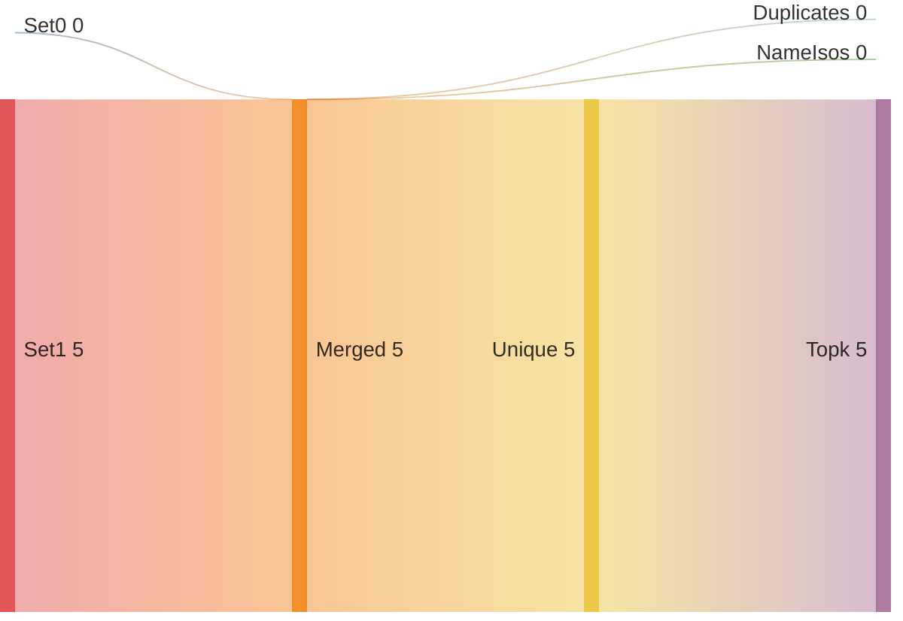
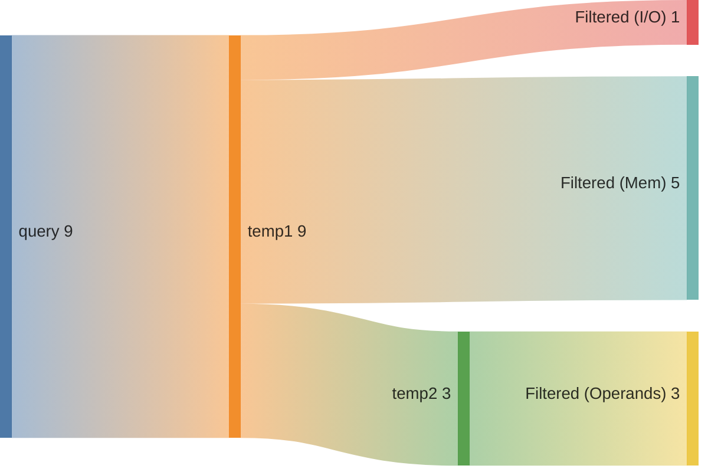
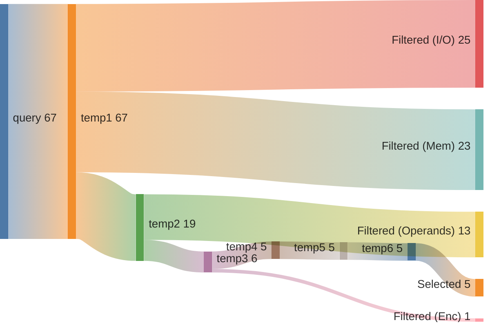

## Summary

Directory: `/var/tmp/ga87puy/isaac-demo/out/embench_iot/edn/20260520T184558`

### Experiment
```ini
[isaac-demo-embench_iot/edn-20260520T184558]
benchmark=embench_iot/edn
datetime=20260520T184558
directory=/var/tmp/ga87puy/isaac-demo/out/embench_iot/edn/20260520T184558
comment=""
```

### Environment/Config
<details>
<summary>Vars</summary>

```sh
ARCH=rv32im_zicsr_zifencei
ABI=ilp32
GLOBAL_ISEL=0
UNROLL=0
OPTIMIZE=3
TARGET=
CCACHE=1
LLVM_BUILD_TYPE=Release
LLVM_ENABLE_ASSERTIONS=ON
CDFG_STAGE=32
FORCE_PURGE_DB=1
ISAAC_LIMIT_RESULTS=
ISAAC_MIN_ISO_WEIGHT=0.05
ISAAC_SCALE_ISO_WEIGHT=auto
ISAAC_SORT_BY=IsoWeight
ISAAC_TOPK=
ISAAC_PARTITION_WITH_MAXMISO=auto
HLS_ENABLE=1
HLS_SKIP_BASELINE=0
HLS_SKIP_DEFAULT=0
HLS_SKIP_SHARED=0
HLS_NAILGUN_LIBRARY=
HLS_NAILGUN_RESOURCE_MODEL=ol_sky130
HLS_NAILGUN_CLOCK_NS=100
HLS_NAILGUN_SCHEDULE_TIMEOUT=60
HLS_NAILGUN_REFINE_TIMEOUT=60
HLS_NAILGUN_CORE_NAME=CV32E40P
HLS_NAILGUN_ILP_SOLVER=GUROBI
HLS_NAILGUN_SCHED_ALGO_MS=y
HLS_NAILGUN_SCHED_ALGO_PA=y
HLS_NAILGUN_SCHED_ALGO_RA=y
HLS_NAILGUN_SCHED_ALGO_MI=y
HLS_NAILGUN_OL2_ENABLE=y
HLS_NAILGUN_OL2_CONFIG_TEMPLATE=/var/tmp/ga87puy/isaac-demo/cfg/openlane/minimal_config_fast.json
HLS_NAILGUN_OL2_UNTIL_STEP=OpenROAD.Floorplan
HLS_NAILGUN_OL2_TARGET_FREQ=20
HLS_NAILGUN_OL2_TARGET_UTIL=20
HLS_NAILGUN_SHARE_RESOURCES=0
ASIP_SYN_ENABLE=1
ASIP_SYN_SKIP_BASELINE=0
ASIP_SYN_SKIP_DEFAULT=0
ASIP_SYN_SKIP_SHARED=0
ASIP_SYN_TOOL=synopsys
ASIP_SYN_SYNOPSYS_PDK=nangate45
ASIP_SYN_SYNOPSYS_CLOCK_NS=10
ASIP_SYN_SYNOPSYS_CORE_NAME=CV32E40P
FPGA_SYN_ENABLE=0
FPGA_SYN_SKIP_BASELINE=0
FPGA_SYN_SKIP_DEFAULT=0
FPGA_SYN_SKIP_SHARED=0
FPGA_SYN_TOOL=vivado
FPGA_SYN_VIVADO_PART=xc7a200tffv1156-1
FPGA_SYN_VIVADO_CLOCK_NS=50
FPGA_SYN_VIVADO_CORE_NAME=CV32E40P
ISAAC_QUERY_CONFIG_YAML=cfg/isaac/query/paper/cv32e40p.yml
```

</details>

### Times
<details>
<summary>Stages</summary>

| Stage                               |   Diff [s] |
|:------------------------------------|-----------:|
| bench_0                             |      4.338 |
| trace_0                             |      9.512 |
| isaac_0_load                        |     12.067 |
| isaac_0_analyze                     |      6.588 |
| isaac_0_visualize                   |      2.868 |
| isaac_0_pick                        |      2.938 |
| isaac_0_cdfg                        |     27.332 |
| isaac_0_query                       |     12.964 |
| isaac_0_generate                    |      5.307 |
| assign_0_enc                        |      0.711 |
| isaac_0_etiss                       |      1.802 |
| seal5_0_splitted                    |    310.745 |
| assign_0_seal5                      |      0.702 |
| etiss_0                             |     20.856 |
| compare_0                           |     10.638 |
| compare_0_per_instr                 |     11.879 |
| assign_0_compare_per_instr          |      0.702 |
| filter_0                            |      0.81  |
| spec_0_filtered                     |      0.438 |
| isaac_0_generate_filtered           |      5.337 |
| isaac_0_etiss_filtered              |      1.725 |
| fake_hls_0_filtered                 |      0.853 |
| assign_0_fake_hls_filtered          |      1.083 |
| select_0_filtered                   |     23.5   |
| isaac_0_etiss_filtered_selected     |      1.695 |
| fake_hls_0_filtered_selected        |      0.906 |
| assign_0_fake_hls_filtered_selected |      1.108 |
| compare_0_filtered_selected         |     10.793 |
| assign_0_compare_filtered_selected  |      0.028 |
| retrace_0_filtered_selected         |      8.83  |
| reanalyze_0_filtered_selected       |     58.748 |
| assign_0_util_filtered_selected     |      0.634 |
| etiss_perf_0_filtered_selected      |    631.635 |
| compare_perf_0_filtered_selected    |     36.123 |
| retrace_perf_0_filtered_selected    |      6.668 |

</details>

### ISE Potential
|   supported_rel_count |   unsupported_rel_count | has_potential   |
|----------------------:|------------------------:|:----------------|
|              0.652637 |                0.347363 | True            |

### Choices
<details>
<summary>Summary</summary>

<h2>Choice 0</h2>
<table>
<tr><th>func_name</th><th>bb_name</th><th>rel_weight</th><th>num_instrs</th><th>freq</th><th>start</th><th>end</th></tr>
<tr><td>benchmark_body</td><td>%bb.8</td><td>0.404084</td><td>7</td><td>217500.0</td><td>0x1000774</td><td>0x1000790</td></tr>
</table>
<pre><code class='asm'>
 1000774: 00069783     	lh	a5, 0x0(a3)
 1000778: 00071803     	lh	a6, 0x0(a4)
 100077c: 02f807b3     	mul	a5, a6, a5
 1000780: 00c78633     	add	a2, a5, a2
 1000784: 00270713     	addi	a4, a4, 0x2
 1000788: 00268693     	addi	a3, a3, 0x2
 100078c: ffb714e3     	bne	a4, s11, 0x1000774 <benchmark_body+0x134>
</code></pre>
<h2>Choice 1</h2>
<table>
<tr><th>func_name</th><th>bb_name</th><th>rel_weight</th><th>num_instrs</th><th>freq</th><th>start</th><th>end</th></tr>
<tr><td>benchmark_body</td><td>%bb.12</td><td>0.369449</td><td>20</td><td>69600.0</td><td>0x10007d4</td><td>0x1000824</td></tr>
</table>
<pre><code class='asm'>
 10007d4: ffe69883     	lh	a7, -0x2(a3)
 10007d8: ffe71283     	lh	t0, -0x2(a4)
 10007dc: 01079793     	slli	a5, a5, 0x10
 10007e0: 4107d793     	srai	a5, a5, 0x10
 10007e4: 02f887b3     	mul	a5, a7, a5
 10007e8: 01078833     	add	a6, a5, a6
 10007ec: 00071303     	lh	t1, 0x0(a4)
 10007f0: 025887b3     	mul	a5, a7, t0
 10007f4: 00069883     	lh	a7, 0x0(a3)
 10007f8: 00c78633     	add	a2, a5, a2
 10007fc: 01031793     	slli	a5, t1, 0x10
 1000800: 0107d793     	srli	a5, a5, 0x10
 1000804: 025882b3     	mul	t0, a7, t0
 1000808: 00580833     	add	a6, a6, t0
 100080c: 026888b3     	mul	a7, a7, t1
 1000810: 01160633     	add	a2, a2, a7
 1000814: 00468693     	addi	a3, a3, 0x4
 1000818: 04298893     	addi	a7, s3, 0x42
 100081c: 00470713     	addi	a4, a4, 0x4
 1000820: fb169ae3     	bne	a3, a7, 0x10007d4 <benchmark_body+0x194>
</code></pre>

</details>

### Queries
<details>
<summary>Metrics</summary>

|   num_rows |   num_nodes |   num_edges | func           | basic_block   |
|-----------:|------------:|------------:|:---------------|:--------------|
|         78 |          84 |          60 | benchmark_body | %bb.8         |
|       5356 |        1957 |        1957 | benchmark_body | %bb.12        |

</details>

### Sankeys
<details>
<summary>Merge Query Results</summary>





</details>

<details>
<summary>Filtered Candidates</summary>


</details>

<details>
<summary>benchmark_body_%bb.8_0</summary>



</details>

<details>
<summary>benchmark_body_%bb.12_0</summary>



</details>

### Compare DF
| Model   | Arch                         |   Run Instructions |   Run Instructions (rel.) |   Total ROM |   Total RAM |   ROM code |   ROM code (rel.) |
|:--------|:-----------------------------|-------------------:|--------------------------:|------------:|------------:|-----------:|------------------:|
| edn     | rv32im_zicsr_zifencei        |            3765988 |                  1        |        6672 |        2828 |       4996 |          1        |
| edn     | rv32im_zicsr_zifencei_xisaac |            3526303 |                  0.936355 |        6592 |        2828 |       4916 |          0.983987 |

### CoreDSL
<details>
<summary>gen/XIsaac.core_desc</summary>

```c
import "/var/tmp/ga87puy/isaac-demo/etiss_arch_riscv/rv_base/RVI.core_desc"

InstructionSet XIsaac extends RV32I {
    instructions {
        CUSTOM0 {
            encoding: 7'b0000000 :: rs2[4:0] :: rs1[4:0] :: 3'b000 :: rd[4:0] :: 7'b1111011;
            assembly: {"custom0", "{name(rd)}, {name(rs1)}, {name(rs2)}"};
            behavior: {
                unsigned<32> rs2_val = X[rs2];
                unsigned<32> rs1_val = X[rs1];
                unsigned<32> outp0 = (unsigned<32>)((((signed<32>)(rs1_val) * (signed<32>)((unsigned<32>)((((signed<32>)((unsigned<32>)((((unsigned<32>)(rs2_val) << (unsigned<32>)((16)))))) >> (signed<32>)((16)))))))));
                X[rd] = outp0;
            }
        }
        CUSTOM1 {
            encoding: 7'b0000001 :: 5'b00000 :: rs1[4:0] :: 3'b000 :: rd[4:0] :: 7'b1111011;
            assembly: {"custom1", "{name(rd)}, {name(rs1)}"};
            behavior: {
                unsigned<32> rs1_val = X[rs1];
                unsigned<32> outp0 = (unsigned<32>)((((signed<32>)((unsigned<32>)((((unsigned<32>)(rs1_val) << (unsigned<32>)((16)))))) >> (signed<32>)((16)))));
                X[rd] = outp0;
            }
        }
        CUSTOM2 {
            encoding: 7'b0000010 :: rs2[4:0] :: rs1[4:0] :: 3'b000 :: rd[4:0] :: 7'b1111011;
            assembly: {"custom2", "{name(rd)}, {name(rs1)}, {name(rs2)}"};
            behavior: {
                unsigned<32> rs1_val = X[rs1];
                unsigned<32> rs2_val = X[rs2];
                unsigned<32> outp0 = (unsigned<32>)((((signed<32>)(rs2_val) * (signed<32>)((unsigned<32>)((((signed<32>)(rs1_val) >> (signed<32>)((16)))))))));
                X[rd] = outp0;
            }
        }
        CUSTOM3 {
            encoding: 7'b0000011 :: 5'b00000 :: rs1[4:0] :: 3'b000 :: rd[4:0] :: 7'b1111011;
            assembly: {"custom3", "{name(rd)}, {name(rs1)}"};
            behavior: {
                unsigned<32> rs1_val = X[rs1];
                unsigned<32> outp0 = (unsigned<32>)((((unsigned<32>)((unsigned<32>)((((unsigned<32>)(rs1_val) << (unsigned<32>)((16)))))) >> (unsigned<32>)((16)))));
                X[rd] = outp0;
            }
        }
        CUSTOM4 {
            encoding: 2'b00 :: uimm5[4:0] :: rs2[4:0] :: rs1[4:0] :: 3'b001 :: rd[4:0] :: 7'b1111011;
            assembly: {"custom4", "{name(rd)}, {name(rs1)}, {name(rs2)}, {uimm5}"};
            behavior: {
                unsigned<32> rs1_val = X[rs1];
                unsigned<32> rs2_val = X[rs2];
                unsigned<32> outp0 = (unsigned<32>)((((signed<32>)(rs2_val) * (signed<32>)((unsigned<32>)((((signed<32>)(rs1_val) >> (signed<32>)((unsigned<5>)((uimm5))))))))));
                X[rd] = outp0;
            }
        }
    }
}


```

</details>

<details>
<summary>gen_filtered/XIsaac.core_desc</summary>

```c
import "/var/tmp/ga87puy/isaac-demo/etiss_arch_riscv/rv_base/RVI.core_desc"

InstructionSet XIsaac extends RV32I {
    instructions {
        CUSTOM0 {
            encoding: 7'b0000000 :: rs2[4:0] :: rs1[4:0] :: 3'b000 :: rd[4:0] :: 7'b1111011;
            assembly: {"custom0", "{name(rd)}, {name(rs1)}, {name(rs2)}"};
            behavior: {
                unsigned<32> rs2_val = X[rs2];
                unsigned<32> rs1_val = X[rs1];
                unsigned<32> outp0 = (unsigned<32>)(((((signed<32>)((rs1_val)) * (signed<32>)(((unsigned<32>)(((((signed<32>)(((unsigned<32>)(((((unsigned<32>)((rs2_val)) << (unsigned<32>)(((16))))))))) >> (signed<32>)(((16)))))))))))));
                X[rd] = outp0;
            }
        }
        CUSTOM1 {
            encoding: 7'b0000001 :: 5'b00000 :: rs1[4:0] :: 3'b000 :: rd[4:0] :: 7'b1111011;
            assembly: {"custom1", "{name(rd)}, {name(rs1)}"};
            behavior: {
                unsigned<32> rs1_val = X[rs1];
                unsigned<32> outp0 = (unsigned<32>)(((((signed<32>)(((unsigned<32>)(((((unsigned<32>)((rs1_val)) << (unsigned<32>)(((16))))))))) >> (signed<32>)(((16)))))));
                X[rd] = outp0;
            }
        }
        CUSTOM2 {
            encoding: 7'b0000010 :: rs2[4:0] :: rs1[4:0] :: 3'b000 :: rd[4:0] :: 7'b1111011;
            assembly: {"custom2", "{name(rd)}, {name(rs1)}, {name(rs2)}"};
            behavior: {
                unsigned<32> rs1_val = X[rs1];
                unsigned<32> rs2_val = X[rs2];
                unsigned<32> outp0 = (unsigned<32>)(((((signed<32>)((rs2_val)) * (signed<32>)(((unsigned<32>)(((((signed<32>)((rs1_val)) >> (signed<32>)(((16)))))))))))));
                X[rd] = outp0;
            }
        }
        CUSTOM3 {
            encoding: 7'b0000011 :: 5'b00000 :: rs1[4:0] :: 3'b000 :: rd[4:0] :: 7'b1111011;
            assembly: {"custom3", "{name(rd)}, {name(rs1)}"};
            behavior: {
                unsigned<32> rs1_val = X[rs1];
                unsigned<32> outp0 = (unsigned<32>)(((((unsigned<32>)(((unsigned<32>)(((((unsigned<32>)((rs1_val)) << (unsigned<32>)(((16))))))))) >> (unsigned<32>)(((16)))))));
                X[rd] = outp0;
            }
        }
        CUSTOM4 {
            encoding: 2'b00 :: uimm5[4:0] :: rs2[4:0] :: rs1[4:0] :: 3'b001 :: rd[4:0] :: 7'b1111011;
            assembly: {"custom4", "{name(rd)}, {name(rs1)}, {name(rs2)}, {uimm5}"};
            behavior: {
                unsigned<32> rs1_val = X[rs1];
                unsigned<32> rs2_val = X[rs2];
                unsigned<32> outp0 = (unsigned<32>)(((((signed<32>)((rs2_val)) * (signed<32>)(((unsigned<32>)(((((signed<32>)((rs1_val)) >> (signed<32>)(((unsigned<5>)(((uimm5)))))))))))))));
                X[rd] = outp0;
            }
        }
    }
}


```

</details>


