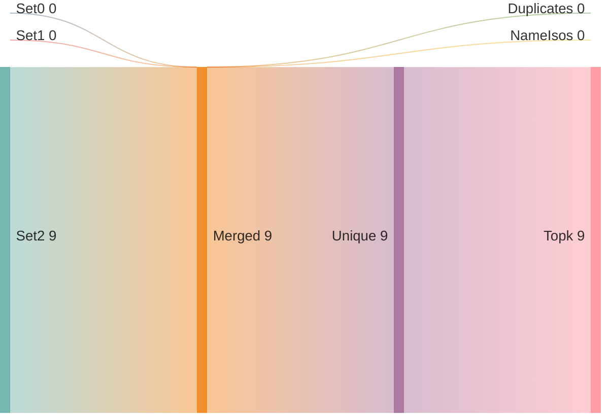
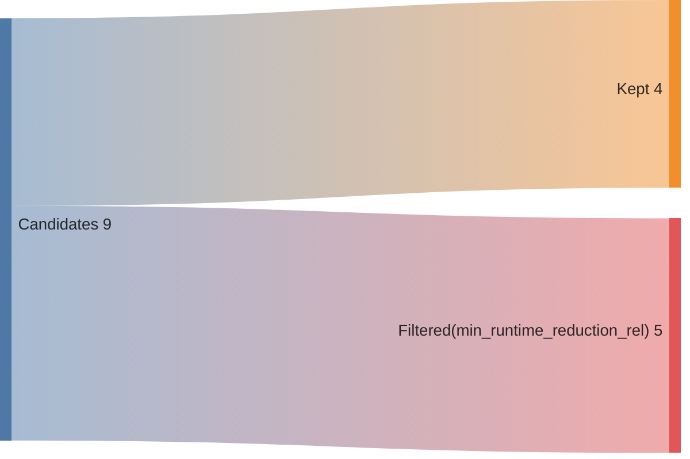
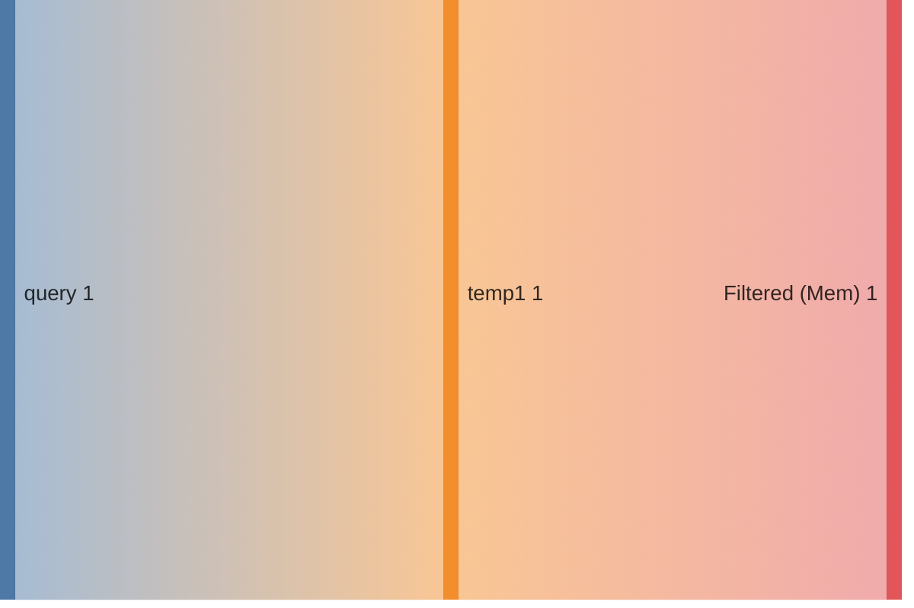
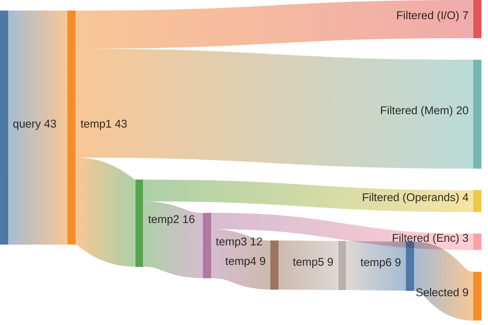

## Summary

Directory: `/var/tmp/ga87puy/isaac-demo/out/embench_iot/huffbench/20260520T202544`

### Experiment
```ini
[isaac-demo-embench_iot/huffbench-20260520T202544]
benchmark=embench_iot/huffbench
datetime=20260520T202544
directory=/var/tmp/ga87puy/isaac-demo/out/embench_iot/huffbench/20260520T202544
comment=""
```

### Environment/Config
<details>
<summary>Vars</summary>

```sh
ARCH=rv32im_zicsr_zifencei
ABI=ilp32
GLOBAL_ISEL=0
UNROLL=0
OPTIMIZE=3
TARGET=
CCACHE=1
LLVM_BUILD_TYPE=Release
LLVM_ENABLE_ASSERTIONS=ON
CDFG_STAGE=32
FORCE_PURGE_DB=1
ISAAC_LIMIT_RESULTS=
ISAAC_MIN_ISO_WEIGHT=0.05
ISAAC_SCALE_ISO_WEIGHT=auto
ISAAC_SORT_BY=IsoWeight
ISAAC_TOPK=
ISAAC_PARTITION_WITH_MAXMISO=auto
HLS_ENABLE=1
HLS_SKIP_BASELINE=0
HLS_SKIP_DEFAULT=0
HLS_SKIP_SHARED=0
HLS_NAILGUN_LIBRARY=
HLS_NAILGUN_RESOURCE_MODEL=ol_sky130
HLS_NAILGUN_CLOCK_NS=100
HLS_NAILGUN_SCHEDULE_TIMEOUT=60
HLS_NAILGUN_REFINE_TIMEOUT=60
HLS_NAILGUN_CORE_NAME=CV32E40P
HLS_NAILGUN_ILP_SOLVER=GUROBI
HLS_NAILGUN_SCHED_ALGO_MS=y
HLS_NAILGUN_SCHED_ALGO_PA=y
HLS_NAILGUN_SCHED_ALGO_RA=y
HLS_NAILGUN_SCHED_ALGO_MI=y
HLS_NAILGUN_OL2_ENABLE=y
HLS_NAILGUN_OL2_CONFIG_TEMPLATE=/var/tmp/ga87puy/isaac-demo/cfg/openlane/minimal_config_fast.json
HLS_NAILGUN_OL2_UNTIL_STEP=OpenROAD.Floorplan
HLS_NAILGUN_OL2_TARGET_FREQ=20
HLS_NAILGUN_OL2_TARGET_UTIL=20
HLS_NAILGUN_SHARE_RESOURCES=0
ASIP_SYN_ENABLE=1
ASIP_SYN_SKIP_BASELINE=0
ASIP_SYN_SKIP_DEFAULT=0
ASIP_SYN_SKIP_SHARED=0
ASIP_SYN_TOOL=synopsys
ASIP_SYN_SYNOPSYS_PDK=nangate45
ASIP_SYN_SYNOPSYS_CLOCK_NS=10
ASIP_SYN_SYNOPSYS_CORE_NAME=CV32E40P
FPGA_SYN_ENABLE=0
FPGA_SYN_SKIP_BASELINE=0
FPGA_SYN_SKIP_DEFAULT=0
FPGA_SYN_SKIP_SHARED=0
FPGA_SYN_TOOL=vivado
FPGA_SYN_VIVADO_PART=xc7a200tffv1156-1
FPGA_SYN_VIVADO_CLOCK_NS=50
FPGA_SYN_VIVADO_CORE_NAME=CV32E40P
ISAAC_QUERY_CONFIG_YAML=cfg/isaac/query/paper/cv32e40p.yml
```

</details>

### Times
<details>
<summary>Stages</summary>

| Stage                               |   Diff [s] |
|:------------------------------------|-----------:|
| bench_0                             |      4.383 |
| trace_0                             |      8.006 |
| isaac_0_load                        |      8.04  |
| isaac_0_analyze                     |      5.621 |
| isaac_0_visualize                   |      3.783 |
| isaac_0_pick                        |      2.891 |
| isaac_0_cdfg                        |     25.499 |
| isaac_0_query                       |     19.513 |
| isaac_0_generate                    |      5.646 |
| assign_0_enc                        |      0.788 |
| isaac_0_etiss                       |      1.783 |
| seal5_0_splitted                    |    317.159 |
| assign_0_seal5                      |      0.526 |
| etiss_0                             |     21.877 |
| compare_0                           |     10.503 |
| compare_0_per_instr                 |     13.165 |
| assign_0_compare_per_instr          |      0.796 |
| filter_0                            |      0.86  |
| spec_0_filtered                     |      0.433 |
| isaac_0_generate_filtered           |      5.321 |
| isaac_0_etiss_filtered              |      1.744 |
| fake_hls_0_filtered                 |      0.909 |
| assign_0_fake_hls_filtered          |      1.142 |
| select_0_filtered                   |     23.966 |
| isaac_0_etiss_filtered_selected     |      1.652 |
| fake_hls_0_filtered_selected        |      0.839 |
| assign_0_fake_hls_filtered_selected |      1.054 |
| compare_0_filtered_selected         |     10.87  |
| assign_0_compare_filtered_selected  |      0.021 |
| retrace_0_filtered_selected         |      7.812 |
| reanalyze_0_filtered_selected       |     53.554 |
| assign_0_util_filtered_selected     |      0.634 |
| etiss_perf_0_filtered_selected      |    529.902 |
| compare_perf_0_filtered_selected    |     17.196 |
| retrace_perf_0_filtered_selected    |      6.55  |

</details>

### ISE Potential
|   supported_rel_count |   unsupported_rel_count | has_potential   |
|----------------------:|------------------------:|:----------------|
|              0.531989 |                0.468011 | True            |

### Choices
<details>
<summary>Summary</summary>

<h2>Choice 0</h2>
<table>
<tr><th>func_name</th><th>bb_name</th><th>rel_weight</th><th>num_instrs</th><th>freq</th><th>start</th><th>end</th></tr>
<tr><td>compdecomp</td><td>%bb.68</td><td>0.197431</td><td>4</td><td>112629.0</td><td>0x1000ab4</td><td>0x1000ac4</td></tr>
</table>
<pre><code class='asm'>
 1000ab4: 00032383     	lw	t2, 0x0(t1)
 1000ab8: 00128293     	addi	t0, t0, 0x1
 1000abc: 00430313     	addi	t1, t1, 0x4
 1000ac0: ff13eae3     	bltu	t2, a7, 0x1000ab4 <compdecomp+0x778>
</code></pre>
<h2>Choice 1</h2>
<table>
<tr><th>func_name</th><th>bb_name</th><th>rel_weight</th><th>num_instrs</th><th>freq</th><th>start</th><th>end</th></tr>
<tr><td>compdecomp</td><td>%bb.61</td><td>0.190347</td><td>8</td><td>54294.0</td><td>0x1000a18</td><td>0x1000a38</td></tr>
</table>
<pre><code class='asm'>
 1000a18: fff3ce83     	lbu	t4, -0x1(t2)
 1000a1c: fff28293     	addi	t0, t0, -0x1
 1000a20: 01c32023     	sw	t3, 0x0(t1)
 1000a24: 01d38023     	sb	t4, 0x0(t2)
 1000a28: fff38393     	addi	t2, t2, -0x1
 1000a2c: ffc30313     	addi	t1, t1, -0x4
 1000a30: fe0290e3     	bnez	t0, 0x1000a10 <compdecomp+0x6d4>
 1000a34: f99ff06f     	j	0x10009cc <compdecomp+0x690>
</code></pre>
<h2>Choice 2</h2>
<table>
<tr><th>func_name</th><th>bb_name</th><th>rel_weight</th><th>num_instrs</th><th>freq</th><th>start</th><th>end</th></tr>
<tr><td>compdecomp</td><td>%bb.48</td><td>0.132247</td><td>11</td><td>27434.0</td><td>0x10006e0</td><td>0x100070c</td></tr>
</table>
<pre><code class='asm'>
 10006e0: 00231e93     	slli	t4, t1, 0x2
 10006e4: 01d78eb3     	add	t4, a5, t4
 10006e8: 000eae83     	lw	t4, 0x0(t4)
 10006ec: 01cefeb3     	and	t4, t4, t3
 10006f0: 00660f33     	add	t5, a2, t1
 10006f4: 000f4f03     	lbu	t5, 0x0(t5)
 10006f8: 01d03eb3     	snez	t4, t4
 10006fc: 01d2e2b3     	or	t0, t0, t4
 1000700: 00138393     	addi	t2, t2, 0x1
 1000704: 001e5e13     	srli	t3, t3, 0x1
 1000708: fbe3f2e3     	bgeu	t2, t5, 0x10006ac <compdecomp+0x370>
</code></pre>
<h2>Choice 3</h2>
<table>
<tr><th>func_name</th><th>bb_name</th><th>rel_weight</th><th>num_instrs</th><th>freq</th><th>start</th><th>end</th></tr>
<tr><td>compdecomp</td><td>%bb.92</td><td>0.052616</td><td>5</td><td>24013.0</td><td>0x1000ae8</td><td>0x1000afc</td></tr>
</table>
<pre><code class='asm'>
 1000ae8: 00185313     	srli	t1, a6, 0x1
 1000aec: 00283813     	sltiu	a6, a6, 0x2
 1000af0: 010787b3     	add	a5, a5, a6
 1000af4: 00030813     	mv	a6, t1
 1000af8: f885eae3     	bltu	a1, s0, 0x1000a8c <compdecomp+0x750>
</code></pre>

</details>

### Queries
<details>
<summary>Metrics</summary>

|   num_rows |   num_nodes |   num_edges | func       | basic_block   |
|-----------:|------------:|------------:|:-----------|:--------------|
|          1 |           2 |           1 | compdecomp | %bb.68        |
|          1 |           2 |           1 | compdecomp | %bb.61        |
|       2415 |         828 |         690 | compdecomp | %bb.48        |

</details>

### Sankeys
<details>
<summary>Merge Query Results</summary>





</details>

<details>
<summary>Filtered Candidates</summary>





</details>

<details>
<summary>compdecomp_%bb.68_0</summary>



</details>

<details>
<summary>compdecomp_%bb.61_0</summary>


</details>

<details>
<summary>compdecomp_%bb.48_0</summary>



</details>

### Compare DF
| Model     | Arch                         |   Run Instructions |   Run Instructions (rel.) |   Total ROM |   Total RAM |   ROM code |   ROM code (rel.) |
|:----------|:-----------------------------|-------------------:|--------------------------:|------------:|------------:|-----------:|------------------:|
| huffbench | rv32im_zicsr_zifencei        |            2281930 |                   1       |        6244 |        9936 |       5668 |          1        |
| huffbench | rv32im_zicsr_zifencei_xisaac |            2203477 |                   0.96562 |        6080 |        9936 |       5504 |          0.971066 |

### CoreDSL
<details>
<summary>gen/XIsaac.core_desc</summary>

```c
import "/var/tmp/ga87puy/isaac-demo/etiss_arch_riscv/rv_base/RVI.core_desc"

InstructionSet XIsaac extends RV32I {
    instructions {
        CUSTOM0 {
            encoding: 7'b0000000 :: rs2[4:0] :: rs1[4:0] :: 3'b000 :: rd[4:0] :: 7'b1111011;
            assembly: {"custom0", "{name(rd)}, {name(rs1)}, {name(rs2)}"};
            behavior: {
                unsigned<32> rs1_val = X[rs1];
                unsigned<32> rs2_val = X[rs2];
                unsigned<32> outp0 = (unsigned<32>)((((signed<32>)((unsigned<32>)((((signed<32>)(rs2_val) + (signed<32>)((0)))))) + (signed<32>)(rs1_val))));
                X[rd] = outp0;
            }
        }
        CUSTOM1 {
            encoding: 2'b00 :: uimm1[4:0] :: rs2[4:0] :: rs1[4:0] :: 3'b001 :: rd[4:0] :: 7'b1111011;
            assembly: {"custom1", "{name(rd)}, {name(rs1)}, {name(rs2)}, {uimm1}"};
            behavior: {
                unsigned<32> rs1_val = X[rs1];
                unsigned<32> rs2_val = X[rs2];
                unsigned<32> outp0 = (unsigned<32>)((((signed<32>)((unsigned<32>)((((signed<32>)(rs2_val) + (signed<32>)((unsigned<1>)((uimm1))))))) + (signed<32>)(rs1_val))));
                X[rd] = outp0;
            }
        }
        CUSTOM2 {
            encoding: 2'b01 :: uimm5[4:0] :: rs2[4:0] :: rs1[4:0] :: 3'b001 :: rd[4:0] :: 7'b1111011;
            assembly: {"custom2", "{name(rd)}, {name(rs1)}, {name(rs2)}, {uimm5}"};
            behavior: {
                unsigned<32> rs1_val = X[rs1];
                unsigned<32> rs2_val = X[rs2];
                unsigned<32> outp0 = (unsigned<32>)((((signed<32>)((unsigned<32>)((((signed<32>)(rs2_val) + (signed<32>)((unsigned<5>)((uimm5))))))) + (signed<32>)(rs1_val))));
                X[rd] = outp0;
            }
        }
        CUSTOM3 {
            encoding: 7'b0000001 :: rs2[4:0] :: rs1[4:0] :: 3'b000 :: rd[4:0] :: 7'b1111011;
            assembly: {"custom3", "{name(rd)}, {name(rs1)}, {name(rs2)}"};
            behavior: {
                unsigned<32> rs2_val = X[rs2];
                unsigned<32> rs1_val = X[rs1];
                unsigned<32> outp0 = (unsigned<32>)((((signed<32>)((unsigned<32>)((((signed<32>)(rs2_val) + (signed<32>)((0)))))) + (signed<32>)((unsigned<32>)((((unsigned<32>)(rs1_val) << (unsigned<32>)((2)))))))));
                X[rd] = outp0;
            }
        }
        CUSTOM4 {
            encoding: 2'b10 :: uimm2[4:0] :: rs2[4:0] :: rs1[4:0] :: 3'b001 :: rd[4:0] :: 7'b1111011;
            assembly: {"custom4", "{name(rd)}, {name(rs1)}, {name(rs2)}, {uimm2}"};
            behavior: {
                unsigned<32> rs2_val = X[rs2];
                unsigned<32> rs1_val = X[rs1];
                unsigned<32> outp0 = (unsigned<32>)((((signed<32>)((unsigned<32>)((((signed<32>)(rs2_val) + (signed<32>)((0)))))) + (signed<32>)((unsigned<32>)((((unsigned<32>)(rs1_val) << (unsigned<32>)((unsigned<2>)((uimm2))))))))));
                X[rd] = outp0;
            }
        }
        CUSTOM5 {
            encoding: 2'b11 :: uimm5[4:0] :: rs2[4:0] :: rs1[4:0] :: 3'b001 :: rd[4:0] :: 7'b1111011;
            assembly: {"custom5", "{name(rd)}, {name(rs1)}, {name(rs2)}, {uimm5}"};
            behavior: {
                unsigned<32> rs2_val = X[rs2];
                unsigned<32> rs1_val = X[rs1];
                unsigned<32> outp0 = (unsigned<32>)((((signed<32>)((unsigned<32>)((((signed<32>)(rs2_val) + (signed<32>)((0)))))) + (signed<32>)((unsigned<32>)((((unsigned<32>)(rs1_val) << (unsigned<32>)((unsigned<5>)((uimm5))))))))));
                X[rd] = outp0;
            }
        }
        CUSTOM6 {
            encoding: 7'b0000010 :: rs2[4:0] :: rs1[4:0] :: 3'b000 :: rd[4:0] :: 7'b1111011;
            assembly: {"custom6", "{name(rd)}, {name(rs1)}, {name(rs2)}"};
            behavior: {
                unsigned<32> rs2_val = X[rs2];
                unsigned<32> rs1_val = X[rs1];
                unsigned<32> outp0 = (unsigned<32>)((((signed<32>)(rs1_val) + (signed<32>)((unsigned<32>)((((unsigned<32>)(rs2_val) << (unsigned<32>)((2)))))))));
                X[rd] = outp0;
            }
        }
        CUSTOM7 {
            encoding: 2'b00 :: uimm2[4:0] :: rs2[4:0] :: rs1[4:0] :: 3'b010 :: rd[4:0] :: 7'b1111011;
            assembly: {"custom7", "{name(rd)}, {name(rs1)}, {name(rs2)}, {uimm2}"};
            behavior: {
                unsigned<32> rs2_val = X[rs2];
                unsigned<32> rs1_val = X[rs1];
                unsigned<32> outp0 = (unsigned<32>)((((signed<32>)(rs1_val) + (signed<32>)((unsigned<32>)((((unsigned<32>)(rs2_val) << (unsigned<32>)((unsigned<2>)((uimm2))))))))));
                X[rd] = outp0;
            }
        }
        CUSTOM8 {
            encoding: 2'b01 :: uimm5[4:0] :: rs2[4:0] :: rs1[4:0] :: 3'b010 :: rd[4:0] :: 7'b1111011;
            assembly: {"custom8", "{name(rd)}, {name(rs1)}, {name(rs2)}, {uimm5}"};
            behavior: {
                unsigned<32> rs2_val = X[rs2];
                unsigned<32> rs1_val = X[rs1];
                unsigned<32> outp0 = (unsigned<32>)((((signed<32>)(rs1_val) + (signed<32>)((unsigned<32>)((((unsigned<32>)(rs2_val) << (unsigned<32>)((unsigned<5>)((uimm5))))))))));
                X[rd] = outp0;
            }
        }
    }
}


```

</details>

<details>
<summary>gen_filtered/XIsaac.core_desc</summary>

```c
import "/var/tmp/ga87puy/isaac-demo/etiss_arch_riscv/rv_base/RVI.core_desc"

InstructionSet XIsaac extends RV32I {
    instructions {
        CUSTOM3 {
            encoding: 7'b0000001 :: rs2[4:0] :: rs1[4:0] :: 3'b000 :: rd[4:0] :: 7'b1111011;
            assembly: {"custom3", "{name(rd)}, {name(rs1)}, {name(rs2)}"};
            behavior: {
                unsigned<32> rs2_val = X[rs2];
                unsigned<32> rs1_val = X[rs1];
                unsigned<32> outp0 = (unsigned<32>)(((((signed<32>)(((unsigned<32>)(((((signed<32>)((rs2_val)) + (signed<32>)(((0))))))))) + (signed<32>)(((unsigned<32>)(((((unsigned<32>)((rs1_val)) << (unsigned<32>)(((2)))))))))))));
                X[rd] = outp0;
            }
        }
        CUSTOM5 {
            encoding: 2'b11 :: uimm5[4:0] :: rs2[4:0] :: rs1[4:0] :: 3'b001 :: rd[4:0] :: 7'b1111011;
            assembly: {"custom5", "{name(rd)}, {name(rs1)}, {name(rs2)}, {uimm5}"};
            behavior: {
                unsigned<32> rs2_val = X[rs2];
                unsigned<32> rs1_val = X[rs1];
                unsigned<32> outp0 = (unsigned<32>)(((((signed<32>)(((unsigned<32>)(((((signed<32>)((rs2_val)) + (signed<32>)(((0))))))))) + (signed<32>)(((unsigned<32>)(((((unsigned<32>)((rs1_val)) << (unsigned<32>)(((unsigned<5>)(((uimm5)))))))))))))));
                X[rd] = outp0;
            }
        }
        CUSTOM6 {
            encoding: 7'b0000010 :: rs2[4:0] :: rs1[4:0] :: 3'b000 :: rd[4:0] :: 7'b1111011;
            assembly: {"custom6", "{name(rd)}, {name(rs1)}, {name(rs2)}"};
            behavior: {
                unsigned<32> rs2_val = X[rs2];
                unsigned<32> rs1_val = X[rs1];
                unsigned<32> outp0 = (unsigned<32>)(((((signed<32>)((rs1_val)) + (signed<32>)(((unsigned<32>)(((((unsigned<32>)((rs2_val)) << (unsigned<32>)(((2)))))))))))));
                X[rd] = outp0;
            }
        }
        CUSTOM8 {
            encoding: 2'b01 :: uimm5[4:0] :: rs2[4:0] :: rs1[4:0] :: 3'b010 :: rd[4:0] :: 7'b1111011;
            assembly: {"custom8", "{name(rd)}, {name(rs1)}, {name(rs2)}, {uimm5}"};
            behavior: {
                unsigned<32> rs2_val = X[rs2];
                unsigned<32> rs1_val = X[rs1];
                unsigned<32> outp0 = (unsigned<32>)(((((signed<32>)((rs1_val)) + (signed<32>)(((unsigned<32>)(((((unsigned<32>)((rs2_val)) << (unsigned<32>)(((unsigned<5>)(((uimm5)))))))))))))));
                X[rd] = outp0;
            }
        }
    }
}


```

</details>


