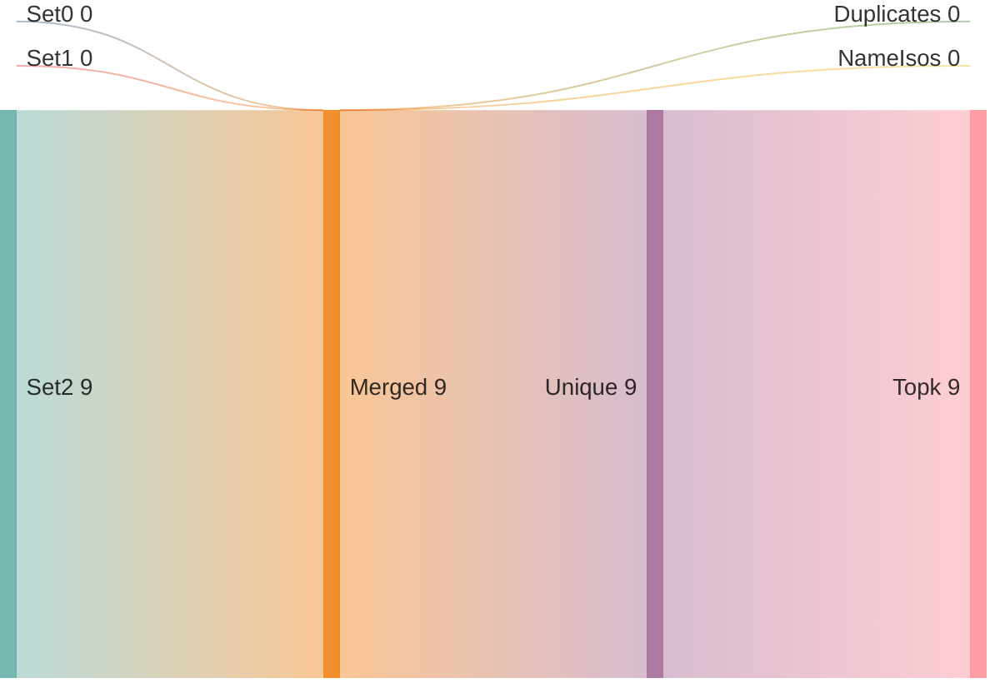

```mermaid
---
config:
  sankey:
    showValues: true
---
sankey-beta

%% source,target,value
Set0,Merged,0
Set1,Merged,0
Set2,Merged,9
Merged,Duplicates,0
Merged,NameIsos,0
Merged,Unique,9
Unique,Topk,9

```
