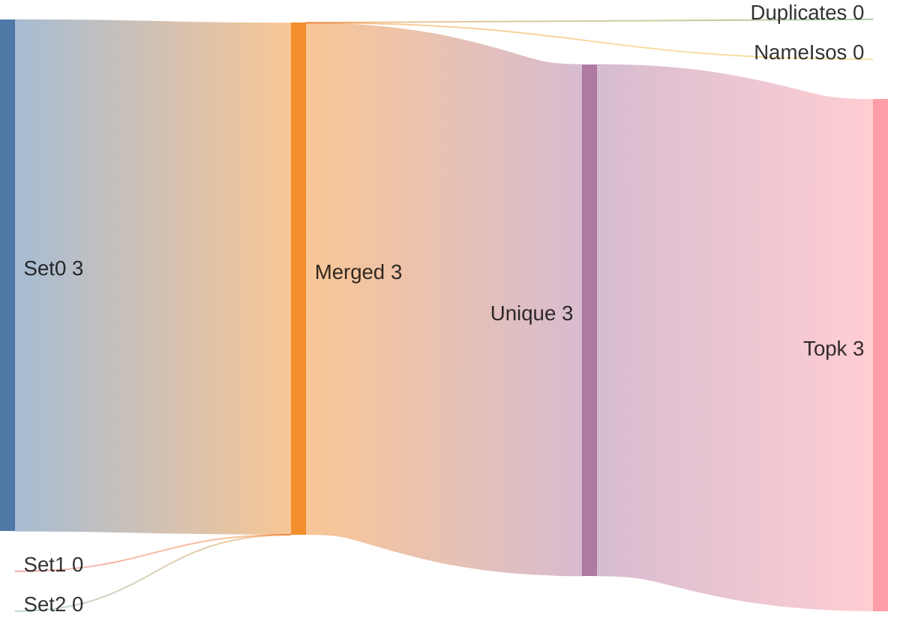
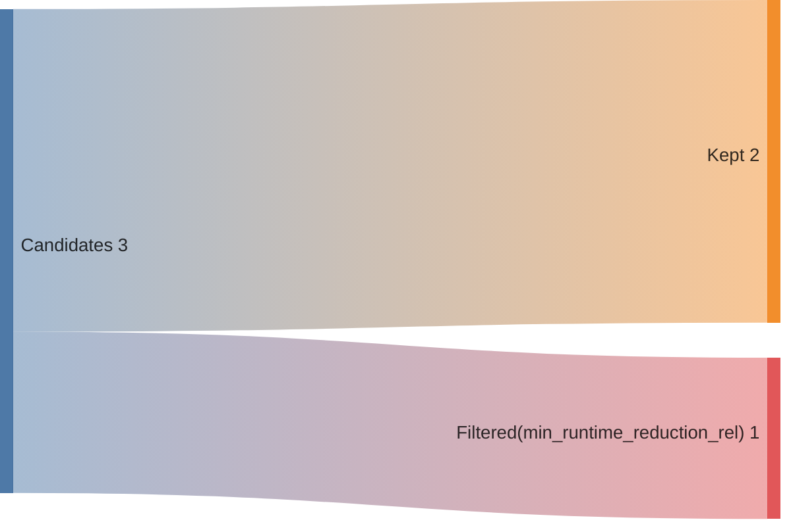
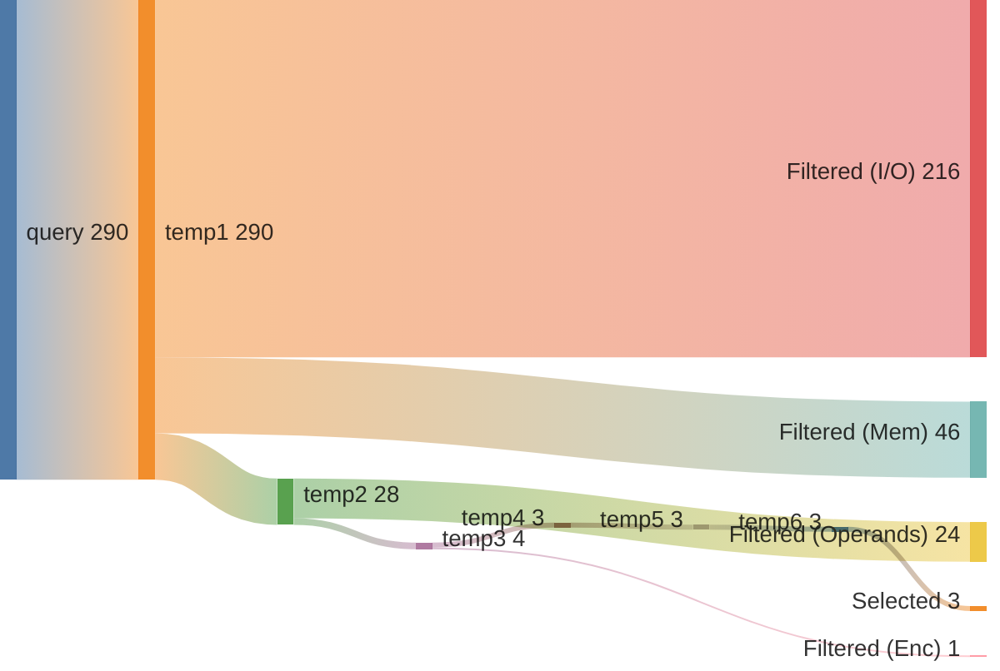
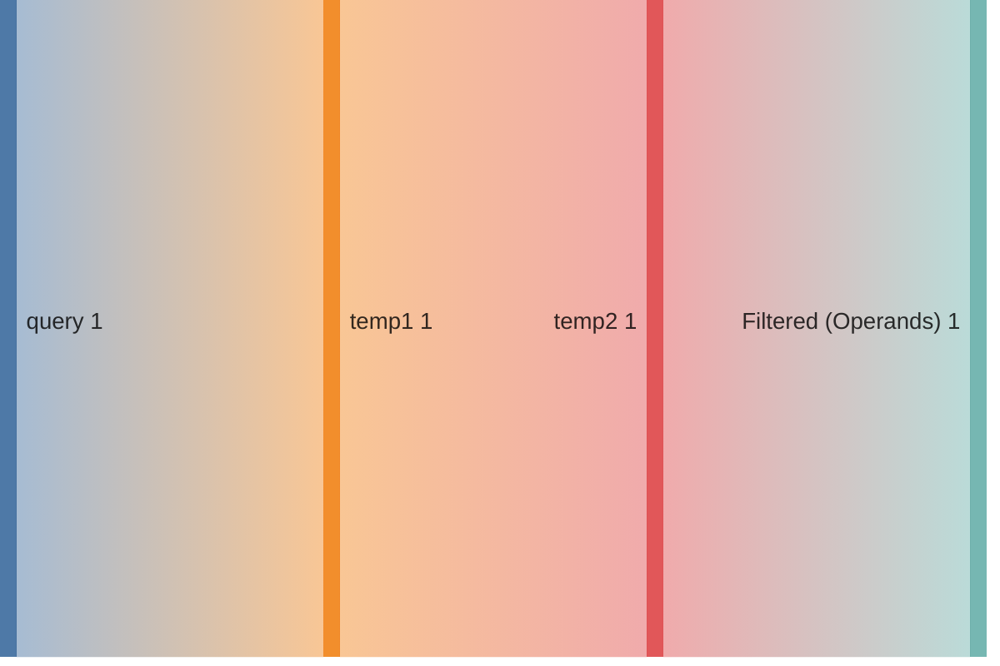
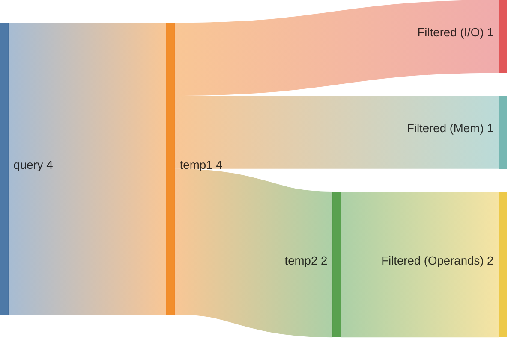

## Summary

Directory: `/var/tmp/ga87puy/isaac-demo/out/embench_iot/md5sum/20260520T152546`

### Experiment
```ini
[isaac-demo-embench_iot/md5sum-20260520T152546]
benchmark=embench_iot/md5sum
datetime=20260520T152546
directory=/var/tmp/ga87puy/isaac-demo/out/embench_iot/md5sum/20260520T152546
comment=""
```

### Environment/Config
<details>
<summary>Vars</summary>

```sh
ARCH=rv32im_zicsr_zifencei
ABI=ilp32
GLOBAL_ISEL=0
UNROLL=0
OPTIMIZE=3
TARGET=
CCACHE=1
LLVM_BUILD_TYPE=Release
LLVM_ENABLE_ASSERTIONS=ON
CDFG_STAGE=32
FORCE_PURGE_DB=1
ISAAC_LIMIT_RESULTS=
ISAAC_MIN_ISO_WEIGHT=0.05
ISAAC_SCALE_ISO_WEIGHT=auto
ISAAC_SORT_BY=IsoWeight
ISAAC_TOPK=
ISAAC_PARTITION_WITH_MAXMISO=auto
HLS_ENABLE=1
HLS_SKIP_BASELINE=0
HLS_SKIP_DEFAULT=0
HLS_SKIP_SHARED=0
HLS_NAILGUN_LIBRARY=
HLS_NAILGUN_RESOURCE_MODEL=ol_sky130
HLS_NAILGUN_CLOCK_NS=100
HLS_NAILGUN_SCHEDULE_TIMEOUT=60
HLS_NAILGUN_REFINE_TIMEOUT=60
HLS_NAILGUN_CORE_NAME=CV32E40P
HLS_NAILGUN_ILP_SOLVER=GUROBI
HLS_NAILGUN_SCHED_ALGO_MS=y
HLS_NAILGUN_SCHED_ALGO_PA=y
HLS_NAILGUN_SCHED_ALGO_RA=y
HLS_NAILGUN_SCHED_ALGO_MI=y
HLS_NAILGUN_OL2_ENABLE=y
HLS_NAILGUN_OL2_CONFIG_TEMPLATE=/var/tmp/ga87puy/isaac-demo/cfg/openlane/minimal_config_fast.json
HLS_NAILGUN_OL2_UNTIL_STEP=OpenROAD.Floorplan
HLS_NAILGUN_OL2_TARGET_FREQ=20
HLS_NAILGUN_OL2_TARGET_UTIL=20
HLS_NAILGUN_SHARE_RESOURCES=0
ASIP_SYN_ENABLE=1
ASIP_SYN_SKIP_BASELINE=0
ASIP_SYN_SKIP_DEFAULT=0
ASIP_SYN_SKIP_SHARED=0
ASIP_SYN_TOOL=synopsys
ASIP_SYN_SYNOPSYS_PDK=nangate45
ASIP_SYN_SYNOPSYS_CLOCK_NS=10
ASIP_SYN_SYNOPSYS_CORE_NAME=CV32E40P
FPGA_SYN_ENABLE=0
FPGA_SYN_SKIP_BASELINE=0
FPGA_SYN_SKIP_DEFAULT=0
FPGA_SYN_SKIP_SHARED=0
FPGA_SYN_TOOL=vivado
FPGA_SYN_VIVADO_PART=xc7a200tffv1156-1
FPGA_SYN_VIVADO_CLOCK_NS=50
FPGA_SYN_VIVADO_CORE_NAME=CV32E40P
ISAAC_QUERY_CONFIG_YAML=cfg/isaac/query/paper/cv32e40p.yml
```

</details>

### Times
<details>
<summary>Stages</summary>

| Stage                               |   Diff [s] |
|:------------------------------------|-----------:|
| bench_0                             |      3.947 |
| trace_0                             |      7.729 |
| isaac_0_load                        |      7.008 |
| isaac_0_analyze                     |      4.701 |
| isaac_0_visualize                   |      3.527 |
| isaac_0_pick                        |      3.017 |
| isaac_0_cdfg                        |     11.284 |
| isaac_0_query                       |     18.472 |
| isaac_0_generate                    |      5.157 |
| assign_0_enc                        |      0.738 |
| isaac_0_etiss                       |      1.698 |
| seal5_0_splitted                    |    313.157 |
| assign_0_seal5                      |      0.718 |
| etiss_0                             |    868.107 |
| compare_0                           |     10.362 |
| compare_0_per_instr                 |     10.768 |
| assign_0_compare_per_instr          |      0.68  |
| filter_0                            |      0.776 |
| spec_0_filtered                     |      0.413 |
| isaac_0_generate_filtered           |      5.151 |
| isaac_0_etiss_filtered              |      1.664 |
| fake_hls_0_filtered                 |      0.827 |
| assign_0_fake_hls_filtered          |      1.072 |
| select_0_filtered                   |     12.283 |
| isaac_0_etiss_filtered_selected     |      1.653 |
| fake_hls_0_filtered_selected        |      0.849 |
| assign_0_fake_hls_filtered_selected |      1.101 |
| compare_0_filtered_selected         |     10.349 |
| assign_0_compare_filtered_selected  |      0.026 |
| retrace_0_filtered_selected         |      7.228 |
| reanalyze_0_filtered_selected       |     49.709 |
| assign_0_util_filtered_selected     |      0.585 |
| etiss_perf_0_filtered_selected      |    382.132 |
| compare_perf_0_filtered_selected    |     16.245 |
| retrace_perf_0_filtered_selected    |      6.334 |

</details>

### ISE Potential
|   supported_rel_count |   unsupported_rel_count | has_potential   |
|----------------------:|------------------------:|:----------------|
|              0.742536 |                0.257464 | True            |

### Choices
<details>
<summary>Summary</summary>

<h2>Choice 0</h2>
<table>
<tr><th>func_name</th><th>bb_name</th><th>rel_weight</th><th>num_instrs</th><th>freq</th><th>start</th><th>end</th></tr>
<tr><td>md5</td><td>%bb.10</td><td>0.569162</td><td>22</td><td>52224.0</td><td>0x10004b0</td><td>0x1000508</td></tr>
</table>
<pre><code class='asm'>
 10004b0: 00092d83     	lw	s11, 0x0(s2)
 10004b4: 002d1d13     	slli	s10, s10, 0x2
 10004b8: 01af8d33     	add	s10, t6, s10
 10004bc: 000d2d03     	lw	s10, 0x0(s10)
 10004c0: 000a2083     	lw	ra, 0x0(s4)
 10004c4: 018c8c33     	add	s8, s9, s8
 10004c8: 01bc0c33     	add	s8, s8, s11
 10004cc: 01ac0c33     	add	s8, s8, s10
 10004d0: 001c1cb3     	sll	s9, s8, ra
 10004d4: 40100d33     	neg	s10, ra
 10004d8: 01ac5c33     	srl	s8, s8, s10
 10004dc: 019c6cb3     	or	s9, s8, s9
 10004e0: 016c8cb3     	add	s9, s9, s6
 10004e4: 001f0f13     	addi	t5, t5, 0x1
 10004e8: 00340413     	addi	s0, s0, 0x3
 10004ec: 004a0a13     	addi	s4, s4, 0x4
 10004f0: 00490913     	addi	s2, s2, 0x4
 10004f4: 00548493     	addi	s1, s1, 0x5
 10004f8: 007e8e93     	addi	t4, t4, 0x7
 10004fc: 000a8d13     	mv	s10, s5
 1000500: 000b0d93     	mv	s11, s6
 1000504: f46408e3     	beq	s0, t1, 0x1000454 <md5+0x118>
</code></pre>
<h2>Choice 1</h2>
<table>
<tr><th>func_name</th><th>bb_name</th><th>rel_weight</th><th>num_instrs</th><th>freq</th><th>start</th><th>end</th></tr>
<tr><td>md5</td><td>%bb.3</td><td>0.129355</td><td>5</td><td>52224.0</td><td>0x1000508</td><td>0x100051c</td></tr>
</table>
<pre><code class='asm'>
 1000508: 000b8c13     	mv	s8, s7
 100050c: 000c8b13     	mv	s6, s9
 1000510: 000d8a93     	mv	s5, s11
 1000514: 000d0b93     	mv	s7, s10
 1000518: f9e2f2e3     	bgeu	t0, t5, 0x100049c <md5+0x160>
</code></pre>
<h2>Choice 2</h2>
<table>
<tr><th>func_name</th><th>bb_name</th><th>rel_weight</th><th>num_instrs</th><th>freq</th><th>start</th><th>end</th></tr>
<tr><td>benchmark_body</td><td>%bb.3</td><td>0.101059</td><td>4</td><td>51000.0</td><td>0x1000620</td><td>0x1000630</td></tr>
</table>
<pre><code class='asm'>
 1000620: 00b98633     	add	a2, s3, a1
 1000624: 00b60023     	sb	a1, 0x0(a2)
 1000628: 00158593     	addi	a1, a1, 0x1
 100062c: ff559ae3     	bne	a1, s5, 0x1000620 <benchmark_body+0x5c>
</code></pre>

</details>

### Queries
<details>
<summary>Metrics</summary>

|   num_rows |   num_nodes |   num_edges | func           | basic_block   |
|-----------:|------------:|------------:|:---------------|:--------------|
|     140185 |        8464 |        8464 | md5            | %bb.10        |
|          1 |           2 |           1 | md5            | %bb.3         |
|         10 |          20 |          12 | benchmark_body | %bb.3         |

</details>

### Sankeys
<details>
<summary>Merge Query Results</summary>





</details>

<details>
<summary>Filtered Candidates</summary>





</details>

<details>
<summary>md5_%bb.10_0</summary>



</details>

<details>
<summary>md5_%bb.3_0</summary>



</details>

<details>
<summary>benchmark_body_%bb.3_0</summary>



</details>

### Compare DF
| Model   | Arch                         |   Run Instructions |   Run Instructions (rel.) |   Total ROM |   Total RAM |   ROM code |   ROM code (rel.) |
|:--------|:-----------------------------|-------------------:|--------------------------:|------------:|------------:|-----------:|------------------:|
| md5sum  | rv32im_zicsr_zifencei        |            2018668 |                  1        |        4864 |        4328 |       4276 |          1        |
| md5sum  | rv32im_zicsr_zifencei_xisaac |            1966443 |                  0.974129 |        4844 |        4328 |       4256 |          0.995323 |

### CoreDSL
<details>
<summary>gen/XIsaac.core_desc</summary>

```c
import "/var/tmp/ga87puy/isaac-demo/etiss_arch_riscv/rv_base/RVI.core_desc"

InstructionSet XIsaac extends RV32I {
    instructions {
        CUSTOM0 {
            encoding: 7'b0000000 :: rs2[4:0] :: rs1[4:0] :: 3'b000 :: rd[4:0] :: 7'b1111011;
            assembly: {"custom0", "{name(rd)}, {name(rs1)}, {name(rs2)}"};
            behavior: {
                unsigned<32> rs1_val = X[rs1];
                unsigned<32> rs2_val = X[rs2];
                unsigned<32> outp0 = (unsigned<32>)((((signed<32>)(rs2_val) + (signed<32>)((unsigned<32>)((((unsigned<32>)(rs1_val) << (unsigned<32>)((2)))))))));
                X[rd] = outp0;
            }
        }
        CUSTOM1 {
            encoding: 2'b00 :: uimm2[4:0] :: rs2[4:0] :: rs1[4:0] :: 3'b001 :: rd[4:0] :: 7'b1111011;
            assembly: {"custom1", "{name(rd)}, {name(rs1)}, {name(rs2)}, {uimm2}"};
            behavior: {
                unsigned<32> rs1_val = X[rs1];
                unsigned<32> rs2_val = X[rs2];
                unsigned<32> outp0 = (unsigned<32>)((((signed<32>)(rs2_val) + (signed<32>)((unsigned<32>)((((unsigned<32>)(rs1_val) << (unsigned<32>)((unsigned<2>)((uimm2))))))))));
                X[rd] = outp0;
            }
        }
        CUSTOM2 {
            encoding: 2'b01 :: uimm5[4:0] :: rs2[4:0] :: rs1[4:0] :: 3'b001 :: rd[4:0] :: 7'b1111011;
            assembly: {"custom2", "{name(rd)}, {name(rs1)}, {name(rs2)}, {uimm5}"};
            behavior: {
                unsigned<32> rs1_val = X[rs1];
                unsigned<32> rs2_val = X[rs2];
                unsigned<32> outp0 = (unsigned<32>)((((signed<32>)(rs2_val) + (signed<32>)((unsigned<32>)((((unsigned<32>)(rs1_val) << (unsigned<32>)((unsigned<5>)((uimm5))))))))));
                X[rd] = outp0;
            }
        }
    }
}


```

</details>

<details>
<summary>gen_filtered/XIsaac.core_desc</summary>

```c
import "/var/tmp/ga87puy/isaac-demo/etiss_arch_riscv/rv_base/RVI.core_desc"

InstructionSet XIsaac extends RV32I {
    instructions {
        CUSTOM0 {
            encoding: 7'b0000000 :: rs2[4:0] :: rs1[4:0] :: 3'b000 :: rd[4:0] :: 7'b1111011;
            assembly: {"custom0", "{name(rd)}, {name(rs1)}, {name(rs2)}"};
            behavior: {
                unsigned<32> rs1_val = X[rs1];
                unsigned<32> rs2_val = X[rs2];
                unsigned<32> outp0 = (unsigned<32>)(((((signed<32>)((rs2_val)) + (signed<32>)(((unsigned<32>)(((((unsigned<32>)((rs1_val)) << (unsigned<32>)(((2)))))))))))));
                X[rd] = outp0;
            }
        }
        CUSTOM2 {
            encoding: 2'b01 :: uimm5[4:0] :: rs2[4:0] :: rs1[4:0] :: 3'b001 :: rd[4:0] :: 7'b1111011;
            assembly: {"custom2", "{name(rd)}, {name(rs1)}, {name(rs2)}, {uimm5}"};
            behavior: {
                unsigned<32> rs1_val = X[rs1];
                unsigned<32> rs2_val = X[rs2];
                unsigned<32> outp0 = (unsigned<32>)(((((signed<32>)((rs2_val)) + (signed<32>)(((unsigned<32>)(((((unsigned<32>)((rs1_val)) << (unsigned<32>)(((unsigned<5>)(((uimm5)))))))))))))));
                X[rd] = outp0;
            }
        }
    }
}


```

</details>


