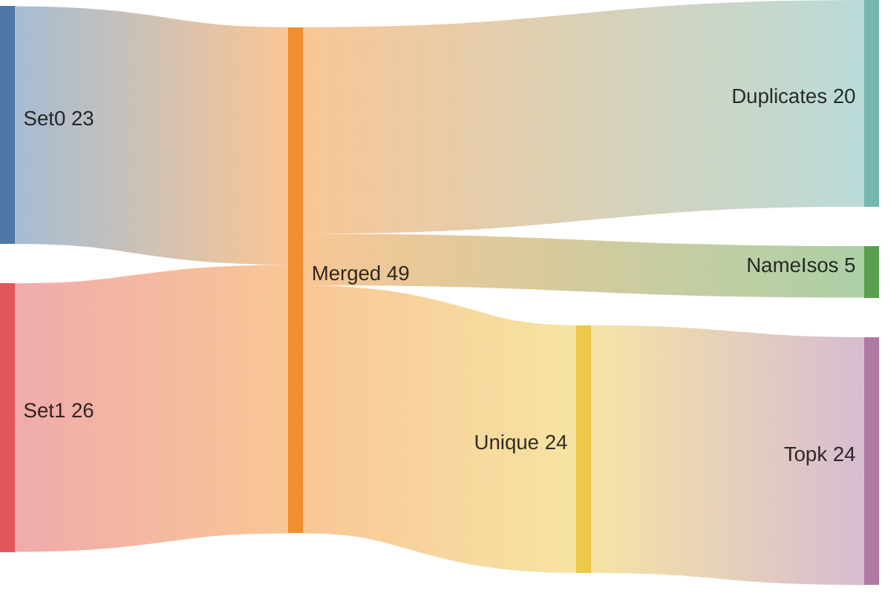

```mermaid
---
config:
  sankey:
    showValues: true
---
sankey-beta

%% source,target,value
Set0,Merged,23
Set1,Merged,26
Merged,Duplicates,20
Merged,NameIsos,5
Merged,Unique,24
Unique,Topk,24

```
