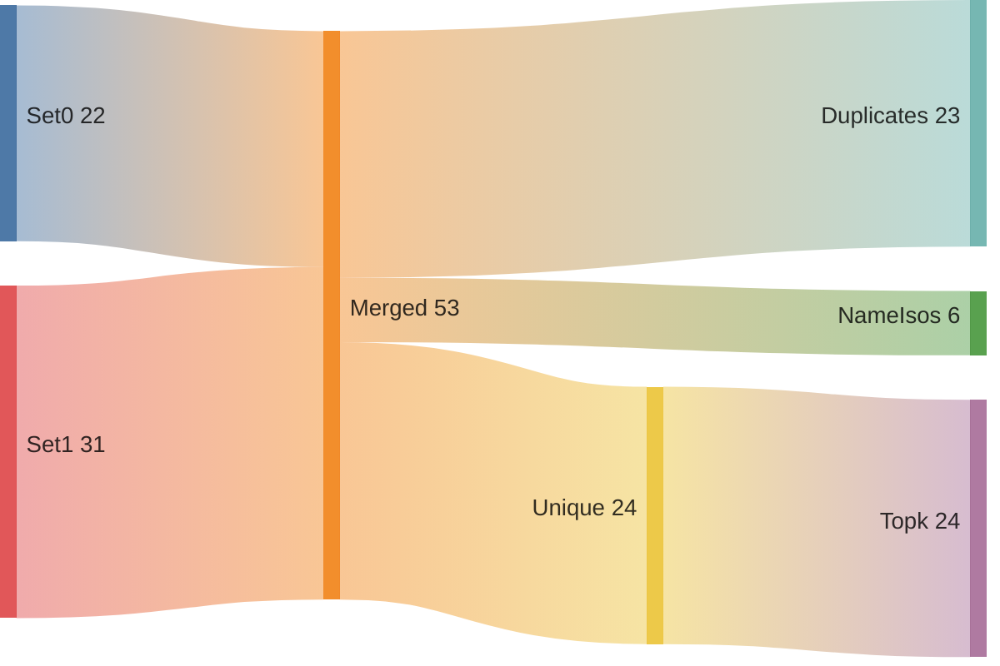
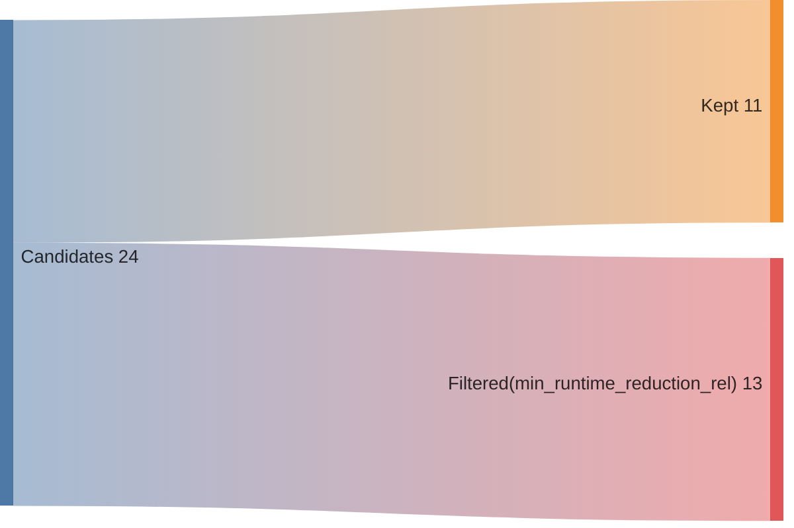
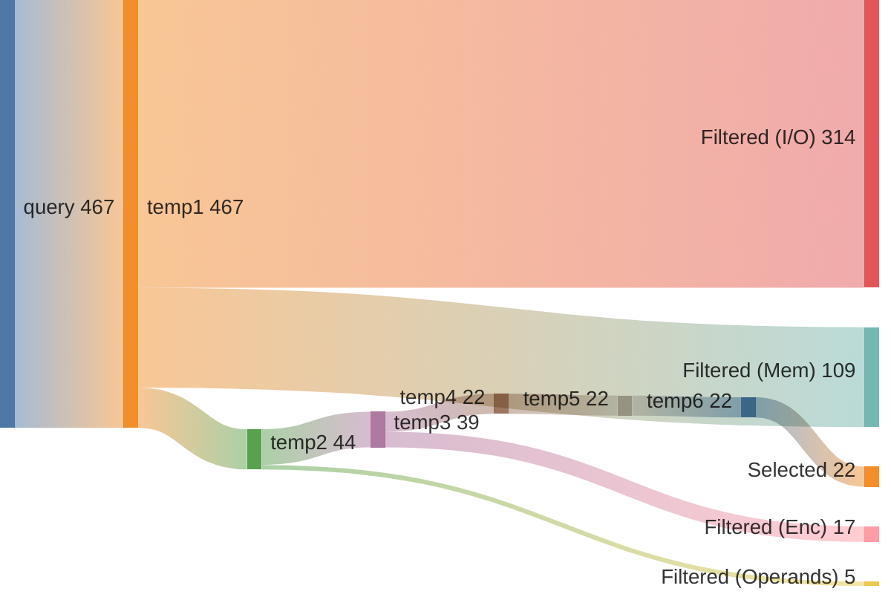
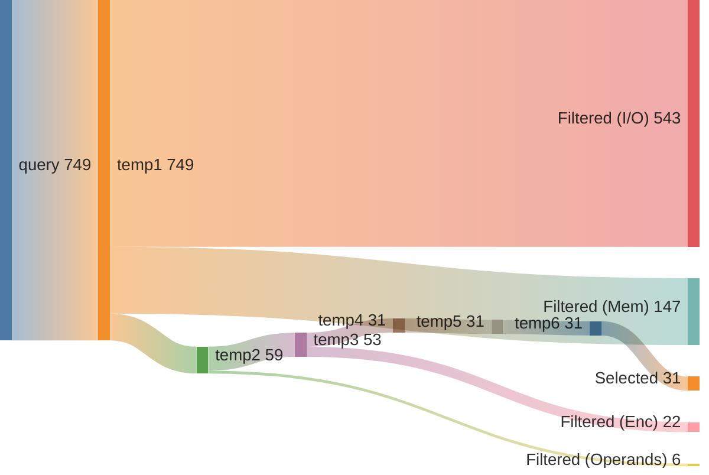

## Summary

Directory: `/var/tmp/ga87puy/isaac-demo/out/embench_iot/nettle-aes/20260527T121142`

### Experiment
```ini
[isaac-demo-embench_iot/nettle-aes-20260527T121142]
benchmark=embench_iot/nettle-aes
datetime=20260527T121142
directory=/var/tmp/ga87puy/isaac-demo/out/embench_iot/nettle-aes/20260527T121142
comment=""
```

### Environment/Config
<details>
<summary>Vars</summary>

```sh
ARCH=rv32im_zicsr_zifencei
ABI=ilp32
GLOBAL_ISEL=0
UNROLL=0
OPTIMIZE=3
TARGET=
CCACHE=1
LLVM_BUILD_TYPE=Release
LLVM_ENABLE_ASSERTIONS=ON
CDFG_STAGE=32
FORCE_PURGE_DB=1
ISAAC_LIMIT_RESULTS=
ISAAC_MIN_ISO_WEIGHT=0.05
ISAAC_SCALE_ISO_WEIGHT=auto
ISAAC_SORT_BY=IsoWeight
ISAAC_TOPK=
ISAAC_PARTITION_WITH_MAXMISO=auto
HLS_ENABLE=1
HLS_SKIP_BASELINE=0
HLS_SKIP_DEFAULT=0
HLS_SKIP_SHARED=0
HLS_NAILGUN_LIBRARY=
HLS_NAILGUN_RESOURCE_MODEL=ol_sky130
HLS_NAILGUN_CLOCK_NS=100
HLS_NAILGUN_SCHEDULE_TIMEOUT=60
HLS_NAILGUN_REFINE_TIMEOUT=60
HLS_NAILGUN_CORE_NAME=VEX_5S
HLS_NAILGUN_ILP_SOLVER=GUROBI
HLS_NAILGUN_SCHED_ALGO_MS=y
HLS_NAILGUN_SCHED_ALGO_PA=y
HLS_NAILGUN_SCHED_ALGO_RA=y
HLS_NAILGUN_SCHED_ALGO_MI=y
HLS_NAILGUN_OL2_ENABLE=n
HLS_NAILGUN_OL2_CONFIG_TEMPLATE=/var/tmp/ga87puy/isaac-demo/cfg/openlane/minimal_config_fast.json
HLS_NAILGUN_OL2_UNTIL_STEP=OpenROAD.Floorplan
HLS_NAILGUN_OL2_TARGET_FREQ=20
HLS_NAILGUN_OL2_TARGET_UTIL=20
HLS_NAILGUN_SHARE_RESOURCES=0
ASIP_SYN_ENABLE=1
ASIP_SYN_SKIP_BASELINE=0
ASIP_SYN_SKIP_DEFAULT=0
ASIP_SYN_SKIP_SHARED=0
ASIP_SYN_TOOL=synopsys
ASIP_SYN_SYNOPSYS_PDK=nangate45
ASIP_SYN_SYNOPSYS_CLOCK_NS=10
ASIP_SYN_SYNOPSYS_CORE_NAME=VEX_5S
FPGA_SYN_ENABLE=0
FPGA_SYN_SKIP_BASELINE=0
FPGA_SYN_SKIP_DEFAULT=0
FPGA_SYN_SKIP_SHARED=0
FPGA_SYN_TOOL=vivado
FPGA_SYN_VIVADO_PART=xc7a200tffv1156-1
FPGA_SYN_VIVADO_CLOCK_NS=50
FPGA_SYN_VIVADO_CORE_NAME=VEX_5S
ISAAC_QUERY_CONFIG_YAML=cfg/isaac/query/paper/vex.yml
```

</details>

### Times
<details>
<summary>Stages</summary>

| Stage                              |   Diff [s] |
|:-----------------------------------|-----------:|
| bench_0                            |      8.169 |
| trace_0                            |     19.453 |
| isaac_0_load                       |     27.057 |
| isaac_0_analyze                    |     20.876 |
| isaac_0_visualize                  |      7.727 |
| isaac_0_pick                       |      6.834 |
| isaac_0_cdfg                       |     60.724 |
| isaac_0_query                      |    116.843 |
| isaac_0_generate                   |     12.839 |
| assign_0_enc                       |      1.456 |
| isaac_0_etiss                      |      4.874 |
| seal5_0_splitted                   |    707.126 |
| assign_0_seal5                     |      2.06  |
| etiss_0                            |     39.53  |
| compare_0                          |     22.389 |
| compare_0_per_instr                |     37.974 |
| assign_0_compare_per_instr         |      2.07  |
| filter_0                           |      2.333 |
| spec_0_filtered                    |      1.234 |
| isaac_0_generate_filtered          |     12.89  |
| isaac_0_etiss_filtered             |      3.932 |
| hls_0_filtered                     |    917.393 |
| assign_0_hls_filtered              |      2.712 |
| select_0_filtered                  |    114.972 |
| isaac_0_etiss_filtered_selected    |      3.51  |
| hls_0_filtered_selected            |    677.181 |
| assign_0_hls_filtered_selected     |      2.445 |
| compare_0_filtered_selected        |     21.787 |
| assign_0_compare_filtered_selected |      0.026 |
| retrace_0_filtered_selected        |     16.371 |
| reanalyze_0_filtered_selected      |    146.741 |
| assign_0_util_filtered_selected    |      1.508 |
| etiss_perf_0_filtered_selected     |    256.266 |
| compare_perf_0_filtered_selected   |     28.057 |
| retrace_perf_0_filtered_selected   |     11.677 |

</details>

### ISE Potential
|   supported_rel_count |   unsupported_rel_count | has_potential   |
|----------------------:|------------------------:|:----------------|
|              0.737249 |                0.262751 | True            |

### Choices
<details>
<summary>Summary</summary>

<h2>Choice 0</h2>
<table>
<tr><th>func_name</th><th>bb_name</th><th>rel_weight</th><th>num_instrs</th><th>freq</th><th>start</th><th>end</th></tr>
<tr><td>_nettle_aes_decrypt</td><td>%bb.6</td><td>0.394009</td><td>87</td><td>16224.0</td><td>0x1000d2c</td><td>0x1000e88</td></tr>
</table>
<pre><code class='asm'>
 1000d2c: 0ffef993     	andi	s3, t4, 0xff
 1000d30: 00299993     	slli	s3, s3, 0x2
 1000d34: 013809b3     	add	s3, a6, s3
 1000d38: 0009a983     	lw	s3, 0x0(s3)
 1000d3c: 006f5a13     	srli	s4, t5, 0x6
 1000d40: 3fca7a13     	andi	s4, s4, 0x3fc
 1000d44: 01488a33     	add	s4, a7, s4
 1000d48: 000a2a03     	lw	s4, 0x0(s4)
 1000d4c: 00e45a93     	srli	s5, s0, 0xe
 1000d50: 3fcafa93     	andi	s5, s5, 0x3fc
 1000d54: 01528ab3     	add	s5, t0, s5
 1000d58: 000aaa83     	lw	s5, 0x0(s5)
 1000d5c: 018fdb13     	srli	s6, t6, 0x18
 1000d60: 002b1b13     	slli	s6, s6, 0x2
 1000d64: 01630b33     	add	s6, t1, s6
 1000d68: 000b2b03     	lw	s6, 0x0(s6)
 1000d6c: 013a49b3     	xor	s3, s4, s3
 1000d70: 016aca33     	xor	s4, s5, s6
 1000d74: 0149c9b3     	xor	s3, s3, s4
 1000d78: ff44aa03     	lw	s4, -0xc(s1)
 1000d7c: 0ffffa93     	andi	s5, t6, 0xff
 1000d80: 002a9a93     	slli	s5, s5, 0x2
 1000d84: 01580ab3     	add	s5, a6, s5
 1000d88: 000aaa83     	lw	s5, 0x0(s5)
 1000d8c: 006edb13     	srli	s6, t4, 0x6
 1000d90: 3fcb7b13     	andi	s6, s6, 0x3fc
 1000d94: 01688b33     	add	s6, a7, s6
 1000d98: 000b2b03     	lw	s6, 0x0(s6)
 1000d9c: 00ef5b93     	srli	s7, t5, 0xe
 1000da0: 3fcbfb93     	andi	s7, s7, 0x3fc
 1000da4: 01728bb3     	add	s7, t0, s7
 1000da8: 000bab83     	lw	s7, 0x0(s7)
 1000dac: 01845c13     	srli	s8, s0, 0x18
 1000db0: 002c1c13     	slli	s8, s8, 0x2
 1000db4: 01830c33     	add	s8, t1, s8
 1000db8: 000c2c03     	lw	s8, 0x0(s8)
 1000dbc: 00eedc93     	srli	s9, t4, 0xe
 1000dc0: 018edd13     	srli	s10, t4, 0x18
 1000dc4: 0149ceb3     	xor	t4, s3, s4
 1000dc8: 015b49b3     	xor	s3, s6, s5
 1000dcc: 018bca33     	xor	s4, s7, s8
 1000dd0: 0149c9b3     	xor	s3, s3, s4
 1000dd4: ff84aa03     	lw	s4, -0x8(s1)
 1000dd8: 0ff47a93     	andi	s5, s0, 0xff
 1000ddc: 002a9a93     	slli	s5, s5, 0x2
 1000de0: 01580ab3     	add	s5, a6, s5
 1000de4: 000aaa83     	lw	s5, 0x0(s5)
 1000de8: 006fdb13     	srli	s6, t6, 0x6
 1000dec: 3fcb7b13     	andi	s6, s6, 0x3fc
 1000df0: 01688b33     	add	s6, a7, s6
 1000df4: 000b2b03     	lw	s6, 0x0(s6)
 1000df8: 3fccfb93     	andi	s7, s9, 0x3fc
 1000dfc: 01728bb3     	add	s7, t0, s7
 1000e00: 000bab83     	lw	s7, 0x0(s7)
 1000e04: 018f5c13     	srli	s8, t5, 0x18
 1000e08: 002c1c13     	slli	s8, s8, 0x2
 1000e0c: 01830c33     	add	s8, t1, s8
 1000e10: 000c2c03     	lw	s8, 0x0(s8)
 1000e14: 00efdc93     	srli	s9, t6, 0xe
 1000e18: 0149cfb3     	xor	t6, s3, s4
 1000e1c: 015b49b3     	xor	s3, s6, s5
 1000e20: 018bca33     	xor	s4, s7, s8
 1000e24: 0149c9b3     	xor	s3, s3, s4
 1000e28: ffc4aa03     	lw	s4, -0x4(s1)
 1000e2c: 0fff7f13     	andi	t5, t5, 0xff
 1000e30: 002f1f13     	slli	t5, t5, 0x2
 1000e34: 01e80f33     	add	t5, a6, t5
 1000e38: 000f2f03     	lw	t5, 0x0(t5)
 1000e3c: 00645413     	srli	s0, s0, 0x6
 1000e40: 3fc47413     	andi	s0, s0, 0x3fc
 1000e44: 00888433     	add	s0, a7, s0
 1000e48: 00042a83     	lw	s5, 0x0(s0)
 1000e4c: 3fccf413     	andi	s0, s9, 0x3fc
 1000e50: 00828433     	add	s0, t0, s0
 1000e54: 00042b03     	lw	s6, 0x0(s0)
 1000e58: 002d1d13     	slli	s10, s10, 0x2
 1000e5c: 01a30d33     	add	s10, t1, s10
 1000e60: 000d2b83     	lw	s7, 0x0(s10)
 1000e64: 0149c433     	xor	s0, s3, s4
 1000e68: 0004a983     	lw	s3, 0x0(s1)
 1000e6c: 01eacf33     	xor	t5, s5, t5
 1000e70: 017b4a33     	xor	s4, s6, s7
 1000e74: 014f4f33     	xor	t5, t5, s4
 1000e78: 013f4f33     	xor	t5, t5, s3
 1000e7c: fff90913     	addi	s2, s2, -0x1
 1000e80: 01048493     	addi	s1, s1, 0x10
 1000e84: ea0914e3     	bnez	s2, 0x1000d2c <_nettle_aes_decrypt+0x318>
</code></pre>
<h2>Choice 1</h2>
<table>
<tr><th>func_name</th><th>bb_name</th><th>rel_weight</th><th>num_instrs</th><th>freq</th><th>start</th><th>end</th></tr>
<tr><td>_nettle_aes_encrypt</td><td>%bb.6</td><td>0.394009</td><td>87</td><td>16224.0</td><td>0x1000870</td><td>0x10009cc</td></tr>
</table>
<pre><code class='asm'>
 1000870: 0fff7993     	andi	s3, t5, 0xff
 1000874: 00299993     	slli	s3, s3, 0x2
 1000878: 013809b3     	add	s3, a6, s3
 100087c: 0009a983     	lw	s3, 0x0(s3)
 1000880: 006fda13     	srli	s4, t6, 0x6
 1000884: 3fca7a13     	andi	s4, s4, 0x3fc
 1000888: 01488a33     	add	s4, a7, s4
 100088c: 000a2a03     	lw	s4, 0x0(s4)
 1000890: 00e45a93     	srli	s5, s0, 0xe
 1000894: 3fcafa93     	andi	s5, s5, 0x3fc
 1000898: 01528ab3     	add	s5, t0, s5
 100089c: 000aaa83     	lw	s5, 0x0(s5)
 10008a0: 018edb13     	srli	s6, t4, 0x18
 10008a4: 002b1b13     	slli	s6, s6, 0x2
 10008a8: 01630b33     	add	s6, t1, s6
 10008ac: 000b2b03     	lw	s6, 0x0(s6)
 10008b0: 013a49b3     	xor	s3, s4, s3
 10008b4: 016aca33     	xor	s4, s5, s6
 10008b8: 0149c9b3     	xor	s3, s3, s4
 10008bc: ff44aa03     	lw	s4, -0xc(s1)
 10008c0: 0ffffa93     	andi	s5, t6, 0xff
 10008c4: 002a9a93     	slli	s5, s5, 0x2
 10008c8: 01580ab3     	add	s5, a6, s5
 10008cc: 000aaa83     	lw	s5, 0x0(s5)
 10008d0: 00645b13     	srli	s6, s0, 0x6
 10008d4: 3fcb7b13     	andi	s6, s6, 0x3fc
 10008d8: 01688b33     	add	s6, a7, s6
 10008dc: 000b2b03     	lw	s6, 0x0(s6)
 10008e0: 00eedb93     	srli	s7, t4, 0xe
 10008e4: 3fcbfb93     	andi	s7, s7, 0x3fc
 10008e8: 01728bb3     	add	s7, t0, s7
 10008ec: 000bab83     	lw	s7, 0x0(s7)
 10008f0: 018f5c13     	srli	s8, t5, 0x18
 10008f4: 002c1c13     	slli	s8, s8, 0x2
 10008f8: 01830c33     	add	s8, t1, s8
 10008fc: 000c2c03     	lw	s8, 0x0(s8)
 1000900: 00ef5c93     	srli	s9, t5, 0xe
 1000904: 006f5d13     	srli	s10, t5, 0x6
 1000908: 0149cf33     	xor	t5, s3, s4
 100090c: 015b49b3     	xor	s3, s6, s5
 1000910: 018bca33     	xor	s4, s7, s8
 1000914: 0149c9b3     	xor	s3, s3, s4
 1000918: ff84aa03     	lw	s4, -0x8(s1)
 100091c: 0ff47a93     	andi	s5, s0, 0xff
 1000920: 002a9a93     	slli	s5, s5, 0x2
 1000924: 01580ab3     	add	s5, a6, s5
 1000928: 000aaa83     	lw	s5, 0x0(s5)
 100092c: 006edb13     	srli	s6, t4, 0x6
 1000930: 3fcb7b13     	andi	s6, s6, 0x3fc
 1000934: 01688b33     	add	s6, a7, s6
 1000938: 000b2b03     	lw	s6, 0x0(s6)
 100093c: 3fccfb93     	andi	s7, s9, 0x3fc
 1000940: 01728bb3     	add	s7, t0, s7
 1000944: 000bab83     	lw	s7, 0x0(s7)
 1000948: 018fdc13     	srli	s8, t6, 0x18
 100094c: 002c1c13     	slli	s8, s8, 0x2
 1000950: 01830c33     	add	s8, t1, s8
 1000954: 000c2c03     	lw	s8, 0x0(s8)
 1000958: 00efdc93     	srli	s9, t6, 0xe
 100095c: 0149cfb3     	xor	t6, s3, s4
 1000960: 015b49b3     	xor	s3, s6, s5
 1000964: 018bca33     	xor	s4, s7, s8
 1000968: 0149c9b3     	xor	s3, s3, s4
 100096c: ffc4aa03     	lw	s4, -0x4(s1)
 1000970: 0ffefe93     	andi	t4, t4, 0xff
 1000974: 002e9e93     	slli	t4, t4, 0x2
 1000978: 01d80eb3     	add	t4, a6, t4
 100097c: 000eae83     	lw	t4, 0x0(t4)
 1000980: 3fcd7a93     	andi	s5, s10, 0x3fc
 1000984: 01588ab3     	add	s5, a7, s5
 1000988: 000aaa83     	lw	s5, 0x0(s5)
 100098c: 3fccfb13     	andi	s6, s9, 0x3fc
 1000990: 01628b33     	add	s6, t0, s6
 1000994: 000b2b03     	lw	s6, 0x0(s6)
 1000998: 01845413     	srli	s0, s0, 0x18
 100099c: 00241413     	slli	s0, s0, 0x2
 10009a0: 00830433     	add	s0, t1, s0
 10009a4: 00042b83     	lw	s7, 0x0(s0)
 10009a8: 0149c433     	xor	s0, s3, s4
 10009ac: 0004a983     	lw	s3, 0x0(s1)
 10009b0: 01daceb3     	xor	t4, s5, t4
 10009b4: 017b4a33     	xor	s4, s6, s7
 10009b8: 014eceb3     	xor	t4, t4, s4
 10009bc: 013eceb3     	xor	t4, t4, s3
 10009c0: fff90913     	addi	s2, s2, -0x1
 10009c4: 01048493     	addi	s1, s1, 0x10
 10009c8: ea0914e3     	bnez	s2, 0x1000870 <_nettle_aes_encrypt+0x318>
</code></pre>

</details>

### Queries
<details>
<summary>Metrics</summary>

|   num_rows |   num_nodes |   num_edges | func                | basic_block   |
|-----------:|------------:|------------:|:--------------------|:--------------|
|    2405721 |      188598 |      177633 | _nettle_aes_decrypt | %bb.6         |
|    2405721 |      188598 |      177633 | _nettle_aes_encrypt | %bb.6         |

</details>

### Sankeys
<details>
<summary>Merge Query Results</summary>





</details>

<details>
<summary>Filtered Candidates</summary>





</details>

<details>
<summary>_nettle_aes_decrypt_%bb.6_0</summary>



</details>

<details>
<summary>_nettle_aes_encrypt_%bb.6_0</summary>



</details>

### Compare DF
| Model      | Arch                         |   Run Instructions |   Run Instructions (rel.) |   Total ROM |   Total RAM |   ROM code |   ROM code (rel.) |
|:-----------|:-----------------------------|-------------------:|--------------------------:|------------:|------------:|-----------:|------------------:|
| nettle-aes | rv32im_zicsr_zifencei        |            3582415 |                  1        |       16364 |        2760 |       6548 |          1        |
| nettle-aes | rv32im_zicsr_zifencei_xisaac |            2642670 |                  0.737678 |       16104 |        2760 |       6288 |          0.960293 |

### CoreDSL
<details>
<summary>gen/XIsaac.core_desc</summary>

```c
import "/var/tmp/ga87puy/isaac-demo/etiss_arch_riscv/rv_base/RVI.core_desc"

InstructionSet XIsaac extends RV32I {
    instructions {
        CUSTOM0 {
            encoding: 7'b0000000 :: rs2[4:0] :: rs1[4:0] :: 3'b000 :: rd[4:0] :: 7'b1111011;
            assembly: {"custom0", "{name(rd)}, {name(rs1)}, {name(rs2)}"};
            behavior: {
                unsigned<32> rs2_val = X[rs2];
                unsigned<32> rs1_val = X[rs1];
                unsigned<32> outp0 = (unsigned<32>)((((signed<32>)(rs2_val) + (signed<32>)((unsigned<32>)((((unsigned<32>)(rs1_val) << (unsigned<32>)((2)))))))));
                X[rd] = outp0;
            }
        }
        CUSTOM1 {
            encoding: 7'b0000001 :: rs2[4:0] :: rs1[4:0] :: 3'b000 :: rd[4:0] :: 7'b1111011;
            assembly: {"custom1", "{name(rd)}, {name(rs1)}, {name(rs2)}"};
            behavior: {
                unsigned<32> rs1_val = X[rs1];
                unsigned<32> rs2_val = X[rs2];
                unsigned<32> outp0 = (unsigned<32>)((((signed<32>)(rs2_val) + (signed<32>)((unsigned<32>)((((unsigned<32>)(rs1_val) & (unsigned<32>)((1020)))))))));
                X[rd] = outp0;
            }
        }
        CUSTOM2 {
            encoding: 2'b00 :: uimm2[4:0] :: rs2[4:0] :: rs1[4:0] :: 3'b001 :: rd[4:0] :: 7'b1111011;
            assembly: {"custom2", "{name(rd)}, {name(rs1)}, {name(rs2)}, {uimm2}"};
            behavior: {
                unsigned<32> rs2_val = X[rs2];
                unsigned<32> rs1_val = X[rs1];
                unsigned<32> outp0 = (unsigned<32>)((((signed<32>)(rs2_val) + (signed<32>)((unsigned<32>)((((unsigned<32>)(rs1_val) << (unsigned<32>)((unsigned<2>)((uimm2))))))))));
                X[rd] = outp0;
            }
        }
        CUSTOM3 {
            encoding: 2'b01 :: uimm5[4:0] :: rs2[4:0] :: rs1[4:0] :: 3'b001 :: rd[4:0] :: 7'b1111011;
            assembly: {"custom3", "{name(rd)}, {name(rs1)}, {name(rs2)}, {uimm5}"};
            behavior: {
                unsigned<32> rs2_val = X[rs2];
                unsigned<32> rs1_val = X[rs1];
                unsigned<32> outp0 = (unsigned<32>)((((signed<32>)(rs2_val) + (signed<32>)((unsigned<32>)((((unsigned<32>)(rs1_val) << (unsigned<32>)((unsigned<5>)((uimm5))))))))));
                X[rd] = outp0;
            }
        }
        CUSTOM4 {
            encoding: 7'b0000010 :: rs2[4:0] :: rs1[4:0] :: 3'b000 :: rd[4:0] :: 7'b1111011;
            assembly: {"custom4", "{name(rd)}, {name(rs1)}, {name(rs2)}"};
            behavior: {
                unsigned<32> rs1_val = X[rs1];
                unsigned<32> rs2_val = X[rs2];
                unsigned<32> outp0 = (unsigned<32>)((((signed<32>)(rs1_val) + (signed<32>)((unsigned<32>)((((unsigned<32>)((unsigned<32>)((((unsigned<32>)(rs2_val) >> (unsigned<32>)((14)))))) & (unsigned<32>)((1020)))))))));
                X[rd] = outp0;
            }
        }
        CUSTOM5 {
            encoding: 7'b0000011 :: rs2[4:0] :: rs1[4:0] :: 3'b000 :: rd[4:0] :: 7'b1111011;
            assembly: {"custom5", "{name(rd)}, {name(rs1)}, {name(rs2)}"};
            behavior: {
                unsigned<32> rs1_val = X[rs1];
                unsigned<32> rs2_val = X[rs2];
                unsigned<32> outp0 = (unsigned<32>)((((signed<32>)(rs1_val) + (signed<32>)((unsigned<32>)((((unsigned<32>)((unsigned<32>)((((unsigned<32>)(rs2_val) >> (unsigned<32>)((24)))))) << (unsigned<32>)((2)))))))));
                X[rd] = outp0;
            }
        }
        CUSTOM6 {
            encoding: 7'b0000100 :: rs2[4:0] :: rs1[4:0] :: 3'b000 :: rd[4:0] :: 7'b1111011;
            assembly: {"custom6", "{name(rd)}, {name(rs1)}, {name(rs2)}"};
            behavior: {
                unsigned<32> rs2_val = X[rs2];
                unsigned<32> rs1_val = X[rs1];
                unsigned<32> outp0 = (unsigned<32>)((((signed<32>)(rs1_val) + (signed<32>)((unsigned<32>)((((unsigned<32>)((unsigned<32>)((((unsigned<32>)(rs2_val) & (unsigned<32>)((255)))))) << (unsigned<32>)((2)))))))));
                X[rd] = outp0;
            }
        }
        CUSTOM7 {
            encoding: 7'b0000101 :: rs2[4:0] :: rs1[4:0] :: 3'b000 :: rd[4:0] :: 7'b1111011;
            assembly: {"custom7", "{name(rd)}, {name(rs1)}, {name(rs2)}"};
            behavior: {
                unsigned<32> rs2_val = X[rs2];
                unsigned<32> rs1_val = X[rs1];
                unsigned<32> outp0 = (unsigned<32>)((((signed<32>)(rs2_val) + (signed<32>)((unsigned<32>)((((unsigned<32>)((unsigned<32>)((((unsigned<32>)(rs1_val) >> (unsigned<32>)((6)))))) & (unsigned<32>)((1020)))))))));
                X[rd] = outp0;
            }
        }
        CUSTOM8 {
            encoding: 2'b10 :: uimm5[4:0] :: rs2[4:0] :: rs1[4:0] :: 3'b001 :: rd[4:0] :: 7'b1111011;
            assembly: {"custom8", "{name(rd)}, {name(rs1)}, {name(rs2)}, {uimm5}"};
            behavior: {
                unsigned<32> rs1_val = X[rs1];
                unsigned<32> rs2_val = X[rs2];
                unsigned<32> outp0 = (unsigned<32>)((((signed<32>)(rs1_val) + (signed<32>)((unsigned<32>)((((unsigned<32>)((unsigned<32>)((((unsigned<32>)(rs2_val) >> (unsigned<32>)((unsigned<5>)((uimm5))))))) & (unsigned<32>)((1020)))))))));
                X[rd] = outp0;
            }
        }
        CUSTOM9 {
            encoding: 2'b11 :: uimm4[4:0] :: rs2[4:0] :: rs1[4:0] :: 3'b001 :: rd[4:0] :: 7'b1111011;
            assembly: {"custom9", "{name(rd)}, {name(rs1)}, {name(rs2)}, {uimm4}"};
            behavior: {
                unsigned<32> rs2_val = X[rs2];
                unsigned<32> rs1_val = X[rs1];
                unsigned<32> outp0 = (unsigned<32>)((((signed<32>)(rs2_val) + (signed<32>)((unsigned<32>)((((unsigned<32>)((unsigned<32>)((((unsigned<32>)(rs1_val) >> (unsigned<32>)((unsigned<4>)((uimm4))))))) & (unsigned<32>)((1020)))))))));
                X[rd] = outp0;
            }
        }
        CUSTOM10 {
            encoding: 2'b00 :: uimm2[4:0] :: rs2[4:0] :: rs1[4:0] :: 3'b010 :: rd[4:0] :: 7'b1111011;
            assembly: {"custom10", "{name(rd)}, {name(rs1)}, {name(rs2)}, {uimm2}"};
            behavior: {
                unsigned<32> rs2_val = X[rs2];
                unsigned<32> rs1_val = X[rs1];
                unsigned<32> outp0 = (unsigned<32>)((((signed<32>)(rs1_val) + (signed<32>)((unsigned<32>)((((unsigned<32>)((unsigned<32>)((((unsigned<32>)(rs2_val) >> (unsigned<32>)((24)))))) << (unsigned<32>)((unsigned<2>)((uimm2))))))))));
                X[rd] = outp0;
            }
        }
        CUSTOM11 {
            encoding: 2'b01 :: uimm5[4:0] :: rs2[4:0] :: rs1[4:0] :: 3'b010 :: rd[4:0] :: 7'b1111011;
            assembly: {"custom11", "{name(rd)}, {name(rs1)}, {name(rs2)}, {uimm5}"};
            behavior: {
                unsigned<32> rs2_val = X[rs2];
                unsigned<32> rs1_val = X[rs1];
                unsigned<32> outp0 = (unsigned<32>)((((signed<32>)(rs1_val) + (signed<32>)((unsigned<32>)((((unsigned<32>)((unsigned<32>)((((unsigned<32>)(rs2_val) >> (unsigned<32>)((24)))))) << (unsigned<32>)((unsigned<5>)((uimm5))))))))));
                X[rd] = outp0;
            }
        }
        CUSTOM12 {
            encoding: 7'b0000110 :: 5'b00000 :: rs1[4:0] :: 3'b000 :: rd[4:0] :: 7'b1111011;
            assembly: {"custom12", "{name(rd)}, {name(rs1)}"};
            behavior: {
                unsigned<32> rs1_val = X[rs1];
                unsigned<32> outp0 = (unsigned<32>)((((unsigned<32>)((unsigned<32>)((((unsigned<32>)(rs1_val) & (unsigned<32>)((255)))))) << (unsigned<32>)((2)))));
                X[rd] = outp0;
            }
        }
        CUSTOM13 {
            encoding: 7'b0000111 :: 5'b00000 :: rs1[4:0] :: 3'b000 :: rd[4:0] :: 7'b1111011;
            assembly: {"custom13", "{name(rd)}, {name(rs1)}"};
            behavior: {
                unsigned<32> rs1_val = X[rs1];
                unsigned<32> outp0 = (unsigned<32>)((((unsigned<32>)((unsigned<32>)((((unsigned<32>)(rs1_val) >> (unsigned<32>)((14)))))) & (unsigned<32>)((1020)))));
                X[rd] = outp0;
            }
        }
        CUSTOM14 {
            encoding: 7'b0001000 :: 5'b00000 :: rs1[4:0] :: 3'b000 :: rd[4:0] :: 7'b1111011;
            assembly: {"custom14", "{name(rd)}, {name(rs1)}"};
            behavior: {
                unsigned<32> rs1_val = X[rs1];
                unsigned<32> outp0 = (unsigned<32>)((((unsigned<32>)((unsigned<32>)((((unsigned<32>)(rs1_val) >> (unsigned<32>)((6)))))) & (unsigned<32>)((1020)))));
                X[rd] = outp0;
            }
        }
        CUSTOM15 {
            encoding: 7'b0001001 :: 5'b00000 :: rs1[4:0] :: 3'b000 :: rd[4:0] :: 7'b1111011;
            assembly: {"custom15", "{name(rd)}, {name(rs1)}"};
            behavior: {
                unsigned<32> rs1_val = X[rs1];
                unsigned<32> outp0 = (unsigned<32>)((((unsigned<32>)((unsigned<32>)((((unsigned<32>)(rs1_val) >> (unsigned<32>)((24)))))) << (unsigned<32>)((2)))));
                X[rd] = outp0;
            }
        }
        CUSTOM16 {
            encoding: 7'b0001010 :: uimm2[4:0] :: rs1[4:0] :: 3'b000 :: rd[4:0] :: 7'b1111011;
            assembly: {"custom16", "{name(rd)}, {name(rs1)}, {uimm2}"};
            behavior: {
                unsigned<32> rs1_val = X[rs1];
                unsigned<32> outp0 = (unsigned<32>)((((unsigned<32>)((unsigned<32>)((((unsigned<32>)(rs1_val) & (unsigned<32>)((255)))))) << (unsigned<32>)((unsigned<2>)((uimm2))))));
                X[rd] = outp0;
            }
        }
        CUSTOM17 {
            encoding: 7'b0001011 :: uimm5[4:0] :: rs1[4:0] :: 3'b000 :: rd[4:0] :: 7'b1111011;
            assembly: {"custom17", "{name(rd)}, {name(rs1)}, {uimm5}"};
            behavior: {
                unsigned<32> rs1_val = X[rs1];
                unsigned<32> outp0 = (unsigned<32>)((((unsigned<32>)((unsigned<32>)((((unsigned<32>)(rs1_val) & (unsigned<32>)((255)))))) << (unsigned<32>)((unsigned<5>)((uimm5))))));
                X[rd] = outp0;
            }
        }
        CUSTOM18 {
            encoding: 7'b0001100 :: uimm5[4:0] :: rs1[4:0] :: 3'b000 :: rd[4:0] :: 7'b1111011;
            assembly: {"custom18", "{name(rd)}, {name(rs1)}, {uimm5}"};
            behavior: {
                unsigned<32> rs1_val = X[rs1];
                unsigned<32> outp0 = (unsigned<32>)((((unsigned<32>)((unsigned<32>)((((unsigned<32>)(rs1_val) >> (unsigned<32>)((unsigned<5>)((uimm5))))))) & (unsigned<32>)((1020)))));
                X[rd] = outp0;
            }
        }
        CUSTOM19 {
            encoding: 7'b0001101 :: uimm4[4:0] :: rs1[4:0] :: 3'b000 :: rd[4:0] :: 7'b1111011;
            assembly: {"custom19", "{name(rd)}, {name(rs1)}, {uimm4}"};
            behavior: {
                unsigned<32> rs1_val = X[rs1];
                unsigned<32> outp0 = (unsigned<32>)((((unsigned<32>)((unsigned<32>)((((unsigned<32>)(rs1_val) >> (unsigned<32>)((unsigned<4>)((uimm4))))))) & (unsigned<32>)((1020)))));
                X[rd] = outp0;
            }
        }
        CUSTOM20 {
            encoding: uimm6[11:0] :: rs1[4:0] :: 3'b011 :: rd[4:0] :: 7'b1111011;
            assembly: {"custom20", "{name(rd)}, {name(rs1)}, {uimm6}"};
            behavior: {
                unsigned<32> rs1_val = X[rs1];
                unsigned<32> outp0 = (unsigned<32>)((((unsigned<32>)((unsigned<32>)((((unsigned<32>)(rs1_val) >> (unsigned<32>)((unsigned<6>)((uimm6))))))) << (unsigned<32>)((2)))));
                X[rd] = outp0;
            }
        }
        CUSTOM21 {
            encoding: uimm7[11:0] :: rs1[4:0] :: 3'b100 :: rd[4:0] :: 7'b1111011;
            assembly: {"custom21", "{name(rd)}, {name(rs1)}, {uimm7}"};
            behavior: {
                unsigned<32> rs1_val = X[rs1];
                unsigned<32> outp0 = (unsigned<32>)((((unsigned<32>)((unsigned<32>)((((unsigned<32>)(rs1_val) >> (unsigned<32>)((unsigned<7>)((uimm7))))))) << (unsigned<32>)((2)))));
                X[rd] = outp0;
            }
        }
        CUSTOM22 {
            encoding: 7'b0001110 :: uimm2[4:0] :: rs1[4:0] :: 3'b000 :: rd[4:0] :: 7'b1111011;
            assembly: {"custom22", "{name(rd)}, {name(rs1)}, {uimm2}"};
            behavior: {
                unsigned<32> rs1_val = X[rs1];
                unsigned<32> outp0 = (unsigned<32>)((((unsigned<32>)((unsigned<32>)((((unsigned<32>)(rs1_val) >> (unsigned<32>)((24)))))) << (unsigned<32>)((unsigned<2>)((uimm2))))));
                X[rd] = outp0;
            }
        }
        CUSTOM23 {
            encoding: 7'b0001111 :: uimm5[4:0] :: rs1[4:0] :: 3'b000 :: rd[4:0] :: 7'b1111011;
            assembly: {"custom23", "{name(rd)}, {name(rs1)}, {uimm5}"};
            behavior: {
                unsigned<32> rs1_val = X[rs1];
                unsigned<32> outp0 = (unsigned<32>)((((unsigned<32>)((unsigned<32>)((((unsigned<32>)(rs1_val) >> (unsigned<32>)((24)))))) << (unsigned<32>)((unsigned<5>)((uimm5))))));
                X[rd] = outp0;
            }
        }
    }
}


```

</details>

<details>
<summary>gen_filtered/XIsaac.core_desc</summary>

```c
import "/var/tmp/ga87puy/isaac-demo/etiss_arch_riscv/rv_base/RVI.core_desc"

InstructionSet XIsaac extends RV32I {
    instructions {
        CUSTOM0 {
            encoding: 7'b0000000 :: rs2[4:0] :: rs1[4:0] :: 3'b000 :: rd[4:0] :: 7'b1111011;
            assembly: {"custom0", "{name(rd)}, {name(rs1)}, {name(rs2)}"};
            behavior: {
                unsigned<32> rs2_val = X[rs2];
                unsigned<32> rs1_val = X[rs1];
                unsigned<32> outp0 = (unsigned<32>)(((((signed<32>)((rs2_val)) + (signed<32>)(((unsigned<32>)(((((unsigned<32>)((rs1_val)) << (unsigned<32>)(((2)))))))))))));
                X[rd] = outp0;
            }
        }
        CUSTOM1 {
            encoding: 7'b0000001 :: rs2[4:0] :: rs1[4:0] :: 3'b000 :: rd[4:0] :: 7'b1111011;
            assembly: {"custom1", "{name(rd)}, {name(rs1)}, {name(rs2)}"};
            behavior: {
                unsigned<32> rs1_val = X[rs1];
                unsigned<32> rs2_val = X[rs2];
                unsigned<32> outp0 = (unsigned<32>)(((((signed<32>)((rs2_val)) + (signed<32>)(((unsigned<32>)(((((unsigned<32>)((rs1_val)) & (unsigned<32>)(((1020)))))))))))));
                X[rd] = outp0;
            }
        }
        CUSTOM3 {
            encoding: 2'b01 :: uimm5[4:0] :: rs2[4:0] :: rs1[4:0] :: 3'b001 :: rd[4:0] :: 7'b1111011;
            assembly: {"custom3", "{name(rd)}, {name(rs1)}, {name(rs2)}, {uimm5}"};
            behavior: {
                unsigned<32> rs2_val = X[rs2];
                unsigned<32> rs1_val = X[rs1];
                unsigned<32> outp0 = (unsigned<32>)(((((signed<32>)((rs2_val)) + (signed<32>)(((unsigned<32>)(((((unsigned<32>)((rs1_val)) << (unsigned<32>)(((unsigned<5>)(((uimm5)))))))))))))));
                X[rd] = outp0;
            }
        }
        CUSTOM4 {
            encoding: 7'b0000010 :: rs2[4:0] :: rs1[4:0] :: 3'b000 :: rd[4:0] :: 7'b1111011;
            assembly: {"custom4", "{name(rd)}, {name(rs1)}, {name(rs2)}"};
            behavior: {
                unsigned<32> rs1_val = X[rs1];
                unsigned<32> rs2_val = X[rs2];
                unsigned<32> outp0 = (unsigned<32>)(((((signed<32>)((rs1_val)) + (signed<32>)(((unsigned<32>)(((((unsigned<32>)(((unsigned<32>)(((((unsigned<32>)((rs2_val)) >> (unsigned<32>)(((14))))))))) & (unsigned<32>)(((1020)))))))))))));
                X[rd] = outp0;
            }
        }
        CUSTOM5 {
            encoding: 7'b0000011 :: rs2[4:0] :: rs1[4:0] :: 3'b000 :: rd[4:0] :: 7'b1111011;
            assembly: {"custom5", "{name(rd)}, {name(rs1)}, {name(rs2)}"};
            behavior: {
                unsigned<32> rs1_val = X[rs1];
                unsigned<32> rs2_val = X[rs2];
                unsigned<32> outp0 = (unsigned<32>)(((((signed<32>)((rs1_val)) + (signed<32>)(((unsigned<32>)(((((unsigned<32>)(((unsigned<32>)(((((unsigned<32>)((rs2_val)) >> (unsigned<32>)(((24))))))))) << (unsigned<32>)(((2)))))))))))));
                X[rd] = outp0;
            }
        }
        CUSTOM7 {
            encoding: 7'b0000101 :: rs2[4:0] :: rs1[4:0] :: 3'b000 :: rd[4:0] :: 7'b1111011;
            assembly: {"custom7", "{name(rd)}, {name(rs1)}, {name(rs2)}"};
            behavior: {
                unsigned<32> rs2_val = X[rs2];
                unsigned<32> rs1_val = X[rs1];
                unsigned<32> outp0 = (unsigned<32>)(((((signed<32>)((rs2_val)) + (signed<32>)(((unsigned<32>)(((((unsigned<32>)(((unsigned<32>)(((((unsigned<32>)((rs1_val)) >> (unsigned<32>)(((6))))))))) & (unsigned<32>)(((1020)))))))))))));
                X[rd] = outp0;
            }
        }
        CUSTOM8 {
            encoding: 2'b10 :: uimm5[4:0] :: rs2[4:0] :: rs1[4:0] :: 3'b001 :: rd[4:0] :: 7'b1111011;
            assembly: {"custom8", "{name(rd)}, {name(rs1)}, {name(rs2)}, {uimm5}"};
            behavior: {
                unsigned<32> rs1_val = X[rs1];
                unsigned<32> rs2_val = X[rs2];
                unsigned<32> outp0 = (unsigned<32>)(((((signed<32>)((rs1_val)) + (signed<32>)(((unsigned<32>)(((((unsigned<32>)(((unsigned<32>)(((((unsigned<32>)((rs2_val)) >> (unsigned<32>)(((unsigned<5>)(((uimm5))))))))))) & (unsigned<32>)(((1020)))))))))))));
                X[rd] = outp0;
            }
        }
        CUSTOM13 {
            encoding: 7'b0000111 :: 5'b00000 :: rs1[4:0] :: 3'b000 :: rd[4:0] :: 7'b1111011;
            assembly: {"custom13", "{name(rd)}, {name(rs1)}"};
            behavior: {
                unsigned<32> rs1_val = X[rs1];
                unsigned<32> outp0 = (unsigned<32>)(((((unsigned<32>)(((unsigned<32>)(((((unsigned<32>)((rs1_val)) >> (unsigned<32>)(((14))))))))) & (unsigned<32>)(((1020)))))));
                X[rd] = outp0;
            }
        }
        CUSTOM14 {
            encoding: 7'b0001000 :: 5'b00000 :: rs1[4:0] :: 3'b000 :: rd[4:0] :: 7'b1111011;
            assembly: {"custom14", "{name(rd)}, {name(rs1)}"};
            behavior: {
                unsigned<32> rs1_val = X[rs1];
                unsigned<32> outp0 = (unsigned<32>)(((((unsigned<32>)(((unsigned<32>)(((((unsigned<32>)((rs1_val)) >> (unsigned<32>)(((6))))))))) & (unsigned<32>)(((1020)))))));
                X[rd] = outp0;
            }
        }
        CUSTOM17 {
            encoding: 7'b0001011 :: uimm5[4:0] :: rs1[4:0] :: 3'b000 :: rd[4:0] :: 7'b1111011;
            assembly: {"custom17", "{name(rd)}, {name(rs1)}, {uimm5}"};
            behavior: {
                unsigned<32> rs1_val = X[rs1];
                unsigned<32> outp0 = (unsigned<32>)(((((unsigned<32>)(((unsigned<32>)(((((unsigned<32>)((rs1_val)) & (unsigned<32>)(((255))))))))) << (unsigned<32>)(((unsigned<5>)(((uimm5)))))))));
                X[rd] = outp0;
            }
        }
        CUSTOM18 {
            encoding: 7'b0001100 :: uimm5[4:0] :: rs1[4:0] :: 3'b000 :: rd[4:0] :: 7'b1111011;
            assembly: {"custom18", "{name(rd)}, {name(rs1)}, {uimm5}"};
            behavior: {
                unsigned<32> rs1_val = X[rs1];
                unsigned<32> outp0 = (unsigned<32>)(((((unsigned<32>)(((unsigned<32>)(((((unsigned<32>)((rs1_val)) >> (unsigned<32>)(((unsigned<5>)(((uimm5))))))))))) & (unsigned<32>)(((1020)))))));
                X[rd] = outp0;
            }
        }
    }
}


```

</details>


