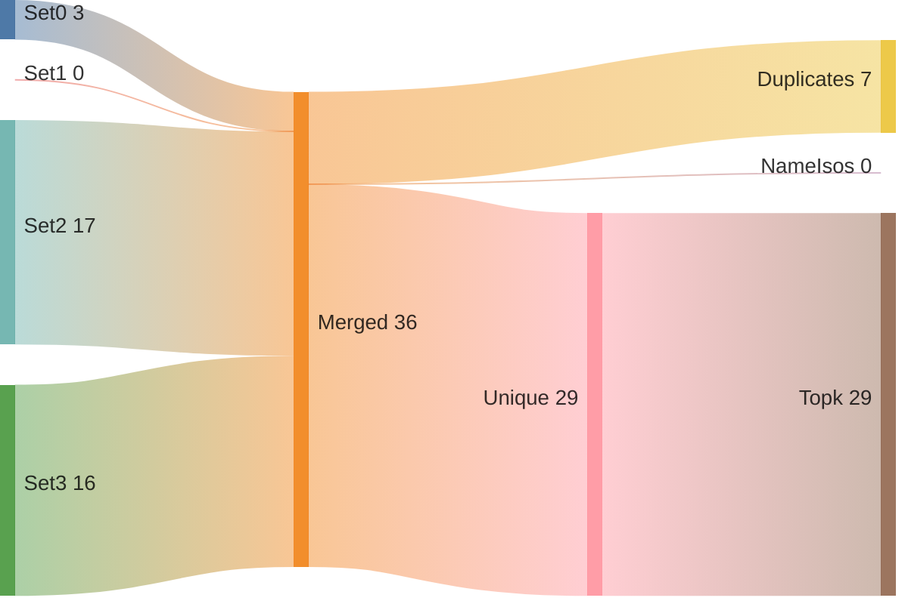

```mermaid
---
config:
  sankey:
    showValues: true
---
sankey-beta

%% source,target,value
Set0,Merged,3
Set1,Merged,0
Set2,Merged,17
Set3,Merged,16
Merged,Duplicates,7
Merged,NameIsos,0
Merged,Unique,29
Unique,Topk,29

```
