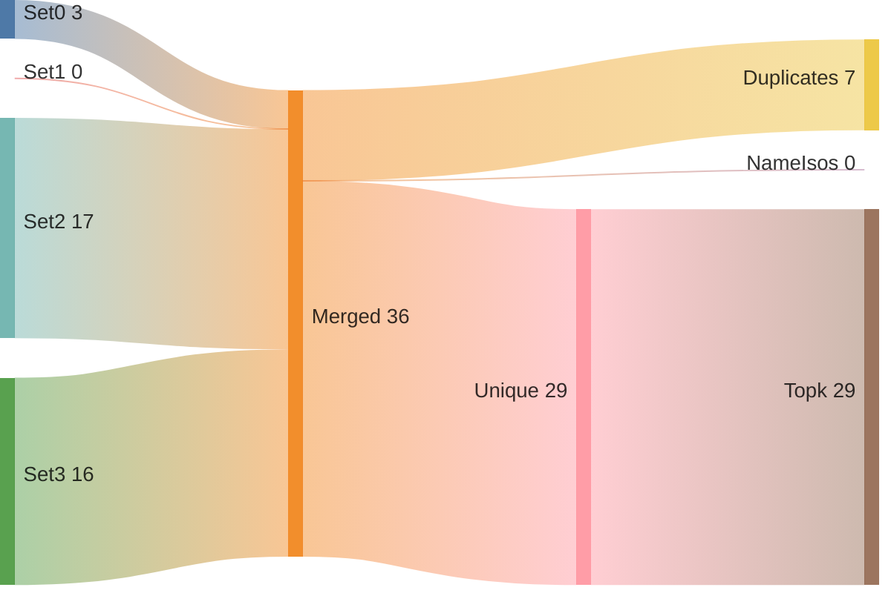
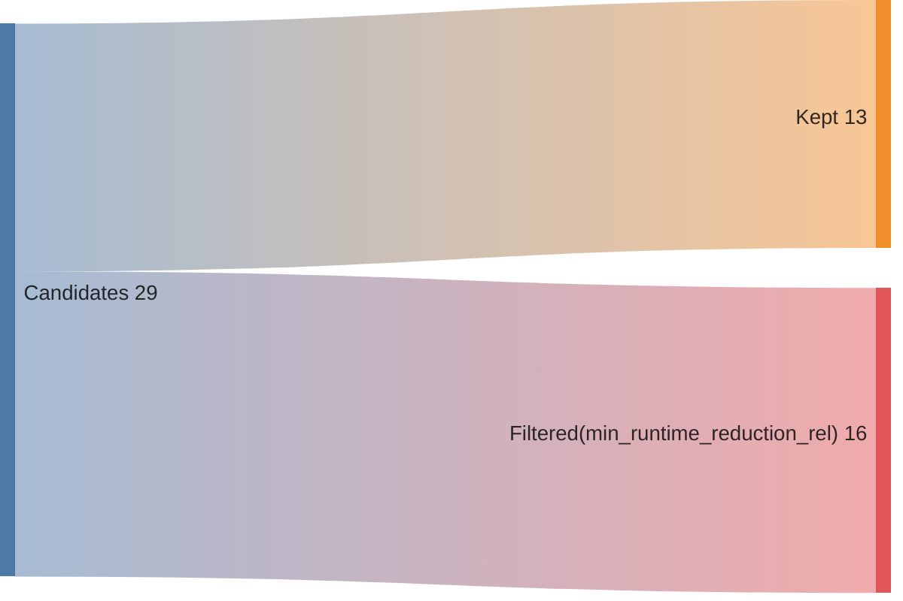
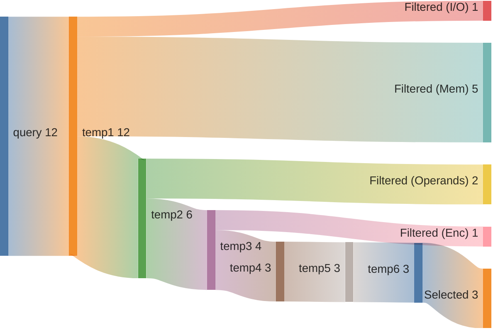
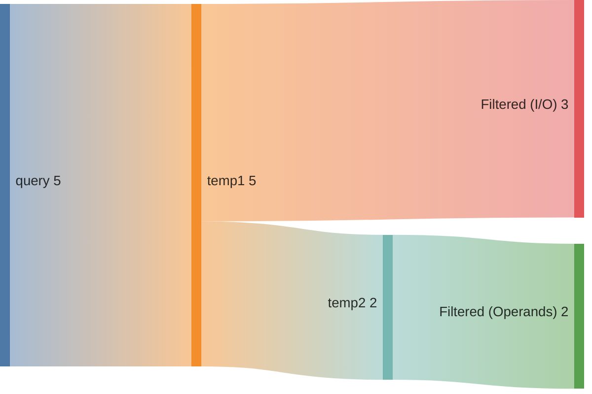
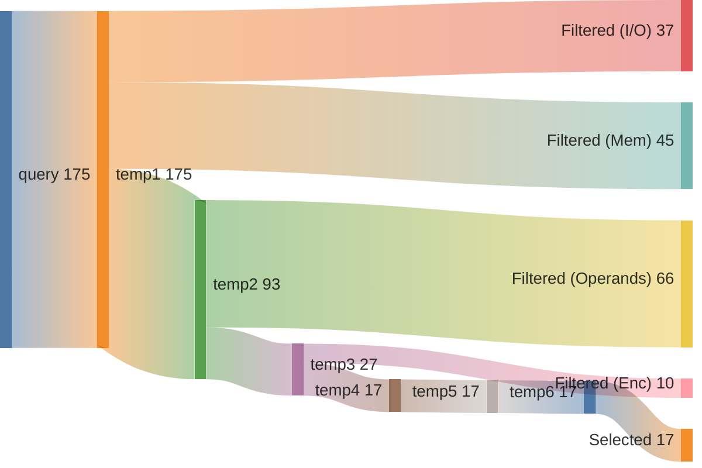
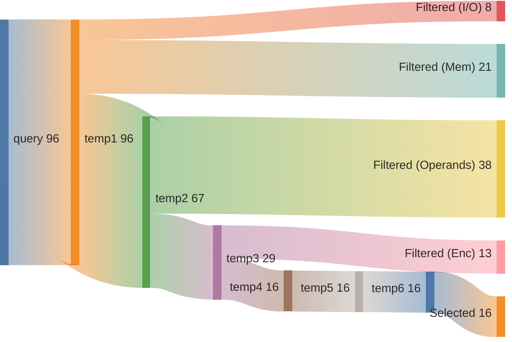

## Summary

Directory: `/var/tmp/ga87puy/isaac-demo/out/embench_iot/picojpeg/20260522T170540`

### Experiment
```ini
[isaac-demo-embench_iot/picojpeg-20260522T170540]
benchmark=embench_iot/picojpeg
datetime=20260522T170540
directory=/var/tmp/ga87puy/isaac-demo/out/embench_iot/picojpeg/20260522T170540
comment=""
```

### Environment/Config
<details>
<summary>Vars</summary>

```sh
ARCH=rv32im_zicsr_zifencei
ABI=ilp32
GLOBAL_ISEL=0
UNROLL=0
OPTIMIZE=3
TARGET=
CCACHE=1
LLVM_BUILD_TYPE=Release
LLVM_ENABLE_ASSERTIONS=ON
CDFG_STAGE=32
FORCE_PURGE_DB=1
ISAAC_LIMIT_RESULTS=
ISAAC_MIN_ISO_WEIGHT=0.05
ISAAC_SCALE_ISO_WEIGHT=auto
ISAAC_SORT_BY=IsoWeight
ISAAC_TOPK=
ISAAC_PARTITION_WITH_MAXMISO=auto
HLS_ENABLE=1
HLS_SKIP_BASELINE=0
HLS_SKIP_DEFAULT=0
HLS_SKIP_SHARED=0
HLS_NAILGUN_LIBRARY=
HLS_NAILGUN_RESOURCE_MODEL=ol_sky130
HLS_NAILGUN_CLOCK_NS=100
HLS_NAILGUN_SCHEDULE_TIMEOUT=60
HLS_NAILGUN_REFINE_TIMEOUT=60
HLS_NAILGUN_CORE_NAME=VEX_5S
HLS_NAILGUN_ILP_SOLVER=GUROBI
HLS_NAILGUN_SCHED_ALGO_MS=y
HLS_NAILGUN_SCHED_ALGO_PA=y
HLS_NAILGUN_SCHED_ALGO_RA=y
HLS_NAILGUN_SCHED_ALGO_MI=y
HLS_NAILGUN_OL2_ENABLE=n
HLS_NAILGUN_OL2_CONFIG_TEMPLATE=/var/tmp/ga87puy/isaac-demo/cfg/openlane/minimal_config_fast.json
HLS_NAILGUN_OL2_UNTIL_STEP=OpenROAD.Floorplan
HLS_NAILGUN_OL2_TARGET_FREQ=20
HLS_NAILGUN_OL2_TARGET_UTIL=20
HLS_NAILGUN_SHARE_RESOURCES=0
ASIP_SYN_ENABLE=1
ASIP_SYN_SKIP_BASELINE=0
ASIP_SYN_SKIP_DEFAULT=0
ASIP_SYN_SKIP_SHARED=0
ASIP_SYN_TOOL=synopsys
ASIP_SYN_SYNOPSYS_PDK=nangate45
ASIP_SYN_SYNOPSYS_CLOCK_NS=10
ASIP_SYN_SYNOPSYS_CORE_NAME=VEX_5S
FPGA_SYN_ENABLE=0
FPGA_SYN_SKIP_BASELINE=0
FPGA_SYN_SKIP_DEFAULT=0
FPGA_SYN_SKIP_SHARED=0
FPGA_SYN_TOOL=vivado
FPGA_SYN_VIVADO_PART=xc7a200tffv1156-1
FPGA_SYN_VIVADO_CLOCK_NS=50
FPGA_SYN_VIVADO_CORE_NAME=VEX_5S
ISAAC_QUERY_CONFIG_YAML=cfg/isaac/query/paper/vex.yml
```

</details>

### Times
<details>
<summary>Stages</summary>

| Stage                              |   Diff [s] |
|:-----------------------------------|-----------:|
| bench_0                            |     11.587 |
| trace_0                            |     21.482 |
| isaac_0_load                       |     19.279 |
| isaac_0_analyze                    |     27.26  |
| isaac_0_visualize                  |      8.941 |
| isaac_0_pick                       |      8.048 |
| isaac_0_cdfg                       |    217.71  |
| isaac_0_query                      |     94.982 |
| isaac_0_generate                   |     13.06  |
| assign_0_enc                       |      2.432 |
| isaac_0_etiss                      |      5.207 |
| seal5_0_splitted                   |    714.53  |
| assign_0_seal5                     |      2.349 |
| etiss_0                            |     43.162 |
| compare_0                          |     25.533 |
| compare_0_per_instr                |     39.222 |
| assign_0_compare_per_instr         |      2.354 |
| filter_0                           |      2.644 |
| spec_0_filtered                    |      1.38  |
| isaac_0_generate_filtered          |     10.47  |
| isaac_0_etiss_filtered             |      4.261 |
| hls_0_filtered                     |   3009.32  |
| assign_0_hls_filtered              |      2.481 |
| select_0_filtered                  |    179.507 |
| isaac_0_etiss_filtered_selected    |      3.242 |
| hls_0_filtered_selected            |    610.359 |
| assign_0_hls_filtered_selected     |      2.792 |
| compare_0_filtered_selected        |     24.971 |
| assign_0_compare_filtered_selected |      0.016 |
| retrace_0_filtered_selected        |     18.917 |
| reanalyze_0_filtered_selected      |    139.562 |
| assign_0_util_filtered_selected    |      1.786 |
| etiss_perf_0_filtered_selected     |    254.618 |
| compare_perf_0_filtered_selected   |     32.827 |
| retrace_perf_0_filtered_selected   |     15.303 |

</details>

### ISE Potential
|   supported_rel_count |   unsupported_rel_count | has_potential   |
|----------------------:|------------------------:|:----------------|
|              0.595392 |                0.404608 | True            |

### Choices
<details>
<summary>Summary</summary>

<h2>Choice 0</h2>
<table>
<tr><th>func_name</th><th>bb_name</th><th>rel_weight</th><th>num_instrs</th><th>freq</th><th>start</th><th>end</th></tr>
<tr><td>pjpeg_decode_mcu</td><td>%bb.131</td><td>0.162806</td><td>9</td><td>60174.0</td><td>0x1000fd8</td><td>0x1000ffc</td></tr>
</table>
<pre><code class='asm'>
 1000fd8: 00050603     	lb	a2, 0x0(a0)
 1000fdc: 00161613     	slli	a2, a2, 0x1
 1000fe0: 00cd8633     	add	a2, s11, a2
 1000fe4: 00061023     	sh	zero, 0x0(a2)
 1000fe8: 0ff5f613     	andi	a2, a1, 0xff
 1000fec: 00150513     	addi	a0, a0, 0x1
 1000ff0: 00158593     	addi	a1, a1, 0x1
 1000ff4: 04000693     	li	a3, 0x40
 1000ff8: fed610e3     	bne	a2, a3, 0x1000fd8 <pjpeg_decode_mcu+0xaf4>
</code></pre>
<h2>Choice 1</h2>
<table>
<tr><th>func_name</th><th>bb_name</th><th>rel_weight</th><th>num_instrs</th><th>freq</th><th>start</th><th>end</th></tr>
<tr><td>pjpeg_decode_mcu</td><td>%bb.149</td><td>0.071211</td><td>12</td><td>19740.0</td><td>0x1001e88</td><td>0x1001eb8</td></tr>
</table>
<pre><code class='asm'>
 1001e88: 0006c703     	lbu	a4, 0x0(a3)
 1001e8c: 00268693     	addi	a3, a3, 0x2
 1001e90: 00158793     	addi	a5, a1, 0x1
 1001e94: 00e60023     	sb	a4, 0x0(a2)
 1001e98: 00160613     	addi	a2, a2, 0x1
 1001e9c: 00e50023     	sb	a4, 0x0(a0)
 1001ea0: 00150513     	addi	a0, a0, 0x1
 1001ea4: 040c0813     	addi	a6, s8, 0x40
 1001ea8: 00e58023     	sb	a4, 0x0(a1)
 1001eac: 00078593     	mv	a1, a5
 1001eb0: fd079ce3     	bne	a5, a6, 0x1001e88 <pjpeg_decode_mcu+0x19a4>
 1001eb4: f00fe06f     	j	0x10005b4 <pjpeg_decode_mcu+0xd0>
</code></pre>
<h2>Choice 2</h2>
<table>
<tr><th>func_name</th><th>bb_name</th><th>rel_weight</th><th>num_instrs</th><th>freq</th><th>start</th><th>end</th></tr>
<tr><td>pjpeg_decode_mcu</td><td>%bb.151</td><td>0.058181</td><td>9</td><td>21504.0</td><td>0x1001848</td><td>0x100186c</td></tr>
</table>
<pre><code class='asm'>
 1001848: 0006c703     	lbu	a4, 0x0(a3)
 100184c: 0005c783     	lbu	a5, 0x0(a1)
 1001850: 06700813     	li	a6, 0x67
 1001854: 03070833     	mul	a6, a4, a6
 1001858: 00885813     	srli	a6, a6, 0x8
 100185c: 00f707b3     	add	a5, a4, a5
 1001860: 010787b3     	add	a5, a5, a6
 1001864: f4d78793     	addi	a5, a5, -0xb3
 1001868: 00fbf663     	bgeu	s7, a5, 0x1001874 <pjpeg_decode_mcu+0x1390>
</code></pre>
<h2>Choice 3</h2>
<table>
<tr><th>func_name</th><th>bb_name</th><th>rel_weight</th><th>num_instrs</th><th>freq</th><th>start</th><th>end</th></tr>
<tr><td>pjpeg_decode_mcu</td><td>%bb.337</td><td>0.051716</td><td>8</td><td>21504.0</td><td>0x1001e44</td><td>0x1001e64</td></tr>
</table>
<pre><code class='asm'>
 1001e44: 00064803     	lbu	a6, 0x0(a2)
 1001e48: 03a708b3     	mul	a7, a4, s10
 1001e4c: 0088d893     	srli	a7, a7, 0x8
 1001e50: 01070733     	add	a4, a4, a6
 1001e54: 01170733     	add	a4, a4, a7
 1001e58: f1d70713     	addi	a4, a4, -0xe3
 1001e5c: 00f58023     	sb	a5, 0x0(a1)
 1001e60: faebf4e3     	bgeu	s7, a4, 0x1001e08 <pjpeg_decode_mcu+0x1924>
</code></pre>

</details>

### Queries
<details>
<summary>Metrics</summary>

|   num_rows |   num_nodes |   num_edges | func             | basic_block   |
|-----------:|------------:|------------:|:-----------------|:--------------|
|         91 |          91 |          65 | pjpeg_decode_mcu | %bb.131       |
|         21 |          42 |          30 | pjpeg_decode_mcu | %bb.149       |
|      27966 |        2832 |        2832 | pjpeg_decode_mcu | %bb.151       |
|       9591 |        1380 |        1242 | pjpeg_decode_mcu | %bb.337       |

</details>

### Sankeys
<details>
<summary>Merge Query Results</summary>





</details>

<details>
<summary>Filtered Candidates</summary>





</details>

<details>
<summary>pjpeg_decode_mcu_%bb.131_0</summary>



</details>

<details>
<summary>pjpeg_decode_mcu_%bb.149_0</summary>



</details>

<details>
<summary>pjpeg_decode_mcu_%bb.151_0</summary>



</details>

<details>
<summary>pjpeg_decode_mcu_%bb.337_0</summary>



</details>

### Compare DF
| Model    | Arch                         |   Run Instructions |   Run Instructions (rel.) |   Total ROM |   Total RAM |   ROM code |   ROM code (rel.) |
|:---------|:-----------------------------|-------------------:|--------------------------:|------------:|------------:|-----------:|------------------:|
| picojpeg | rv32im_zicsr_zifencei        |            3326490 |                  1        |       26976 |        3624 |      24740 |          1        |
| picojpeg | rv32im_zicsr_zifencei_xisaac |            3063077 |                  0.920814 |       26588 |        3624 |      24352 |          0.984317 |

### CoreDSL
<details>
<summary>gen/XIsaac.core_desc</summary>

```c
import "/var/tmp/ga87puy/isaac-demo/etiss_arch_riscv/rv_base/RVI.core_desc"

InstructionSet XIsaac extends RV32I {
    instructions {
        CUSTOM0 {
            encoding: 7'b0000000 :: rs2[4:0] :: rs1[4:0] :: 3'b000 :: rd[4:0] :: 7'b1111011;
            assembly: {"custom0", "{name(rd)}, {name(rs1)}, {name(rs2)}"};
            behavior: {
                unsigned<32> rs1_val = X[rs1];
                unsigned<32> rs2_val = X[rs2];
                unsigned<32> outp0 = (unsigned<32>)((((signed<32>)(rs2_val) + (signed<32>)((unsigned<32>)((((unsigned<32>)(rs1_val) << (unsigned<32>)((1)))))))));
                X[rd] = outp0;
            }
        }
        CUSTOM1 {
            encoding: 2'b00 :: uimm1[4:0] :: rs2[4:0] :: rs1[4:0] :: 3'b001 :: rd[4:0] :: 7'b1111011;
            assembly: {"custom1", "{name(rd)}, {name(rs1)}, {name(rs2)}, {uimm1}"};
            behavior: {
                unsigned<32> rs1_val = X[rs1];
                unsigned<32> rs2_val = X[rs2];
                unsigned<32> outp0 = (unsigned<32>)((((signed<32>)(rs2_val) + (signed<32>)((unsigned<32>)((((unsigned<32>)(rs1_val) << (unsigned<32>)((unsigned<1>)((uimm1))))))))));
                X[rd] = outp0;
            }
        }
        CUSTOM2 {
            encoding: 2'b01 :: uimm5[4:0] :: rs2[4:0] :: rs1[4:0] :: 3'b001 :: rd[4:0] :: 7'b1111011;
            assembly: {"custom2", "{name(rd)}, {name(rs1)}, {name(rs2)}, {uimm5}"};
            behavior: {
                unsigned<32> rs1_val = X[rs1];
                unsigned<32> rs2_val = X[rs2];
                unsigned<32> outp0 = (unsigned<32>)((((signed<32>)(rs2_val) + (signed<32>)((unsigned<32>)((((unsigned<32>)(rs1_val) << (unsigned<32>)((unsigned<5>)((uimm5))))))))));
                X[rd] = outp0;
            }
        }
        CUSTOM3 {
            encoding: 7'b0000001 :: rs2[4:0] :: rs1[4:0] :: 3'b000 :: rd[4:0] :: 7'b1111011;
            assembly: {"custom3", "{name(rd)}, {name(rs1)}, {name(rs2)}"};
            behavior: {
                unsigned<32> rs1_val = X[rs1];
                unsigned<32> rs2_val = X[rs2];
                unsigned<32> outp0 = (unsigned<32>)((((unsigned<32>)((unsigned<32>)((((signed<32>)(rs1_val) * (signed<32>)((unsigned<32>)((((signed<32>)(rs2_val) + (signed<32>)((103)))))))))) >> (unsigned<32>)((8)))));
                X[rd] = outp0;
            }
        }
        CUSTOM4 {
            encoding: 7'b0000010 :: rs2[4:0] :: rs1[4:0] :: 3'b000 :: rd[4:0] :: 7'b1111011;
            assembly: {"custom4", "{name(rd)}, {name(rs1)}, {name(rs2)}"};
            behavior: {
                unsigned<32> rs1_val = X[rs1];
                unsigned<32> rs2_val = X[rs2];
                unsigned<32> outp0 = (unsigned<32>)((((signed<32>)((unsigned<32>)((((signed<32>)(rs2_val) + (signed<32>)((unsigned<32>)((((unsigned<32>)(rs1_val) >> (unsigned<32>)((8)))))))))) + (signed<32>)((-179)))));
                X[rd] = outp0;
            }
        }
        CUSTOM5 {
            encoding: 2'b10 :: uimm4[4:0] :: rs2[4:0] :: rs1[4:0] :: 3'b001 :: rd[4:0] :: 7'b1111011;
            assembly: {"custom5", "{name(rd)}, {name(rs1)}, {name(rs2)}, {uimm4}"};
            behavior: {
                unsigned<32> rs1_val = X[rs1];
                unsigned<32> rs2_val = X[rs2];
                unsigned<32> outp0 = (unsigned<32>)((((unsigned<32>)((unsigned<32>)((((signed<32>)(rs1_val) * (signed<32>)((unsigned<32>)((((signed<32>)(rs2_val) + (signed<32>)((103)))))))))) >> (unsigned<32>)((unsigned<4>)((uimm4))))));
                X[rd] = outp0;
            }
        }
        CUSTOM6 {
            encoding: 2'b11 :: uimm5[4:0] :: rs2[4:0] :: rs1[4:0] :: 3'b001 :: rd[4:0] :: 7'b1111011;
            assembly: {"custom6", "{name(rd)}, {name(rs1)}, {name(rs2)}, {uimm5}"};
            behavior: {
                unsigned<32> rs1_val = X[rs1];
                unsigned<32> rs2_val = X[rs2];
                unsigned<32> outp0 = (unsigned<32>)((((unsigned<32>)((unsigned<32>)((((signed<32>)(rs1_val) * (signed<32>)((unsigned<32>)((((signed<32>)(rs2_val) + (signed<32>)((103)))))))))) >> (unsigned<32>)((unsigned<5>)((uimm5))))));
                X[rd] = outp0;
            }
        }
        CUSTOM7 {
            encoding: 2'b00 :: uimm4[4:0] :: rs2[4:0] :: rs1[4:0] :: 3'b010 :: rd[4:0] :: 7'b1111011;
            assembly: {"custom7", "{name(rd)}, {name(rs1)}, {name(rs2)}, {uimm4}"};
            behavior: {
                unsigned<32> rs1_val = X[rs1];
                unsigned<32> rs2_val = X[rs2];
                unsigned<32> outp0 = (unsigned<32>)((((signed<32>)((unsigned<32>)((((signed<32>)(rs2_val) + (signed<32>)((unsigned<32>)((((unsigned<32>)(rs1_val) >> (unsigned<32>)((unsigned<4>)((uimm4))))))))))) + (signed<32>)((-179)))));
                X[rd] = outp0;
            }
        }
        CUSTOM8 {
            encoding: 2'b01 :: uimm5[4:0] :: rs2[4:0] :: rs1[4:0] :: 3'b010 :: rd[4:0] :: 7'b1111011;
            assembly: {"custom8", "{name(rd)}, {name(rs1)}, {name(rs2)}, {uimm5}"};
            behavior: {
                unsigned<32> rs1_val = X[rs1];
                unsigned<32> rs2_val = X[rs2];
                unsigned<32> outp0 = (unsigned<32>)((((signed<32>)((unsigned<32>)((((signed<32>)(rs2_val) + (signed<32>)((unsigned<32>)((((unsigned<32>)(rs1_val) >> (unsigned<32>)((unsigned<5>)((uimm5))))))))))) + (signed<32>)((-179)))));
                X[rd] = outp0;
            }
        }
        CUSTOM9 {
            encoding: 7'b0000011 :: 5'b00000 :: rs1[4:0] :: 3'b000 :: rd[4:0] :: 7'b1111011;
            assembly: {"custom9", "{name(rd)}, {name(rs1)}"};
            behavior: {
                unsigned<32> rs1_val = X[rs1];
                unsigned<32> outp0 = (unsigned<32>)((((signed<32>)((unsigned<32>)((((signed)(rs1_val) < (signed)((0)) ? 1 : 0)))) + (signed<32>)((-1)))));
                X[rd] = outp0;
            }
        }
        CUSTOM10 {
            encoding: 7'b0000100 :: rs2[4:0] :: rs1[4:0] :: 3'b000 :: rd[4:0] :: 7'b1111011;
            assembly: {"custom10", "{name(rd)}, {name(rs1)}, {name(rs2)}"};
            behavior: {
                unsigned<32> rs1_val = X[rs1];
                unsigned<32> rs2_val = X[rs2];
                unsigned<32> outp0 = (unsigned<32>)((((signed<32>)(rs1_val) * (signed<32>)((unsigned<32>)((((signed<32>)(rs2_val) + (signed<32>)((103)))))))));
                X[rd] = outp0;
            }
        }
        CUSTOM11 {
            encoding: 7'b0000101 :: rs2[4:0] :: rs1[4:0] :: 3'b000 :: rd[4:0] :: 7'b1111011;
            assembly: {"custom11", "{name(rd)}, {name(rs1)}, {name(rs2)}"};
            behavior: {
                unsigned<32> rs2_val = X[rs2];
                unsigned<32> rs1_val = X[rs1];
                unsigned<32> outp0 = (unsigned<32>)((((unsigned<32>)((unsigned<32>)((((signed<32>)(rs2_val) * (signed<32>)(rs1_val))))) >> (unsigned<32>)((8)))));
                X[rd] = outp0;
            }
        }
        CUSTOM12 {
            encoding: 7'b0000110 :: rs2[4:0] :: rs1[4:0] :: 3'b000 :: rd[4:0] :: 7'b1111011;
            assembly: {"custom12", "{name(rd)}, {name(rs1)}, {name(rs2)}"};
            behavior: {
                unsigned<32> rs1_val = X[rs1];
                unsigned<32> rs2_val = X[rs2];
                unsigned<32> outp0 = (unsigned<32>)((((signed<32>)((unsigned<32>)((((signed<32>)(rs2_val) + (signed<32>)(rs1_val))))) + (signed<32>)((-179)))));
                X[rd] = outp0;
            }
        }
        CUSTOM13 {
            encoding: 7'b0000111 :: rs2[4:0] :: rs1[4:0] :: 3'b000 :: rd[4:0] :: 7'b1111011;
            assembly: {"custom13", "{name(rd)}, {name(rs1)}, {name(rs2)}"};
            behavior: {
                unsigned<32> rs1_val = X[rs1];
                unsigned<32> rs2_val = X[rs2];
                unsigned<32> outp0 = (unsigned<32>)((((signed<32>)(rs2_val) + (signed<32>)((unsigned<32>)((((unsigned<32>)(rs1_val) >> (unsigned<32>)((8)))))))));
                X[rd] = outp0;
            }
        }
        CUSTOM14 {
            encoding: 7'b0001000 :: uimm1[4:0] :: rs1[4:0] :: 3'b000 :: rd[4:0] :: 7'b1111011;
            assembly: {"custom14", "{name(rd)}, {name(rs1)}, {uimm1}"};
            behavior: {
                unsigned<32> rs1_val = X[rs1];
                unsigned<32> outp0 = (unsigned<32>)((((signed<32>)((unsigned<32>)((((signed)(rs1_val) < (signed)((unsigned<1>)((uimm1))) ? 1 : 0)))) + (signed<32>)((-1)))));
                X[rd] = outp0;
            }
        }
        CUSTOM15 {
            encoding: 7'b0001001 :: uimm5[4:0] :: rs1[4:0] :: 3'b000 :: rd[4:0] :: 7'b1111011;
            assembly: {"custom15", "{name(rd)}, {name(rs1)}, {uimm5}"};
            behavior: {
                unsigned<32> rs1_val = X[rs1];
                unsigned<32> outp0 = (unsigned<32>)((((signed<32>)((unsigned<32>)((((signed)(rs1_val) < (signed)((unsigned<5>)((uimm5))) ? 1 : 0)))) + (signed<32>)((-1)))));
                X[rd] = outp0;
            }
        }
        CUSTOM16 {
            encoding: 2'b10 :: uimm4[4:0] :: rs2[4:0] :: rs1[4:0] :: 3'b010 :: rd[4:0] :: 7'b1111011;
            assembly: {"custom16", "{name(rd)}, {name(rs1)}, {name(rs2)}, {uimm4}"};
            behavior: {
                unsigned<32> rs2_val = X[rs2];
                unsigned<32> rs1_val = X[rs1];
                unsigned<32> outp0 = (unsigned<32>)((((unsigned<32>)((unsigned<32>)((((signed<32>)(rs2_val) * (signed<32>)(rs1_val))))) >> (unsigned<32>)((unsigned<4>)((uimm4))))));
                X[rd] = outp0;
            }
        }
        CUSTOM17 {
            encoding: 2'b11 :: uimm5[4:0] :: rs2[4:0] :: rs1[4:0] :: 3'b010 :: rd[4:0] :: 7'b1111011;
            assembly: {"custom17", "{name(rd)}, {name(rs1)}, {name(rs2)}, {uimm5}"};
            behavior: {
                unsigned<32> rs2_val = X[rs2];
                unsigned<32> rs1_val = X[rs1];
                unsigned<32> outp0 = (unsigned<32>)((((unsigned<32>)((unsigned<32>)((((signed<32>)(rs2_val) * (signed<32>)(rs1_val))))) >> (unsigned<32>)((unsigned<5>)((uimm5))))));
                X[rd] = outp0;
            }
        }
        CUSTOM18 {
            encoding: 2'b00 :: uimm4[4:0] :: rs2[4:0] :: rs1[4:0] :: 3'b011 :: rd[4:0] :: 7'b1111011;
            assembly: {"custom18", "{name(rd)}, {name(rs1)}, {name(rs2)}, {uimm4}"};
            behavior: {
                unsigned<32> rs1_val = X[rs1];
                unsigned<32> rs2_val = X[rs2];
                unsigned<32> outp0 = (unsigned<32>)((((signed<32>)(rs2_val) + (signed<32>)((unsigned<32>)((((unsigned<32>)(rs1_val) >> (unsigned<32>)((unsigned<4>)((uimm4))))))))));
                X[rd] = outp0;
            }
        }
        CUSTOM19 {
            encoding: 2'b01 :: uimm5[4:0] :: rs2[4:0] :: rs1[4:0] :: 3'b011 :: rd[4:0] :: 7'b1111011;
            assembly: {"custom19", "{name(rd)}, {name(rs1)}, {name(rs2)}, {uimm5}"};
            behavior: {
                unsigned<32> rs1_val = X[rs1];
                unsigned<32> rs2_val = X[rs2];
                unsigned<32> outp0 = (unsigned<32>)((((signed<32>)(rs2_val) + (signed<32>)((unsigned<32>)((((unsigned<32>)(rs1_val) >> (unsigned<32>)((unsigned<5>)((uimm5))))))))));
                X[rd] = outp0;
            }
        }
        CUSTOM20 {
            encoding: 7'b0001010 :: rs2[4:0] :: rs1[4:0] :: 3'b000 :: rd[4:0] :: 7'b1111011;
            assembly: {"custom20", "{name(rd)}, {name(rs1)}, {name(rs2)}"};
            behavior: {
                unsigned<32> rs2_val = X[rs2];
                unsigned<32> rs1_val = X[rs1];
                unsigned<32> outp0 = (unsigned<32>)((((signed<32>)(rs1_val) + (signed<32>)((unsigned<32>)((((unsigned<32>)((unsigned<32>)((((signed<32>)(rs1_val) * (signed<32>)((unsigned<32>)((((signed<32>)(rs2_val) + (signed<32>)((198)))))))))) >> (unsigned<32>)((8)))))))));
                X[rd] = outp0;
            }
        }
        CUSTOM21 {
            encoding: 7'b0001011 :: rs2[4:0] :: rs1[4:0] :: 3'b000 :: rd[4:0] :: 7'b1111011;
            assembly: {"custom21", "{name(rd)}, {name(rs1)}, {name(rs2)}"};
            behavior: {
                unsigned<32> rs1_val = X[rs1];
                unsigned<32> rs2_val = X[rs2];
                unsigned<32> outp0 = (unsigned<32>)((((signed<32>)(rs2_val) + (signed<32>)((unsigned<32>)((((unsigned<32>)((unsigned<32>)((((signed<32>)(rs2_val) * (signed<32>)(rs1_val))))) >> (unsigned<32>)((8)))))))));
                X[rd] = outp0;
            }
        }
        CUSTOM22 {
            encoding: 7'b0001100 :: rs2[4:0] :: rs1[4:0] :: 3'b000 :: rd[4:0] :: 7'b1111011;
            assembly: {"custom22", "{name(rd)}, {name(rs1)}, {name(rs2)}"};
            behavior: {
                unsigned<32> rs2_val = X[rs2];
                unsigned<32> rs1_val = X[rs1];
                unsigned<32> outp0 = (unsigned<32>)((((unsigned<32>)((unsigned<32>)((((signed<32>)(rs1_val) * (signed<32>)((unsigned<32>)((((signed<32>)(rs2_val) + (signed<32>)((198)))))))))) >> (unsigned<32>)((8)))));
                X[rd] = outp0;
            }
        }
        CUSTOM23 {
            encoding: 7'b0001101 :: rs2[4:0] :: rs1[4:0] :: 3'b000 :: rd[4:0] :: 7'b1111011;
            assembly: {"custom23", "{name(rd)}, {name(rs1)}, {name(rs2)}"};
            behavior: {
                unsigned<32> rs2_val = X[rs2];
                unsigned<32> rs1_val = X[rs1];
                unsigned<32> outp0 = (unsigned<32>)((((signed<32>)(rs1_val) * (signed<32>)((unsigned<32>)((((signed<32>)(rs2_val) + (signed<32>)((198)))))))));
                X[rd] = outp0;
            }
        }
        CUSTOM24 {
            encoding: 7'b0001110 :: rs2[4:0] :: rs1[4:0] :: 3'b000 :: rd[4:0] :: 7'b1111011;
            assembly: {"custom24", "{name(rd)}, {name(rs1)}, {name(rs2)}"};
            behavior: {
                unsigned<32> rs2_val = X[rs2];
                unsigned<32> rs1_val = X[rs1];
                unsigned<32> outp0 = (unsigned<32>)((((signed<32>)((unsigned<32>)((((signed<32>)(rs1_val) + (signed<32>)(rs2_val))))) + (signed<32>)((-227)))));
                X[rd] = outp0;
            }
        }
        CUSTOM25 {
            encoding: 2'b10 :: uimm4[4:0] :: rs2[4:0] :: rs1[4:0] :: 3'b011 :: rd[4:0] :: 7'b1111011;
            assembly: {"custom25", "{name(rd)}, {name(rs1)}, {name(rs2)}, {uimm4}"};
            behavior: {
                unsigned<32> rs1_val = X[rs1];
                unsigned<32> rs2_val = X[rs2];
                unsigned<32> outp0 = (unsigned<32>)((((signed<32>)(rs2_val) + (signed<32>)((unsigned<32>)((((unsigned<32>)((unsigned<32>)((((signed<32>)(rs2_val) * (signed<32>)(rs1_val))))) >> (unsigned<32>)((unsigned<4>)((uimm4))))))))));
                X[rd] = outp0;
            }
        }
        CUSTOM26 {
            encoding: 2'b11 :: uimm5[4:0] :: rs2[4:0] :: rs1[4:0] :: 3'b011 :: rd[4:0] :: 7'b1111011;
            assembly: {"custom26", "{name(rd)}, {name(rs1)}, {name(rs2)}, {uimm5}"};
            behavior: {
                unsigned<32> rs1_val = X[rs1];
                unsigned<32> rs2_val = X[rs2];
                unsigned<32> outp0 = (unsigned<32>)((((signed<32>)(rs2_val) + (signed<32>)((unsigned<32>)((((unsigned<32>)((unsigned<32>)((((signed<32>)(rs2_val) * (signed<32>)(rs1_val))))) >> (unsigned<32>)((unsigned<5>)((uimm5))))))))));
                X[rd] = outp0;
            }
        }
        CUSTOM27 {
            encoding: 2'b00 :: uimm4[4:0] :: rs2[4:0] :: rs1[4:0] :: 3'b100 :: rd[4:0] :: 7'b1111011;
            assembly: {"custom27", "{name(rd)}, {name(rs1)}, {name(rs2)}, {uimm4}"};
            behavior: {
                unsigned<32> rs2_val = X[rs2];
                unsigned<32> rs1_val = X[rs1];
                unsigned<32> outp0 = (unsigned<32>)((((signed<32>)(rs2_val) + (signed<32>)((unsigned<32>)((((unsigned<32>)(rs1_val) >> (unsigned<32>)((unsigned<4>)((uimm4))))))))));
                X[rd] = outp0;
            }
        }
        CUSTOM28 {
            encoding: 2'b01 :: uimm5[4:0] :: rs2[4:0] :: rs1[4:0] :: 3'b100 :: rd[4:0] :: 7'b1111011;
            assembly: {"custom28", "{name(rd)}, {name(rs1)}, {name(rs2)}, {uimm5}"};
            behavior: {
                unsigned<32> rs2_val = X[rs2];
                unsigned<32> rs1_val = X[rs1];
                unsigned<32> outp0 = (unsigned<32>)((((signed<32>)(rs2_val) + (signed<32>)((unsigned<32>)((((unsigned<32>)(rs1_val) >> (unsigned<32>)((unsigned<5>)((uimm5))))))))));
                X[rd] = outp0;
            }
        }
    }
}


```

</details>

<details>
<summary>gen_filtered/XIsaac.core_desc</summary>

```c
import "/var/tmp/ga87puy/isaac-demo/etiss_arch_riscv/rv_base/RVI.core_desc"

InstructionSet XIsaac extends RV32I {
    instructions {
        CUSTOM0 {
            encoding: 7'b0000000 :: rs2[4:0] :: rs1[4:0] :: 3'b000 :: rd[4:0] :: 7'b1111011;
            assembly: {"custom0", "{name(rd)}, {name(rs1)}, {name(rs2)}"};
            behavior: {
                unsigned<32> rs1_val = X[rs1];
                unsigned<32> rs2_val = X[rs2];
                unsigned<32> outp0 = (unsigned<32>)(((((signed<32>)((rs2_val)) + (signed<32>)(((unsigned<32>)(((((unsigned<32>)((rs1_val)) << (unsigned<32>)(((1)))))))))))));
                X[rd] = outp0;
            }
        }
        CUSTOM2 {
            encoding: 2'b01 :: uimm5[4:0] :: rs2[4:0] :: rs1[4:0] :: 3'b001 :: rd[4:0] :: 7'b1111011;
            assembly: {"custom2", "{name(rd)}, {name(rs1)}, {name(rs2)}, {uimm5}"};
            behavior: {
                unsigned<32> rs1_val = X[rs1];
                unsigned<32> rs2_val = X[rs2];
                unsigned<32> outp0 = (unsigned<32>)(((((signed<32>)((rs2_val)) + (signed<32>)(((unsigned<32>)(((((unsigned<32>)((rs1_val)) << (unsigned<32>)(((unsigned<5>)(((uimm5)))))))))))))));
                X[rd] = outp0;
            }
        }
        CUSTOM4 {
            encoding: 7'b0000010 :: rs2[4:0] :: rs1[4:0] :: 3'b000 :: rd[4:0] :: 7'b1111011;
            assembly: {"custom4", "{name(rd)}, {name(rs1)}, {name(rs2)}"};
            behavior: {
                unsigned<32> rs1_val = X[rs1];
                unsigned<32> rs2_val = X[rs2];
                unsigned<32> outp0 = (unsigned<32>)(((((signed<32>)(((unsigned<32>)(((((signed<32>)((rs2_val)) + (signed<32>)(((unsigned<32>)(((((unsigned<32>)((rs1_val)) >> (unsigned<32>)(((8))))))))))))))) + (signed<32>)(((-179)))))));
                X[rd] = outp0;
            }
        }
        CUSTOM8 {
            encoding: 2'b01 :: uimm5[4:0] :: rs2[4:0] :: rs1[4:0] :: 3'b010 :: rd[4:0] :: 7'b1111011;
            assembly: {"custom8", "{name(rd)}, {name(rs1)}, {name(rs2)}, {uimm5}"};
            behavior: {
                unsigned<32> rs1_val = X[rs1];
                unsigned<32> rs2_val = X[rs2];
                unsigned<32> outp0 = (unsigned<32>)(((((signed<32>)(((unsigned<32>)(((((signed<32>)((rs2_val)) + (signed<32>)(((unsigned<32>)(((((unsigned<32>)((rs1_val)) >> (unsigned<32>)(((unsigned<5>)(((uimm5))))))))))))))))) + (signed<32>)(((-179)))))));
                X[rd] = outp0;
            }
        }
        CUSTOM11 {
            encoding: 7'b0000101 :: rs2[4:0] :: rs1[4:0] :: 3'b000 :: rd[4:0] :: 7'b1111011;
            assembly: {"custom11", "{name(rd)}, {name(rs1)}, {name(rs2)}"};
            behavior: {
                unsigned<32> rs2_val = X[rs2];
                unsigned<32> rs1_val = X[rs1];
                unsigned<32> outp0 = (unsigned<32>)(((((unsigned<32>)(((unsigned<32>)(((((signed<32>)((rs2_val)) * (signed<32>)((rs1_val)))))))) >> (unsigned<32>)(((8)))))));
                X[rd] = outp0;
            }
        }
        CUSTOM12 {
            encoding: 7'b0000110 :: rs2[4:0] :: rs1[4:0] :: 3'b000 :: rd[4:0] :: 7'b1111011;
            assembly: {"custom12", "{name(rd)}, {name(rs1)}, {name(rs2)}"};
            behavior: {
                unsigned<32> rs1_val = X[rs1];
                unsigned<32> rs2_val = X[rs2];
                unsigned<32> outp0 = (unsigned<32>)(((((signed<32>)(((unsigned<32>)(((((signed<32>)((rs2_val)) + (signed<32>)((rs1_val)))))))) + (signed<32>)(((-179)))))));
                X[rd] = outp0;
            }
        }
        CUSTOM13 {
            encoding: 7'b0000111 :: rs2[4:0] :: rs1[4:0] :: 3'b000 :: rd[4:0] :: 7'b1111011;
            assembly: {"custom13", "{name(rd)}, {name(rs1)}, {name(rs2)}"};
            behavior: {
                unsigned<32> rs1_val = X[rs1];
                unsigned<32> rs2_val = X[rs2];
                unsigned<32> outp0 = (unsigned<32>)(((((signed<32>)((rs2_val)) + (signed<32>)(((unsigned<32>)(((((unsigned<32>)((rs1_val)) >> (unsigned<32>)(((8)))))))))))));
                X[rd] = outp0;
            }
        }
        CUSTOM17 {
            encoding: 2'b11 :: uimm5[4:0] :: rs2[4:0] :: rs1[4:0] :: 3'b010 :: rd[4:0] :: 7'b1111011;
            assembly: {"custom17", "{name(rd)}, {name(rs1)}, {name(rs2)}, {uimm5}"};
            behavior: {
                unsigned<32> rs2_val = X[rs2];
                unsigned<32> rs1_val = X[rs1];
                unsigned<32> outp0 = (unsigned<32>)(((((unsigned<32>)(((unsigned<32>)(((((signed<32>)((rs2_val)) * (signed<32>)((rs1_val)))))))) >> (unsigned<32>)(((unsigned<5>)(((uimm5)))))))));
                X[rd] = outp0;
            }
        }
        CUSTOM19 {
            encoding: 2'b01 :: uimm5[4:0] :: rs2[4:0] :: rs1[4:0] :: 3'b011 :: rd[4:0] :: 7'b1111011;
            assembly: {"custom19", "{name(rd)}, {name(rs1)}, {name(rs2)}, {uimm5}"};
            behavior: {
                unsigned<32> rs1_val = X[rs1];
                unsigned<32> rs2_val = X[rs2];
                unsigned<32> outp0 = (unsigned<32>)(((((signed<32>)((rs2_val)) + (signed<32>)(((unsigned<32>)(((((unsigned<32>)((rs1_val)) >> (unsigned<32>)(((unsigned<5>)(((uimm5)))))))))))))));
                X[rd] = outp0;
            }
        }
        CUSTOM21 {
            encoding: 7'b0001011 :: rs2[4:0] :: rs1[4:0] :: 3'b000 :: rd[4:0] :: 7'b1111011;
            assembly: {"custom21", "{name(rd)}, {name(rs1)}, {name(rs2)}"};
            behavior: {
                unsigned<32> rs1_val = X[rs1];
                unsigned<32> rs2_val = X[rs2];
                unsigned<32> outp0 = (unsigned<32>)(((((signed<32>)((rs2_val)) + (signed<32>)(((unsigned<32>)(((((unsigned<32>)(((unsigned<32>)(((((signed<32>)((rs2_val)) * (signed<32>)((rs1_val)))))))) >> (unsigned<32>)(((8)))))))))))));
                X[rd] = outp0;
            }
        }
        CUSTOM24 {
            encoding: 7'b0001110 :: rs2[4:0] :: rs1[4:0] :: 3'b000 :: rd[4:0] :: 7'b1111011;
            assembly: {"custom24", "{name(rd)}, {name(rs1)}, {name(rs2)}"};
            behavior: {
                unsigned<32> rs2_val = X[rs2];
                unsigned<32> rs1_val = X[rs1];
                unsigned<32> outp0 = (unsigned<32>)(((((signed<32>)(((unsigned<32>)(((((signed<32>)((rs1_val)) + (signed<32>)((rs2_val)))))))) + (signed<32>)(((-227)))))));
                X[rd] = outp0;
            }
        }
        CUSTOM26 {
            encoding: 2'b11 :: uimm5[4:0] :: rs2[4:0] :: rs1[4:0] :: 3'b011 :: rd[4:0] :: 7'b1111011;
            assembly: {"custom26", "{name(rd)}, {name(rs1)}, {name(rs2)}, {uimm5}"};
            behavior: {
                unsigned<32> rs1_val = X[rs1];
                unsigned<32> rs2_val = X[rs2];
                unsigned<32> outp0 = (unsigned<32>)(((((signed<32>)((rs2_val)) + (signed<32>)(((unsigned<32>)(((((unsigned<32>)(((unsigned<32>)(((((signed<32>)((rs2_val)) * (signed<32>)((rs1_val)))))))) >> (unsigned<32>)(((unsigned<5>)(((uimm5)))))))))))))));
                X[rd] = outp0;
            }
        }
        CUSTOM28 {
            encoding: 2'b01 :: uimm5[4:0] :: rs2[4:0] :: rs1[4:0] :: 3'b100 :: rd[4:0] :: 7'b1111011;
            assembly: {"custom28", "{name(rd)}, {name(rs1)}, {name(rs2)}, {uimm5}"};
            behavior: {
                unsigned<32> rs2_val = X[rs2];
                unsigned<32> rs1_val = X[rs1];
                unsigned<32> outp0 = (unsigned<32>)(((((signed<32>)((rs2_val)) + (signed<32>)(((unsigned<32>)(((((unsigned<32>)((rs1_val)) >> (unsigned<32>)(((unsigned<5>)(((uimm5)))))))))))))));
                X[rd] = outp0;
            }
        }
    }
}


```

</details>


