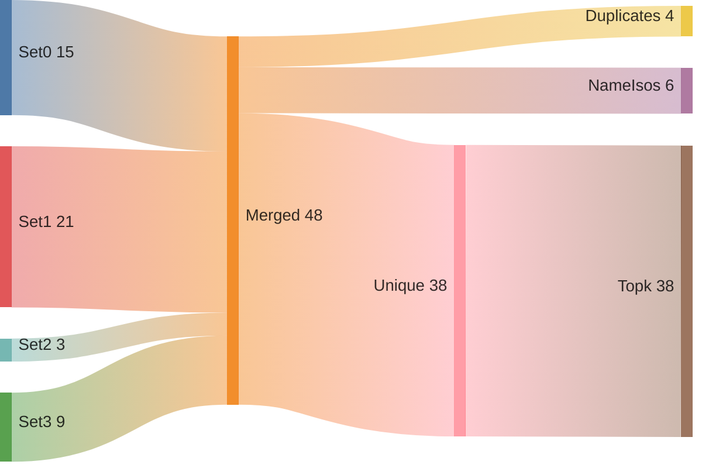

```mermaid
---
config:
  sankey:
    showValues: true
---
sankey-beta

%% source,target,value
Set0,Merged,15
Set1,Merged,21
Set2,Merged,3
Set3,Merged,9
Merged,Duplicates,4
Merged,NameIsos,6
Merged,Unique,38
Unique,Topk,38

```
