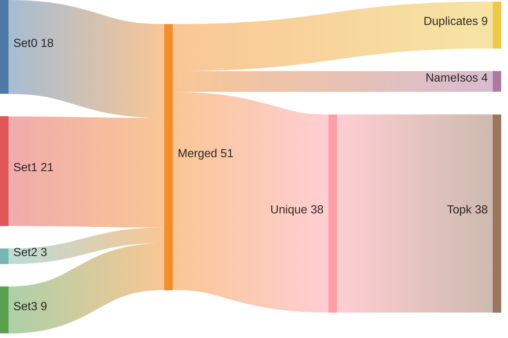
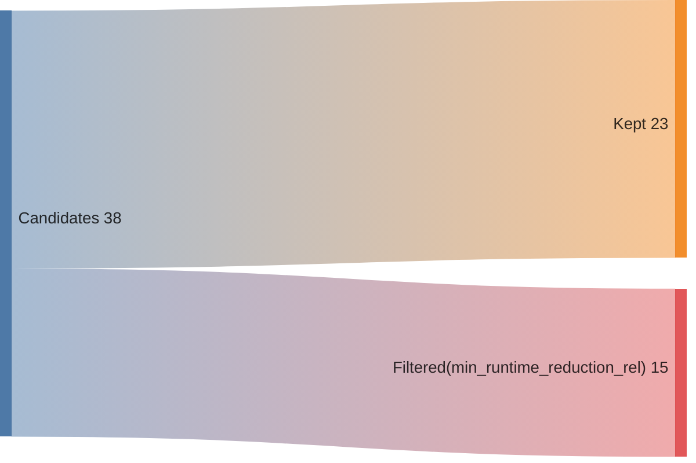
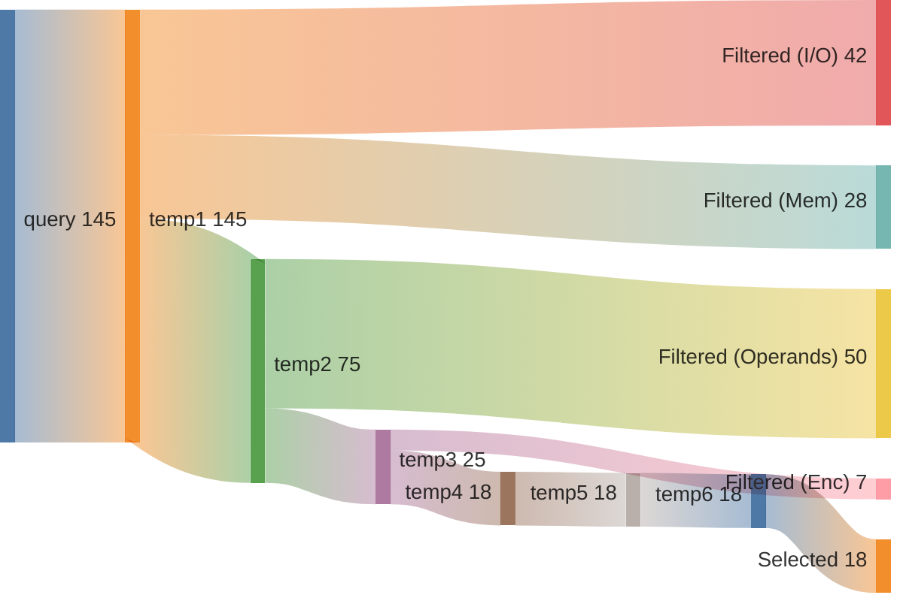
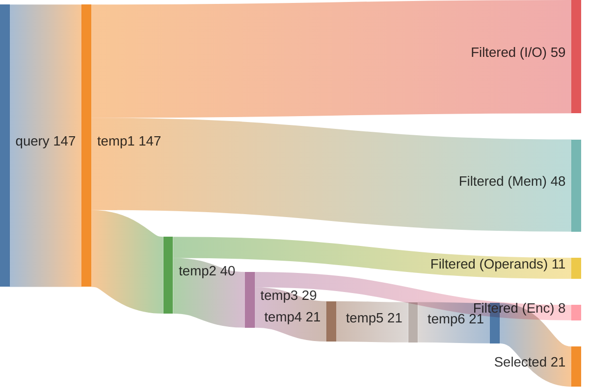
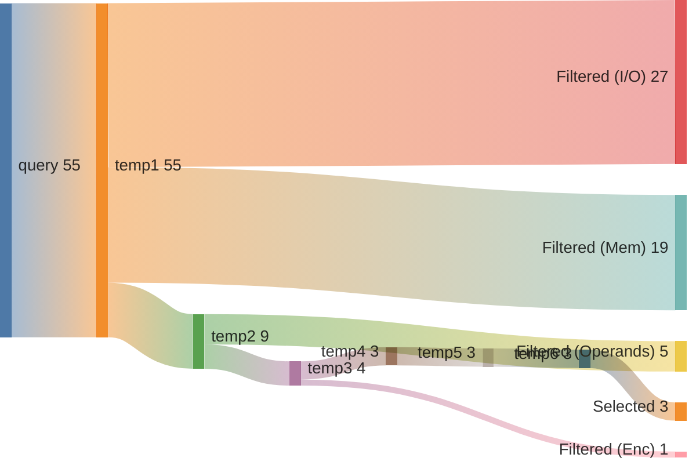
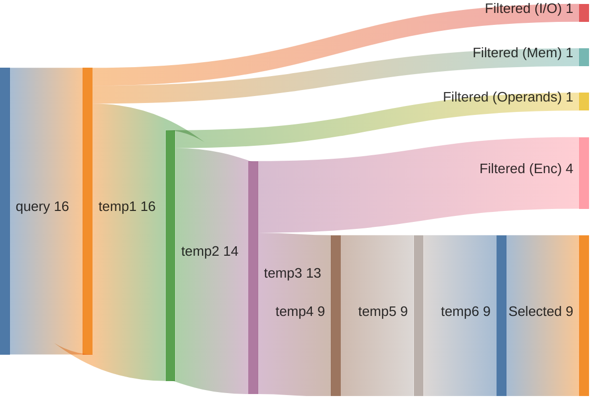

## Summary

Directory: `/var/tmp/ga87puy/isaac-demo/out/embench_iot/qrduino/20260527T131551`

### Experiment
```ini
[isaac-demo-embench_iot/qrduino-20260527T131551]
benchmark=embench_iot/qrduino
datetime=20260527T131551
directory=/var/tmp/ga87puy/isaac-demo/out/embench_iot/qrduino/20260527T131551
comment=""
```

### Environment/Config
<details>
<summary>Vars</summary>

```sh
ARCH=rv32im_zicsr_zifencei
ABI=ilp32
GLOBAL_ISEL=0
UNROLL=0
OPTIMIZE=3
TARGET=
CCACHE=1
LLVM_BUILD_TYPE=Release
LLVM_ENABLE_ASSERTIONS=ON
CDFG_STAGE=32
FORCE_PURGE_DB=1
ISAAC_LIMIT_RESULTS=
ISAAC_MIN_ISO_WEIGHT=0.05
ISAAC_SCALE_ISO_WEIGHT=auto
ISAAC_SORT_BY=IsoWeight
ISAAC_TOPK=
ISAAC_PARTITION_WITH_MAXMISO=auto
HLS_ENABLE=1
HLS_SKIP_BASELINE=0
HLS_SKIP_DEFAULT=0
HLS_SKIP_SHARED=0
HLS_NAILGUN_LIBRARY=
HLS_NAILGUN_RESOURCE_MODEL=ol_sky130
HLS_NAILGUN_CLOCK_NS=100
HLS_NAILGUN_SCHEDULE_TIMEOUT=60
HLS_NAILGUN_REFINE_TIMEOUT=60
HLS_NAILGUN_CORE_NAME=VEX_5S
HLS_NAILGUN_ILP_SOLVER=GUROBI
HLS_NAILGUN_SCHED_ALGO_MS=y
HLS_NAILGUN_SCHED_ALGO_PA=y
HLS_NAILGUN_SCHED_ALGO_RA=y
HLS_NAILGUN_SCHED_ALGO_MI=y
HLS_NAILGUN_OL2_ENABLE=n
HLS_NAILGUN_OL2_CONFIG_TEMPLATE=/var/tmp/ga87puy/isaac-demo/cfg/openlane/minimal_config_fast.json
HLS_NAILGUN_OL2_UNTIL_STEP=OpenROAD.Floorplan
HLS_NAILGUN_OL2_TARGET_FREQ=20
HLS_NAILGUN_OL2_TARGET_UTIL=20
HLS_NAILGUN_SHARE_RESOURCES=0
ASIP_SYN_ENABLE=1
ASIP_SYN_SKIP_BASELINE=0
ASIP_SYN_SKIP_DEFAULT=0
ASIP_SYN_SKIP_SHARED=0
ASIP_SYN_TOOL=synopsys
ASIP_SYN_SYNOPSYS_PDK=nangate45
ASIP_SYN_SYNOPSYS_CLOCK_NS=10
ASIP_SYN_SYNOPSYS_CORE_NAME=VEX_5S
FPGA_SYN_ENABLE=0
FPGA_SYN_SKIP_BASELINE=0
FPGA_SYN_SKIP_DEFAULT=0
FPGA_SYN_SKIP_SHARED=0
FPGA_SYN_TOOL=vivado
FPGA_SYN_VIVADO_PART=xc7a200tffv1156-1
FPGA_SYN_VIVADO_CLOCK_NS=50
FPGA_SYN_VIVADO_CORE_NAME=VEX_5S
ISAAC_QUERY_CONFIG_YAML=cfg/isaac/query/paper/vex.yml
```

</details>

### Times
<details>
<summary>Stages</summary>

| Stage                              |   Diff [s] |
|:-----------------------------------|-----------:|
| bench_0                            |      8.746 |
| trace_0                            |     18.304 |
| isaac_0_load                       |     23.682 |
| isaac_0_analyze                    |     21.708 |
| isaac_0_visualize                  |      7.991 |
| isaac_0_pick                       |      7.891 |
| isaac_0_cdfg                       |     62.194 |
| isaac_0_query                      |     78.663 |
| isaac_0_generate                   |     16.068 |
| assign_0_enc                       |      2.226 |
| isaac_0_etiss                      |      6.418 |
| seal5_0_splitted                   |    706.06  |
| assign_0_seal5                     |      2.453 |
| etiss_0                            |     40.673 |
| compare_0                          |     20.531 |
| compare_0_per_instr                |     50.51  |
| assign_0_compare_per_instr         |      2.165 |
| filter_0                           |      2.688 |
| spec_0_filtered                    |      2.004 |
| isaac_0_generate_filtered          |     13.696 |
| isaac_0_etiss_filtered             |      4.704 |
| hls_0_filtered                     |    543.478 |
| assign_0_hls_filtered              |      1.879 |
| select_0_filtered                  |    161.12  |
| isaac_0_etiss_filtered_selected    |      2.511 |
| hls_0_filtered_selected            |    458.569 |
| assign_0_hls_filtered_selected     |      1.554 |
| compare_0_filtered_selected        |     13.864 |
| assign_0_compare_filtered_selected |      0.013 |
| retrace_0_filtered_selected        |     10.881 |
| reanalyze_0_filtered_selected      |    103.457 |
| assign_0_util_filtered_selected    |      0.991 |
| etiss_perf_0_filtered_selected     |    161.683 |
| compare_perf_0_filtered_selected   |     16.438 |
| retrace_perf_0_filtered_selected   |      5.831 |

</details>

### ISE Potential
|   supported_rel_count |   unsupported_rel_count | has_potential   |
|----------------------:|------------------------:|:----------------|
|              0.659683 |                0.340317 | True            |

### Choices
<details>
<summary>Summary</summary>

<h2>Choice 0</h2>
<table>
<tr><th>func_name</th><th>bb_name</th><th>rel_weight</th><th>num_instrs</th><th>freq</th><th>start</th><th>end</th></tr>
<tr><td>qrencode</td><td>%bb.80</td><td>0.146607</td><td>18</td><td>23040.0</td><td>0x1001e00</td><td>0x1001e48</td></tr>
</table>
<pre><code class='asm'>
 1001e00: 0038d393     	srli	t2, a7, 0x3
 1001e04: 007603b3     	add	t2, a2, t2
 1001e08: 00538e33     	add	t3, t2, t0
 1001e0c: 000e4e03     	lbu	t3, 0x0(t3)
 1001e10: fff8ce93     	not	t4, a7
 1001e14: 007efe93     	andi	t4, t4, 0x7
 1001e18: 01dc1eb3     	sll	t4, s8, t4
 1001e1c: 01cef4b3     	and	s1, t4, t3
 1001e20: 00188893     	addi	a7, a7, 0x1
 1001e24: 0038de13     	srli	t3, a7, 0x3
 1001e28: 01c60e33     	add	t3, a2, t3
 1001e2c: 005e0f33     	add	t5, t3, t0
 1001e30: 000f4f83     	lbu	t6, 0x0(t5)
 1001e34: fff8cf13     	not	t5, a7
 1001e38: 007f7f13     	andi	t5, t5, 0x7
 1001e3c: 01ec1f33     	sll	t5, s8, t5
 1001e40: 01ff7fb3     	and	t6, t5, t6
 1001e44: fa048ae3     	beqz	s1, 0x1001df8 <qrencode+0x84c>
</code></pre>
<h2>Choice 1</h2>
<table>
<tr><th>func_name</th><th>bb_name</th><th>rel_weight</th><th>num_instrs</th><th>freq</th><th>start</th><th>end</th></tr>
<tr><td>qrencode</td><td>%bb.94</td><td>0.123728</td><td>14</td><td>25000.0</td><td>0x1001f00</td><td>0x1001f38</td></tr>
</table>
<pre><code class='asm'>
 1001f00: 6bca4683     	lbu	a3, 0x6bc(s4)
 1001f04: 6d09a883     	lw	a7, 0x6d0(s3)
 1001f08: 00078293     	mv	t0, a5
 1001f0c: 00375793     	srli	a5, a4, 0x3
 1001f10: 02d606b3     	mul	a3, a2, a3
 1001f14: 00f887b3     	add	a5, a7, a5
 1001f18: 00d786b3     	add	a3, a5, a3
 1001f1c: 0006c783     	lbu	a5, 0x0(a3)
 1001f20: fff74693     	not	a3, a4
 1001f24: 0076f893     	andi	a7, a3, 0x7
 1001f28: 6c8da683     	lw	a3, 0x6c8(s11)
 1001f2c: 0117d7b3     	srl	a5, a5, a7
 1001f30: 0017f793     	andi	a5, a5, 0x1
 1001f34: fa5792e3     	bne	a5, t0, 0x1001ed8 <qrencode+0x92c>
</code></pre>
<h2>Choice 2</h2>
<table>
<tr><th>func_name</th><th>bb_name</th><th>rel_weight</th><th>num_instrs</th><th>freq</th><th>start</th><th>end</th></tr>
<tr><td>qrencode</td><td>%bb.120</td><td>0.097215</td><td>11</td><td>25000.0</td><td>0x10020c0</td><td>0x10020ec</td></tr>
</table>
<pre><code class='asm'>
 10020c0: 6bca4603     	lbu	a2, 0x6bc(s4)
 10020c4: 6d09a883     	lw	a7, 0x6d0(s3)
 10020c8: 02c58633     	mul	a2, a1, a2
 10020cc: 00d888b3     	add	a7, a7, a3
 10020d0: 00c88633     	add	a2, a7, a2
 10020d4: 00064883     	lbu	a7, 0x0(a2)
 10020d8: 00080293     	mv	t0, a6
 10020dc: 6c8da603     	lw	a2, 0x6c8(s11)
 10020e0: 00f8d833     	srl	a6, a7, a5
 10020e4: 00187813     	andi	a6, a6, 0x1
 10020e8: fa581ee3     	bne	a6, t0, 0x10020a4 <qrencode+0xaf8>
</code></pre>
<h2>Choice 3</h2>
<table>
<tr><th>func_name</th><th>bb_name</th><th>rel_weight</th><th>num_instrs</th><th>freq</th><th>start</th><th>end</th></tr>
<tr><td>qrencode</td><td>%bb.97</td><td>0.053026</td><td>6</td><td>25000.0</td><td>0x1001ee8</td><td>0x1001f00</td></tr>
</table>
<pre><code class='asm'>
 1001ee8: 6bdac683     	lbu	a3, 0x6bd(s5)
 1001eec: fff78893     	addi	a7, a5, -0x1
 1001ef0: 0018e893     	ori	a7, a7, 0x1
 1001ef4: 00170713     	addi	a4, a4, 0x1
 1001ef8: 00b885b3     	add	a1, a7, a1
 1001efc: 04d77c63     	bgeu	a4, a3, 0x1001f54 <qrencode+0x9a8>
</code></pre>

</details>

### Queries
<details>
<summary>Metrics</summary>

|   num_rows |   num_nodes |   num_edges | func     | basic_block   |
|-----------:|------------:|------------:|:---------|:--------------|
|      17766 |        3572 |        3572 | qrencode | %bb.80        |
|      21528 |        2484 |        2277 | qrencode | %bb.94        |
|       6328 |        1008 |         896 | qrencode | %bb.120       |
|         28 |          42 |          28 | qrencode | %bb.97        |

</details>

### Sankeys
<details>
<summary>Merge Query Results</summary>





</details>

<details>
<summary>Filtered Candidates</summary>





</details>

<details>
<summary>qrencode_%bb.80_0</summary>



</details>

<details>
<summary>qrencode_%bb.94_0</summary>



</details>

<details>
<summary>qrencode_%bb.120_0</summary>



</details>

<details>
<summary>qrencode_%bb.97_0</summary>



</details>

### Compare DF
| Model   | Arch                         |   Run Instructions |   Run Instructions (rel.) |   Total ROM |   Total RAM |   ROM code |   ROM code (rel.) |
|:--------|:-----------------------------|-------------------:|--------------------------:|------------:|------------:|-----------:|------------------:|
| qrduino | rv32im_zicsr_zifencei        |            2828818 |                  1        |       16244 |        9460 |      14632 |           1       |
| qrduino | rv32im_zicsr_zifencei_xisaac |            2392578 |                  0.845787 |       15604 |        9460 |      13992 |           0.95626 |

### CoreDSL
<details>
<summary>gen/XIsaac.core_desc</summary>

```c
import "/var/tmp/ga87puy/isaac-demo/etiss_arch_riscv/rv_base/RVI.core_desc"

InstructionSet XIsaac extends RV32I {
    instructions {
        CUSTOM0 {
            encoding: 7'b0000000 :: rs2[4:0] :: rs1[4:0] :: 3'b000 :: rd[4:0] :: 7'b1111011;
            assembly: {"custom0", "{name(rd)}, {name(rs1)}, {name(rs2)}"};
            behavior: {
                unsigned<32> rs2_val = X[rs2];
                unsigned<32> rs1_val = X[rs1];
                unsigned<32> outp0 = (unsigned<32>)((((unsigned<32>)((unsigned<32>)((((unsigned<32>)(rs1_val) >> (unsigned<32>)((unsigned<32>)((((unsigned<32>)((unsigned<32>)((((unsigned<32>)(rs2_val) ^ (unsigned<32>)((-1)))))) & (unsigned<32>)((7)))))))))) & (unsigned<32>)((1)))));
                X[rd] = outp0;
            }
        }
        CUSTOM1 {
            encoding: 2'b00 :: uimm1[4:0] :: rs2[4:0] :: rs1[4:0] :: 3'b001 :: rd[4:0] :: 7'b1111011;
            assembly: {"custom1", "{name(rd)}, {name(rs1)}, {name(rs2)}, {uimm1}"};
            behavior: {
                unsigned<32> rs2_val = X[rs2];
                unsigned<32> rs1_val = X[rs1];
                unsigned<32> outp0 = (unsigned<32>)((((unsigned<32>)((unsigned<32>)((((unsigned<32>)(rs1_val) >> (unsigned<32>)((unsigned<32>)((((unsigned<32>)((unsigned<32>)((((unsigned<32>)(rs2_val) ^ (unsigned<32>)((-1)))))) & (unsigned<32>)((7)))))))))) & (unsigned<32>)((unsigned<1>)((uimm1))))));
                X[rd] = outp0;
            }
        }
        CUSTOM2 {
            encoding: 2'b01 :: uimm5[4:0] :: rs2[4:0] :: rs1[4:0] :: 3'b001 :: rd[4:0] :: 7'b1111011;
            assembly: {"custom2", "{name(rd)}, {name(rs1)}, {name(rs2)}, {uimm5}"};
            behavior: {
                unsigned<32> rs2_val = X[rs2];
                unsigned<32> rs1_val = X[rs1];
                unsigned<32> outp0 = (unsigned<32>)((((unsigned<32>)((unsigned<32>)((((unsigned<32>)(rs1_val) >> (unsigned<32>)((unsigned<32>)((((unsigned<32>)((unsigned<32>)((((unsigned<32>)(rs2_val) ^ (unsigned<32>)((-1)))))) & (unsigned<32>)((7)))))))))) & (unsigned<32>)((unsigned<5>)((uimm5))))));
                X[rd] = outp0;
            }
        }
        CUSTOM3 {
            encoding: 7'b0000001 :: 5'b00000 :: rs1[4:0] :: 3'b000 :: rd[4:0] :: 7'b1111011;
            assembly: {"custom3", "{name(rd)}, {name(rs1)}"};
            behavior: {
                unsigned<32> rs1_val = X[rs1];
                unsigned<32> outp0 = (unsigned<32>)((((unsigned<32>)((unsigned<32>)((((unsigned<32>)(rs1_val) ^ (unsigned<32>)((-1)))))) & (unsigned<32>)((7)))));
                X[rd] = outp0;
            }
        }
        CUSTOM4 {
            encoding: 7'b0000010 :: rs2[4:0] :: rs1[4:0] :: 3'b000 :: rd[4:0] :: 7'b1111011;
            assembly: {"custom4", "{name(rd)}, {name(rs1)}, {name(rs2)}"};
            behavior: {
                unsigned<32> rs1_val = X[rs1];
                unsigned<32> rs2_val = X[rs2];
                unsigned<32> outp0 = (unsigned<32>)((((unsigned<32>)(rs2_val) << (unsigned<32>)((unsigned<32>)((((unsigned<32>)(rs1_val) & (unsigned<32>)((7)))))))));
                X[rd] = outp0;
            }
        }
        CUSTOM5 {
            encoding: 7'b0000011 :: uimm4[4:0] :: rs1[4:0] :: 3'b000 :: rd[4:0] :: 7'b1111011;
            assembly: {"custom5", "{name(rd)}, {name(rs1)}, {uimm4}"};
            behavior: {
                unsigned<32> rs1_val = X[rs1];
                unsigned<32> outp0 = (unsigned<32>)((((unsigned<32>)((unsigned<32>)((((unsigned<32>)(rs1_val) ^ (unsigned<32>)((-1)))))) & (unsigned<32>)((unsigned<4>)((uimm4))))));
                X[rd] = outp0;
            }
        }
        CUSTOM6 {
            encoding: 7'b0000100 :: uimm5[4:0] :: rs1[4:0] :: 3'b000 :: rd[4:0] :: 7'b1111011;
            assembly: {"custom6", "{name(rd)}, {name(rs1)}, {uimm5}"};
            behavior: {
                unsigned<32> rs1_val = X[rs1];
                unsigned<32> outp0 = (unsigned<32>)((((unsigned<32>)((unsigned<32>)((((unsigned<32>)(rs1_val) ^ (unsigned<32>)((-1)))))) & (unsigned<32>)((unsigned<5>)((uimm5))))));
                X[rd] = outp0;
            }
        }
        CUSTOM7 {
            encoding: 2'b10 :: uimm4[4:0] :: rs2[4:0] :: rs1[4:0] :: 3'b001 :: rd[4:0] :: 7'b1111011;
            assembly: {"custom7", "{name(rd)}, {name(rs1)}, {name(rs2)}, {uimm4}"};
            behavior: {
                unsigned<32> rs2_val = X[rs2];
                unsigned<32> rs1_val = X[rs1];
                unsigned<32> outp0 = (unsigned<32>)((((unsigned<32>)(rs2_val) << (unsigned<32>)((unsigned<32>)((((unsigned<32>)(rs1_val) & (unsigned<32>)((unsigned<4>)((uimm4))))))))));
                X[rd] = outp0;
            }
        }
        CUSTOM8 {
            encoding: 2'b11 :: uimm5[4:0] :: rs2[4:0] :: rs1[4:0] :: 3'b001 :: rd[4:0] :: 7'b1111011;
            assembly: {"custom8", "{name(rd)}, {name(rs1)}, {name(rs2)}, {uimm5}"};
            behavior: {
                unsigned<32> rs2_val = X[rs2];
                unsigned<32> rs1_val = X[rs1];
                unsigned<32> outp0 = (unsigned<32>)((((unsigned<32>)(rs2_val) << (unsigned<32>)((unsigned<32>)((((unsigned<32>)(rs1_val) & (unsigned<32>)((unsigned<5>)((uimm5))))))))));
                X[rd] = outp0;
            }
        }
        CUSTOM9 {
            encoding: 7'b0000101 :: rs2[4:0] :: rs1[4:0] :: 3'b000 :: rd[4:0] :: 7'b1111011;
            assembly: {"custom9", "{name(rd)}, {name(rs1)}, {name(rs2)}"};
            behavior: {
                unsigned<32> rs1_val = X[rs1];
                unsigned<32> rs2_val = X[rs2];
                unsigned<32> outp0 = (unsigned<32>)((((unsigned<32>)((unsigned<32>)((((unsigned<32>)(rs1_val) >> (unsigned<32>)((unsigned<32>)((((unsigned<32>)(rs2_val) & (unsigned<32>)((7)))))))))) & (unsigned<32>)((1)))));
                X[rd] = outp0;
            }
        }
        CUSTOM10 {
            encoding: 7'b0000110 :: rs2[4:0] :: rs1[4:0] :: 3'b000 :: rd[4:0] :: 7'b1111011;
            assembly: {"custom10", "{name(rd)}, {name(rs1)}, {name(rs2)}"};
            behavior: {
                unsigned<32> rs2_val = X[rs2];
                unsigned<32> rs1_val = X[rs1];
                unsigned<32> outp0 = (unsigned<32>)((((unsigned<32>)(rs1_val) >> (unsigned<32>)((unsigned<32>)((((unsigned<32>)((unsigned<32>)((((unsigned<32>)(rs2_val) ^ (unsigned<32>)((-1)))))) & (unsigned<32>)((7)))))))));
                X[rd] = outp0;
            }
        }
        CUSTOM11 {
            encoding: 2'b00 :: uimm1[4:0] :: rs2[4:0] :: rs1[4:0] :: 3'b010 :: rd[4:0] :: 7'b1111011;
            assembly: {"custom11", "{name(rd)}, {name(rs1)}, {name(rs2)}, {uimm1}"};
            behavior: {
                unsigned<32> rs1_val = X[rs1];
                unsigned<32> rs2_val = X[rs2];
                unsigned<32> outp0 = (unsigned<32>)((((unsigned<32>)((unsigned<32>)((((unsigned<32>)(rs1_val) >> (unsigned<32>)((unsigned<32>)((((unsigned<32>)(rs2_val) & (unsigned<32>)((7)))))))))) & (unsigned<32>)((unsigned<1>)((uimm1))))));
                X[rd] = outp0;
            }
        }
        CUSTOM12 {
            encoding: 2'b01 :: uimm5[4:0] :: rs2[4:0] :: rs1[4:0] :: 3'b010 :: rd[4:0] :: 7'b1111011;
            assembly: {"custom12", "{name(rd)}, {name(rs1)}, {name(rs2)}, {uimm5}"};
            behavior: {
                unsigned<32> rs1_val = X[rs1];
                unsigned<32> rs2_val = X[rs2];
                unsigned<32> outp0 = (unsigned<32>)((((unsigned<32>)((unsigned<32>)((((unsigned<32>)(rs1_val) >> (unsigned<32>)((unsigned<32>)((((unsigned<32>)(rs2_val) & (unsigned<32>)((7)))))))))) & (unsigned<32>)((unsigned<5>)((uimm5))))));
                X[rd] = outp0;
            }
        }
        CUSTOM13 {
            encoding: 2'b10 :: uimm4[4:0] :: rs2[4:0] :: rs1[4:0] :: 3'b010 :: rd[4:0] :: 7'b1111011;
            assembly: {"custom13", "{name(rd)}, {name(rs1)}, {name(rs2)}, {uimm4}"};
            behavior: {
                unsigned<32> rs2_val = X[rs2];
                unsigned<32> rs1_val = X[rs1];
                unsigned<32> outp0 = (unsigned<32>)((((unsigned<32>)(rs1_val) >> (unsigned<32>)((unsigned<32>)((((unsigned<32>)((unsigned<32>)((((unsigned<32>)(rs2_val) ^ (unsigned<32>)((-1)))))) & (unsigned<32>)((unsigned<4>)((uimm4))))))))));
                X[rd] = outp0;
            }
        }
        CUSTOM14 {
            encoding: 2'b11 :: uimm5[4:0] :: rs2[4:0] :: rs1[4:0] :: 3'b010 :: rd[4:0] :: 7'b1111011;
            assembly: {"custom14", "{name(rd)}, {name(rs1)}, {name(rs2)}, {uimm5}"};
            behavior: {
                unsigned<32> rs2_val = X[rs2];
                unsigned<32> rs1_val = X[rs1];
                unsigned<32> outp0 = (unsigned<32>)((((unsigned<32>)(rs1_val) >> (unsigned<32>)((unsigned<32>)((((unsigned<32>)((unsigned<32>)((((unsigned<32>)(rs2_val) ^ (unsigned<32>)((-1)))))) & (unsigned<32>)((unsigned<5>)((uimm5))))))))));
                X[rd] = outp0;
            }
        }
        CUSTOM15 {
            encoding: 7'b0000111 :: rs2[4:0] :: rs1[4:0] :: 3'b000 :: rd[4:0] :: 7'b1111011;
            assembly: {"custom15", "{name(rd)}, {name(rs1)}, {name(rs2)}"};
            behavior: {
                unsigned<32> rs2_val = X[rs2];
                unsigned<32> rs1_val = X[rs1];
                unsigned<32> outp0 = (unsigned<32>)((((signed<32>)((unsigned<32>)((((unsigned<32>)((unsigned<32>)((((signed<32>)(rs1_val) + (signed<32>)((-1)))))) | (unsigned<32>)((1)))))) + (signed<32>)(rs2_val))));
                X[rd] = outp0;
            }
        }
        CUSTOM16 {
            encoding: 2'b00 :: simm1[4:0] :: rs2[4:0] :: rs1[4:0] :: 3'b011 :: rd[4:0] :: 7'b1111011;
            assembly: {"custom16", "{name(rd)}, {name(rs1)}, {name(rs2)}, {simm1}"};
            behavior: {
                unsigned<32> rs2_val = X[rs2];
                unsigned<32> rs1_val = X[rs1];
                unsigned<32> outp0 = (unsigned<32>)((((signed<32>)((unsigned<32>)((((unsigned<32>)((unsigned<32>)((((signed<32>)(rs1_val) + (signed<32>)((unsigned<1>)((simm1))))))) | (unsigned<32>)((1)))))) + (signed<32>)(rs2_val))));
                X[rd] = outp0;
            }
        }
        CUSTOM17 {
            encoding: 2'b01 :: simm5[4:0] :: rs2[4:0] :: rs1[4:0] :: 3'b011 :: rd[4:0] :: 7'b1111011;
            assembly: {"custom17", "{name(rd)}, {name(rs1)}, {name(rs2)}, {simm5}"};
            behavior: {
                unsigned<32> rs2_val = X[rs2];
                unsigned<32> rs1_val = X[rs1];
                unsigned<32> outp0 = (unsigned<32>)((((signed<32>)((unsigned<32>)((((unsigned<32>)((unsigned<32>)((((signed<32>)(rs1_val) + (signed<32>)((unsigned<5>)((simm5))))))) | (unsigned<32>)((1)))))) + (signed<32>)(rs2_val))));
                X[rd] = outp0;
            }
        }
        CUSTOM18 {
            encoding: 7'b0001000 :: rs2[4:0] :: rs1[4:0] :: 3'b000 :: rd[4:0] :: 7'b1111011;
            assembly: {"custom18", "{name(rd)}, {name(rs1)}, {name(rs2)}"};
            behavior: {
                unsigned<32> rs1_val = X[rs1];
                unsigned<32> rs2_val = X[rs2];
                unsigned<32> outp0 = (unsigned<32>)((((unsigned<32>)(rs1_val) << (unsigned<32>)((unsigned<32>)((((unsigned<32>)((unsigned<32>)((((unsigned<32>)(rs2_val) ^ (unsigned<32>)((-1)))))) & (unsigned<32>)((7)))))))));
                X[rd] = outp0;
            }
        }
        CUSTOM19 {
            encoding: 2'b10 :: simm1[4:0] :: rs2[4:0] :: rs1[4:0] :: 3'b011 :: rd[4:0] :: 7'b1111011;
            assembly: {"custom19", "{name(rd)}, {name(rs1)}, {name(rs2)}, {simm1}"};
            behavior: {
                unsigned<32> rs1_val = X[rs1];
                unsigned<32> rs2_val = X[rs2];
                unsigned<32> outp0 = (unsigned<32>)((((unsigned<32>)(rs1_val) << (unsigned<32>)((unsigned<32>)((((unsigned<32>)((unsigned<32>)((((unsigned<32>)(rs2_val) ^ (unsigned<32>)((unsigned<1>)((simm1))))))) & (unsigned<32>)((7)))))))));
                X[rd] = outp0;
            }
        }
        CUSTOM20 {
            encoding: 2'b11 :: simm5[4:0] :: rs2[4:0] :: rs1[4:0] :: 3'b011 :: rd[4:0] :: 7'b1111011;
            assembly: {"custom20", "{name(rd)}, {name(rs1)}, {name(rs2)}, {simm5}"};
            behavior: {
                unsigned<32> rs1_val = X[rs1];
                unsigned<32> rs2_val = X[rs2];
                unsigned<32> outp0 = (unsigned<32>)((((unsigned<32>)(rs1_val) << (unsigned<32>)((unsigned<32>)((((unsigned<32>)((unsigned<32>)((((unsigned<32>)(rs2_val) ^ (unsigned<32>)((unsigned<5>)((simm5))))))) & (unsigned<32>)((7)))))))));
                X[rd] = outp0;
            }
        }
        CUSTOM21 {
            encoding: 2'b00 :: uimm4[4:0] :: rs2[4:0] :: rs1[4:0] :: 3'b100 :: rd[4:0] :: 7'b1111011;
            assembly: {"custom21", "{name(rd)}, {name(rs1)}, {name(rs2)}, {uimm4}"};
            behavior: {
                unsigned<32> rs1_val = X[rs1];
                unsigned<32> rs2_val = X[rs2];
                unsigned<32> outp0 = (unsigned<32>)((((unsigned<32>)(rs2_val) << (unsigned<32>)((unsigned<32>)((((unsigned<32>)((unsigned<32>)((((unsigned<32>)(rs1_val) ^ (unsigned<32>)((-1)))))) & (unsigned<32>)((unsigned<4>)((uimm4))))))))));
                X[rd] = outp0;
            }
        }
        CUSTOM22 {
            encoding: 2'b01 :: uimm5[4:0] :: rs2[4:0] :: rs1[4:0] :: 3'b100 :: rd[4:0] :: 7'b1111011;
            assembly: {"custom22", "{name(rd)}, {name(rs1)}, {name(rs2)}, {uimm5}"};
            behavior: {
                unsigned<32> rs1_val = X[rs1];
                unsigned<32> rs2_val = X[rs2];
                unsigned<32> outp0 = (unsigned<32>)((((unsigned<32>)(rs2_val) << (unsigned<32>)((unsigned<32>)((((unsigned<32>)((unsigned<32>)((((unsigned<32>)(rs1_val) ^ (unsigned<32>)((-1)))))) & (unsigned<32>)((unsigned<5>)((uimm5))))))))));
                X[rd] = outp0;
            }
        }
        CUSTOM23 {
            encoding: 7'b0001001 :: rs2[4:0] :: rs1[4:0] :: 3'b000 :: rd[4:0] :: 7'b1111011;
            assembly: {"custom23", "{name(rd)}, {name(rs1)}, {name(rs2)}"};
            behavior: {
                unsigned<32> rs1_val = X[rs1];
                unsigned<32> rs2_val = X[rs2];
                unsigned<32> outp0 = (unsigned<32>)((((unsigned<32>)(rs1_val) >> (unsigned<32>)((unsigned<32>)((((unsigned<32>)(rs2_val) & (unsigned<32>)((7)))))))));
                X[rd] = outp0;
            }
        }
        CUSTOM24 {
            encoding: 7'b0001010 :: rs2[4:0] :: rs1[4:0] :: 3'b000 :: rd[4:0] :: 7'b1111011;
            assembly: {"custom24", "{name(rd)}, {name(rs1)}, {name(rs2)}"};
            behavior: {
                unsigned<32> rs1_val = X[rs1];
                unsigned<32> rs2_val = X[rs2];
                unsigned<32> outp0 = (unsigned<32>)((((unsigned<32>)((unsigned<32>)((((unsigned<32>)(rs1_val) >> (unsigned<32>)(rs2_val))))) & (unsigned<32>)((1)))));
                X[rd] = outp0;
            }
        }
        CUSTOM25 {
            encoding: 2'b10 :: uimm4[4:0] :: rs2[4:0] :: rs1[4:0] :: 3'b100 :: rd[4:0] :: 7'b1111011;
            assembly: {"custom25", "{name(rd)}, {name(rs1)}, {name(rs2)}, {uimm4}"};
            behavior: {
                unsigned<32> rs1_val = X[rs1];
                unsigned<32> rs2_val = X[rs2];
                unsigned<32> outp0 = (unsigned<32>)((((unsigned<32>)(rs1_val) >> (unsigned<32>)((unsigned<32>)((((unsigned<32>)(rs2_val) & (unsigned<32>)((unsigned<4>)((uimm4))))))))));
                X[rd] = outp0;
            }
        }
        CUSTOM26 {
            encoding: 2'b11 :: uimm5[4:0] :: rs2[4:0] :: rs1[4:0] :: 3'b100 :: rd[4:0] :: 7'b1111011;
            assembly: {"custom26", "{name(rd)}, {name(rs1)}, {name(rs2)}, {uimm5}"};
            behavior: {
                unsigned<32> rs1_val = X[rs1];
                unsigned<32> rs2_val = X[rs2];
                unsigned<32> outp0 = (unsigned<32>)((((unsigned<32>)(rs1_val) >> (unsigned<32>)((unsigned<32>)((((unsigned<32>)(rs2_val) & (unsigned<32>)((unsigned<5>)((uimm5))))))))));
                X[rd] = outp0;
            }
        }
        CUSTOM27 {
            encoding: 2'b00 :: uimm1[4:0] :: rs2[4:0] :: rs1[4:0] :: 3'b101 :: rd[4:0] :: 7'b1111011;
            assembly: {"custom27", "{name(rd)}, {name(rs1)}, {name(rs2)}, {uimm1}"};
            behavior: {
                unsigned<32> rs1_val = X[rs1];
                unsigned<32> rs2_val = X[rs2];
                unsigned<32> outp0 = (unsigned<32>)((((unsigned<32>)((unsigned<32>)((((unsigned<32>)(rs1_val) >> (unsigned<32>)(rs2_val))))) & (unsigned<32>)((unsigned<1>)((uimm1))))));
                X[rd] = outp0;
            }
        }
        CUSTOM28 {
            encoding: 2'b01 :: uimm5[4:0] :: rs2[4:0] :: rs1[4:0] :: 3'b101 :: rd[4:0] :: 7'b1111011;
            assembly: {"custom28", "{name(rd)}, {name(rs1)}, {name(rs2)}, {uimm5}"};
            behavior: {
                unsigned<32> rs1_val = X[rs1];
                unsigned<32> rs2_val = X[rs2];
                unsigned<32> outp0 = (unsigned<32>)((((unsigned<32>)((unsigned<32>)((((unsigned<32>)(rs1_val) >> (unsigned<32>)(rs2_val))))) & (unsigned<32>)((unsigned<5>)((uimm5))))));
                X[rd] = outp0;
            }
        }
        CUSTOM29 {
            encoding: 7'b0001011 :: rs2[4:0] :: rs1[4:0] :: 3'b000 :: rd[4:0] :: 7'b1111011;
            assembly: {"custom29", "{name(rd)}, {name(rs1)}, {name(rs2)}"};
            behavior: {
                unsigned<32> rs2_val = X[rs2];
                unsigned<32> rs1_val = X[rs1];
                unsigned<32> outp0 = (unsigned<32>)((((signed<32>)((unsigned<32>)((((unsigned<32>)(rs1_val) | (unsigned<32>)((1)))))) + (signed<32>)(rs2_val))));
                X[rd] = outp0;
            }
        }
        CUSTOM30 {
            encoding: 7'b0001100 :: 5'b00000 :: rs1[4:0] :: 3'b000 :: rd[4:0] :: 7'b1111011;
            assembly: {"custom30", "{name(rd)}, {name(rs1)}"};
            behavior: {
                unsigned<32> rs1_val = X[rs1];
                unsigned<32> outp0 = (unsigned<32>)((((unsigned<32>)((unsigned<32>)((((signed<32>)(rs1_val) + (signed<32>)((-1)))))) | (unsigned<32>)((1)))));
                X[rd] = outp0;
            }
        }
        CUSTOM31 {
            encoding: 2'b10 :: uimm1[4:0] :: rs2[4:0] :: rs1[4:0] :: 3'b101 :: rd[4:0] :: 7'b1111011;
            assembly: {"custom31", "{name(rd)}, {name(rs1)}, {name(rs2)}, {uimm1}"};
            behavior: {
                unsigned<32> rs2_val = X[rs2];
                unsigned<32> rs1_val = X[rs1];
                unsigned<32> outp0 = (unsigned<32>)((((signed<32>)((unsigned<32>)((((unsigned<32>)(rs1_val) | (unsigned<32>)((unsigned<1>)((uimm1))))))) + (signed<32>)(rs2_val))));
                X[rd] = outp0;
            }
        }
        CUSTOM32 {
            encoding: 2'b11 :: uimm5[4:0] :: rs2[4:0] :: rs1[4:0] :: 3'b101 :: rd[4:0] :: 7'b1111011;
            assembly: {"custom32", "{name(rd)}, {name(rs1)}, {name(rs2)}, {uimm5}"};
            behavior: {
                unsigned<32> rs2_val = X[rs2];
                unsigned<32> rs1_val = X[rs1];
                unsigned<32> outp0 = (unsigned<32>)((((signed<32>)((unsigned<32>)((((unsigned<32>)(rs1_val) | (unsigned<32>)((unsigned<5>)((uimm5))))))) + (signed<32>)(rs2_val))));
                X[rd] = outp0;
            }
        }
        CUSTOM33 {
            encoding: 7'b0001101 :: uimm1[4:0] :: rs1[4:0] :: 3'b000 :: rd[4:0] :: 7'b1111011;
            assembly: {"custom33", "{name(rd)}, {name(rs1)}, {uimm1}"};
            behavior: {
                unsigned<32> rs1_val = X[rs1];
                unsigned<32> outp0 = (unsigned<32>)((((unsigned<32>)((unsigned<32>)((((signed<32>)(rs1_val) + (signed<32>)((-1)))))) | (unsigned<32>)((unsigned<1>)((uimm1))))));
                X[rd] = outp0;
            }
        }
        CUSTOM34 {
            encoding: 7'b0001110 :: uimm5[4:0] :: rs1[4:0] :: 3'b000 :: rd[4:0] :: 7'b1111011;
            assembly: {"custom34", "{name(rd)}, {name(rs1)}, {uimm5}"};
            behavior: {
                unsigned<32> rs1_val = X[rs1];
                unsigned<32> outp0 = (unsigned<32>)((((unsigned<32>)((unsigned<32>)((((signed<32>)(rs1_val) + (signed<32>)((-1)))))) | (unsigned<32>)((unsigned<5>)((uimm5))))));
                X[rd] = outp0;
            }
        }
        CUSTOM35 {
            encoding: 7'b0001111 :: rs2[4:0] :: rs1[4:0] :: 3'b000 :: rd[4:0] :: 7'b1111011;
            assembly: {"custom35", "{name(rd)}, {name(rs1)}, {name(rs2)}"};
            behavior: {
                unsigned<32> rs1_val = X[rs1];
                unsigned<32> rs2_val = X[rs2];
                unsigned<32> outp0 = (unsigned<32>)((((signed<32>)(rs2_val) + (signed<32>)((unsigned<32>)((((unsigned<32>)(rs1_val) >> (unsigned<32>)((3)))))))));
                X[rd] = outp0;
            }
        }
        CUSTOM36 {
            encoding: 2'b00 :: uimm3[4:0] :: rs2[4:0] :: rs1[4:0] :: 3'b110 :: rd[4:0] :: 7'b1111011;
            assembly: {"custom36", "{name(rd)}, {name(rs1)}, {name(rs2)}, {uimm3}"};
            behavior: {
                unsigned<32> rs1_val = X[rs1];
                unsigned<32> rs2_val = X[rs2];
                unsigned<32> outp0 = (unsigned<32>)((((signed<32>)(rs2_val) + (signed<32>)((unsigned<32>)((((unsigned<32>)(rs1_val) >> (unsigned<32>)((unsigned<3>)((uimm3))))))))));
                X[rd] = outp0;
            }
        }
        CUSTOM37 {
            encoding: 2'b01 :: uimm5[4:0] :: rs2[4:0] :: rs1[4:0] :: 3'b110 :: rd[4:0] :: 7'b1111011;
            assembly: {"custom37", "{name(rd)}, {name(rs1)}, {name(rs2)}, {uimm5}"};
            behavior: {
                unsigned<32> rs1_val = X[rs1];
                unsigned<32> rs2_val = X[rs2];
                unsigned<32> outp0 = (unsigned<32>)((((signed<32>)(rs2_val) + (signed<32>)((unsigned<32>)((((unsigned<32>)(rs1_val) >> (unsigned<32>)((unsigned<5>)((uimm5))))))))));
                X[rd] = outp0;
            }
        }
    }
}


```

</details>

<details>
<summary>gen_filtered/XIsaac.core_desc</summary>

```c
import "/var/tmp/ga87puy/isaac-demo/etiss_arch_riscv/rv_base/RVI.core_desc"

InstructionSet XIsaac extends RV32I {
    instructions {
        CUSTOM0 {
            encoding: 7'b0000000 :: rs2[4:0] :: rs1[4:0] :: 3'b000 :: rd[4:0] :: 7'b1111011;
            assembly: {"custom0", "{name(rd)}, {name(rs1)}, {name(rs2)}"};
            behavior: {
                unsigned<32> rs2_val = X[rs2];
                unsigned<32> rs1_val = X[rs1];
                unsigned<32> outp0 = (unsigned<32>)(((((unsigned<32>)(((unsigned<32>)(((((unsigned<32>)((rs1_val)) >> (unsigned<32>)(((unsigned<32>)(((((unsigned<32>)(((unsigned<32>)(((((unsigned<32>)((rs2_val)) ^ (unsigned<32>)(((-1))))))))) & (unsigned<32>)(((7))))))))))))))) & (unsigned<32>)(((1)))))));
                X[rd] = outp0;
            }
        }
        CUSTOM2 {
            encoding: 2'b01 :: uimm5[4:0] :: rs2[4:0] :: rs1[4:0] :: 3'b001 :: rd[4:0] :: 7'b1111011;
            assembly: {"custom2", "{name(rd)}, {name(rs1)}, {name(rs2)}, {uimm5}"};
            behavior: {
                unsigned<32> rs2_val = X[rs2];
                unsigned<32> rs1_val = X[rs1];
                unsigned<32> outp0 = (unsigned<32>)(((((unsigned<32>)(((unsigned<32>)(((((unsigned<32>)((rs1_val)) >> (unsigned<32>)(((unsigned<32>)(((((unsigned<32>)(((unsigned<32>)(((((unsigned<32>)((rs2_val)) ^ (unsigned<32>)(((-1))))))))) & (unsigned<32>)(((7))))))))))))))) & (unsigned<32>)(((unsigned<5>)(((uimm5)))))))));
                X[rd] = outp0;
            }
        }
        CUSTOM3 {
            encoding: 7'b0000001 :: 5'b00000 :: rs1[4:0] :: 3'b000 :: rd[4:0] :: 7'b1111011;
            assembly: {"custom3", "{name(rd)}, {name(rs1)}"};
            behavior: {
                unsigned<32> rs1_val = X[rs1];
                unsigned<32> outp0 = (unsigned<32>)(((((unsigned<32>)(((unsigned<32>)(((((unsigned<32>)((rs1_val)) ^ (unsigned<32>)(((-1))))))))) & (unsigned<32>)(((7)))))));
                X[rd] = outp0;
            }
        }
        CUSTOM4 {
            encoding: 7'b0000010 :: rs2[4:0] :: rs1[4:0] :: 3'b000 :: rd[4:0] :: 7'b1111011;
            assembly: {"custom4", "{name(rd)}, {name(rs1)}, {name(rs2)}"};
            behavior: {
                unsigned<32> rs1_val = X[rs1];
                unsigned<32> rs2_val = X[rs2];
                unsigned<32> outp0 = (unsigned<32>)(((((unsigned<32>)((rs2_val)) << (unsigned<32>)(((unsigned<32>)(((((unsigned<32>)((rs1_val)) & (unsigned<32>)(((7)))))))))))));
                X[rd] = outp0;
            }
        }
        CUSTOM6 {
            encoding: 7'b0000100 :: uimm5[4:0] :: rs1[4:0] :: 3'b000 :: rd[4:0] :: 7'b1111011;
            assembly: {"custom6", "{name(rd)}, {name(rs1)}, {uimm5}"};
            behavior: {
                unsigned<32> rs1_val = X[rs1];
                unsigned<32> outp0 = (unsigned<32>)(((((unsigned<32>)(((unsigned<32>)(((((unsigned<32>)((rs1_val)) ^ (unsigned<32>)(((-1))))))))) & (unsigned<32>)(((unsigned<5>)(((uimm5)))))))));
                X[rd] = outp0;
            }
        }
        CUSTOM8 {
            encoding: 2'b11 :: uimm5[4:0] :: rs2[4:0] :: rs1[4:0] :: 3'b001 :: rd[4:0] :: 7'b1111011;
            assembly: {"custom8", "{name(rd)}, {name(rs1)}, {name(rs2)}, {uimm5}"};
            behavior: {
                unsigned<32> rs2_val = X[rs2];
                unsigned<32> rs1_val = X[rs1];
                unsigned<32> outp0 = (unsigned<32>)(((((unsigned<32>)((rs2_val)) << (unsigned<32>)(((unsigned<32>)(((((unsigned<32>)((rs1_val)) & (unsigned<32>)(((unsigned<5>)(((uimm5)))))))))))))));
                X[rd] = outp0;
            }
        }
        CUSTOM9 {
            encoding: 7'b0000101 :: rs2[4:0] :: rs1[4:0] :: 3'b000 :: rd[4:0] :: 7'b1111011;
            assembly: {"custom9", "{name(rd)}, {name(rs1)}, {name(rs2)}"};
            behavior: {
                unsigned<32> rs1_val = X[rs1];
                unsigned<32> rs2_val = X[rs2];
                unsigned<32> outp0 = (unsigned<32>)(((((unsigned<32>)(((unsigned<32>)(((((unsigned<32>)((rs1_val)) >> (unsigned<32>)(((unsigned<32>)(((((unsigned<32>)((rs2_val)) & (unsigned<32>)(((7))))))))))))))) & (unsigned<32>)(((1)))))));
                X[rd] = outp0;
            }
        }
        CUSTOM10 {
            encoding: 7'b0000110 :: rs2[4:0] :: rs1[4:0] :: 3'b000 :: rd[4:0] :: 7'b1111011;
            assembly: {"custom10", "{name(rd)}, {name(rs1)}, {name(rs2)}"};
            behavior: {
                unsigned<32> rs2_val = X[rs2];
                unsigned<32> rs1_val = X[rs1];
                unsigned<32> outp0 = (unsigned<32>)(((((unsigned<32>)((rs1_val)) >> (unsigned<32>)(((unsigned<32>)(((((unsigned<32>)(((unsigned<32>)(((((unsigned<32>)((rs2_val)) ^ (unsigned<32>)(((-1))))))))) & (unsigned<32>)(((7)))))))))))));
                X[rd] = outp0;
            }
        }
        CUSTOM12 {
            encoding: 2'b01 :: uimm5[4:0] :: rs2[4:0] :: rs1[4:0] :: 3'b010 :: rd[4:0] :: 7'b1111011;
            assembly: {"custom12", "{name(rd)}, {name(rs1)}, {name(rs2)}, {uimm5}"};
            behavior: {
                unsigned<32> rs1_val = X[rs1];
                unsigned<32> rs2_val = X[rs2];
                unsigned<32> outp0 = (unsigned<32>)(((((unsigned<32>)(((unsigned<32>)(((((unsigned<32>)((rs1_val)) >> (unsigned<32>)(((unsigned<32>)(((((unsigned<32>)((rs2_val)) & (unsigned<32>)(((7))))))))))))))) & (unsigned<32>)(((unsigned<5>)(((uimm5)))))))));
                X[rd] = outp0;
            }
        }
        CUSTOM14 {
            encoding: 2'b11 :: uimm5[4:0] :: rs2[4:0] :: rs1[4:0] :: 3'b010 :: rd[4:0] :: 7'b1111011;
            assembly: {"custom14", "{name(rd)}, {name(rs1)}, {name(rs2)}, {uimm5}"};
            behavior: {
                unsigned<32> rs2_val = X[rs2];
                unsigned<32> rs1_val = X[rs1];
                unsigned<32> outp0 = (unsigned<32>)(((((unsigned<32>)((rs1_val)) >> (unsigned<32>)(((unsigned<32>)(((((unsigned<32>)(((unsigned<32>)(((((unsigned<32>)((rs2_val)) ^ (unsigned<32>)(((-1))))))))) & (unsigned<32>)(((unsigned<5>)(((uimm5)))))))))))))));
                X[rd] = outp0;
            }
        }
        CUSTOM15 {
            encoding: 7'b0000111 :: rs2[4:0] :: rs1[4:0] :: 3'b000 :: rd[4:0] :: 7'b1111011;
            assembly: {"custom15", "{name(rd)}, {name(rs1)}, {name(rs2)}"};
            behavior: {
                unsigned<32> rs2_val = X[rs2];
                unsigned<32> rs1_val = X[rs1];
                unsigned<32> outp0 = (unsigned<32>)(((((signed<32>)(((unsigned<32>)(((((unsigned<32>)(((unsigned<32>)(((((signed<32>)((rs1_val)) + (signed<32>)(((-1))))))))) | (unsigned<32>)(((1))))))))) + (signed<32>)((rs2_val))))));
                X[rd] = outp0;
            }
        }
        CUSTOM18 {
            encoding: 7'b0001000 :: rs2[4:0] :: rs1[4:0] :: 3'b000 :: rd[4:0] :: 7'b1111011;
            assembly: {"custom18", "{name(rd)}, {name(rs1)}, {name(rs2)}"};
            behavior: {
                unsigned<32> rs1_val = X[rs1];
                unsigned<32> rs2_val = X[rs2];
                unsigned<32> outp0 = (unsigned<32>)(((((unsigned<32>)((rs1_val)) << (unsigned<32>)(((unsigned<32>)(((((unsigned<32>)(((unsigned<32>)(((((unsigned<32>)((rs2_val)) ^ (unsigned<32>)(((-1))))))))) & (unsigned<32>)(((7)))))))))))));
                X[rd] = outp0;
            }
        }
        CUSTOM22 {
            encoding: 2'b01 :: uimm5[4:0] :: rs2[4:0] :: rs1[4:0] :: 3'b100 :: rd[4:0] :: 7'b1111011;
            assembly: {"custom22", "{name(rd)}, {name(rs1)}, {name(rs2)}, {uimm5}"};
            behavior: {
                unsigned<32> rs1_val = X[rs1];
                unsigned<32> rs2_val = X[rs2];
                unsigned<32> outp0 = (unsigned<32>)(((((unsigned<32>)((rs2_val)) << (unsigned<32>)(((unsigned<32>)(((((unsigned<32>)(((unsigned<32>)(((((unsigned<32>)((rs1_val)) ^ (unsigned<32>)(((-1))))))))) & (unsigned<32>)(((unsigned<5>)(((uimm5)))))))))))))));
                X[rd] = outp0;
            }
        }
        CUSTOM23 {
            encoding: 7'b0001001 :: rs2[4:0] :: rs1[4:0] :: 3'b000 :: rd[4:0] :: 7'b1111011;
            assembly: {"custom23", "{name(rd)}, {name(rs1)}, {name(rs2)}"};
            behavior: {
                unsigned<32> rs1_val = X[rs1];
                unsigned<32> rs2_val = X[rs2];
                unsigned<32> outp0 = (unsigned<32>)(((((unsigned<32>)((rs1_val)) >> (unsigned<32>)(((unsigned<32>)(((((unsigned<32>)((rs2_val)) & (unsigned<32>)(((7)))))))))))));
                X[rd] = outp0;
            }
        }
        CUSTOM24 {
            encoding: 7'b0001010 :: rs2[4:0] :: rs1[4:0] :: 3'b000 :: rd[4:0] :: 7'b1111011;
            assembly: {"custom24", "{name(rd)}, {name(rs1)}, {name(rs2)}"};
            behavior: {
                unsigned<32> rs1_val = X[rs1];
                unsigned<32> rs2_val = X[rs2];
                unsigned<32> outp0 = (unsigned<32>)(((((unsigned<32>)(((unsigned<32>)(((((unsigned<32>)((rs1_val)) >> (unsigned<32>)((rs2_val)))))))) & (unsigned<32>)(((1)))))));
                X[rd] = outp0;
            }
        }
        CUSTOM26 {
            encoding: 2'b11 :: uimm5[4:0] :: rs2[4:0] :: rs1[4:0] :: 3'b100 :: rd[4:0] :: 7'b1111011;
            assembly: {"custom26", "{name(rd)}, {name(rs1)}, {name(rs2)}, {uimm5}"};
            behavior: {
                unsigned<32> rs1_val = X[rs1];
                unsigned<32> rs2_val = X[rs2];
                unsigned<32> outp0 = (unsigned<32>)(((((unsigned<32>)((rs1_val)) >> (unsigned<32>)(((unsigned<32>)(((((unsigned<32>)((rs2_val)) & (unsigned<32>)(((unsigned<5>)(((uimm5)))))))))))))));
                X[rd] = outp0;
            }
        }
        CUSTOM28 {
            encoding: 2'b01 :: uimm5[4:0] :: rs2[4:0] :: rs1[4:0] :: 3'b101 :: rd[4:0] :: 7'b1111011;
            assembly: {"custom28", "{name(rd)}, {name(rs1)}, {name(rs2)}, {uimm5}"};
            behavior: {
                unsigned<32> rs1_val = X[rs1];
                unsigned<32> rs2_val = X[rs2];
                unsigned<32> outp0 = (unsigned<32>)(((((unsigned<32>)(((unsigned<32>)(((((unsigned<32>)((rs1_val)) >> (unsigned<32>)((rs2_val)))))))) & (unsigned<32>)(((unsigned<5>)(((uimm5)))))))));
                X[rd] = outp0;
            }
        }
        CUSTOM29 {
            encoding: 7'b0001011 :: rs2[4:0] :: rs1[4:0] :: 3'b000 :: rd[4:0] :: 7'b1111011;
            assembly: {"custom29", "{name(rd)}, {name(rs1)}, {name(rs2)}"};
            behavior: {
                unsigned<32> rs2_val = X[rs2];
                unsigned<32> rs1_val = X[rs1];
                unsigned<32> outp0 = (unsigned<32>)(((((signed<32>)(((unsigned<32>)(((((unsigned<32>)((rs1_val)) | (unsigned<32>)(((1))))))))) + (signed<32>)((rs2_val))))));
                X[rd] = outp0;
            }
        }
        CUSTOM30 {
            encoding: 7'b0001100 :: 5'b00000 :: rs1[4:0] :: 3'b000 :: rd[4:0] :: 7'b1111011;
            assembly: {"custom30", "{name(rd)}, {name(rs1)}"};
            behavior: {
                unsigned<32> rs1_val = X[rs1];
                unsigned<32> outp0 = (unsigned<32>)(((((unsigned<32>)(((unsigned<32>)(((((signed<32>)((rs1_val)) + (signed<32>)(((-1))))))))) | (unsigned<32>)(((1)))))));
                X[rd] = outp0;
            }
        }
        CUSTOM32 {
            encoding: 2'b11 :: uimm5[4:0] :: rs2[4:0] :: rs1[4:0] :: 3'b101 :: rd[4:0] :: 7'b1111011;
            assembly: {"custom32", "{name(rd)}, {name(rs1)}, {name(rs2)}, {uimm5}"};
            behavior: {
                unsigned<32> rs2_val = X[rs2];
                unsigned<32> rs1_val = X[rs1];
                unsigned<32> outp0 = (unsigned<32>)(((((signed<32>)(((unsigned<32>)(((((unsigned<32>)((rs1_val)) | (unsigned<32>)(((unsigned<5>)(((uimm5))))))))))) + (signed<32>)((rs2_val))))));
                X[rd] = outp0;
            }
        }
        CUSTOM34 {
            encoding: 7'b0001110 :: uimm5[4:0] :: rs1[4:0] :: 3'b000 :: rd[4:0] :: 7'b1111011;
            assembly: {"custom34", "{name(rd)}, {name(rs1)}, {uimm5}"};
            behavior: {
                unsigned<32> rs1_val = X[rs1];
                unsigned<32> outp0 = (unsigned<32>)(((((unsigned<32>)(((unsigned<32>)(((((signed<32>)((rs1_val)) + (signed<32>)(((-1))))))))) | (unsigned<32>)(((unsigned<5>)(((uimm5)))))))));
                X[rd] = outp0;
            }
        }
        CUSTOM35 {
            encoding: 7'b0001111 :: rs2[4:0] :: rs1[4:0] :: 3'b000 :: rd[4:0] :: 7'b1111011;
            assembly: {"custom35", "{name(rd)}, {name(rs1)}, {name(rs2)}"};
            behavior: {
                unsigned<32> rs1_val = X[rs1];
                unsigned<32> rs2_val = X[rs2];
                unsigned<32> outp0 = (unsigned<32>)(((((signed<32>)((rs2_val)) + (signed<32>)(((unsigned<32>)(((((unsigned<32>)((rs1_val)) >> (unsigned<32>)(((3)))))))))))));
                X[rd] = outp0;
            }
        }
        CUSTOM37 {
            encoding: 2'b01 :: uimm5[4:0] :: rs2[4:0] :: rs1[4:0] :: 3'b110 :: rd[4:0] :: 7'b1111011;
            assembly: {"custom37", "{name(rd)}, {name(rs1)}, {name(rs2)}, {uimm5}"};
            behavior: {
                unsigned<32> rs1_val = X[rs1];
                unsigned<32> rs2_val = X[rs2];
                unsigned<32> outp0 = (unsigned<32>)(((((signed<32>)((rs2_val)) + (signed<32>)(((unsigned<32>)(((((unsigned<32>)((rs1_val)) >> (unsigned<32>)(((unsigned<5>)(((uimm5)))))))))))))));
                X[rd] = outp0;
            }
        }
    }
}


```

</details>


