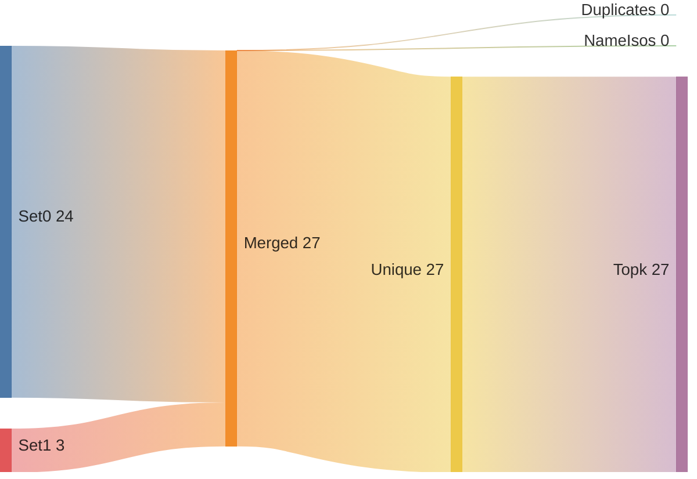
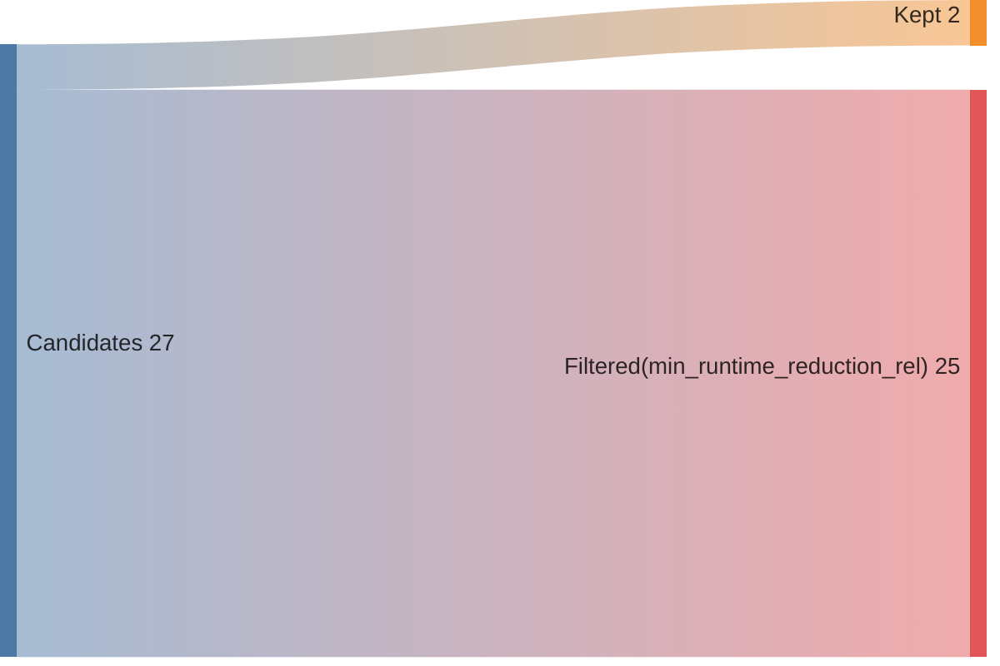
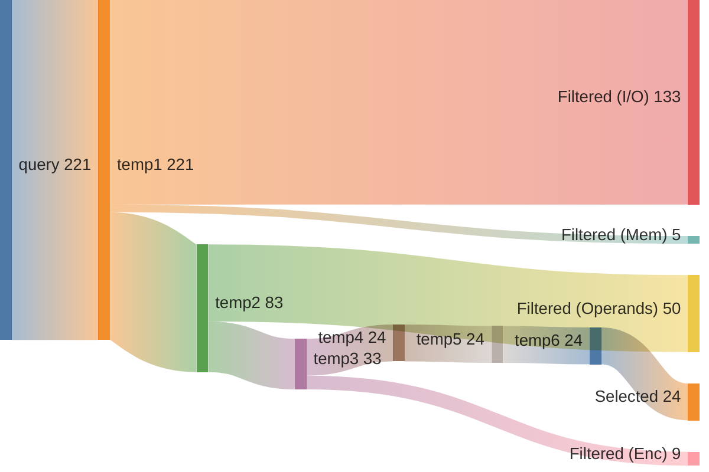
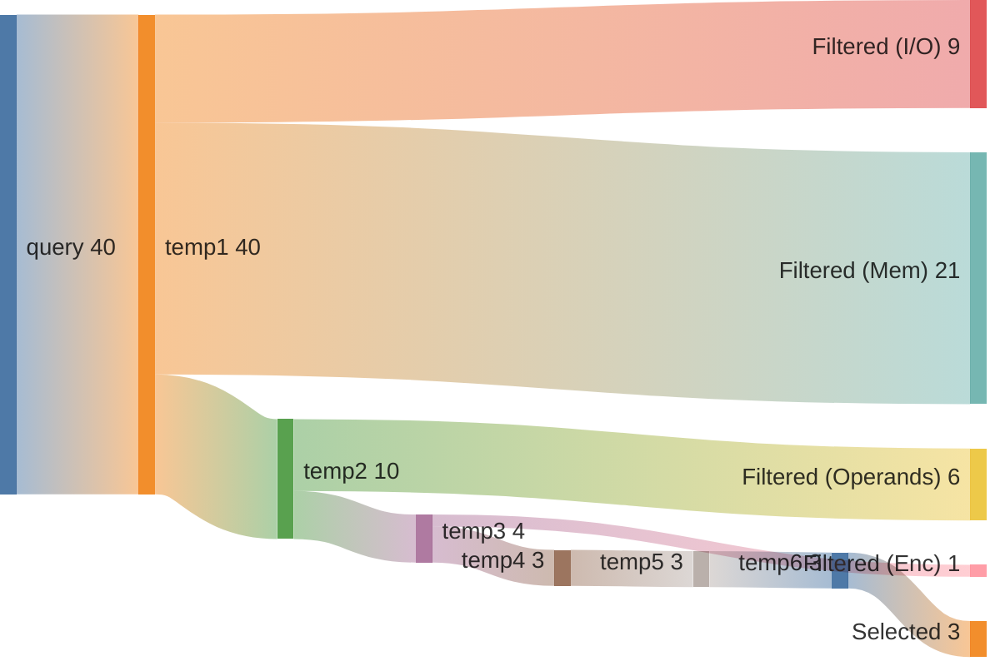

## Summary

Directory: `/var/tmp/ga87puy/isaac-demo/out/embench_iot/sglib-combined/20260520T144548`

### Experiment
```ini
[isaac-demo-embench_iot/sglib-combined-20260520T144548]
benchmark=embench_iot/sglib-combined
datetime=20260520T144548
directory=/var/tmp/ga87puy/isaac-demo/out/embench_iot/sglib-combined/20260520T144548
comment=""
```

### Environment/Config
<details>
<summary>Vars</summary>

```sh
ARCH=rv32im_zicsr_zifencei
ABI=ilp32
GLOBAL_ISEL=0
UNROLL=0
OPTIMIZE=3
TARGET=
CCACHE=1
LLVM_BUILD_TYPE=Release
LLVM_ENABLE_ASSERTIONS=ON
CDFG_STAGE=32
FORCE_PURGE_DB=1
ISAAC_LIMIT_RESULTS=
ISAAC_MIN_ISO_WEIGHT=0.05
ISAAC_SCALE_ISO_WEIGHT=auto
ISAAC_SORT_BY=IsoWeight
ISAAC_TOPK=
ISAAC_PARTITION_WITH_MAXMISO=auto
HLS_ENABLE=1
HLS_SKIP_BASELINE=0
HLS_SKIP_DEFAULT=0
HLS_SKIP_SHARED=0
HLS_NAILGUN_LIBRARY=
HLS_NAILGUN_RESOURCE_MODEL=ol_sky130
HLS_NAILGUN_CLOCK_NS=100
HLS_NAILGUN_SCHEDULE_TIMEOUT=60
HLS_NAILGUN_REFINE_TIMEOUT=60
HLS_NAILGUN_CORE_NAME=CV32E40P
HLS_NAILGUN_ILP_SOLVER=GUROBI
HLS_NAILGUN_SCHED_ALGO_MS=y
HLS_NAILGUN_SCHED_ALGO_PA=y
HLS_NAILGUN_SCHED_ALGO_RA=y
HLS_NAILGUN_SCHED_ALGO_MI=y
HLS_NAILGUN_OL2_ENABLE=y
HLS_NAILGUN_OL2_CONFIG_TEMPLATE=/var/tmp/ga87puy/isaac-demo/cfg/openlane/minimal_config_fast.json
HLS_NAILGUN_OL2_UNTIL_STEP=OpenROAD.Floorplan
HLS_NAILGUN_OL2_TARGET_FREQ=20
HLS_NAILGUN_OL2_TARGET_UTIL=20
HLS_NAILGUN_SHARE_RESOURCES=0
ASIP_SYN_ENABLE=1
ASIP_SYN_SKIP_BASELINE=0
ASIP_SYN_SKIP_DEFAULT=0
ASIP_SYN_SKIP_SHARED=0
ASIP_SYN_TOOL=synopsys
ASIP_SYN_SYNOPSYS_PDK=nangate45
ASIP_SYN_SYNOPSYS_CLOCK_NS=10
ASIP_SYN_SYNOPSYS_CORE_NAME=CV32E40P
FPGA_SYN_ENABLE=0
FPGA_SYN_SKIP_BASELINE=0
FPGA_SYN_SKIP_DEFAULT=0
FPGA_SYN_SKIP_SHARED=0
FPGA_SYN_TOOL=vivado
FPGA_SYN_VIVADO_PART=xc7a200tffv1156-1
FPGA_SYN_VIVADO_CLOCK_NS=50
FPGA_SYN_VIVADO_CORE_NAME=CV32E40P
ISAAC_QUERY_CONFIG_YAML=cfg/isaac/query/paper/cv32e40p.yml
```

</details>

### Times
<details>
<summary>Stages</summary>

| Stage                               |   Diff [s] |
|:------------------------------------|-----------:|
| bench_0                             |      4.618 |
| trace_0                             |      8.333 |
| isaac_0_load                        |      8.937 |
| isaac_0_analyze                     |      6.214 |
| isaac_0_visualize                   |      3.089 |
| isaac_0_pick                        |      2.915 |
| isaac_0_cdfg                        |    184.206 |
| isaac_0_query                       |     21.591 |
| isaac_0_generate                    |      6.569 |
| assign_0_enc                        |      0.946 |
| isaac_0_etiss                       |      2.363 |
| seal5_0_splitted                    |    311.316 |
| assign_0_seal5                      |      0.965 |
| etiss_0                             |     21.87  |
| compare_0                           |     10.927 |
| compare_0_per_instr                 |     18.002 |
| assign_0_compare_per_instr          |      0.925 |
| filter_0                            |      0.874 |
| spec_0_filtered                     |      0.384 |
| isaac_0_generate_filtered           |      4.834 |
| isaac_0_etiss_filtered              |      1.652 |
| fake_hls_0_filtered                 |      0.876 |
| assign_0_fake_hls_filtered          |      1.067 |
| select_0_filtered                   |     13.901 |
| isaac_0_etiss_filtered_selected     |      1.687 |
| fake_hls_0_filtered_selected        |      0.843 |
| assign_0_fake_hls_filtered_selected |      1.148 |
| compare_0_filtered_selected         |     11.768 |
| assign_0_compare_filtered_selected  |      0.022 |
| retrace_0_filtered_selected         |      8.002 |
| reanalyze_0_filtered_selected       |     53.297 |
| assign_0_util_filtered_selected     |      0.629 |
| etiss_perf_0_filtered_selected      |    673.015 |
| compare_perf_0_filtered_selected    |     17.496 |
| retrace_perf_0_filtered_selected    |      6.717 |

</details>

### ISE Potential
|   supported_rel_count |   unsupported_rel_count | has_potential   |
|----------------------:|------------------------:|:----------------|
|              0.395867 |                0.604133 | True            |

### Choices
<details>
<summary>Summary</summary>

<h2>Choice 0</h2>
<table>
<tr><th>func_name</th><th>bb_name</th><th>rel_weight</th><th>num_instrs</th><th>freq</th><th>start</th><th>end</th></tr>
<tr><td>malloc_beebs</td><td>%bb.1</td><td>0.068442</td><td>19</td><td>8700.0</td><td>0x100128c</td><td>0x10012d8</td></tr>
</table>
<pre><code class='asm'>
 100128c: 00050593     	mv	a1, a0
 1001290: 01800637     	lui	a2, 0x1800
 1001294: 6c462503     	lw	a0, 0x6c4(a2)
 1001298: 018006b7     	lui	a3, 0x1800
 100129c: 6cc6a703     	lw	a4, 0x6cc(a3)
 10012a0: 00b507b3     	add	a5, a0, a1
 10012a4: 00b705b3     	add	a1, a4, a1
 10012a8: 0037f713     	andi	a4, a5, 0x3
 10012ac: 00173813     	seqz	a6, a4
 10012b0: 00400893     	li	a7, 0x4
 10012b4: 40e88733     	sub	a4, a7, a4
 10012b8: fff80813     	addi	a6, a6, -0x1
 10012bc: 018008b7     	lui	a7, 0x1800
 10012c0: 6c88a883     	lw	a7, 0x6c8(a7)
 10012c4: 00e87733     	and	a4, a6, a4
 10012c8: 00e58833     	add	a6, a1, a4
 10012cc: 00e785b3     	add	a1, a5, a4
 10012d0: 6d06a623     	sw	a6, 0x6cc(a3)
 10012d4: 00b8f663     	bgeu	a7, a1, 0x10012e0 <malloc_beebs+0x58>
</code></pre>
<h2>Choice 1</h2>
<table>
<tr><th>func_name</th><th>bb_name</th><th>rel_weight</th><th>num_instrs</th><th>freq</th><th>start</th><th>end</th></tr>
<tr><td>benchmark_body</td><td>%bb.76</td><td>0.060657</td><td>13</td><td>11269.0</td><td>0x1000efc</td><td>0x1000f30</td></tr>
</table>
<pre><code class='asm'>
 1000efc: 00269713     	slli	a4, a3, 0x2
 1000f00: 00ed8733     	add	a4, s11, a4
 1000f04: 00072783     	lw	a5, 0x0(a4)
 1000f08: 00261613     	slli	a2, a2, 0x2
 1000f0c: 00cd8633     	add	a2, s11, a2
 1000f10: 00f62023     	sw	a5, 0x0(a2)
 1000f14: 00b72023     	sw	a1, 0x0(a4)
 1000f18: 00169713     	slli	a4, a3, 0x1
 1000f1c: 00170793     	addi	a5, a4, 0x1
 1000f20: 00270713     	addi	a4, a4, 0x2
 1000f24: 00068613     	mv	a2, a3
 1000f28: f8a7c2e3     	blt	a5, a0, 0x1000eac <benchmark_body+0x550>
 1000f2c: f45ff06f     	j	0x1000e70 <benchmark_body+0x514>
</code></pre>

</details>

### Queries
<details>
<summary>Metrics</summary>

|   num_rows |   num_nodes |   num_edges | func           | basic_block   |
|-----------:|------------:|------------:|:---------------|:--------------|
|      59340 |        4816 |        5160 | malloc_beebs   | %bb.1         |
|       1378 |         624 |         572 | benchmark_body | %bb.76        |

</details>

### Sankeys
<details>
<summary>Merge Query Results</summary>





</details>

<details>
<summary>Filtered Candidates</summary>





</details>

<details>
<summary>malloc_beebs_%bb.1_0</summary>



</details>

<details>
<summary>benchmark_body_%bb.76_0</summary>



</details>

### Compare DF
| Model          | Arch                         |   Run Instructions |   Run Instructions (rel.) |   Total ROM |   Total RAM |   ROM code |   ROM code (rel.) |
|:---------------|:-----------------------------|-------------------:|--------------------------:|------------:|------------:|-----------:|------------------:|
| sglib-combined | rv32im_zicsr_zifencei        |            2415224 |                  1        |        8144 |        9908 |       7268 |          1        |
| sglib-combined | rv32im_zicsr_zifencei_xisaac |            2286985 |                  0.946904 |        7980 |        9908 |       7104 |          0.977435 |

### CoreDSL
<details>
<summary>gen/XIsaac.core_desc</summary>

```c
import "/var/tmp/ga87puy/isaac-demo/etiss_arch_riscv/rv_base/RVI.core_desc"

InstructionSet XIsaac extends RV32I {
    instructions {
        CUSTOM0 {
            encoding: 7'b0000000 :: rs2[4:0] :: rs1[4:0] :: 3'b000 :: rd[4:0] :: 7'b1111011;
            assembly: {"custom0", "{name(rd)}, {name(rs1)}, {name(rs2)}"};
            behavior: {
                unsigned<32> rs1_val = X[rs1];
                unsigned<32> rs2_val = X[rs2];
                unsigned<32> temp0 = (unsigned<32>)((((unsigned<32>)(rs1_val) & (unsigned<32>)((3)))));
                unsigned<32> outp0 = (unsigned<32>)((((unsigned<32>)((unsigned<32>)((((signed<32>)((unsigned<32>)(((temp0 < (1) ? 1 : 0)))) + (signed<32>)((-1)))))) & (unsigned<32>)((unsigned<32>)((((signed<32>)((unsigned<32>)((((signed<32>)(rs2_val) + (signed<32>)((4)))))) - (signed<32>)(temp0))))))));
                X[rd] = outp0;
            }
        }
        CUSTOM1 {
            encoding: 2'b00 :: uimm3[4:0] :: rs2[4:0] :: rs1[4:0] :: 3'b001 :: rd[4:0] :: 7'b1111011;
            assembly: {"custom1", "{name(rd)}, {name(rs1)}, {name(rs2)}, {uimm3}"};
            behavior: {
                unsigned<32> rs1_val = X[rs1];
                unsigned<32> rs2_val = X[rs2];
                unsigned<32> temp0 = (unsigned<32>)((((unsigned<32>)(rs1_val) & (unsigned<32>)((unsigned<3>)((uimm3))))));
                unsigned<32> outp0 = (unsigned<32>)((((unsigned<32>)((unsigned<32>)((((signed<32>)((unsigned<32>)(((temp0 < (1) ? 1 : 0)))) + (signed<32>)((-1)))))) & (unsigned<32>)((unsigned<32>)((((signed<32>)((unsigned<32>)((((signed<32>)(rs2_val) + (signed<32>)((4)))))) - (signed<32>)(temp0))))))));
                X[rd] = outp0;
            }
        }
        CUSTOM2 {
            encoding: 2'b01 :: uimm5[4:0] :: rs2[4:0] :: rs1[4:0] :: 3'b001 :: rd[4:0] :: 7'b1111011;
            assembly: {"custom2", "{name(rd)}, {name(rs1)}, {name(rs2)}, {uimm5}"};
            behavior: {
                unsigned<32> rs1_val = X[rs1];
                unsigned<32> rs2_val = X[rs2];
                unsigned<32> temp0 = (unsigned<32>)((((unsigned<32>)(rs1_val) & (unsigned<32>)((unsigned<5>)((uimm5))))));
                unsigned<32> outp0 = (unsigned<32>)((((unsigned<32>)((unsigned<32>)((((signed<32>)((unsigned<32>)(((temp0 < (1) ? 1 : 0)))) + (signed<32>)((-1)))))) & (unsigned<32>)((unsigned<32>)((((signed<32>)((unsigned<32>)((((signed<32>)(rs2_val) + (signed<32>)((4)))))) - (signed<32>)(temp0))))))));
                X[rd] = outp0;
            }
        }
        CUSTOM3 {
            encoding: 7'b0000001 :: rs2[4:0] :: rs1[4:0] :: 3'b000 :: rd[4:0] :: 7'b1111011;
            assembly: {"custom3", "{name(rd)}, {name(rs1)}, {name(rs2)}"};
            behavior: {
                unsigned<32> rs1_val = X[rs1];
                unsigned<32> rs2_val = X[rs2];
                unsigned<32> outp0 = (unsigned<32>)((((signed<32>)(rs1_val) + (signed<32>)((unsigned<32>)((((unsigned<32>)(rs2_val) << (unsigned<32>)((2)))))))));
                X[rd] = outp0;
            }
        }
        CUSTOM4 {
            encoding: 2'b10 :: uimm2[4:0] :: rs2[4:0] :: rs1[4:0] :: 3'b001 :: rd[4:0] :: 7'b1111011;
            assembly: {"custom4", "{name(rd)}, {name(rs1)}, {name(rs2)}, {uimm2}"};
            behavior: {
                unsigned<32> rs1_val = X[rs1];
                unsigned<32> rs2_val = X[rs2];
                unsigned<32> outp0 = (unsigned<32>)((((signed<32>)(rs1_val) + (signed<32>)((unsigned<32>)((((unsigned<32>)(rs2_val) << (unsigned<32>)((unsigned<2>)((uimm2))))))))));
                X[rd] = outp0;
            }
        }
        CUSTOM5 {
            encoding: 2'b11 :: uimm5[4:0] :: rs2[4:0] :: rs1[4:0] :: 3'b001 :: rd[4:0] :: 7'b1111011;
            assembly: {"custom5", "{name(rd)}, {name(rs1)}, {name(rs2)}, {uimm5}"};
            behavior: {
                unsigned<32> rs1_val = X[rs1];
                unsigned<32> rs2_val = X[rs2];
                unsigned<32> outp0 = (unsigned<32>)((((signed<32>)(rs1_val) + (signed<32>)((unsigned<32>)((((unsigned<32>)(rs2_val) << (unsigned<32>)((unsigned<5>)((uimm5))))))))));
                X[rd] = outp0;
            }
        }
        CUSTOM6 {
            encoding: 7'b0000010 :: rs2[4:0] :: rs1[4:0] :: 3'b000 :: rd[4:0] :: 7'b1111011;
            assembly: {"custom6", "{name(rd)}, {name(rs1)}, {name(rs2)}"};
            behavior: {
                unsigned<32> rs1_val = X[rs1];
                unsigned<32> rs2_val = X[rs2];
                unsigned<32> outp0 = (unsigned<32>)((((unsigned<32>)((unsigned<32>)((((signed<32>)((unsigned<32>)(((rs1_val < (1) ? 1 : 0)))) + (signed<32>)((-1)))))) & (unsigned<32>)((unsigned<32>)((((signed<32>)((unsigned<32>)((((signed<32>)(rs2_val) + (signed<32>)((4)))))) - (signed<32>)(rs1_val))))))));
                X[rd] = outp0;
            }
        }
        CUSTOM7 {
            encoding: 7'b0000011 :: rs2[4:0] :: rs1[4:0] :: 3'b000 :: rd[4:0] :: 7'b1111011;
            assembly: {"custom7", "{name(rd)}, {name(rs1)}, {name(rs2)}"};
            behavior: {
                unsigned<32> rs1_val = X[rs1];
                unsigned<32> rs2_val = X[rs2];
                unsigned<32> temp0 = (unsigned<32>)((((unsigned<32>)(rs1_val) & (unsigned<32>)((3)))));
                unsigned<32> outp0 = (unsigned<32>)((((unsigned<32>)((unsigned<32>)((((signed<32>)((unsigned<32>)(((temp0 < (1) ? 1 : 0)))) + (signed<32>)((-1)))))) & (unsigned<32>)((unsigned<32>)((((signed<32>)(rs2_val) - (signed<32>)(temp0))))))));
                X[rd] = outp0;
            }
        }
        CUSTOM8 {
            encoding: 2'b00 :: uimm3[4:0] :: rs2[4:0] :: rs1[4:0] :: 3'b010 :: rd[4:0] :: 7'b1111011;
            assembly: {"custom8", "{name(rd)}, {name(rs1)}, {name(rs2)}, {uimm3}"};
            behavior: {
                unsigned<32> rs1_val = X[rs1];
                unsigned<32> rs2_val = X[rs2];
                unsigned<32> outp0 = (unsigned<32>)((((unsigned<32>)((unsigned<32>)((((signed<32>)((unsigned<32>)(((rs1_val < (1) ? 1 : 0)))) + (signed<32>)((-1)))))) & (unsigned<32>)((unsigned<32>)((((signed<32>)((unsigned<32>)((((signed<32>)(rs2_val) + (signed<32>)((unsigned<3>)((uimm3))))))) - (signed<32>)(rs1_val))))))));
                X[rd] = outp0;
            }
        }
        CUSTOM9 {
            encoding: 2'b01 :: uimm5[4:0] :: rs2[4:0] :: rs1[4:0] :: 3'b010 :: rd[4:0] :: 7'b1111011;
            assembly: {"custom9", "{name(rd)}, {name(rs1)}, {name(rs2)}, {uimm5}"};
            behavior: {
                unsigned<32> rs1_val = X[rs1];
                unsigned<32> rs2_val = X[rs2];
                unsigned<32> outp0 = (unsigned<32>)((((unsigned<32>)((unsigned<32>)((((signed<32>)((unsigned<32>)(((rs1_val < (1) ? 1 : 0)))) + (signed<32>)((-1)))))) & (unsigned<32>)((unsigned<32>)((((signed<32>)((unsigned<32>)((((signed<32>)(rs2_val) + (signed<32>)((unsigned<5>)((uimm5))))))) - (signed<32>)(rs1_val))))))));
                X[rd] = outp0;
            }
        }
        CUSTOM10 {
            encoding: 2'b10 :: uimm3[4:0] :: rs2[4:0] :: rs1[4:0] :: 3'b010 :: rd[4:0] :: 7'b1111011;
            assembly: {"custom10", "{name(rd)}, {name(rs1)}, {name(rs2)}, {uimm3}"};
            behavior: {
                unsigned<32> rs1_val = X[rs1];
                unsigned<32> rs2_val = X[rs2];
                unsigned<32> temp0 = (unsigned<32>)((((unsigned<32>)(rs1_val) & (unsigned<32>)((unsigned<3>)((uimm3))))));
                unsigned<32> outp0 = (unsigned<32>)((((unsigned<32>)((unsigned<32>)((((signed<32>)((unsigned<32>)(((temp0 < (1) ? 1 : 0)))) + (signed<32>)((-1)))))) & (unsigned<32>)((unsigned<32>)((((signed<32>)(rs2_val) - (signed<32>)(temp0))))))));
                X[rd] = outp0;
            }
        }
        CUSTOM11 {
            encoding: 2'b11 :: uimm5[4:0] :: rs2[4:0] :: rs1[4:0] :: 3'b010 :: rd[4:0] :: 7'b1111011;
            assembly: {"custom11", "{name(rd)}, {name(rs1)}, {name(rs2)}, {uimm5}"};
            behavior: {
                unsigned<32> rs1_val = X[rs1];
                unsigned<32> rs2_val = X[rs2];
                unsigned<32> temp0 = (unsigned<32>)((((unsigned<32>)(rs1_val) & (unsigned<32>)((unsigned<5>)((uimm5))))));
                unsigned<32> outp0 = (unsigned<32>)((((unsigned<32>)((unsigned<32>)((((signed<32>)((unsigned<32>)(((temp0 < (1) ? 1 : 0)))) + (signed<32>)((-1)))))) & (unsigned<32>)((unsigned<32>)((((signed<32>)(rs2_val) - (signed<32>)(temp0))))))));
                X[rd] = outp0;
            }
        }
        CUSTOM12 {
            encoding: 7'b0000100 :: rs2[4:0] :: rs1[4:0] :: 3'b000 :: rd[4:0] :: 7'b1111011;
            assembly: {"custom12", "{name(rd)}, {name(rs1)}, {name(rs2)}"};
            behavior: {
                unsigned<32> rs1_val = X[rs1];
                unsigned<32> rs2_val = X[rs2];
                unsigned<32> outp0 = (unsigned<32>)((((unsigned<32>)((unsigned<32>)((((signed<32>)((unsigned<32>)(((rs1_val < (1) ? 1 : 0)))) + (signed<32>)((-1)))))) & (unsigned<32>)((unsigned<32>)((((signed<32>)(rs2_val) - (signed<32>)(rs1_val))))))));
                X[rd] = outp0;
            }
        }
        CUSTOM13 {
            encoding: 2'b00 :: simm1[4:0] :: rs2[4:0] :: rs1[4:0] :: 3'b011 :: rd[4:0] :: 7'b1111011;
            assembly: {"custom13", "{name(rd)}, {name(rs1)}, {name(rs2)}, {simm1}"};
            behavior: {
                unsigned<32> rs1_val = X[rs1];
                unsigned<32> rs2_val = X[rs2];
                unsigned<32> outp0 = (unsigned<32>)((((unsigned<32>)((unsigned<32>)((((signed<32>)((unsigned<32>)(((rs1_val < (1) ? 1 : 0)))) + (signed<32>)((unsigned<1>)((simm1))))))) & (unsigned<32>)((unsigned<32>)((((signed<32>)(rs2_val) - (signed<32>)(rs1_val))))))));
                X[rd] = outp0;
            }
        }
        CUSTOM14 {
            encoding: 2'b01 :: simm5[4:0] :: rs2[4:0] :: rs1[4:0] :: 3'b011 :: rd[4:0] :: 7'b1111011;
            assembly: {"custom14", "{name(rd)}, {name(rs1)}, {name(rs2)}, {simm5}"};
            behavior: {
                unsigned<32> rs1_val = X[rs1];
                unsigned<32> rs2_val = X[rs2];
                unsigned<32> outp0 = (unsigned<32>)((((unsigned<32>)((unsigned<32>)((((signed<32>)((unsigned<32>)(((rs1_val < (1) ? 1 : 0)))) + (signed<32>)((unsigned<5>)((simm5))))))) & (unsigned<32>)((unsigned<32>)((((signed<32>)(rs2_val) - (signed<32>)(rs1_val))))))));
                X[rd] = outp0;
            }
        }
        CUSTOM15 {
            encoding: 7'b0000101 :: rs2[4:0] :: rs1[4:0] :: 3'b000 :: rd[4:0] :: 7'b1111011;
            assembly: {"custom15", "{name(rd)}, {name(rs1)}, {name(rs2)}"};
            behavior: {
                unsigned<32> rs1_val = X[rs1];
                unsigned<32> rs2_val = X[rs2];
                unsigned<32> outp0 = (unsigned<32>)((((unsigned<32>)((unsigned<32>)((((signed<32>)((unsigned<32>)(((rs2_val < (1) ? 1 : 0)))) + (signed<32>)((-1)))))) & (unsigned<32>)(rs1_val))));
                X[rd] = outp0;
            }
        }
        CUSTOM16 {
            encoding: 2'b10 :: simm1[4:0] :: rs2[4:0] :: rs1[4:0] :: 3'b011 :: rd[4:0] :: 7'b1111011;
            assembly: {"custom16", "{name(rd)}, {name(rs1)}, {name(rs2)}, {simm1}"};
            behavior: {
                unsigned<32> rs2_val = X[rs2];
                unsigned<32> rs1_val = X[rs1];
                unsigned<32> outp0 = (unsigned<32>)((((unsigned<32>)((unsigned<32>)((((signed<32>)((unsigned<32>)(((rs2_val < (1) ? 1 : 0)))) + (signed<32>)((unsigned<1>)((simm1))))))) & (unsigned<32>)(rs1_val))));
                X[rd] = outp0;
            }
        }
        CUSTOM17 {
            encoding: 2'b11 :: simm5[4:0] :: rs2[4:0] :: rs1[4:0] :: 3'b011 :: rd[4:0] :: 7'b1111011;
            assembly: {"custom17", "{name(rd)}, {name(rs1)}, {name(rs2)}, {simm5}"};
            behavior: {
                unsigned<32> rs2_val = X[rs2];
                unsigned<32> rs1_val = X[rs1];
                unsigned<32> outp0 = (unsigned<32>)((((unsigned<32>)((unsigned<32>)((((signed<32>)((unsigned<32>)(((rs2_val < (1) ? 1 : 0)))) + (signed<32>)((unsigned<5>)((simm5))))))) & (unsigned<32>)(rs1_val))));
                X[rd] = outp0;
            }
        }
        CUSTOM18 {
            encoding: 7'b0000110 :: 5'b00000 :: rs1[4:0] :: 3'b000 :: rd[4:0] :: 7'b1111011;
            assembly: {"custom18", "{name(rd)}, {name(rs1)}"};
            behavior: {
                unsigned<32> rs1_val = X[rs1];
                unsigned<32> outp0 = (unsigned<32>)((((signed<32>)((unsigned<32>)(((rs1_val < (1) ? 1 : 0)))) + (signed<32>)((-1)))));
                X[rd] = outp0;
            }
        }
        CUSTOM19 {
            encoding: 7'b0000111 :: rs2[4:0] :: rs1[4:0] :: 3'b000 :: rd[4:0] :: 7'b1111011;
            assembly: {"custom19", "{name(rd)}, {name(rs1)}, {name(rs2)}"};
            behavior: {
                unsigned<32> rs1_val = X[rs1];
                unsigned<32> rs2_val = X[rs2];
                unsigned<32> outp0 = (unsigned<32>)((((signed<32>)((unsigned<32>)((((signed<32>)(rs2_val) + (signed<32>)((4)))))) - (signed<32>)(rs1_val))));
                X[rd] = outp0;
            }
        }
        CUSTOM20 {
            encoding: 7'b0001000 :: rs2[4:0] :: rs1[4:0] :: 3'b000 :: rd[4:0] :: 7'b1111011;
            assembly: {"custom20", "{name(rd)}, {name(rs1)}, {name(rs2)}"};
            behavior: {
                unsigned<32> rs1_val = X[rs1];
                unsigned<32> rs2_val = X[rs2];
                unsigned<32> outp0 = (unsigned<32>)((((unsigned<32>)((unsigned<32>)((((signed<32>)(rs2_val) + (signed<32>)((-1)))))) & (unsigned<32>)(rs1_val))));
                X[rd] = outp0;
            }
        }
        CUSTOM21 {
            encoding: 7'b0001001 :: simm1[4:0] :: rs1[4:0] :: 3'b000 :: rd[4:0] :: 7'b1111011;
            assembly: {"custom21", "{name(rd)}, {name(rs1)}, {simm1}"};
            behavior: {
                unsigned<32> rs1_val = X[rs1];
                unsigned<32> outp0 = (unsigned<32>)((((signed<32>)((unsigned<32>)(((rs1_val < (1) ? 1 : 0)))) + (signed<32>)((unsigned<1>)((simm1))))));
                X[rd] = outp0;
            }
        }
        CUSTOM22 {
            encoding: 7'b0001010 :: simm5[4:0] :: rs1[4:0] :: 3'b000 :: rd[4:0] :: 7'b1111011;
            assembly: {"custom22", "{name(rd)}, {name(rs1)}, {simm5}"};
            behavior: {
                unsigned<32> rs1_val = X[rs1];
                unsigned<32> outp0 = (unsigned<32>)((((signed<32>)((unsigned<32>)(((rs1_val < (1) ? 1 : 0)))) + (signed<32>)((unsigned<5>)((simm5))))));
                X[rd] = outp0;
            }
        }
        CUSTOM23 {
            encoding: 2'b00 :: uimm3[4:0] :: rs2[4:0] :: rs1[4:0] :: 3'b100 :: rd[4:0] :: 7'b1111011;
            assembly: {"custom23", "{name(rd)}, {name(rs1)}, {name(rs2)}, {uimm3}"};
            behavior: {
                unsigned<32> rs1_val = X[rs1];
                unsigned<32> rs2_val = X[rs2];
                unsigned<32> outp0 = (unsigned<32>)((((signed<32>)((unsigned<32>)((((signed<32>)(rs2_val) + (signed<32>)((unsigned<3>)((uimm3))))))) - (signed<32>)(rs1_val))));
                X[rd] = outp0;
            }
        }
        CUSTOM24 {
            encoding: 2'b01 :: uimm5[4:0] :: rs2[4:0] :: rs1[4:0] :: 3'b100 :: rd[4:0] :: 7'b1111011;
            assembly: {"custom24", "{name(rd)}, {name(rs1)}, {name(rs2)}, {uimm5}"};
            behavior: {
                unsigned<32> rs1_val = X[rs1];
                unsigned<32> rs2_val = X[rs2];
                unsigned<32> outp0 = (unsigned<32>)((((signed<32>)((unsigned<32>)((((signed<32>)(rs2_val) + (signed<32>)((unsigned<5>)((uimm5))))))) - (signed<32>)(rs1_val))));
                X[rd] = outp0;
            }
        }
        CUSTOM25 {
            encoding: 2'b10 :: simm1[4:0] :: rs2[4:0] :: rs1[4:0] :: 3'b100 :: rd[4:0] :: 7'b1111011;
            assembly: {"custom25", "{name(rd)}, {name(rs1)}, {name(rs2)}, {simm1}"};
            behavior: {
                unsigned<32> rs1_val = X[rs1];
                unsigned<32> rs2_val = X[rs2];
                unsigned<32> outp0 = (unsigned<32>)((((unsigned<32>)((unsigned<32>)((((signed<32>)(rs2_val) + (signed<32>)((unsigned<1>)((simm1))))))) & (unsigned<32>)(rs1_val))));
                X[rd] = outp0;
            }
        }
        CUSTOM26 {
            encoding: 2'b11 :: simm5[4:0] :: rs2[4:0] :: rs1[4:0] :: 3'b100 :: rd[4:0] :: 7'b1111011;
            assembly: {"custom26", "{name(rd)}, {name(rs1)}, {name(rs2)}, {simm5}"};
            behavior: {
                unsigned<32> rs1_val = X[rs1];
                unsigned<32> rs2_val = X[rs2];
                unsigned<32> outp0 = (unsigned<32>)((((unsigned<32>)((unsigned<32>)((((signed<32>)(rs2_val) + (signed<32>)((unsigned<5>)((simm5))))))) & (unsigned<32>)(rs1_val))));
                X[rd] = outp0;
            }
        }
    }
}


```

</details>

<details>
<summary>gen_filtered/XIsaac.core_desc</summary>

```c
import "/var/tmp/ga87puy/isaac-demo/etiss_arch_riscv/rv_base/RVI.core_desc"

InstructionSet XIsaac extends RV32I {
    instructions {
        CUSTOM3 {
            encoding: 7'b0000001 :: rs2[4:0] :: rs1[4:0] :: 3'b000 :: rd[4:0] :: 7'b1111011;
            assembly: {"custom3", "{name(rd)}, {name(rs1)}, {name(rs2)}"};
            behavior: {
                unsigned<32> rs1_val = X[rs1];
                unsigned<32> rs2_val = X[rs2];
                unsigned<32> outp0 = (unsigned<32>)(((((signed<32>)((rs1_val)) + (signed<32>)(((unsigned<32>)(((((unsigned<32>)((rs2_val)) << (unsigned<32>)(((2)))))))))))));
                X[rd] = outp0;
            }
        }
        CUSTOM5 {
            encoding: 2'b11 :: uimm5[4:0] :: rs2[4:0] :: rs1[4:0] :: 3'b001 :: rd[4:0] :: 7'b1111011;
            assembly: {"custom5", "{name(rd)}, {name(rs1)}, {name(rs2)}, {uimm5}"};
            behavior: {
                unsigned<32> rs1_val = X[rs1];
                unsigned<32> rs2_val = X[rs2];
                unsigned<32> outp0 = (unsigned<32>)(((((signed<32>)((rs1_val)) + (signed<32>)(((unsigned<32>)(((((unsigned<32>)((rs2_val)) << (unsigned<32>)(((unsigned<5>)(((uimm5)))))))))))))));
                X[rd] = outp0;
            }
        }
    }
}


```

</details>


