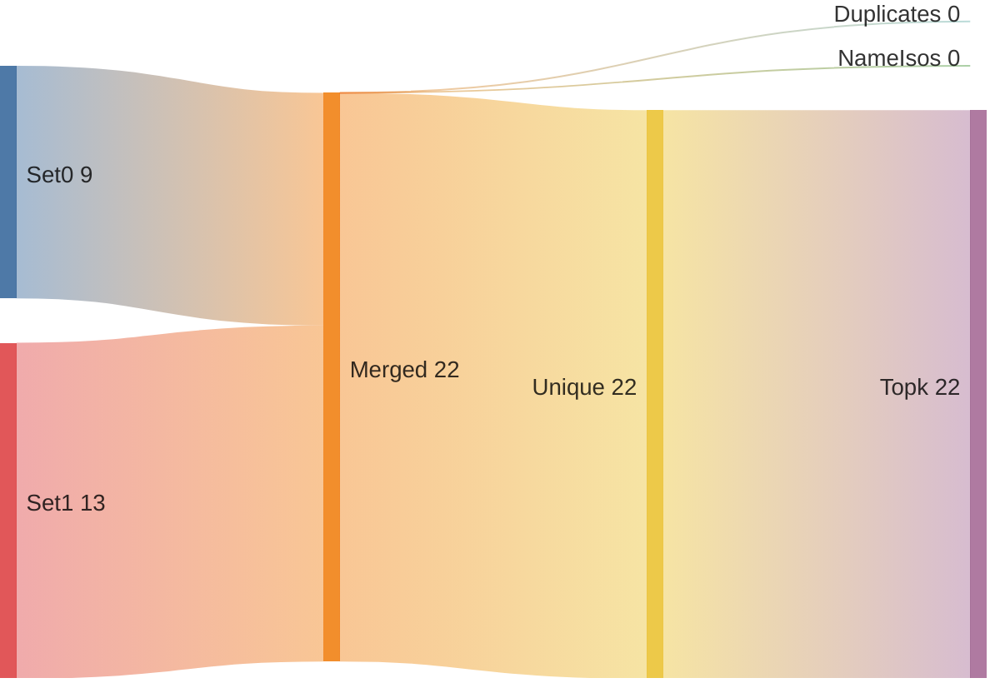
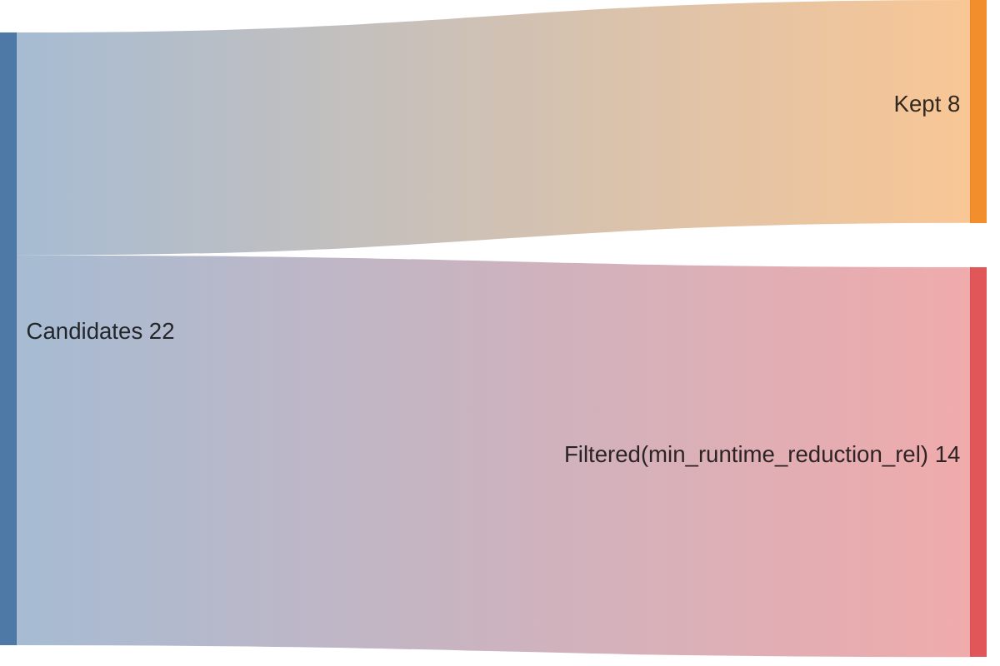
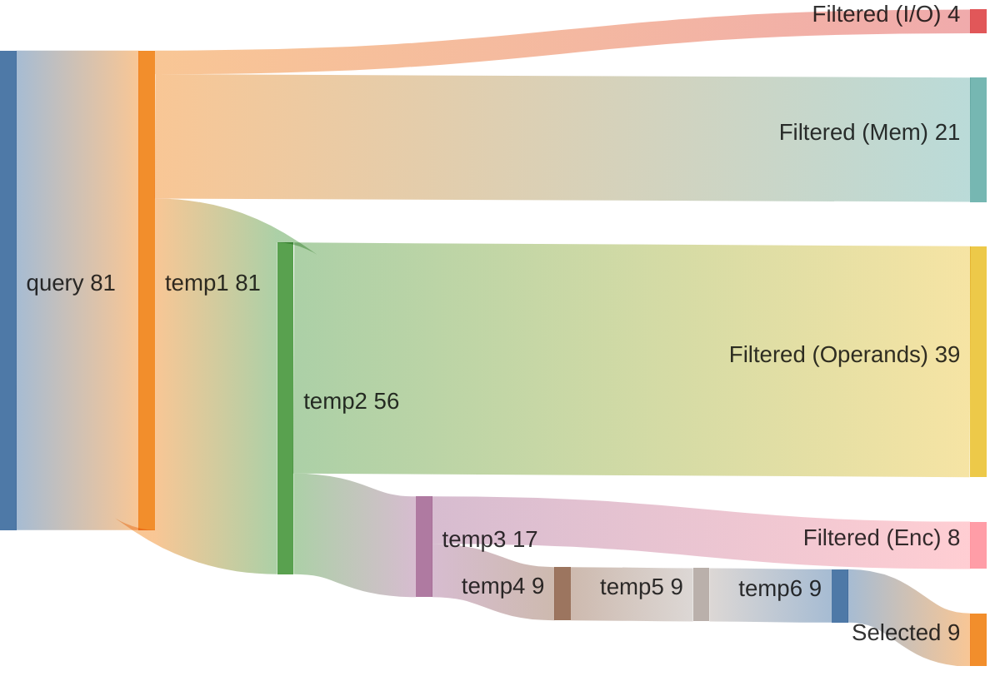
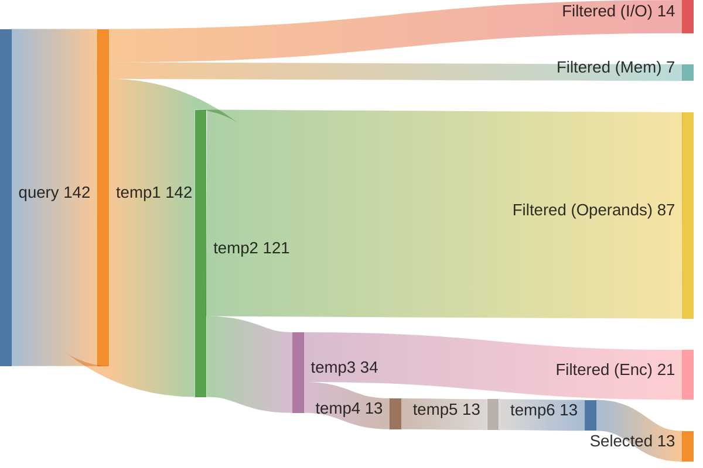

## Summary

Directory: `/var/tmp/ga87puy/isaac-demo/out/embench_iot/tarfind/20260520T223626`

### Experiment
```ini
[isaac-demo-embench_iot/tarfind-20260520T223626]
benchmark=embench_iot/tarfind
datetime=20260520T223626
directory=/var/tmp/ga87puy/isaac-demo/out/embench_iot/tarfind/20260520T223626
comment=""
```

### Environment/Config
<details>
<summary>Vars</summary>

```sh
ARCH=rv32im_zicsr_zifencei
ABI=ilp32
GLOBAL_ISEL=0
UNROLL=0
OPTIMIZE=3
TARGET=
CCACHE=1
LLVM_BUILD_TYPE=Release
LLVM_ENABLE_ASSERTIONS=ON
CDFG_STAGE=32
FORCE_PURGE_DB=1
ISAAC_LIMIT_RESULTS=
ISAAC_MIN_ISO_WEIGHT=0.05
ISAAC_SCALE_ISO_WEIGHT=auto
ISAAC_SORT_BY=IsoWeight
ISAAC_TOPK=
ISAAC_PARTITION_WITH_MAXMISO=auto
HLS_ENABLE=1
HLS_SKIP_BASELINE=0
HLS_SKIP_DEFAULT=0
HLS_SKIP_SHARED=0
HLS_NAILGUN_LIBRARY=
HLS_NAILGUN_RESOURCE_MODEL=ol_sky130
HLS_NAILGUN_CLOCK_NS=100
HLS_NAILGUN_SCHEDULE_TIMEOUT=60
HLS_NAILGUN_REFINE_TIMEOUT=60
HLS_NAILGUN_CORE_NAME=CV32E40P
HLS_NAILGUN_ILP_SOLVER=GUROBI
HLS_NAILGUN_SCHED_ALGO_MS=y
HLS_NAILGUN_SCHED_ALGO_PA=y
HLS_NAILGUN_SCHED_ALGO_RA=y
HLS_NAILGUN_SCHED_ALGO_MI=y
HLS_NAILGUN_OL2_ENABLE=y
HLS_NAILGUN_OL2_CONFIG_TEMPLATE=/var/tmp/ga87puy/isaac-demo/cfg/openlane/minimal_config_fast.json
HLS_NAILGUN_OL2_UNTIL_STEP=OpenROAD.Floorplan
HLS_NAILGUN_OL2_TARGET_FREQ=20
HLS_NAILGUN_OL2_TARGET_UTIL=20
HLS_NAILGUN_SHARE_RESOURCES=0
ASIP_SYN_ENABLE=1
ASIP_SYN_SKIP_BASELINE=0
ASIP_SYN_SKIP_DEFAULT=0
ASIP_SYN_SKIP_SHARED=0
ASIP_SYN_TOOL=synopsys
ASIP_SYN_SYNOPSYS_PDK=nangate45
ASIP_SYN_SYNOPSYS_CLOCK_NS=10
ASIP_SYN_SYNOPSYS_CORE_NAME=CV32E40P
FPGA_SYN_ENABLE=0
FPGA_SYN_SKIP_BASELINE=0
FPGA_SYN_SKIP_DEFAULT=0
FPGA_SYN_SKIP_SHARED=0
FPGA_SYN_TOOL=vivado
FPGA_SYN_VIVADO_PART=xc7a200tffv1156-1
FPGA_SYN_VIVADO_CLOCK_NS=50
FPGA_SYN_VIVADO_CORE_NAME=CV32E40P
ISAAC_QUERY_CONFIG_YAML=cfg/isaac/query/paper/cv32e40p.yml
```

</details>

### Times
<details>
<summary>Stages</summary>

| Stage                               |   Diff [s] |
|:------------------------------------|-----------:|
| bench_0                             |      3.991 |
| trace_0                             |      6.393 |
| isaac_0_load                        |      5.037 |
| isaac_0_analyze                     |      3.726 |
| isaac_0_visualize                   |      3.615 |
| isaac_0_pick                        |      3.315 |
| isaac_0_cdfg                        |     16.665 |
| isaac_0_query                       |     17.63  |
| isaac_0_generate                    |      5.923 |
| assign_0_enc                        |      0.872 |
| isaac_0_etiss                       |      1.69  |
| seal5_0_splitted                    |    339.256 |
| assign_0_seal5                      |      0.792 |
| etiss_0                             |     21.06  |
| compare_0                           |      8.85  |
| compare_0_per_instr                 |     15.118 |
| assign_0_compare_per_instr          |      0.692 |
| filter_0                            |      0.776 |
| spec_0_filtered                     |      0.396 |
| isaac_0_generate_filtered           |      4.843 |
| isaac_0_etiss_filtered              |      1.456 |
| fake_hls_0_filtered                 |      0.728 |
| assign_0_fake_hls_filtered          |      1.135 |
| select_0_filtered                   |     37.379 |
| isaac_0_etiss_filtered_selected     |      1.827 |
| fake_hls_0_filtered_selected        |      0.806 |
| assign_0_fake_hls_filtered_selected |      0.965 |
| compare_0_filtered_selected         |      9.236 |
| assign_0_compare_filtered_selected  |      0.02  |
| retrace_0_filtered_selected         |      6.227 |
| reanalyze_0_filtered_selected       |     45.471 |
| assign_0_util_filtered_selected     |      0.6   |
| etiss_perf_0_filtered_selected      |    305.456 |
| compare_perf_0_filtered_selected    |     49.97  |
| retrace_perf_0_filtered_selected    |      5.653 |

</details>

### ISE Potential
|   supported_rel_count |   unsupported_rel_count | has_potential   |
|----------------------:|------------------------:|:----------------|
|              0.549937 |                0.450063 | True            |

### Choices
<details>
<summary>Summary</summary>

<h2>Choice 0</h2>
<table>
<tr><th>func_name</th><th>bb_name</th><th>rel_weight</th><th>num_instrs</th><th>freq</th><th>start</th><th>end</th></tr>
<tr><td>rand_beebs</td><td>%bb.0</td><td>0.387712</td><td>13</td><td>36190.0</td><td>0x1000560</td><td>0x1000594</td></tr>
</table>
<pre><code class='asm'>
 1000560: 018005b7     	lui	a1, 0x1800
 1000564: 6bc5a503     	lw	a0, 0x6bc(a1)
 1000568: 41c65637     	lui	a2, 0x41c65
 100056c: e6d60613     	addi	a2, a2, -0x193
 1000570: 02c50533     	mul	a0, a0, a2
 1000574: 00003637     	lui	a2, 0x3
 1000578: 03960613     	addi	a2, a2, 0x39
 100057c: 00c50533     	add	a0, a0, a2
 1000580: 00151513     	slli	a0, a0, 0x1
 1000584: 00155613     	srli	a2, a0, 0x1
 1000588: 01065513     	srli	a0, a2, 0x10
 100058c: 6ac5ae23     	sw	a2, 0x6bc(a1)
 1000590: 00008067     	ret
</code></pre>
<h2>Choice 1</h2>
<table>
<tr><th>func_name</th><th>bb_name</th><th>rel_weight</th><th>num_instrs</th><th>freq</th><th>start</th><th>end</th></tr>
<tr><td>benchmark_body</td><td>%bb.5</td><td>0.328064</td><td>11</td><td>36190.0</td><td>0x1000438</td><td>0x1000464</td></tr>
</table>
<pre><code class='asm'>
 1000438: 128000ef     	jal	0x1000560 <rand_beebs>
 100043c: 039515b3     	mulh	a1, a0, s9
 1000440: 01f5d613     	srli	a2, a1, 0x1f
 1000444: 0035d593     	srli	a1, a1, 0x3
 1000448: 00c585b3     	add	a1, a1, a2
 100044c: 03a585b3     	mul	a1, a1, s10
 1000450: 40b50533     	sub	a0, a0, a1
 1000454: 04150513     	addi	a0, a0, 0x41
 1000458: 00a98023     	sb	a0, 0x0(s3)
 100045c: 00198993     	addi	s3, s3, 0x1
 1000460: fc999ce3     	bne	s3, s1, 0x1000438 <benchmark_body+0xf4>
</code></pre>

</details>

### Queries
<details>
<summary>Metrics</summary>

|   num_rows |   num_nodes |   num_edges | func           | basic_block   |
|-----------:|------------:|------------:|:---------------|:--------------|
|       5565 |         945 |         840 | rand_beebs     | %bb.0         |
|      29161 |        2892 |        2651 | benchmark_body | %bb.5         |

</details>

### Sankeys
<details>
<summary>Merge Query Results</summary>





</details>

<details>
<summary>Filtered Candidates</summary>





</details>

<details>
<summary>rand_beebs_%bb.0_0</summary>



</details>

<details>
<summary>benchmark_body_%bb.5_0</summary>



</details>

### Compare DF
| Model   | Arch                         |   Run Instructions |   Run Instructions (rel.) |   Total ROM |   Total RAM |   ROM code |   ROM code (rel.) |
|:--------|:-----------------------------|-------------------:|--------------------------:|------------:|------------:|-----------:|------------------:|
| tarfind | rv32im_zicsr_zifencei        |            1213490 |                  1        |        3664 |       10228 |       3588 |          1        |
| tarfind | rv32im_zicsr_zifencei_xisaac |             996350 |                  0.821062 |        3632 |       10228 |       3556 |          0.991081 |

### CoreDSL
<details>
<summary>gen/XIsaac.core_desc</summary>

```c
import "/var/tmp/ga87puy/isaac-demo/etiss_arch_riscv/rv_base/RVI.core_desc"

InstructionSet XIsaac extends RV32I {
    instructions {
        CUSTOM0 {
            encoding: 7'b0000000 :: rs2[4:0] :: rs1[4:0] :: 3'b000 :: rd[4:0] :: 7'b1111011;
            assembly: {"custom0", "{name(rd)}, {name(rs1)}, {name(rs2)}"};
            behavior: {
                unsigned<32> rs2_val = X[rs2];
                unsigned<32> rs1_val = X[rs1];
                unsigned<32> temp0 = (unsigned<32>)((((signed<32>)(((signed<64>)(((signed<32>)(rs1_val) * (signed<32>)((unsigned<32>)((((signed<32>)(rs2_val) + (signed<32>)((-945)))))))) >> 32)))));
                unsigned<32> outp0 = (unsigned<32>)((((signed<32>)((unsigned<32>)((((unsigned<32>)(temp0) >> (unsigned<32>)((3)))))) + (signed<32>)((unsigned<32>)((((unsigned<32>)(temp0) >> (unsigned<32>)((31)))))))));
                X[rd] = outp0;
            }
        }
        CUSTOM1 {
            encoding: 7'b0000001 :: rs2[4:0] :: rs1[4:0] :: 3'b000 :: rd[4:0] :: 7'b1111011;
            assembly: {"custom1", "{name(rd)}, {name(rs1)}, {name(rs2)}"};
            behavior: {
                unsigned<32> rs1_val = X[rs1];
                unsigned<32> rs2_val = X[rs2];
                unsigned<32> outp0 = (unsigned<32>)((((unsigned<32>)((unsigned<32>)((((unsigned<32>)((unsigned<32>)((((signed<32>)(rs1_val) + (signed<32>)((unsigned<32>)((((signed<32>)(rs2_val) + (signed<32>)((57)))))))))) << (unsigned<32>)((1)))))) >> (unsigned<32>)((1)))));
                X[rd] = outp0;
            }
        }
        CUSTOM2 {
            encoding: 7'b0000010 :: rs2[4:0] :: rs1[4:0] :: 3'b000 :: rd[4:0] :: 7'b1111011;
            assembly: {"custom2", "{name(rd)}, {name(rs1)}, {name(rs2)}"};
            behavior: {
                unsigned<32> rs1_val = X[rs1];
                unsigned<32> rs2_val = X[rs2];
                unsigned<32> temp0 = (unsigned<32>)((((signed<32>)(((signed<64>)(((signed<32>)(rs2_val) * (signed<32>)(rs1_val))) >> 32)))));
                unsigned<32> outp0 = (unsigned<32>)((((signed<32>)((unsigned<32>)((((unsigned<32>)(temp0) >> (unsigned<32>)((3)))))) + (signed<32>)((unsigned<32>)((((unsigned<32>)(temp0) >> (unsigned<32>)((31)))))))));
                X[rd] = outp0;
            }
        }
        CUSTOM3 {
            encoding: 7'b0000011 :: rs2[4:0] :: rs1[4:0] :: 3'b000 :: rd[4:0] :: 7'b1111011;
            assembly: {"custom3", "{name(rd)}, {name(rs1)}, {name(rs2)}"};
            behavior: {
                unsigned<32> rs2_val = X[rs2];
                unsigned<32> rs1_val = X[rs1];
                unsigned<32> outp0 = (unsigned<32>)((((signed<32>)((unsigned<32>)((((signed<32>)((unsigned<32>)((((unsigned<32>)(rs1_val) >> (unsigned<32>)((3)))))) + (signed<32>)((unsigned<32>)((((unsigned<32>)(rs1_val) >> (unsigned<32>)((31)))))))))) * (signed<32>)(rs2_val))));
                X[rd] = outp0;
            }
        }
        CUSTOM4 {
            encoding: 7'b0000100 :: rs2[4:0] :: rs1[4:0] :: 3'b000 :: rd[4:0] :: 7'b1111011;
            assembly: {"custom4", "{name(rd)}, {name(rs1)}, {name(rs2)}"};
            behavior: {
                unsigned<32> rs1_val = X[rs1];
                unsigned<32> rs2_val = X[rs2];
                unsigned<32> outp0 = (unsigned<32>)((((unsigned<32>)((unsigned<32>)((((signed<32>)(rs1_val) + (signed<32>)((unsigned<32>)((((signed<32>)(rs2_val) + (signed<32>)((57)))))))))) << (unsigned<32>)((1)))));
                X[rd] = outp0;
            }
        }
        CUSTOM5 {
            encoding: 7'b0000101 :: rs2[4:0] :: rs1[4:0] :: 3'b000 :: rd[4:0] :: 7'b1111011;
            assembly: {"custom5", "{name(rd)}, {name(rs1)}, {name(rs2)}"};
            behavior: {
                unsigned<32> rs1_val = X[rs1];
                unsigned<32> rs2_val = X[rs2];
                unsigned<32> outp0 = (unsigned<32>)((((unsigned<32>)((unsigned<32>)((((unsigned<32>)((unsigned<32>)((((signed<32>)(rs1_val) + (signed<32>)(rs2_val))))) << (unsigned<32>)((1)))))) >> (unsigned<32>)((1)))));
                X[rd] = outp0;
            }
        }
        CUSTOM6 {
            encoding: 7'b0000110 :: 5'b00000 :: rs1[4:0] :: 3'b000 :: rd[4:0] :: 7'b1111011;
            assembly: {"custom6", "{name(rd)}, {name(rs1)}"};
            behavior: {
                unsigned<32> rs1_val = X[rs1];
                unsigned<32> outp0 = (unsigned<32>)((((signed<32>)((unsigned<32>)((((unsigned<32>)(rs1_val) >> (unsigned<32>)((3)))))) + (signed<32>)((unsigned<32>)((((unsigned<32>)(rs1_val) >> (unsigned<32>)((31)))))))));
                X[rd] = outp0;
            }
        }
        CUSTOM7 {
            encoding: uimm6[11:0] :: rs1[4:0] :: 3'b001 :: rd[4:0] :: 7'b1111011;
            assembly: {"custom7", "{name(rd)}, {name(rs1)}, {uimm6}"};
            behavior: {
                unsigned<32> rs1_val = X[rs1];
                unsigned<32> outp0 = (unsigned<32>)((((signed<32>)((unsigned<32>)((((unsigned<32>)(rs1_val) >> (unsigned<32>)((3)))))) + (signed<32>)((unsigned<32>)((((unsigned<32>)(rs1_val) >> (unsigned<32>)((unsigned<6>)((uimm6))))))))));
                X[rd] = outp0;
            }
        }
        CUSTOM8 {
            encoding: uimm7[11:0] :: rs1[4:0] :: 3'b010 :: rd[4:0] :: 7'b1111011;
            assembly: {"custom8", "{name(rd)}, {name(rs1)}, {uimm7}"};
            behavior: {
                unsigned<32> rs1_val = X[rs1];
                unsigned<32> outp0 = (unsigned<32>)((((signed<32>)((unsigned<32>)((((unsigned<32>)(rs1_val) >> (unsigned<32>)((3)))))) + (signed<32>)((unsigned<32>)((((unsigned<32>)(rs1_val) >> (unsigned<32>)((unsigned<7>)((uimm7))))))))));
                X[rd] = outp0;
            }
        }
        CUSTOM9 {
            encoding: 7'b0000111 :: rs2[4:0] :: rs1[4:0] :: 3'b000 :: rd[4:0] :: 7'b1111011;
            assembly: {"custom9", "{name(rd)}, {name(rs1)}, {name(rs2)}"};
            behavior: {
                unsigned<32> rs1_val = X[rs1];
                unsigned<32> rs2_val = X[rs2];
                unsigned<32> outp0 = (unsigned<32>)((((signed<32>)(rs1_val) * (signed<32>)((unsigned<32>)((((signed<32>)(rs2_val) + (signed<32>)((-403)))))))));
                X[rd] = outp0;
            }
        }
        CUSTOM10 {
            encoding: 7'b0001000 :: rs2[4:0] :: rs1[4:0] :: 3'b000 :: rd[4:0] :: 7'b1111011;
            assembly: {"custom10", "{name(rd)}, {name(rs1)}, {name(rs2)}"};
            behavior: {
                unsigned<32> rs1_val = X[rs1];
                unsigned<32> rs2_val = X[rs2];
                unsigned<32> outp0 = (unsigned<32>)((((signed<32>)(rs1_val) + (signed<32>)((unsigned<32>)((((signed<32>)(rs2_val) + (signed<32>)((57)))))))));
                X[rd] = outp0;
            }
        }
        CUSTOM11 {
            encoding: 7'b0001001 :: rs2[4:0] :: rs1[4:0] :: 3'b000 :: rd[4:0] :: 7'b1111011;
            assembly: {"custom11", "{name(rd)}, {name(rs1)}, {name(rs2)}"};
            behavior: {
                unsigned<32> rs1_val = X[rs1];
                unsigned<32> rs2_val = X[rs2];
                unsigned<32> outp0 = (unsigned<32>)((((unsigned<32>)((unsigned<32>)((((signed<32>)(rs1_val) + (signed<32>)(rs2_val))))) << (unsigned<32>)((1)))));
                X[rd] = outp0;
            }
        }
        CUSTOM12 {
            encoding: 7'b0001010 :: 5'b00000 :: rs1[4:0] :: 3'b000 :: rd[4:0] :: 7'b1111011;
            assembly: {"custom12", "{name(rd)}, {name(rs1)}"};
            behavior: {
                unsigned<32> rs1_val = X[rs1];
                unsigned<32> outp0 = (unsigned<32>)((((unsigned<32>)((unsigned<32>)((((unsigned<32>)(rs1_val) << (unsigned<32>)((1)))))) >> (unsigned<32>)((1)))));
                X[rd] = outp0;
            }
        }
        CUSTOM13 {
            encoding: 2'b00 :: uimm1[4:0] :: rs2[4:0] :: rs1[4:0] :: 3'b011 :: rd[4:0] :: 7'b1111011;
            assembly: {"custom13", "{name(rd)}, {name(rs1)}, {name(rs2)}, {uimm1}"};
            behavior: {
                unsigned<32> rs1_val = X[rs1];
                unsigned<32> rs2_val = X[rs2];
                unsigned<32> outp0 = (unsigned<32>)((((unsigned<32>)((unsigned<32>)((((signed<32>)(rs1_val) + (signed<32>)(rs2_val))))) << (unsigned<32>)((unsigned<1>)((uimm1))))));
                X[rd] = outp0;
            }
        }
        CUSTOM14 {
            encoding: 2'b01 :: uimm5[4:0] :: rs2[4:0] :: rs1[4:0] :: 3'b011 :: rd[4:0] :: 7'b1111011;
            assembly: {"custom14", "{name(rd)}, {name(rs1)}, {name(rs2)}, {uimm5}"};
            behavior: {
                unsigned<32> rs1_val = X[rs1];
                unsigned<32> rs2_val = X[rs2];
                unsigned<32> outp0 = (unsigned<32>)((((unsigned<32>)((unsigned<32>)((((signed<32>)(rs1_val) + (signed<32>)(rs2_val))))) << (unsigned<32>)((unsigned<5>)((uimm5))))));
                X[rd] = outp0;
            }
        }
        CUSTOM15 {
            encoding: 7'b0001011 :: rs2[4:0] :: rs1[4:0] :: 3'b000 :: rd[4:0] :: 7'b1111011;
            assembly: {"custom15", "{name(rd)}, {name(rs1)}, {name(rs2)}"};
            behavior: {
                unsigned<32> rs1_val = X[rs1];
                unsigned<32> rs2_val = X[rs2];
                unsigned<32> outp0 = (unsigned<32>)((((signed<32>)((unsigned<32>)((((unsigned<32>)(rs2_val) >> (unsigned<32>)((3)))))) + (signed<32>)(rs1_val))));
                X[rd] = outp0;
            }
        }
        CUSTOM16 {
            encoding: 7'b0001100 :: rs2[4:0] :: rs1[4:0] :: 3'b000 :: rd[4:0] :: 7'b1111011;
            assembly: {"custom16", "{name(rd)}, {name(rs1)}, {name(rs2)}"};
            behavior: {
                unsigned<32> rs1_val = X[rs1];
                unsigned<32> rs2_val = X[rs2];
                unsigned<32> outp0 = (unsigned<32>)((((signed<32>)(rs1_val) * (signed<32>)((unsigned<32>)((((signed<32>)(rs2_val) + (signed<32>)((26)))))))));
                X[rd] = outp0;
            }
        }
        CUSTOM17 {
            encoding: 7'b0001101 :: rs2[4:0] :: rs1[4:0] :: 3'b000 :: rd[4:0] :: 7'b1111011;
            assembly: {"custom17", "{name(rd)}, {name(rs1)}, {name(rs2)}"};
            behavior: {
                unsigned<32> rs1_val = X[rs1];
                unsigned<32> rs2_val = X[rs2];
                unsigned<32> outp0 = (unsigned<32>)((((signed<32>)(rs1_val) + (signed<32>)((unsigned<32>)((((unsigned<32>)(rs2_val) >> (unsigned<32>)((31)))))))));
                X[rd] = outp0;
            }
        }
        CUSTOM18 {
            encoding: 7'b0001110 :: rs2[4:0] :: rs1[4:0] :: 3'b000 :: rd[4:0] :: 7'b1111011;
            assembly: {"custom18", "{name(rd)}, {name(rs1)}, {name(rs2)}"};
            behavior: {
                unsigned<32> rs1_val = X[rs1];
                unsigned<32> rs2_val = X[rs2];
                unsigned<32> outp0 = (unsigned<32>)((((signed<32>)((unsigned<32>)((((signed<32>)(rs2_val) - (signed<32>)(rs1_val))))) + (signed<32>)((65)))));
                X[rd] = outp0;
            }
        }
        CUSTOM19 {
            encoding: 7'b0001111 :: rs2[4:0] :: rs1[4:0] :: 3'b000 :: rd[4:0] :: 7'b1111011;
            assembly: {"custom19", "{name(rd)}, {name(rs1)}, {name(rs2)}"};
            behavior: {
                unsigned<32> rs2_val = X[rs2];
                unsigned<32> rs1_val = X[rs1];
                unsigned<32> outp0 = (unsigned<32>)((((signed<32>)(((signed<64>)(((signed<32>)(rs1_val) * (signed<32>)((unsigned<32>)((((signed<32>)(rs2_val) + (signed<32>)((-945)))))))) >> 32)))));
                X[rd] = outp0;
            }
        }
        CUSTOM20 {
            encoding: 2'b10 :: uimm3[4:0] :: rs2[4:0] :: rs1[4:0] :: 3'b011 :: rd[4:0] :: 7'b1111011;
            assembly: {"custom20", "{name(rd)}, {name(rs1)}, {name(rs2)}, {uimm3}"};
            behavior: {
                unsigned<32> rs2_val = X[rs2];
                unsigned<32> rs1_val = X[rs1];
                unsigned<32> outp0 = (unsigned<32>)((((signed<32>)((unsigned<32>)((((unsigned<32>)(rs2_val) >> (unsigned<32>)((unsigned<3>)((uimm3))))))) + (signed<32>)(rs1_val))));
                X[rd] = outp0;
            }
        }
        CUSTOM21 {
            encoding: 2'b11 :: uimm5[4:0] :: rs2[4:0] :: rs1[4:0] :: 3'b011 :: rd[4:0] :: 7'b1111011;
            assembly: {"custom21", "{name(rd)}, {name(rs1)}, {name(rs2)}, {uimm5}"};
            behavior: {
                unsigned<32> rs2_val = X[rs2];
                unsigned<32> rs1_val = X[rs1];
                unsigned<32> outp0 = (unsigned<32>)((((signed<32>)((unsigned<32>)((((unsigned<32>)(rs2_val) >> (unsigned<32>)((unsigned<5>)((uimm5))))))) + (signed<32>)(rs1_val))));
                X[rd] = outp0;
            }
        }
    }
}


```

</details>

<details>
<summary>gen_filtered/XIsaac.core_desc</summary>

```c
import "/var/tmp/ga87puy/isaac-demo/etiss_arch_riscv/rv_base/RVI.core_desc"

InstructionSet XIsaac extends RV32I {
    instructions {
        CUSTOM3 {
            encoding: 7'b0000011 :: rs2[4:0] :: rs1[4:0] :: 3'b000 :: rd[4:0] :: 7'b1111011;
            assembly: {"custom3", "{name(rd)}, {name(rs1)}, {name(rs2)}"};
            behavior: {
                unsigned<32> rs2_val = X[rs2];
                unsigned<32> rs1_val = X[rs1];
                unsigned<32> outp0 = (unsigned<32>)(((((signed<32>)(((unsigned<32>)(((((signed<32>)(((unsigned<32>)(((((unsigned<32>)((rs1_val)) >> (unsigned<32>)(((3))))))))) + (signed<32>)(((unsigned<32>)(((((unsigned<32>)((rs1_val)) >> (unsigned<32>)(((31))))))))))))))) * (signed<32>)((rs2_val))))));
                X[rd] = outp0;
            }
        }
        CUSTOM5 {
            encoding: 7'b0000101 :: rs2[4:0] :: rs1[4:0] :: 3'b000 :: rd[4:0] :: 7'b1111011;
            assembly: {"custom5", "{name(rd)}, {name(rs1)}, {name(rs2)}"};
            behavior: {
                unsigned<32> rs1_val = X[rs1];
                unsigned<32> rs2_val = X[rs2];
                unsigned<32> outp0 = (unsigned<32>)(((((unsigned<32>)(((unsigned<32>)(((((unsigned<32>)(((unsigned<32>)(((((signed<32>)((rs1_val)) + (signed<32>)((rs2_val)))))))) << (unsigned<32>)(((1))))))))) >> (unsigned<32>)(((1)))))));
                X[rd] = outp0;
            }
        }
        CUSTOM6 {
            encoding: 7'b0000110 :: 5'b00000 :: rs1[4:0] :: 3'b000 :: rd[4:0] :: 7'b1111011;
            assembly: {"custom6", "{name(rd)}, {name(rs1)}"};
            behavior: {
                unsigned<32> rs1_val = X[rs1];
                unsigned<32> outp0 = (unsigned<32>)(((((signed<32>)(((unsigned<32>)(((((unsigned<32>)((rs1_val)) >> (unsigned<32>)(((3))))))))) + (signed<32>)(((unsigned<32>)(((((unsigned<32>)((rs1_val)) >> (unsigned<32>)(((31)))))))))))));
                X[rd] = outp0;
            }
        }
        CUSTOM12 {
            encoding: 7'b0001010 :: 5'b00000 :: rs1[4:0] :: 3'b000 :: rd[4:0] :: 7'b1111011;
            assembly: {"custom12", "{name(rd)}, {name(rs1)}"};
            behavior: {
                unsigned<32> rs1_val = X[rs1];
                unsigned<32> outp0 = (unsigned<32>)(((((unsigned<32>)(((unsigned<32>)(((((unsigned<32>)((rs1_val)) << (unsigned<32>)(((1))))))))) >> (unsigned<32>)(((1)))))));
                X[rd] = outp0;
            }
        }
        CUSTOM15 {
            encoding: 7'b0001011 :: rs2[4:0] :: rs1[4:0] :: 3'b000 :: rd[4:0] :: 7'b1111011;
            assembly: {"custom15", "{name(rd)}, {name(rs1)}, {name(rs2)}"};
            behavior: {
                unsigned<32> rs1_val = X[rs1];
                unsigned<32> rs2_val = X[rs2];
                unsigned<32> outp0 = (unsigned<32>)(((((signed<32>)(((unsigned<32>)(((((unsigned<32>)((rs2_val)) >> (unsigned<32>)(((3))))))))) + (signed<32>)((rs1_val))))));
                X[rd] = outp0;
            }
        }
        CUSTOM17 {
            encoding: 7'b0001101 :: rs2[4:0] :: rs1[4:0] :: 3'b000 :: rd[4:0] :: 7'b1111011;
            assembly: {"custom17", "{name(rd)}, {name(rs1)}, {name(rs2)}"};
            behavior: {
                unsigned<32> rs1_val = X[rs1];
                unsigned<32> rs2_val = X[rs2];
                unsigned<32> outp0 = (unsigned<32>)(((((signed<32>)((rs1_val)) + (signed<32>)(((unsigned<32>)(((((unsigned<32>)((rs2_val)) >> (unsigned<32>)(((31)))))))))))));
                X[rd] = outp0;
            }
        }
        CUSTOM18 {
            encoding: 7'b0001110 :: rs2[4:0] :: rs1[4:0] :: 3'b000 :: rd[4:0] :: 7'b1111011;
            assembly: {"custom18", "{name(rd)}, {name(rs1)}, {name(rs2)}"};
            behavior: {
                unsigned<32> rs1_val = X[rs1];
                unsigned<32> rs2_val = X[rs2];
                unsigned<32> outp0 = (unsigned<32>)(((((signed<32>)(((unsigned<32>)(((((signed<32>)((rs2_val)) - (signed<32>)((rs1_val)))))))) + (signed<32>)(((65)))))));
                X[rd] = outp0;
            }
        }
        CUSTOM21 {
            encoding: 2'b11 :: uimm5[4:0] :: rs2[4:0] :: rs1[4:0] :: 3'b011 :: rd[4:0] :: 7'b1111011;
            assembly: {"custom21", "{name(rd)}, {name(rs1)}, {name(rs2)}, {uimm5}"};
            behavior: {
                unsigned<32> rs2_val = X[rs2];
                unsigned<32> rs1_val = X[rs1];
                unsigned<32> outp0 = (unsigned<32>)(((((signed<32>)(((unsigned<32>)(((((unsigned<32>)((rs2_val)) >> (unsigned<32>)(((unsigned<5>)(((uimm5))))))))))) + (signed<32>)((rs1_val))))));
                X[rd] = outp0;
            }
        }
    }
}


```

</details>


