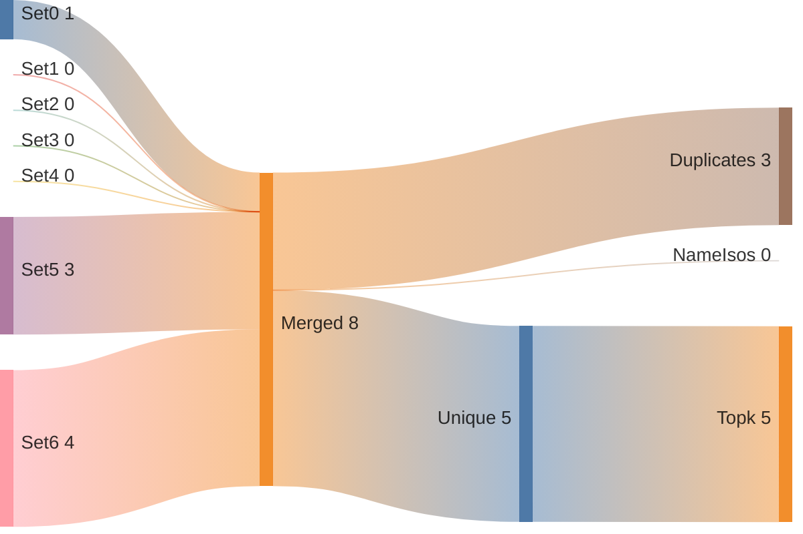
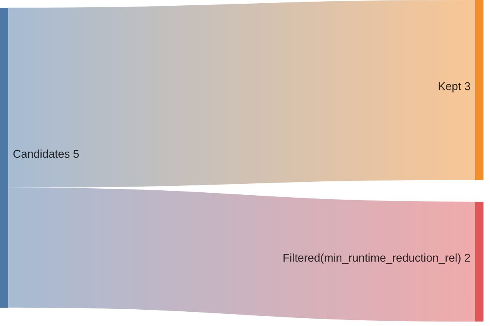
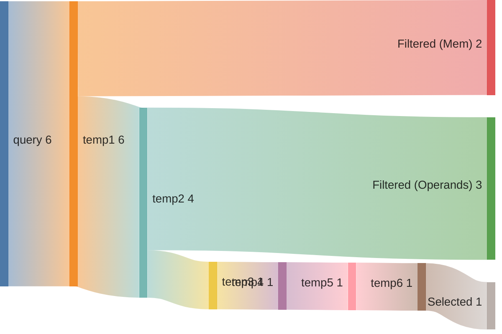
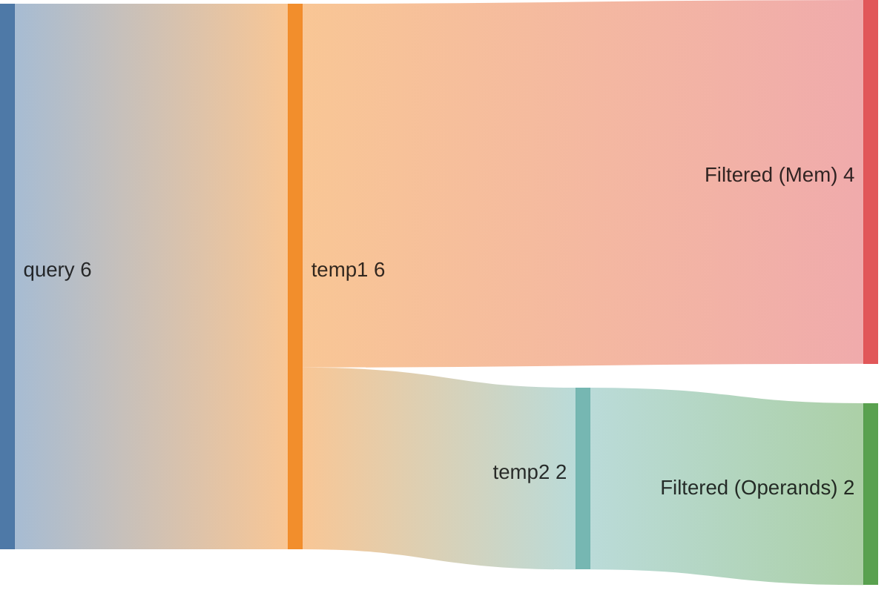
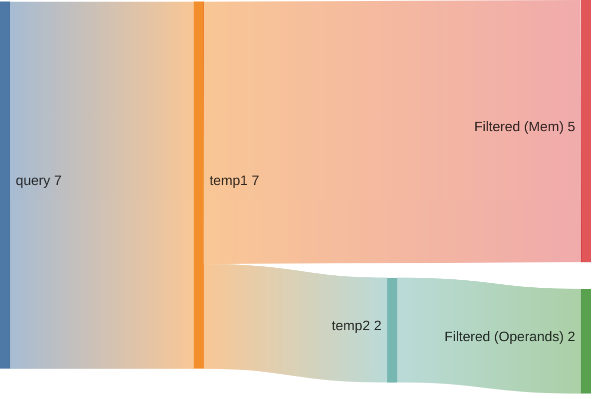
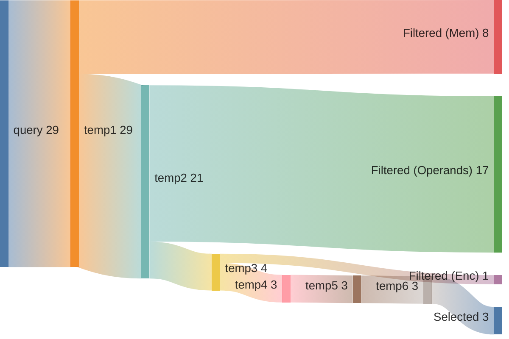
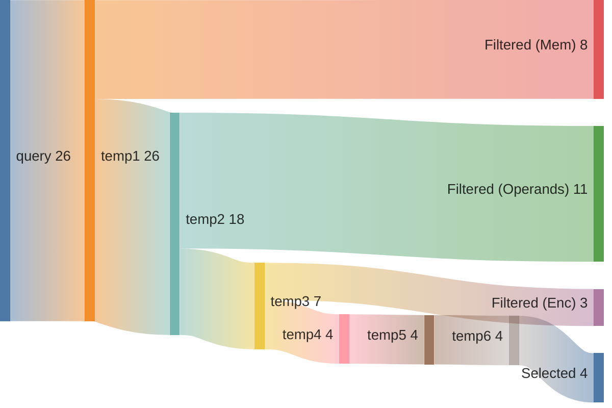

## Summary

Directory: `/var/tmp/ga87puy/isaac-demo/out/embench_iot/ud/20260522T135623`

### Experiment
```ini
[isaac-demo-embench_iot/ud-20260522T135623]
benchmark=embench_iot/ud
datetime=20260522T135623
directory=/var/tmp/ga87puy/isaac-demo/out/embench_iot/ud/20260522T135623
comment=""
```

### Environment/Config
<details>
<summary>Vars</summary>

```sh
ARCH=rv32im_zicsr_zifencei
ABI=ilp32
GLOBAL_ISEL=0
UNROLL=0
OPTIMIZE=3
TARGET=
CCACHE=1
LLVM_BUILD_TYPE=Release
LLVM_ENABLE_ASSERTIONS=ON
CDFG_STAGE=32
FORCE_PURGE_DB=1
ISAAC_LIMIT_RESULTS=
ISAAC_MIN_ISO_WEIGHT=0.05
ISAAC_SCALE_ISO_WEIGHT=auto
ISAAC_SORT_BY=IsoWeight
ISAAC_TOPK=
ISAAC_PARTITION_WITH_MAXMISO=auto
HLS_ENABLE=1
HLS_SKIP_BASELINE=0
HLS_SKIP_DEFAULT=0
HLS_SKIP_SHARED=0
HLS_NAILGUN_LIBRARY=
HLS_NAILGUN_RESOURCE_MODEL=ol_sky130
HLS_NAILGUN_CLOCK_NS=100
HLS_NAILGUN_SCHEDULE_TIMEOUT=60
HLS_NAILGUN_REFINE_TIMEOUT=60
HLS_NAILGUN_CORE_NAME=CV32E40P
HLS_NAILGUN_ILP_SOLVER=GUROBI
HLS_NAILGUN_SCHED_ALGO_MS=y
HLS_NAILGUN_SCHED_ALGO_PA=y
HLS_NAILGUN_SCHED_ALGO_RA=y
HLS_NAILGUN_SCHED_ALGO_MI=y
HLS_NAILGUN_OL2_ENABLE=y
HLS_NAILGUN_OL2_CONFIG_TEMPLATE=/var/tmp/ga87puy/isaac-demo/cfg/openlane/minimal_config_fast.json
HLS_NAILGUN_OL2_UNTIL_STEP=OpenROAD.Floorplan
HLS_NAILGUN_OL2_TARGET_FREQ=20
HLS_NAILGUN_OL2_TARGET_UTIL=20
HLS_NAILGUN_SHARE_RESOURCES=0
ASIP_SYN_ENABLE=1
ASIP_SYN_SKIP_BASELINE=0
ASIP_SYN_SKIP_DEFAULT=0
ASIP_SYN_SKIP_SHARED=0
ASIP_SYN_TOOL=synopsys
ASIP_SYN_SYNOPSYS_PDK=nangate45
ASIP_SYN_SYNOPSYS_CLOCK_NS=10
ASIP_SYN_SYNOPSYS_CORE_NAME=CV32E40P
FPGA_SYN_ENABLE=0
FPGA_SYN_SKIP_BASELINE=0
FPGA_SYN_SKIP_DEFAULT=0
FPGA_SYN_SKIP_SHARED=0
FPGA_SYN_TOOL=vivado
FPGA_SYN_VIVADO_PART=xc7a200tffv1156-1
FPGA_SYN_VIVADO_CLOCK_NS=50
FPGA_SYN_VIVADO_CORE_NAME=CV32E40P
ISAAC_QUERY_CONFIG_YAML=cfg/isaac/query/paper/cv32e40p.yml
```

</details>

### Times
<details>
<summary>Stages</summary>

| Stage                               |   Diff [s] |
|:------------------------------------|-----------:|
| bench_0                             |      7.903 |
| trace_0                             |     17.459 |
| isaac_0_load                        |     20.08  |
| isaac_0_analyze                     |     17.653 |
| isaac_0_visualize                   |      8.424 |
| isaac_0_pick                        |      7.487 |
| isaac_0_cdfg                        |     20.015 |
| isaac_0_query                       |     63.47  |
| isaac_0_generate                    |     12.317 |
| assign_0_enc                        |      1.025 |
| isaac_0_etiss                       |      4.001 |
| seal5_0_splitted                    |    683.315 |
| assign_0_seal5                      |      1.12  |
| etiss_0                             |     35.678 |
| compare_0                           |     20.558 |
| compare_0_per_instr                 |     23.469 |
| assign_0_compare_per_instr          |      1.11  |
| filter_0                            |      1.851 |
| spec_0_filtered                     |      0.943 |
| isaac_0_generate_filtered           |     12.238 |
| isaac_0_etiss_filtered              |      4.21  |
| fake_hls_0_filtered                 |      1.336 |
| assign_0_fake_hls_filtered          |      2.573 |
| select_0_filtered                   |     39.064 |
| isaac_0_etiss_filtered_selected     |      3.825 |
| fake_hls_0_filtered_selected        |      1.284 |
| assign_0_fake_hls_filtered_selected |      2.662 |
| compare_0_filtered_selected         |     20.072 |
| assign_0_compare_filtered_selected  |      0.029 |
| retrace_0_filtered_selected         |     16.579 |
| reanalyze_0_filtered_selected       |    141.261 |
| assign_0_util_filtered_selected     |      1.629 |
| etiss_perf_0_filtered_selected      |    258.536 |
| compare_perf_0_filtered_selected    |     37.1   |
| retrace_perf_0_filtered_selected    |     12.197 |

</details>

### ISE Potential
|   supported_rel_count |   unsupported_rel_count | has_potential   |
|----------------------:|------------------------:|:----------------|
|              0.683864 |                0.316136 | True            |

### Choices
<details>
<summary>Summary</summary>

<h2>Choice 0</h2>
<table>
<tr><th>func_name</th><th>bb_name</th><th>rel_weight</th><th>num_instrs</th><th>freq</th><th>start</th><th>end</th></tr>
<tr><td>benchmark_body</td><td>%bb.4</td><td>0.168912</td><td>8</td><td>53208.0</td><td>0x1000420</td><td>0x1000440</td></tr>
</table>
<pre><code class='asm'>
 1000420: 0012b313     	seqz	t1, t0
 1000424: 00689333     	sll	t1, a7, t1
 1000428: 00682023     	sw	t1, 0x0(a6)
 100042c: 00e30733     	add	a4, t1, a4
 1000430: fff28293     	addi	t0, t0, -0x1
 1000434: 00480813     	addi	a6, a6, 0x4
 1000438: 00188893     	addi	a7, a7, 0x1
 100043c: fef812e3     	bne	a6, a5, 0x1000420 <benchmark_body+0x78>
</code></pre>
<h2>Choice 1</h2>
<table>
<tr><th>func_name</th><th>bb_name</th><th>rel_weight</th><th>num_instrs</th><th>freq</th><th>start</th><th>end</th></tr>
<tr><td>ludcmp</td><td>%bb.13</td><td>0.143692</td><td>7</td><td>51730.0</td><td>0x10005e0</td><td>0x10005fc</td></tr>
</table>
<pre><code class='asm'>
 10005e0: 00092983     	lw	s3, 0x0(s2)
 10005e4: 0004aa03     	lw	s4, 0x0(s1)
 10005e8: 033a09b3     	mul	s3, s4, s3
 10005ec: 41340433     	sub	s0, s0, s3
 10005f0: 00490913     	addi	s2, s2, 0x4
 10005f4: 05048493     	addi	s1, s1, 0x50
 10005f8: fe7914e3     	bne	s2, t2, 0x10005e0 <ludcmp+0x138>
</code></pre>
<h2>Choice 2</h2>
<table>
<tr><th>func_name</th><th>bb_name</th><th>rel_weight</th><th>num_instrs</th><th>freq</th><th>start</th><th>end</th></tr>
<tr><td>ludcmp</td><td>%bb.9</td><td>0.082110</td><td>7</td><td>29560.0</td><td>0x1000558</td><td>0x1000574</td></tr>
</table>
<pre><code class='asm'>
 1000558: 000b2b83     	lw	s7, 0x0(s6)
 100055c: 000aac03     	lw	s8, 0x0(s5)
 1000560: 037c0bb3     	mul	s7, s8, s7
 1000564: 417989b3     	sub	s3, s3, s7
 1000568: 004b0b13     	addi	s6, s6, 0x4
 100056c: 050a8a93     	addi	s5, s5, 0x50
 1000570: ff4b14e3     	bne	s6, s4, 0x1000558 <ludcmp+0xb0>
</code></pre>
<h2>Choice 3</h2>
<table>
<tr><th>func_name</th><th>bb_name</th><th>rel_weight</th><th>num_instrs</th><th>freq</th><th>start</th><th>end</th></tr>
<tr><td>ludcmp</td><td>%bb.23</td><td>0.073310</td><td>9</td><td>20527.0</td><td>0x1000758</td><td>0x100077c</td></tr>
</table>
<pre><code class='asm'>
 1000758: 000f2483     	lw	s1, 0x0(t5)
 100075c: 000fa903     	lw	s2, 0x0(t6)
 1000760: 029904b3     	mul	s1, s2, s1
 1000764: 409e8eb3     	sub	t4, t4, s1
 1000768: fff40413     	addi	s0, s0, -0x1
 100076c: 004f8f93     	addi	t6, t6, 0x4
 1000770: 004f0f13     	addi	t5, t5, 0x4
 1000774: fe0412e3     	bnez	s0, 0x1000758 <ludcmp+0x2b0>
 1000778: f91ff06f     	j	0x1000708 <ludcmp+0x260>
</code></pre>
<h2>Choice 4</h2>
<table>
<tr><th>func_name</th><th>bb_name</th><th>rel_weight</th><th>num_instrs</th><th>freq</th><th>start</th><th>end</th></tr>
<tr><td>ludcmp</td><td>%bb.17</td><td>0.061582</td><td>7</td><td>22170.0</td><td>0x1000668</td><td>0x1000684</td></tr>
</table>
<pre><code class='asm'>
 1000668: 0003ae83     	lw	t4, 0x0(t2)
 100066c: 000e2f03     	lw	t5, 0x0(t3)
 1000670: 03df0eb3     	mul	t4, t5, t4
 1000674: 41d282b3     	sub	t0, t0, t4
 1000678: 004e0e13     	addi	t3, t3, 0x4
 100067c: 00438393     	addi	t2, t2, 0x4
 1000680: fe6e14e3     	bne	t3, t1, 0x1000668 <ludcmp+0x1c0>
</code></pre>
<h2>Choice 5</h2>
<table>
<tr><th>func_name</th><th>bb_name</th><th>rel_weight</th><th>num_instrs</th><th>freq</th><th>start</th><th>end</th></tr>
<tr><td>ludcmp</td><td>%bb.8</td><td>0.058650</td><td>10</td><td>14780.0</td><td>0x1000530</td><td>0x1000558</td></tr>
</table>
<pre><code class='asm'>
 1000530: 00090493     	mv	s1, s2
 1000534: 02c90933     	mul	s2, s2, a2
 1000538: 01250933     	add	s2, a0, s2
 100053c: 01d90933     	add	s2, s2, t4
 1000540: 00092983     	lw	s3, 0x0(s2)
 1000544: 02cf0a33     	mul	s4, t5, a2
 1000548: 014f8a33     	add	s4, t6, s4
 100054c: 01450a33     	add	s4, a0, s4
 1000550: 00028a93     	mv	s5, t0
 1000554: 00040b13     	mv	s6, s0
</code></pre>
<h2>Choice 6</h2>
<table>
<tr><th>func_name</th><th>bb_name</th><th>rel_weight</th><th>num_instrs</th><th>freq</th><th>start</th><th>end</th></tr>
<tr><td>ludcmp</td><td>%bb.12</td><td>0.052785</td><td>6</td><td>22170.0</td><td>0x10005c8</td><td>0x10005e0</td></tr>
</table>
<pre><code class='asm'>
 10005c8: 000f8f13     	mv	t5, t6
 10005cc: 002f9f93     	slli	t6, t6, 0x2
 10005d0: 01fe0fb3     	add	t6, t3, t6
 10005d4: 000fa403     	lw	s0, 0x0(t6)
 10005d8: 000e8493     	mv	s1, t4
 10005dc: 00030913     	mv	s2, t1
</code></pre>

</details>

### Queries
<details>
<summary>Metrics</summary>

|   num_rows |   num_nodes |   num_edges | func           | basic_block   |
|-----------:|------------:|------------:|:---------------|:--------------|
|         36 |          48 |          32 | benchmark_body | %bb.4         |
|         55 |          60 |          40 | ludcmp         | %bb.13        |
|         55 |          60 |          40 | ludcmp         | %bb.9         |
|         55 |          60 |          40 | ludcmp         | %bb.23        |
|         55 |          60 |          40 | ludcmp         | %bb.17        |
|        780 |         351 |         312 | ludcmp         | %bb.8         |
|        435 |         174 |         145 | ludcmp         | %bb.12        |

</details>

### Sankeys
<details>
<summary>Merge Query Results</summary>





</details>

<details>
<summary>Filtered Candidates</summary>





</details>

<details>
<summary>benchmark_body_%bb.4_0</summary>



</details>

<details>
<summary>ludcmp_%bb.13_0</summary>



</details>

<details>
<summary>ludcmp_%bb.9_0</summary>



</details>

<details>
<summary>ludcmp_%bb.23_0</summary>


</details>

<details>
<summary>ludcmp_%bb.17_0</summary>


</details>

<details>
<summary>ludcmp_%bb.8_0</summary>



</details>

<details>
<summary>ludcmp_%bb.12_0</summary>



</details>

### Compare DF
| Model   | Arch                         |   Run Instructions |   Run Instructions (rel.) |   Total ROM |   Total RAM |   ROM code |   ROM code (rel.) |
|:--------|:-----------------------------|-------------------:|--------------------------:|------------:|------------:|-----------:|------------------:|
| ud      | rv32im_zicsr_zifencei        |            2520073 |                  1        |        4176 |        2980 |       4100 |          1        |
| ud      | rv32im_zicsr_zifencei_xisaac |            2404788 |                  0.954253 |        4124 |        2980 |       4048 |          0.987317 |

### CoreDSL
<details>
<summary>gen/XIsaac.core_desc</summary>

```c
import "/var/tmp/ga87puy/isaac-demo/etiss_arch_riscv/rv_base/RVI.core_desc"

InstructionSet XIsaac extends RV32I {
    instructions {
        CUSTOM0 {
            encoding: 7'b0000000 :: rs2[4:0] :: rs1[4:0] :: 3'b000 :: rd[4:0] :: 7'b1111011;
            assembly: {"custom0", "{name(rd)}, {name(rs1)}, {name(rs2)}"};
            behavior: {
                unsigned<32> rs1_val = X[rs1];
                unsigned<32> rs2_val = X[rs2];
                unsigned<32> outp0 = (unsigned<32>)((((unsigned<32>)(rs2_val) << (unsigned<32>)((unsigned<32>)(((rs1_val < (1) ? 1 : 0)))))));
                X[rd] = outp0;
            }
        }
        CUSTOM1 {
            encoding: 7'b0000001 :: rs2[4:0] :: rs1[4:0] :: 3'b000 :: rd[4:0] :: 7'b1111011;
            assembly: {"custom1", "{name(rd)}, {name(rs1)}, {name(rs2)}"};
            behavior: {
                unsigned<32> rs2_val = X[rs2];
                unsigned<32> rs1_val = X[rs1];
                unsigned<32> outp0 = (unsigned<32>)((((signed<32>)(rs2_val) * (signed<32>)((unsigned<32>)((((signed<32>)(rs1_val) + (signed<32>)((80)))))))));
                X[rd] = outp0;
            }
        }
        CUSTOM2 {
            encoding: 7'b0000010 :: rs2[4:0] :: rs1[4:0] :: 3'b000 :: rd[4:0] :: 7'b1111011;
            assembly: {"custom2", "{name(rd)}, {name(rs1)}, {name(rs2)}"};
            behavior: {
                unsigned<32> rs1_val = X[rs1];
                unsigned<32> rs2_val = X[rs2];
                unsigned<32> outp0 = (unsigned<32>)((((signed<32>)(rs1_val) + (signed<32>)((unsigned<32>)((((unsigned<32>)(rs2_val) << (unsigned<32>)((2)))))))));
                X[rd] = outp0;
            }
        }
        CUSTOM3 {
            encoding: 2'b00 :: uimm2[4:0] :: rs2[4:0] :: rs1[4:0] :: 3'b001 :: rd[4:0] :: 7'b1111011;
            assembly: {"custom3", "{name(rd)}, {name(rs1)}, {name(rs2)}, {uimm2}"};
            behavior: {
                unsigned<32> rs1_val = X[rs1];
                unsigned<32> rs2_val = X[rs2];
                unsigned<32> outp0 = (unsigned<32>)((((signed<32>)(rs1_val) + (signed<32>)((unsigned<32>)((((unsigned<32>)(rs2_val) << (unsigned<32>)((unsigned<2>)((uimm2))))))))));
                X[rd] = outp0;
            }
        }
        CUSTOM4 {
            encoding: 2'b01 :: uimm5[4:0] :: rs2[4:0] :: rs1[4:0] :: 3'b001 :: rd[4:0] :: 7'b1111011;
            assembly: {"custom4", "{name(rd)}, {name(rs1)}, {name(rs2)}, {uimm5}"};
            behavior: {
                unsigned<32> rs1_val = X[rs1];
                unsigned<32> rs2_val = X[rs2];
                unsigned<32> outp0 = (unsigned<32>)((((signed<32>)(rs1_val) + (signed<32>)((unsigned<32>)((((unsigned<32>)(rs2_val) << (unsigned<32>)((unsigned<5>)((uimm5))))))))));
                X[rd] = outp0;
            }
        }
    }
}


```

</details>

<details>
<summary>gen_filtered/XIsaac.core_desc</summary>

```c
import "/var/tmp/ga87puy/isaac-demo/etiss_arch_riscv/rv_base/RVI.core_desc"

InstructionSet XIsaac extends RV32I {
    instructions {
        CUSTOM0 {
            encoding: 7'b0000000 :: rs2[4:0] :: rs1[4:0] :: 3'b000 :: rd[4:0] :: 7'b1111011;
            assembly: {"custom0", "{name(rd)}, {name(rs1)}, {name(rs2)}"};
            behavior: {
                unsigned<32> rs1_val = X[rs1];
                unsigned<32> rs2_val = X[rs2];
                unsigned<32> outp0 = (unsigned<32>)(((((unsigned<32>)((rs2_val)) << (unsigned<32>)(((unsigned<32>)((((rs1_val < (1) ? 1 : 0))))))))));
                X[rd] = outp0;
            }
        }
        CUSTOM2 {
            encoding: 7'b0000010 :: rs2[4:0] :: rs1[4:0] :: 3'b000 :: rd[4:0] :: 7'b1111011;
            assembly: {"custom2", "{name(rd)}, {name(rs1)}, {name(rs2)}"};
            behavior: {
                unsigned<32> rs1_val = X[rs1];
                unsigned<32> rs2_val = X[rs2];
                unsigned<32> outp0 = (unsigned<32>)(((((signed<32>)((rs1_val)) + (signed<32>)(((unsigned<32>)(((((unsigned<32>)((rs2_val)) << (unsigned<32>)(((2)))))))))))));
                X[rd] = outp0;
            }
        }
        CUSTOM4 {
            encoding: 2'b01 :: uimm5[4:0] :: rs2[4:0] :: rs1[4:0] :: 3'b001 :: rd[4:0] :: 7'b1111011;
            assembly: {"custom4", "{name(rd)}, {name(rs1)}, {name(rs2)}, {uimm5}"};
            behavior: {
                unsigned<32> rs1_val = X[rs1];
                unsigned<32> rs2_val = X[rs2];
                unsigned<32> outp0 = (unsigned<32>)(((((signed<32>)((rs1_val)) + (signed<32>)(((unsigned<32>)(((((unsigned<32>)((rs2_val)) << (unsigned<32>)(((unsigned<5>)(((uimm5)))))))))))))));
                X[rd] = outp0;
            }
        }
    }
}


```

</details>


