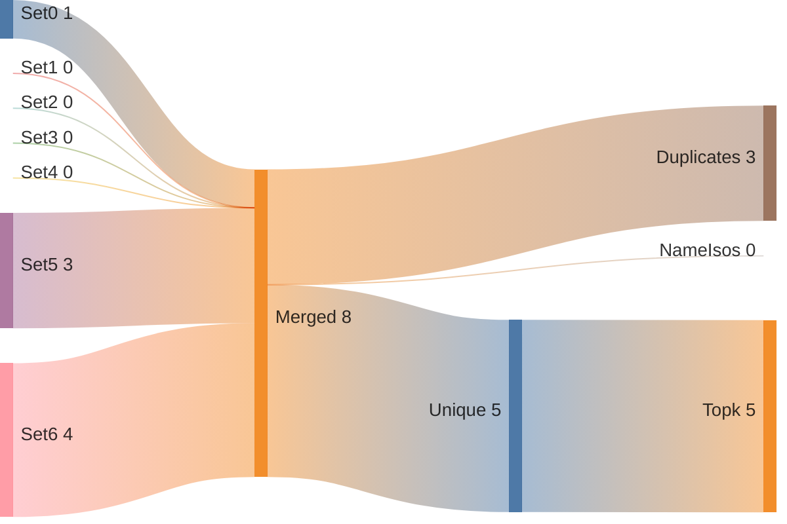

```mermaid
---
config:
  sankey:
    showValues: true
---
sankey-beta

%% source,target,value
Set0,Merged,1
Set1,Merged,0
Set2,Merged,0
Set3,Merged,0
Set4,Merged,0
Set5,Merged,3
Set6,Merged,4
Merged,Duplicates,3
Merged,NameIsos,0
Merged,Unique,5
Unique,Topk,5

```
