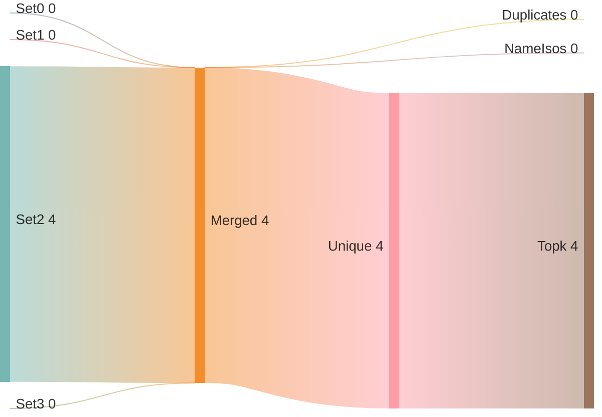
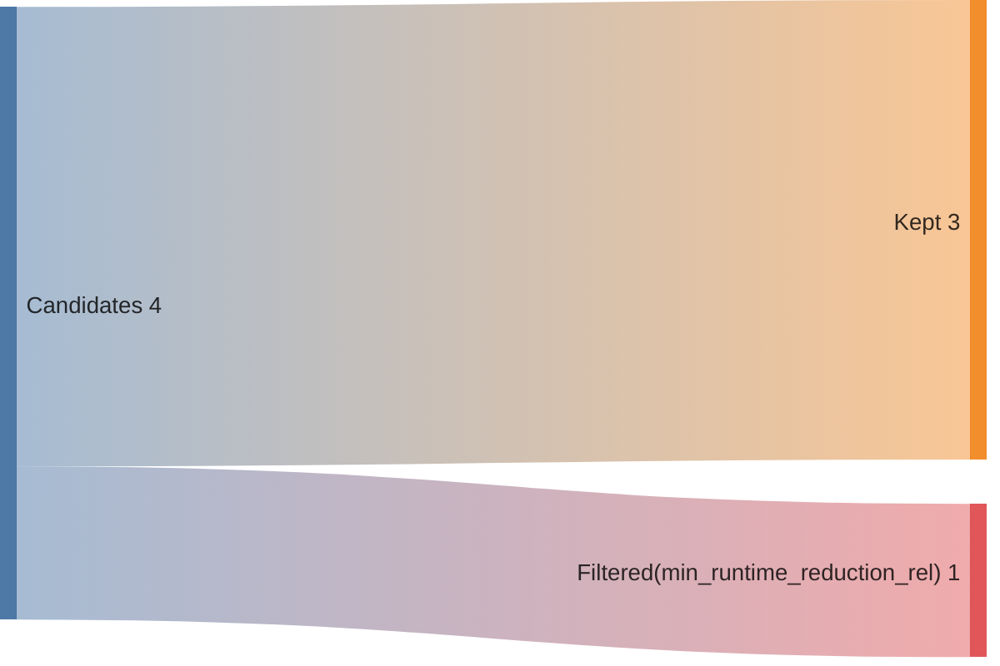
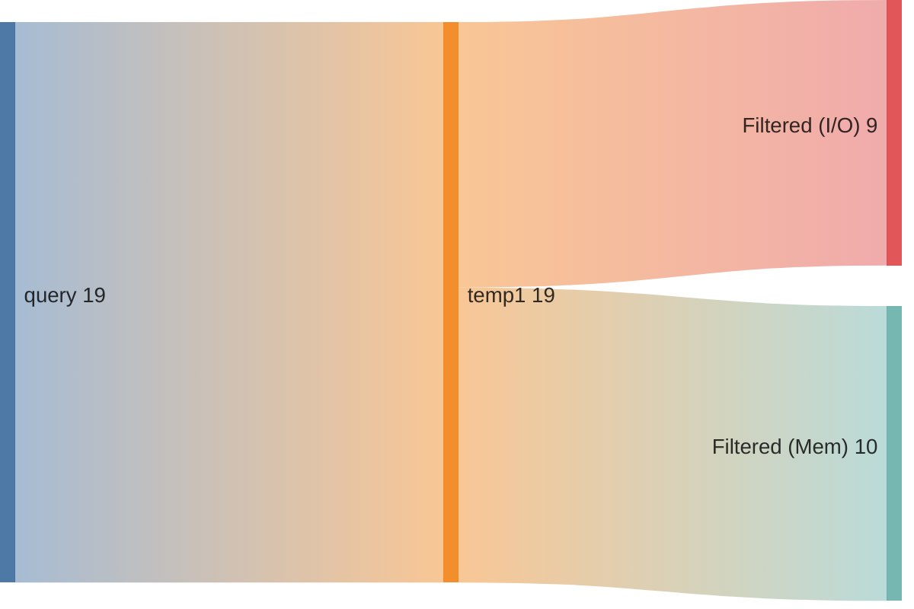
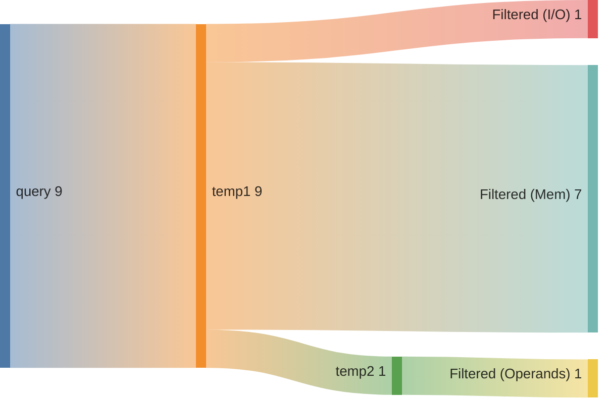
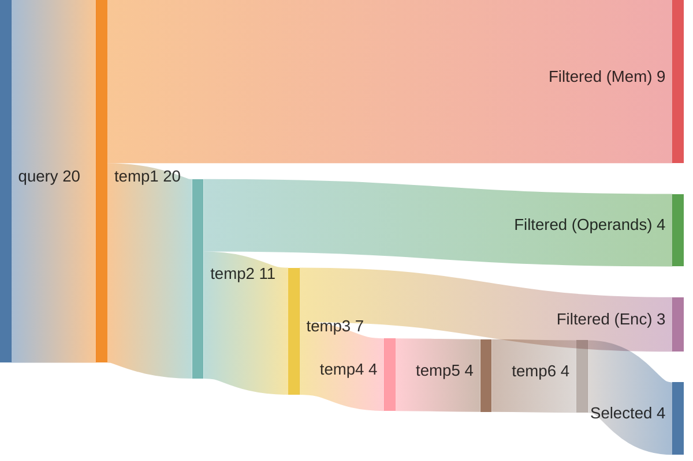
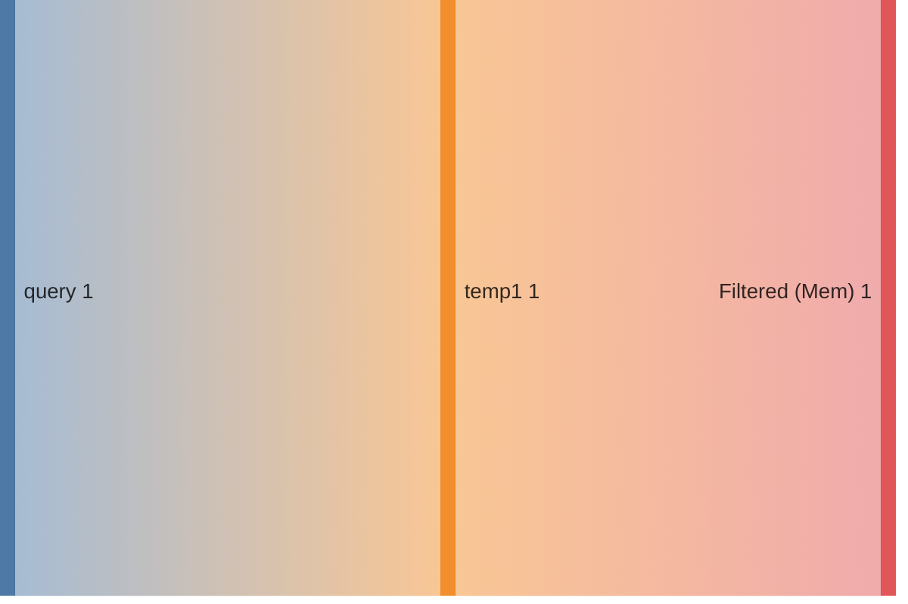

## Summary

Directory: `/var/tmp/ga87puy/isaac-demo/out/embench_iot/xgboost/20260527T141329`

### Experiment
```ini
[isaac-demo-embench_iot/xgboost-20260527T141329]
benchmark=embench_iot/xgboost
datetime=20260527T141329
directory=/var/tmp/ga87puy/isaac-demo/out/embench_iot/xgboost/20260527T141329
comment=""
```

### Environment/Config
<details>
<summary>Vars</summary>

```sh
ARCH=rv32im_zicsr_zifencei
ABI=ilp32
GLOBAL_ISEL=0
UNROLL=0
OPTIMIZE=3
TARGET=
CCACHE=1
LLVM_BUILD_TYPE=Release
LLVM_ENABLE_ASSERTIONS=ON
CDFG_STAGE=32
FORCE_PURGE_DB=1
ISAAC_LIMIT_RESULTS=
ISAAC_MIN_ISO_WEIGHT=0.05
ISAAC_SCALE_ISO_WEIGHT=auto
ISAAC_SORT_BY=IsoWeight
ISAAC_TOPK=
ISAAC_PARTITION_WITH_MAXMISO=auto
HLS_ENABLE=1
HLS_SKIP_BASELINE=0
HLS_SKIP_DEFAULT=0
HLS_SKIP_SHARED=0
HLS_NAILGUN_LIBRARY=
HLS_NAILGUN_RESOURCE_MODEL=ol_sky130
HLS_NAILGUN_CLOCK_NS=100
HLS_NAILGUN_SCHEDULE_TIMEOUT=60
HLS_NAILGUN_REFINE_TIMEOUT=60
HLS_NAILGUN_CORE_NAME=VEX_5S
HLS_NAILGUN_ILP_SOLVER=GUROBI
HLS_NAILGUN_SCHED_ALGO_MS=y
HLS_NAILGUN_SCHED_ALGO_PA=y
HLS_NAILGUN_SCHED_ALGO_RA=y
HLS_NAILGUN_SCHED_ALGO_MI=y
HLS_NAILGUN_OL2_ENABLE=n
HLS_NAILGUN_OL2_CONFIG_TEMPLATE=/var/tmp/ga87puy/isaac-demo/cfg/openlane/minimal_config_fast.json
HLS_NAILGUN_OL2_UNTIL_STEP=OpenROAD.Floorplan
HLS_NAILGUN_OL2_TARGET_FREQ=20
HLS_NAILGUN_OL2_TARGET_UTIL=20
HLS_NAILGUN_SHARE_RESOURCES=0
ASIP_SYN_ENABLE=1
ASIP_SYN_SKIP_BASELINE=0
ASIP_SYN_SKIP_DEFAULT=0
ASIP_SYN_SKIP_SHARED=0
ASIP_SYN_TOOL=synopsys
ASIP_SYN_SYNOPSYS_PDK=nangate45
ASIP_SYN_SYNOPSYS_CLOCK_NS=10
ASIP_SYN_SYNOPSYS_CORE_NAME=VEX_5S
FPGA_SYN_ENABLE=0
FPGA_SYN_SKIP_BASELINE=0
FPGA_SYN_SKIP_DEFAULT=0
FPGA_SYN_SKIP_SHARED=0
FPGA_SYN_TOOL=vivado
FPGA_SYN_VIVADO_PART=xc7a200tffv1156-1
FPGA_SYN_VIVADO_CLOCK_NS=50
FPGA_SYN_VIVADO_CORE_NAME=VEX_5S
ISAAC_QUERY_CONFIG_YAML=cfg/isaac/query/paper/vex.yml
```

</details>

### Times
<details>
<summary>Stages</summary>

| Stage                              |   Diff [s] |
|:-----------------------------------|-----------:|
| bench_0                            |      4.933 |
| trace_0                            |     12.589 |
| isaac_0_load                       |     19.848 |
| isaac_0_analyze                    |     13.474 |
| isaac_0_visualize                  |      5.032 |
| isaac_0_pick                       |      4.907 |
| isaac_0_cdfg                       |      5.741 |
| isaac_0_query                      |     24.493 |
| isaac_0_generate                   |      7.34  |
| assign_0_enc                       |      0.967 |
| isaac_0_etiss                      |      2.458 |
| seal5_0_splitted                   |    480.719 |
| assign_0_seal5                     |      0.918 |
| etiss_0                            |     63.763 |
| compare_0                          |     13.238 |
| compare_0_per_instr                |     14.592 |
| assign_0_compare_per_instr         |      0.938 |
| filter_0                           |      1.063 |
| spec_0_filtered                    |      0.55  |
| isaac_0_generate_filtered          |      7.112 |
| isaac_0_etiss_filtered             |      2.537 |
| hls_0_filtered                     |    699.537 |
| assign_0_hls_filtered              |      1.474 |
| select_0_filtered                  |     22.855 |
| isaac_0_etiss_filtered_selected    |      2.491 |
| hls_0_filtered_selected            |    466.046 |
| assign_0_hls_filtered_selected     |      1.52  |
| compare_0_filtered_selected        |     13.413 |
| assign_0_compare_filtered_selected |      0.028 |
| retrace_0_filtered_selected        |     11.117 |
| reanalyze_0_filtered_selected      |    106.849 |
| assign_0_util_filtered_selected    |      0.975 |
| etiss_perf_0_filtered_selected     |    134.708 |
| compare_perf_0_filtered_selected   |     17.528 |
| retrace_perf_0_filtered_selected   |      7.792 |

</details>

### ISE Potential
|   supported_rel_count |   unsupported_rel_count | has_potential   |
|----------------------:|------------------------:|:----------------|
|               0.58816 |                 0.41184 | True            |

### Choices
<details>
<summary>Summary</summary>

<h2>Choice 0</h2>
<table>
<tr><th>func_name</th><th>bb_name</th><th>rel_weight</th><th>num_instrs</th><th>freq</th><th>start</th><th>end</th></tr>
<tr><td>predict</td><td>%bb.5</td><td>0.431552</td><td>8</td><td>183282.0</td><td>0x1000534</td><td>0x1000554</td></tr>
</table>
<pre><code class='asm'>
 1000534: 013a0b33     	add	s6, s4, s3
 1000538: 000b4b03     	lbu	s6, 0x0(s6)
 100053c: 013a8bb3     	add	s7, s5, s3
 1000540: 000bcb83     	lbu	s7, 0x0(s7)
 1000544: 01650b33     	add	s6, a0, s6
 1000548: 000b4c03     	lbu	s8, 0x0(s6)
 100054c: 000e0b13     	mv	s6, t3
 1000550: fd7c68e3     	bltu	s8, s7, 0x1000520 <predict+0xf4>
</code></pre>
<h2>Choice 1</h2>
<table>
<tr><th>func_name</th><th>bb_name</th><th>rel_weight</th><th>num_instrs</th><th>freq</th><th>start</th><th>end</th></tr>
<tr><td>predict</td><td>%bb.9</td><td>0.269720</td><td>5</td><td>183282.0</td><td>0x1000520</td><td>0x1000534</td></tr>
</table>
<pre><code class='asm'>
 1000520: 00cb0b33     	add	s6, s6, a2
 1000524: 013b09b3     	add	s3, s6, s3
 1000528: 00098b03     	lb	s6, 0x0(s3)
 100052c: 0ffb7993     	andi	s3, s6, 0xff
 1000530: fa0b48e3     	bltz	s6, 0x10004e0 <predict+0xb4>
</code></pre>
<h2>Choice 2</h2>
<table>
<tr><th>func_name</th><th>bb_name</th><th>rel_weight</th><th>num_instrs</th><th>freq</th><th>start</th><th>end</th></tr>
<tr><td>predict</td><td>%bb.6</td><td>0.150693</td><td>10</td><td>51200.0</td><td>0x10004e0</td><td>0x1000508</td></tr>
</table>
<pre><code class='asm'>
 10004e0: 00ee8a33     	add	s4, t4, a4
 10004e4: 07f9f993     	andi	s3, s3, 0x7f
 10004e8: 013a09b3     	add	s3, s4, s3
 10004ec: 0009c983     	lbu	s3, 0x0(s3)
 10004f0: 01340433     	add	s0, s0, s3
 10004f4: 00148493     	addi	s1, s1, 0x1
 10004f8: 01260633     	add	a2, a2, s2
 10004fc: 01270733     	add	a4, a4, s2
 1000500: 00170713     	addi	a4, a4, 0x1
 1000504: faf48ae3     	beq	s1, a5, 0x10004b8 <predict+0x8c>
</code></pre>
<h2>Choice 3</h2>
<table>
<tr><th>func_name</th><th>bb_name</th><th>rel_weight</th><th>num_instrs</th><th>freq</th><th>start</th><th>end</th></tr>
<tr><td>predict</td><td>%bb.4</td><td>0.090416</td><td>6</td><td>51200.0</td><td>0x1000508</td><td>0x1000520</td></tr>
</table>
<pre><code class='asm'>
 1000508: 00988933     	add	s2, a7, s1
 100050c: 00094903     	lbu	s2, 0x0(s2)
 1000510: 00000993     	li	s3, 0x0
 1000514: 00c28a33     	add	s4, t0, a2
 1000518: 00c30ab3     	add	s5, t1, a2
 100051c: 0180006f     	j	0x1000534 <predict+0x108>
</code></pre>

</details>

### Queries
<details>
<summary>Metrics</summary>

|   num_rows |   num_nodes |   num_edges | func    | basic_block   |
|-----------:|------------:|------------:|:--------|:--------------|
|        528 |         224 |         192 | predict | %bb.5         |
|        136 |          80 |          64 | predict | %bb.9         |
|        231 |         189 |         126 | predict | %bb.6         |
|          1 |           2 |           1 | predict | %bb.4         |

</details>

### Sankeys
<details>
<summary>Merge Query Results</summary>





</details>

<details>
<summary>Filtered Candidates</summary>





</details>

<details>
<summary>predict_%bb.5_0</summary>



</details>

<details>
<summary>predict_%bb.9_0</summary>



</details>

<details>
<summary>predict_%bb.6_0</summary>



</details>

<details>
<summary>predict_%bb.4_0</summary>



</details>

### Compare DF
| Model   | Arch                         |   Run Instructions |   Run Instructions (rel.) |   Total ROM |   Total RAM |   ROM code |   ROM code (rel.) |
|:--------|:-----------------------------|-------------------:|--------------------------:|------------:|------------:|-----------:|------------------:|
| xgboost | rv32im_zicsr_zifencei        |            3397674 |                  1        |       43156 |        1216 |       3524 |           1       |
| xgboost | rv32im_zicsr_zifencei_xisaac |            3295274 |                  0.969862 |       43140 |        1216 |       3508 |           0.99546 |

### CoreDSL
<details>
<summary>gen/XIsaac.core_desc</summary>

```c
import "/var/tmp/ga87puy/isaac-demo/etiss_arch_riscv/rv_base/RVI.core_desc"

InstructionSet XIsaac extends RV32I {
    instructions {
        CUSTOM0 {
            encoding: 7'b0000000 :: rs2[4:0] :: rs1[4:0] :: 3'b000 :: rd[4:0] :: 7'b1111011;
            assembly: {"custom0", "{name(rd)}, {name(rs1)}, {name(rs2)}"};
            behavior: {
                unsigned<32> rs1_val = X[rs1];
                unsigned<32> rs2_val = X[rs2];
                unsigned<32> outp0 = (unsigned<32>)((((signed<32>)((unsigned<32>)((((signed<32>)(rs2_val) + (signed<32>)(rs1_val))))) + (signed<32>)((1)))));
                X[rd] = outp0;
            }
        }
        CUSTOM1 {
            encoding: 7'b0000001 :: rs2[4:0] :: rs1[4:0] :: 3'b000 :: rd[4:0] :: 7'b1111011;
            assembly: {"custom1", "{name(rd)}, {name(rs1)}, {name(rs2)}"};
            behavior: {
                unsigned<32> rs2_val = X[rs2];
                unsigned<32> rs1_val = X[rs1];
                unsigned<32> outp0 = (unsigned<32>)((((signed<32>)(rs1_val) + (signed<32>)((unsigned<32>)((((unsigned<32>)(rs2_val) & (unsigned<32>)((127)))))))));
                X[rd] = outp0;
            }
        }
        CUSTOM2 {
            encoding: 2'b00 :: uimm1[4:0] :: rs2[4:0] :: rs1[4:0] :: 3'b001 :: rd[4:0] :: 7'b1111011;
            assembly: {"custom2", "{name(rd)}, {name(rs1)}, {name(rs2)}, {uimm1}"};
            behavior: {
                unsigned<32> rs1_val = X[rs1];
                unsigned<32> rs2_val = X[rs2];
                unsigned<32> outp0 = (unsigned<32>)((((signed<32>)((unsigned<32>)((((signed<32>)(rs2_val) + (signed<32>)(rs1_val))))) + (signed<32>)((unsigned<1>)((uimm1))))));
                X[rd] = outp0;
            }
        }
        CUSTOM3 {
            encoding: 2'b01 :: uimm5[4:0] :: rs2[4:0] :: rs1[4:0] :: 3'b001 :: rd[4:0] :: 7'b1111011;
            assembly: {"custom3", "{name(rd)}, {name(rs1)}, {name(rs2)}, {uimm5}"};
            behavior: {
                unsigned<32> rs1_val = X[rs1];
                unsigned<32> rs2_val = X[rs2];
                unsigned<32> outp0 = (unsigned<32>)((((signed<32>)((unsigned<32>)((((signed<32>)(rs2_val) + (signed<32>)(rs1_val))))) + (signed<32>)((unsigned<5>)((uimm5))))));
                X[rd] = outp0;
            }
        }
    }
}


```

</details>

<details>
<summary>gen_filtered/XIsaac.core_desc</summary>

```c
import "/var/tmp/ga87puy/isaac-demo/etiss_arch_riscv/rv_base/RVI.core_desc"

InstructionSet XIsaac extends RV32I {
    instructions {
        CUSTOM0 {
            encoding: 7'b0000000 :: rs2[4:0] :: rs1[4:0] :: 3'b000 :: rd[4:0] :: 7'b1111011;
            assembly: {"custom0", "{name(rd)}, {name(rs1)}, {name(rs2)}"};
            behavior: {
                unsigned<32> rs1_val = X[rs1];
                unsigned<32> rs2_val = X[rs2];
                unsigned<32> outp0 = (unsigned<32>)(((((signed<32>)(((unsigned<32>)(((((signed<32>)((rs2_val)) + (signed<32>)((rs1_val)))))))) + (signed<32>)(((1)))))));
                X[rd] = outp0;
            }
        }
        CUSTOM1 {
            encoding: 7'b0000001 :: rs2[4:0] :: rs1[4:0] :: 3'b000 :: rd[4:0] :: 7'b1111011;
            assembly: {"custom1", "{name(rd)}, {name(rs1)}, {name(rs2)}"};
            behavior: {
                unsigned<32> rs2_val = X[rs2];
                unsigned<32> rs1_val = X[rs1];
                unsigned<32> outp0 = (unsigned<32>)(((((signed<32>)((rs1_val)) + (signed<32>)(((unsigned<32>)(((((unsigned<32>)((rs2_val)) & (unsigned<32>)(((127)))))))))))));
                X[rd] = outp0;
            }
        }
        CUSTOM3 {
            encoding: 2'b01 :: uimm5[4:0] :: rs2[4:0] :: rs1[4:0] :: 3'b001 :: rd[4:0] :: 7'b1111011;
            assembly: {"custom3", "{name(rd)}, {name(rs1)}, {name(rs2)}, {uimm5}"};
            behavior: {
                unsigned<32> rs1_val = X[rs1];
                unsigned<32> rs2_val = X[rs2];
                unsigned<32> outp0 = (unsigned<32>)(((((signed<32>)(((unsigned<32>)(((((signed<32>)((rs2_val)) + (signed<32>)((rs1_val)))))))) + (signed<32>)(((unsigned<5>)(((uimm5)))))))));
                X[rd] = outp0;
            }
        }
    }
}


```

</details>


